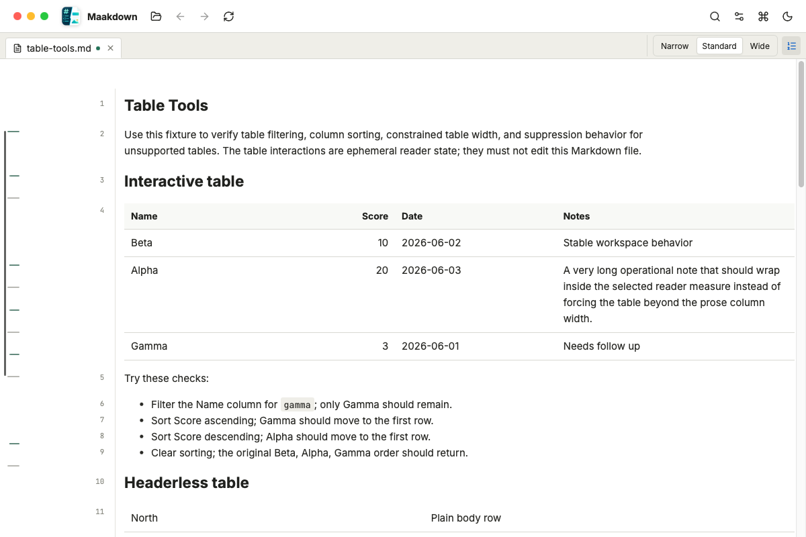
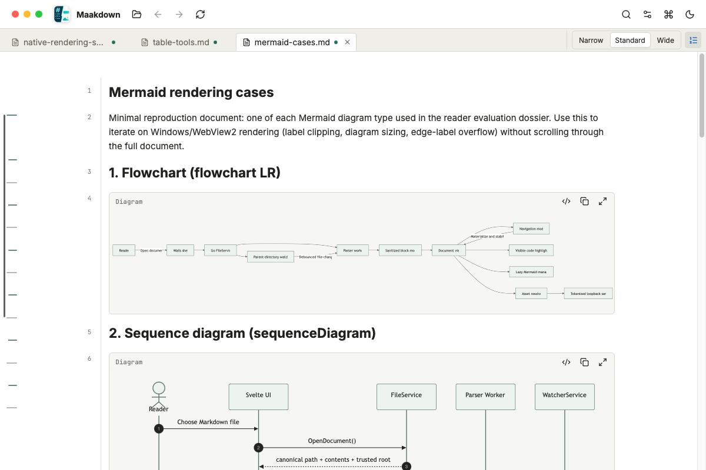

<div align="center">


# Maakdown

**A precise, distraction-free desktop app for reading your Markdown.**

[](https://github.com/cybermaak/maakdown/actions)
[](LICENSE)
[](#download)

Maakdown is a fast, local-first Markdown viewer designed for technical documents, personal notes, and knowledge bases. Open any Markdown file and see it the way you meant it — clean typography, rich tables, code, math, and diagrams in a calm workspace.

**Latest release: [v0.2.0 — Precision Reading & Performance](https://github.com/cybermaak/maakdown/releases/tag/v0.2.0)**

<br />


</div>

---

## 🌟 Why Maakdown?

We built Maakdown because reading Markdown shouldn't feel like staring at a raw code editor, nor should it require a heavyweight, slow electron app. 

- **Precision Reading Controls**: Change the reading measure or show semantic document line numbers directly from the tab bar, then jump to any reader line from the command palette.
- **Lightning Fast on Massive Files**: Open a 10,000-line document and it still scrolls smoothly and stays light on memory. Text appears instantly, and richer details fill in as you read.
- **Built for Technical Minds**: Shiki-highlighted code, KaTeX math, Mermaid diagrams, sortable and filterable tables, task lists, callouts, footnotes, and local images all just work.
- **Local-First & Private**: Your files never leave your machine. Work offline across many notes using tabs, recent files, and a session that restores itself perfectly the next time you open the app.
- **Keyboard & Navigation Ready**: Search the current document, navigate with the outline minimap and command palette, jump between notes via wikilinks, and print or export to PDF whenever you need a copy.

---

## ✨ Features at a Glance

| Feature | Details |
|---|---|
| **Standard Markdown** | Full support for CommonMark + GFM tables, task lists, strikethrough, autolinks, and footnotes. |
| **Code & Syntax** | Shiki highlighting by default, with Highlight.js available as a fast fallback from the command palette. |
| **Math & Diagrams** | Inline and block math rendered with KaTeX. Mermaid diagrams lazy-load on viewport entry. |
| **Metadata & Callouts** | YAML frontmatter surfaces as a clean document masthead. Full support for GitHub/Obsidian-style callouts. |
| **Precision Reading** | Docked reading-width controls, semantic document line numbers, `Go to line...`, reader statistics, and minimap search/structure marks. |
| **Tables** | Constrained reader layouts, row numbers, sorting, type-aware filtering, and active filter/sort chips. |
| **Seamless Navigation** | Hover-revealed outline with scroll-spy, internal `#anchors`, per-tab history, and a unified command palette. |
| **Wikilinks** | Native `[[Note Name]]` support resolved through a blazing-fast Go-built vault index. |
| **Workspace & Output** | Tabbed documents, drag-and-drop, native print, and system print-to-PDF support. |
| **Custom Appearance** | Light/dark and high-contrast reader themes with configurable typography and measure. |

---

## 📸 Screenshots

<table>
  <tr>
    <td width="50%">
      
      <p align="center"><em>Focused reading with metadata and docked controls</em></p>
    </td>
    <td width="50%">
      
      <p align="center"><em>Dark theme with rendered Mermaid diagrams</em></p>
    </td>
  </tr>
  <tr>
    <td width="50%">
      
      <p align="center"><em>Reader-first tables with sorting and filtering</em></p>
    </td>
    <td width="50%">
      
      <p align="center"><em>Shiki-highlighted code and KaTeX math</em></p>
    </td>
  </tr>
  <tr>
    <td width="50%">
      
      <p align="center"><em>Unified commands, navigation, and settings</em></p>
    </td>
    <td width="50%">
      
      <p align="center"><em>Restorable multi-tab workspace</em></p>
    </td>
  </tr>
</table>

Every image above comes from the real app rendering release fixtures. The repeatable refresh process is documented in [`docs/release-site-refresh.md`](docs/release-site-refresh.md).

---

## 🚀 Download & Installation

Grab the latest build for your OS from the [GitHub Releases](https://github.com/cybermaak/maakdown/releases) page — or visit the [project homepage](https://cybermaak.github.io/maakdown/):

| Platform | Artifact | Notes |
|---|---|---|
| **macOS** (Apple silicon) | `.dmg` or `.zip` | **Signed & notarized** — opens without Gatekeeper warnings |
| **Windows** (x64) | `.zip` | Native Windows build with Markdown file association. Unsigned (SmartScreen may warn) |
| **Linux** (x64) | `.tar.gz` | Requires WebKit2GTK (preinstalled on most desktop distros) |

Extract (or drag the dmg's app to Applications) and launch.

---

## 🛠️ For Developers & Contributors

Maakdown is an open-source project built with performance and simplicity in mind. We use a **Go backend** via [Wails v2](https://wails.io/) paired with a **Svelte 5 + TypeScript** frontend.

### Architecture Highlights
- **Go Backend**: Handles file operations, safe-save watcher debounce, tokenized loopback asset server, and blazing-fast wikilink indexing.
- **Svelte 5 Frontend**: A framework-agnostic core running a unified/remark/rehype pipeline, with a fully virtualized reader UI.

### Getting Started

Prerequisites: **Go 1.22+**, **Node.js 20.19+**, and the **Wails CLI v2.12.x**.

```bash
# Clone the repository
git clone https://github.com/cybermaak/maakdown.git
cd maakdown

# Install frontend dependencies
cd frontend && npm install && cd ..

# Start the dev server (hot-reloads frontend in a native WebView)
wails dev
```

For comprehensive documentation on the codebase, project rules, and contributing guidelines, please refer to:
- [`docs/markdown-viewer-design-spec.md`](docs/markdown-viewer-design-spec.md) — Product & Technical Spec
- [`AGENTS.md`](AGENTS.md) — Repo Operating Rules
- [`DEV_CONTEXT.md`](DEV_CONTEXT.md) — Current Project State & Completed Tasks

---

## 📜 License

Maakdown is open-source software licensed under the [MIT License](LICENSE).
