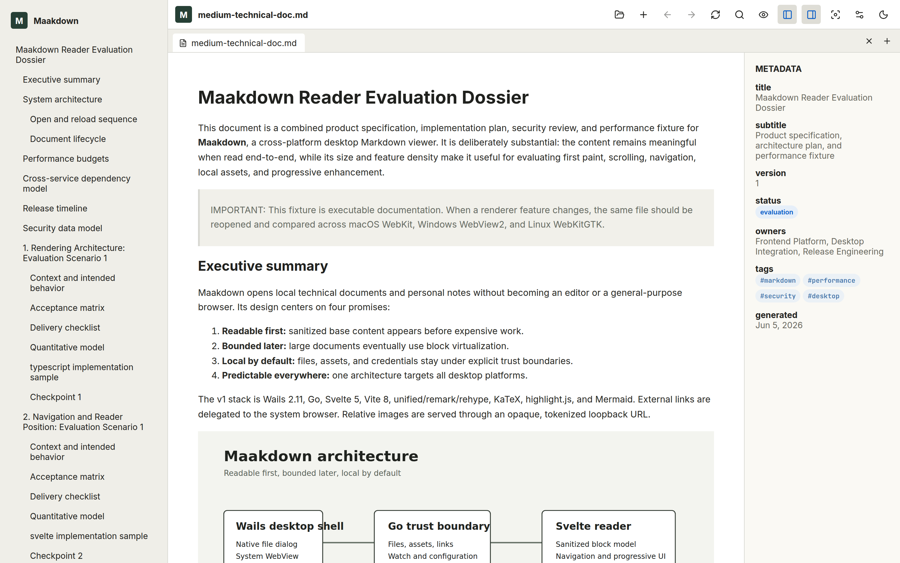
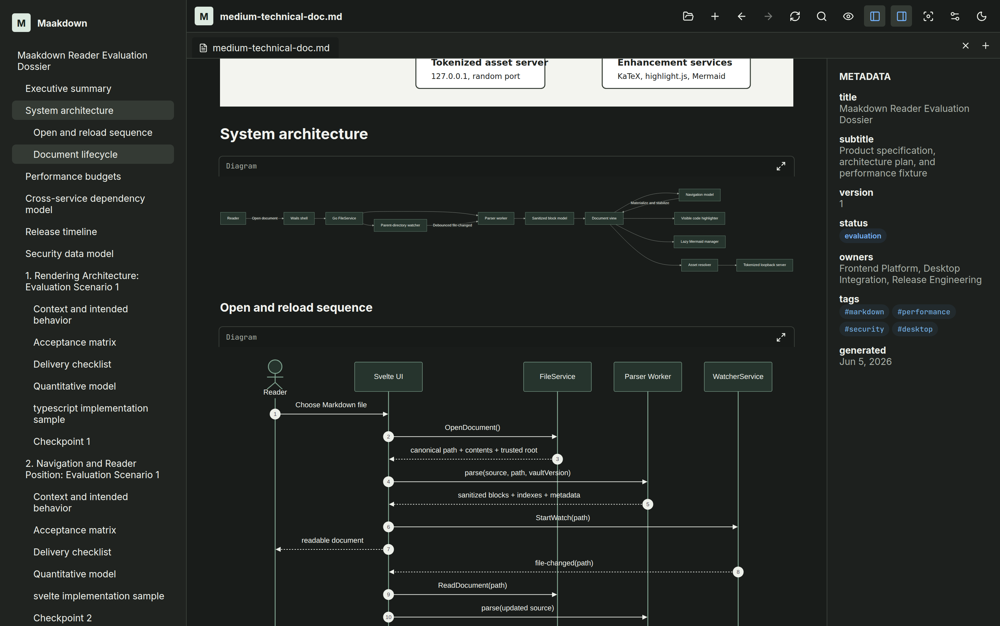
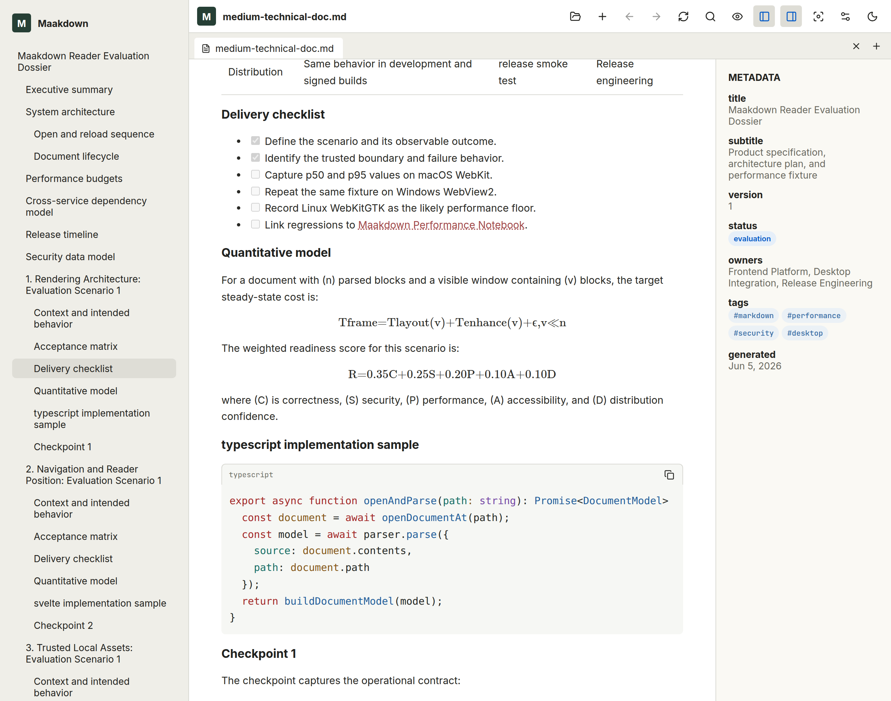
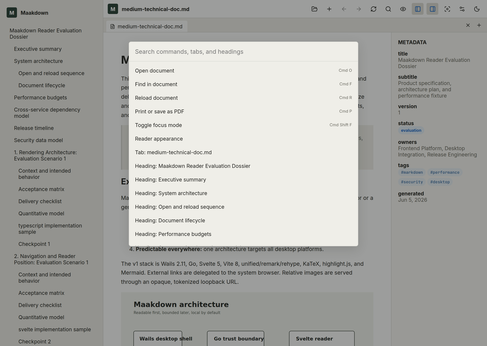

<div align="center">

# Maakdown

**A beautiful, distraction-free desktop app for reading your Markdown.**

Open any Markdown file and see it the way you meant it — clean typography, rich code, math, and
diagrams, all in a calm reading workspace. Keep many documents open in tabs, jump around with a
sidebar outline and search, and pick up right where you left off next time.

Works on Windows, macOS, and Linux.

<br />



</div>

---

## Why you'll like it

- **A genuinely nice reading experience.** Warm, book-like themes, careful typography, and a focus
  mode that clears everything but the words. Tune the font, size, line height, and width to taste.
- **Handles your biggest files with ease.** Open a 10,000-line document and it still scrolls
  smoothly and stays light on memory, with text appearing instantly and richer details filling in
  as you read.
- **Renders the technical stuff correctly.** Syntax-highlighted code, KaTeX math, Mermaid diagrams,
  tables, task lists, callouts, footnotes, and local images all just work.
- **Built for working across many notes.** Tabbed documents, recent files, drag-and-drop, internal
  links and wikilinks between notes, and a session that restores itself the next time you open the app.
- **Find and get things out fast.** Search the current document, navigate with a command palette and
  keyboard shortcuts, and print or export to PDF whenever you need a copy.

## Features

| Area | What you get |
|---|---|
| **Markdown** | CommonMark + GFM tables, task lists, strikethrough, autolinks, and footnotes |
| **Code** | Fenced-code highlighting via highlight.js (default), with optional Shiki |
| **Math** | Inline and block math rendered with KaTeX |
| **Diagrams** | Mermaid fenced diagrams, lazy-loaded and rendered on viewport entry |
| **Frontmatter** | YAML frontmatter extracted to a metadata panel, never body-rendered |
| **Callouts** | GitHub / Obsidian-style callouts with a sanitized class allowlist |
| **Images** | Local relative images resolved through a bounded loopback asset service |
| **Navigation** | Sidebar TOC with scroll-spy, internal `#anchors`, footnotes, and per-tab history |
| **Wikilinks** | `[[Note Name]]` resolved through a Go-built vault index |
| **Workspace** | Tabbed documents, session restoration, recent files, and drag-and-drop |
| **Find** | Current-document search with true match counts, next/previous, and a case-sensitive toggle |
| **Commands** | Native menus, keyboard shortcuts, and an in-app command palette |
| **Output** | Print and system print-to-PDF of the complete document, not just the visible slice |
| **Appearance** | Light/dark themes, focus mode, and configurable font, size, line height, and measure |

## Screenshots

<table>
  <tr>
    <td width="50%">
      
      <p align="center"><em>Dark theme with rendered Mermaid diagrams</em></p>
    </td>
    <td width="50%">
      
      <p align="center"><em>Syntax-highlighted code and KaTeX math</em></p>
    </td>
  </tr>
  <tr>
    <td width="50%">
      
      <p align="center"><em>Command palette for fast keyboard navigation</em></p>
    </td>
    <td width="50%" valign="top">
      <p>Every screenshot above is generated from the real app rendering the sample documents in
      <code>fixtures/</code>. Regenerate them at any time with:</p>
      <pre><code>cd frontend
node scripts/capture-readme-screenshots.mjs</code></pre>
      <p>The script drives the actual Svelte frontend in headless Chromium via the dev fixture
      loader, so the images always reflect current rendering.</p>
    </td>
  </tr>
</table>

> Screenshots use the bundled `fixtures/medium-technical-doc.md` evaluation document.

## Architecture

Maakdown is a [Wails](https://wails.io/) v2 desktop app: a Go backend paired with a Svelte +
TypeScript frontend.

- **Go backend** (`internal/`, `app.go`, `main.go`) — file open/read, a parent-directory filesystem
  watcher with safe-save debounce, a tokenized loopback asset server for local images, external link
  routing, config, and the vault index for wikilinks.
- **Svelte/TypeScript frontend** (`frontend/src/`) — the document shell, stores, IPC wrappers, and the
  virtualized reader UI, built on the Maakdown design system.
- **Framework-agnostic core** (`frontend/src/core/`) — the unified/remark/rehype Markdown pipeline,
  document model, virtualizer, navigation, highlighters, Mermaid, KaTeX, sanitization, assets, theme,
  and workers.

### Stack

- Wails v2.11.x · Go
- Svelte 5.x · TypeScript · Vite 8.x
- unified / remark / rehype Markdown pipeline
- KaTeX · highlight.js · optional Shiki (JS RegExp engine) · Mermaid

The authoritative product and architecture docs live in [`docs/`](docs/):

- [`docs/markdown-viewer-design-spec.md`](docs/markdown-viewer-design-spec.md) — product & technical spec
- [`docs/markdown-viewer-implementation-plan.md`](docs/markdown-viewer-implementation-plan.md) — implementation plan
- [`docs/task-tracker.md`](docs/task-tracker.md) — project/progress tracker
- [`docs/review-consensus.md`](docs/review-consensus.md) — multi-model review consensus

---

## Development Setup

### Prerequisites

| Tool | Version | Notes |
|---|---|---|
| **Go** | 1.22+ | Backend and the Wails CLI |
| **Node.js** | 20.19+ or 22.12+ | Required by Vite 8 / the Svelte plugin (avoid 22.0–22.11) |
| **npm** | 10.x | Ships with Node |
| **Wails CLI** | v2.11.x | Desktop dev/build; do **not** use Wails v3 for v1 |
| Platform deps | — | See the [Wails platform guide](https://wails.io/docs/gettingstarted/installation) for the WebView/build packages on your OS (e.g. WebKit2GTK on Linux) |

Install the Wails CLI once Go is on your `PATH`:

```bash
go install github.com/wailsapp/wails/v2/cmd/wails@v2.11.0
# Ensure the install location is on PATH:
export PATH="$PATH:$(go env GOPATH)/bin"
wails doctor   # checks your platform dependencies
```

### Get the code

```bash
git clone https://github.com/cybermaak/maakdown.git
cd maakdown
```

### Install dependencies

```bash
# Frontend
cd frontend
npm install
cd ..

# Backend modules are fetched on first build/test:
go mod download
```

### Run the app in development

```bash
# From the repository root — hot-reloads the Svelte frontend in the desktop WebView:
wails dev
```

`wails dev` serves the frontend from Vite (`http://localhost:5173`) and rebuilds the Go backend on
change. If you only need the frontend in a browser (no native shell), run `npm run dev` inside
`frontend/`.

### Build a production binary

```bash
wails build
# Output lands in build/bin/Maakdown (platform-specific)
```

### Everyday commands

Run from the repository root unless noted:

```bash
# Frontend (run inside frontend/)
npm run check          # Svelte/TypeScript type checking
npm run build          # Production frontend bundle
npm run test           # Vitest unit tests
npm run uat            # Playwright UI-driven UAT journeys (headless Chromium)
npm run benchmark      # Reader performance harness (parser, virtualizer, navigation)

# Backend
go test ./...          # Go service tests

# Combined verification
scripts/verify.sh      # Frontend test/check/build + go test + wails build (skips missing tools)
scripts/release-check.sh  # verify.sh + fixture regen + benchmark + UAT
```

> **Tip:** `scripts/verify.sh` gracefully skips any stage whose tooling is missing (e.g. it skips the
> Wails build if `wails` isn't on `PATH`), so it's safe to run in partial environments.

### Project layout

```text
maakdown/
├── app.go, main.go        # Wails app lifecycle and entry point
├── internal/              # Go services: assetservice, watcher, vault, …
├── frontend/
│   ├── src/core/          # Framework-agnostic Markdown pipeline, virtualizer, navigation
│   ├── src/design-system/ # Production Svelte primitives + gallery
│   ├── src/components/     # Reader surface, TOC, metadata panel
│   ├── src/ipc/           # The only place generated wailsjs/ bindings are imported
│   └── e2e/               # Playwright UAT journeys
├── fixtures/              # Deterministic Markdown evaluation documents
├── docs/                  # Spec, plan, trackers, design system, UAT plan
├── build/                 # Signing-safe templates: darwin/, windows/, signing/
└── scripts/              # verify.sh, release-check.sh, signing helpers
```

### Conventions worth knowing

These constraints are enforced across the codebase — keep them in mind when contributing:

- **No Wails v3** in v1; stay on the v2.11.x line.
- **No raw `file://` image loading** and **no image bytes over Wails IPC** for normal rendering — local
  images go through the tokenized loopback asset server.
- **No native hash scrolling** in document content; use the virtualizer-aware navigation model.
- **No generated `wailsjs/` imports outside `frontend/src/ipc/`** — application code calls through the
  IPC adapter.
- Read [`AGENTS.md`](AGENTS.md) and [`CLAUDE.md`](CLAUDE.md) for the full repo operating rules, and keep
  [`DEV_CONTEXT.md`](DEV_CONTEXT.md) and [`docs/task-tracker.md`](docs/task-tracker.md) current as work lands.

### Current status

The repository implements the design system and core reader/workspace phases (P0–P11 locally complete).
Remaining work centers on hosted cross-platform (Linux/macOS/Windows) verification and signed release
acceptance. See [`DEV_CONTEXT.md`](DEV_CONTEXT.md) and [`docs/task-tracker.md`](docs/task-tracker.md)
for the live picture.

---

## Signing & Releases

macOS and Windows signing are treated as first-class release concerns. The repository keeps
signing-safe templates, entitlements, manifests, and documentation under `build/darwin/`,
`build/windows/`, and `build/signing/`.

**Certificates, private keys, provisioning profiles, notarization credentials, and signed artifacts
must never be committed.** Signing inputs are provided via environment variables or CI secrets — see
[`.env.example`](.env.example) for the expected variable names.

## License

See [`LICENSE`](LICENSE).
