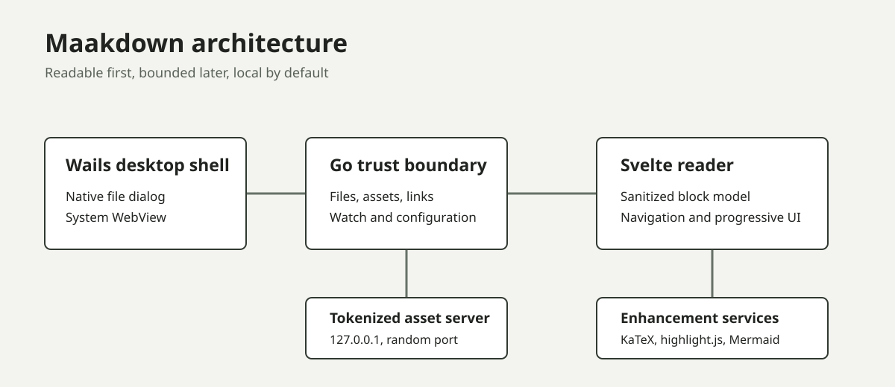
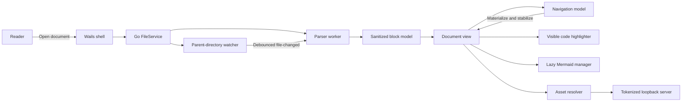
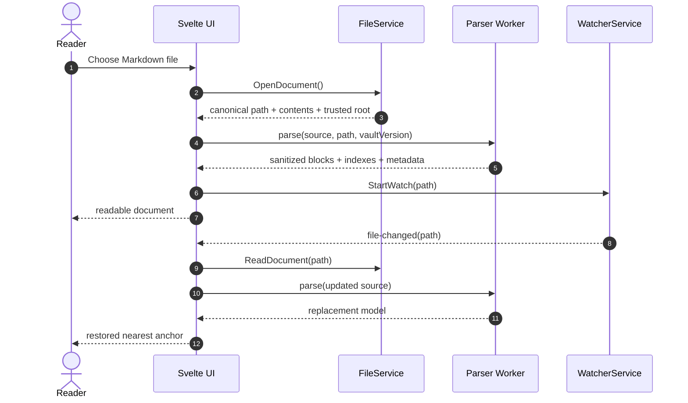
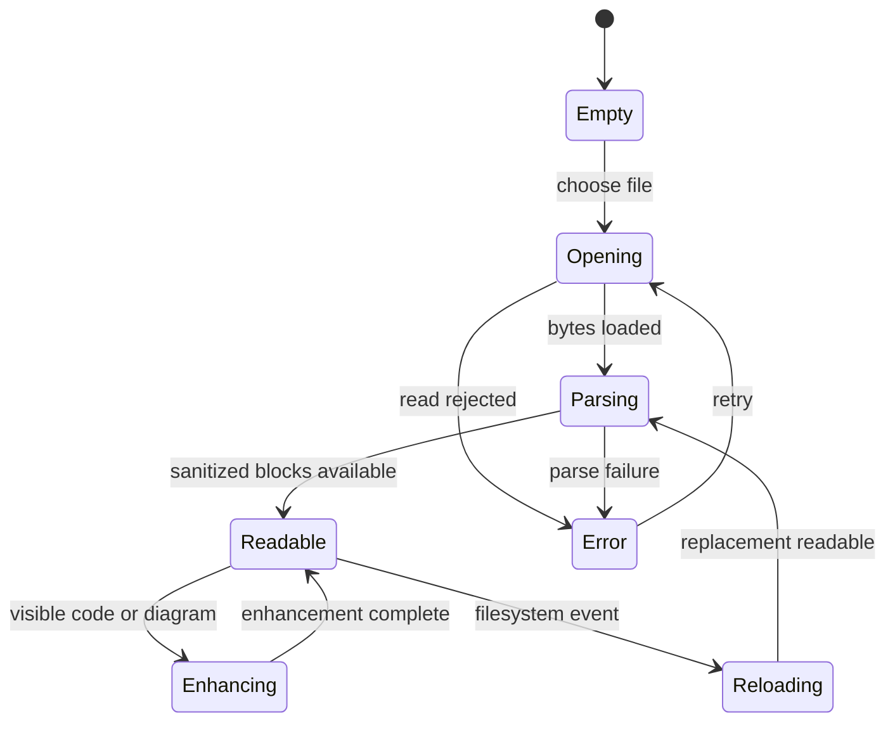
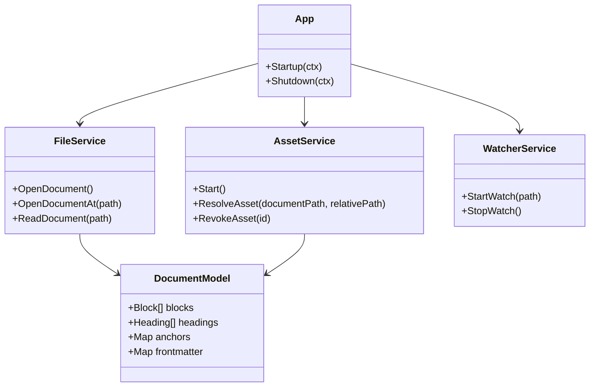
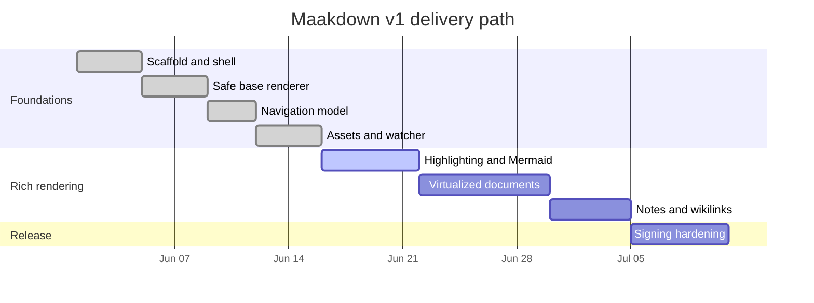
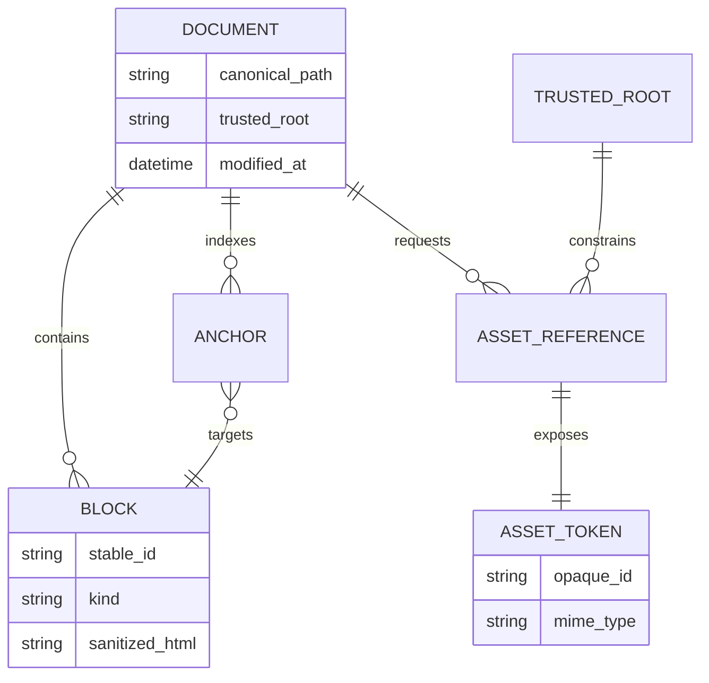

# Maakdown Reader Evaluation Dossier

This document is a combined product specification, implementation plan, security
review, and performance fixture for **Maakdown**, a cross-platform desktop
Markdown viewer. It is deliberately substantial: the content remains meaningful
when read end-to-end, while its size and feature density make it useful for
evaluating first paint, scrolling, navigation, local assets, and progressive
enhancement.

> [!IMPORTANT]
> This fixture is executable documentation. When a renderer feature changes, the
> same file should be reopened and compared across macOS WebKit, Windows WebView2,
> and Linux WebKitGTK.

## Executive summary

Maakdown opens local technical documents and personal notes without becoming an
editor or a general-purpose browser. Its design centers on four promises:

1. **Readable first:** sanitized base content appears before expensive work.
2. **Bounded later:** large documents eventually use block virtualization.
3. **Local by default:** files, assets, and credentials stay under explicit trust boundaries.
4. **Predictable everywhere:** one architecture targets all desktop platforms.

The v1 stack is Wails 2.11, Go, Svelte 5, Vite 8, unified/remark/rehype, KaTeX,
highlight.js, and Mermaid. External links are delegated to the system browser.
Relative images are served through an opaque, tokenized loopback URL.



## System architecture



### Open and reload sequence



### Document lifecycle



## Performance budgets

| Fixture | macOS target | Windows target | Linux target |
|---|---:|---:|---:|
| Small README first meaningful paint | 200 ms | 150 ms | 250 ms |
| Medium technical document | 350 ms | 250 ms | 450 ms |
| This evaluation dossier | responsive scroll | responsive scroll | responsive scroll |
| Anchor correction | <= 8 px | <= 8 px | <= 8 px |

The frame budget at 60 Hz is approximately:

$$
\Delta t = \frac{1000\text{ ms}}{60} \approx 16.67\text{ ms}
$$


## Cross-service dependency model



## Release timeline



## Security data model



## 1. Rendering Architecture: Evaluation Scenario 1

This scenario examines **Keeping parsing deterministic while expensive enhancements remain progressive**. The governing choice is:
Sanitize serialized block HTML in the parser worker, then enhance visible code and diagrams separately. The primary measurement is `open-to-readable-text`, owned by
Frontend platform. This section intentionally mixes prose, structured data, links,
code, mathematics, and navigation targets so that one scroll pass exercises the
reader as a coherent technical document rather than as synthetic filler.

### Context and intended behavior

Maakdown should make the base text readable before enhancement work begins. A
reader opening this section should be able to scan the decision, inspect the
acceptance criteria, follow [the implementation checkpoint](#checkpoint-1),
and return from footnote 1 without the interface stealing focus.[^scenario-1]

> [!NOTE]
> Scenario 1 belongs to **P1** and uses `open-to-readable-text` as its
> principal signal. A slow enhancement must never make the unenhanced source unreadable.

> [!WARNING]
> A successful happy-path render is not enough. The same workflow must remain safe
> when Markdown contains raw HTML, malformed links, oversized assets, duplicate
> headings, or a filesystem event burst.

### Acceptance matrix

| Dimension | Expected behavior | Evidence | Owner |
|---|---|---|---|
| Correctness | Stable block ordering and deterministic anchors | fixture snapshot | Frontend platform |
| Security | Sanitized HTML and constrained local resources | adversarial tests | Security |
| Performance | No sustained main-thread stall during scrolling | trace and timing sample | Performance |
| Accessibility | Keyboard-reachable links and meaningful document structure | semantic audit | Reader experience |
| Distribution | Same behavior in development and signed builds | release smoke test | Release engineering |

### Delivery checklist

- [x] Define the scenario and its observable outcome.
- [x] Identify the trusted boundary and failure behavior.
- [ ] Capture p50 and p95 values on macOS WebKit.
- [ ] Repeat the same fixture on Windows WebView2.
- [ ] Record Linux WebKitGTK as the likely performance floor.
- [ ] Link regressions to [[Maakdown Performance Notebook]].

### Quantitative model

For a document with (n) parsed blocks and a visible window containing (v)
blocks, the target steady-state cost is:

$$
T_{frame} = T_{layout}(v) + T_{enhance}(v) + \epsilon,
\qquad v \ll n
$$

The weighted readiness score for this scenario is:

$$
R = 0.35C + 0.25S + 0.20P + 0.10A + 0.10D
$$

where (C) is correctness, (S) security, (P) performance, (A)
accessibility, and (D) distribution confidence.

### typescript implementation sample

```typescript
export async function openAndParse(path: string): Promise<DocumentModel> {
  const document = await openDocumentAt(path);
  const model = await parser.parse({
    source: document.contents,
    path: document.path
  });
  return buildDocumentModel(model);
}
```

### Checkpoint 1

<a id="checkpoint-1"></a>

The checkpoint captures the operational contract:

1. Parse and sanitize before HTML reaches the document surface.
2. Preserve plain text and source code while enhancements are pending.
3. Resolve navigation through stable document-model identifiers.
4. Keep filesystem paths behind the backend trust boundary.
5. Verify the same behavior in a packaged build.

The expected result is measurable: **open-to-readable-text** should remain within its
budget while the reader scrolls continuously through adjacent sections.

[^scenario-1]: Scenario 1 is generated deterministically from the approved Maakdown design and implementation plan.


## 2. Navigation and Reader Position: Evaluation Scenario 1

This scenario examines **Making anchors reliable when large documents eventually use a bounded DOM**. The governing choice is:
Route TOC, footnotes, and internal links through one anchor-to-block navigation model. The primary measurement is `anchor landing error`, owned by
Reader experience. This section intentionally mixes prose, structured data, links,
code, mathematics, and navigation targets so that one scroll pass exercises the
reader as a coherent technical document rather than as synthetic filler.

### Context and intended behavior

Maakdown should make the base text readable before enhancement work begins. A
reader opening this section should be able to scan the decision, inspect the
acceptance criteria, follow [the implementation checkpoint](#checkpoint-2),
and return from footnote 2 without the interface stealing focus.[^scenario-2]

> [!NOTE]
> Scenario 2 belongs to **P1** and uses `anchor landing error` as its
> principal signal. A slow enhancement must never make the unenhanced source unreadable.

> [!WARNING]
> A successful happy-path render is not enough. The same workflow must remain safe
> when Markdown contains raw HTML, malformed links, oversized assets, duplicate
> headings, or a filesystem event burst.

### Acceptance matrix

| Dimension | Expected behavior | Evidence | Owner |
|---|---|---|---|
| Correctness | Stable block ordering and deterministic anchors | fixture snapshot | Reader experience |
| Security | Sanitized HTML and constrained local resources | adversarial tests | Security |
| Performance | No sustained main-thread stall during scrolling | trace and timing sample | Performance |
| Accessibility | Keyboard-reachable links and meaningful document structure | semantic audit | Reader experience |
| Distribution | Same behavior in development and signed builds | release smoke test | Release engineering |

### Delivery checklist

- [x] Define the scenario and its observable outcome.
- [x] Identify the trusted boundary and failure behavior.
- [ ] Capture p50 and p95 values on macOS WebKit.
- [ ] Repeat the same fixture on Windows WebView2.
- [ ] Record Linux WebKitGTK as the likely performance floor.
- [ ] Link regressions to [[Maakdown Performance Notebook]].

### Quantitative model

For a document with (n) parsed blocks and a visible window containing (v)
blocks, the target steady-state cost is:

$$
T_{frame} = T_{layout}(v) + T_{enhance}(v) + \epsilon,
\qquad v \ll n
$$

The weighted readiness score for this scenario is:

$$
R = 0.35C + 0.25S + 0.20P + 0.10A + 0.10D
$$

where (C) is correctness, (S) security, (P) performance, (A)
accessibility, and (D) distribution confidence.

### svelte implementation sample

```svelte
<script lang="ts">
  import type { Heading } from '../core/model/types';
  let { headings, activeId }: { headings: Heading[]; activeId: string | null } = $props();
</script>

<nav aria-label="Document outline">
  {#each headings as heading}
    <button class:active={heading.id === activeId}>{heading.text}</button>
  {/each}
</nav>
```

### Checkpoint 2

<a id="checkpoint-2"></a>

The checkpoint captures the operational contract:

1. Parse and sanitize before HTML reaches the document surface.
2. Preserve plain text and source code while enhancements are pending.
3. Resolve navigation through stable document-model identifiers.
4. Keep filesystem paths behind the backend trust boundary.
5. Verify the same behavior in a packaged build.

The expected result is measurable: **anchor landing error** should remain within its
budget while the reader scrolls continuously through adjacent sections.

[^scenario-2]: Scenario 2 is generated deterministically from the approved Maakdown design and implementation plan.


## 3. Trusted Local Assets: Evaluation Scenario 1

This scenario examines **Displaying relative images without turning the viewer into an arbitrary file server**. The governing choice is:
Resolve assets under a trusted root and expose opaque tokenized loopback URLs. The primary measurement is `blocked traversal attempts`, owned by
Backend platform. This section intentionally mixes prose, structured data, links,
code, mathematics, and navigation targets so that one scroll pass exercises the
reader as a coherent technical document rather than as synthetic filler.

### Context and intended behavior

Maakdown should make the base text readable before enhancement work begins. A
reader opening this section should be able to scan the decision, inspect the
acceptance criteria, follow [the implementation checkpoint](#checkpoint-3),
and return from footnote 3 without the interface stealing focus.[^scenario-3]

> [!NOTE]
> Scenario 3 belongs to **P1** and uses `blocked traversal attempts` as its
> principal signal. A slow enhancement must never make the unenhanced source unreadable.

> [!WARNING]
> A successful happy-path render is not enough. The same workflow must remain safe
> when Markdown contains raw HTML, malformed links, oversized assets, duplicate
> headings, or a filesystem event burst.

### Acceptance matrix

| Dimension | Expected behavior | Evidence | Owner |
|---|---|---|---|
| Correctness | Stable block ordering and deterministic anchors | fixture snapshot | Backend platform |
| Security | Sanitized HTML and constrained local resources | adversarial tests | Security |
| Performance | No sustained main-thread stall during scrolling | trace and timing sample | Performance |
| Accessibility | Keyboard-reachable links and meaningful document structure | semantic audit | Reader experience |
| Distribution | Same behavior in development and signed builds | release smoke test | Release engineering |

### Delivery checklist

- [x] Define the scenario and its observable outcome.
- [x] Identify the trusted boundary and failure behavior.
- [ ] Capture p50 and p95 values on macOS WebKit.
- [ ] Repeat the same fixture on Windows WebView2.
- [ ] Record Linux WebKitGTK as the likely performance floor.
- [ ] Link regressions to [[Maakdown Performance Notebook]].

### Quantitative model

For a document with (n) parsed blocks and a visible window containing (v)
blocks, the target steady-state cost is:

$$
T_{frame} = T_{layout}(v) + T_{enhance}(v) + \epsilon,
\qquad v \ll n
$$

The weighted readiness score for this scenario is:

$$
R = 0.35C + 0.25S + 0.20P + 0.10A + 0.10D
$$

where (C) is correctness, (S) security, (P) performance, (A)
accessibility, and (D) distribution confidence.

### bash implementation sample

```bash
set -euo pipefail

npm --prefix frontend run test
npm --prefix frontend run check
npm --prefix frontend run build
go test ./...
"$(go env GOPATH)/bin/wails" build
```

### Checkpoint 3

<a id="checkpoint-3"></a>

The checkpoint captures the operational contract:

1. Parse and sanitize before HTML reaches the document surface.
2. Preserve plain text and source code while enhancements are pending.
3. Resolve navigation through stable document-model identifiers.
4. Keep filesystem paths behind the backend trust boundary.
5. Verify the same behavior in a packaged build.

The expected result is measurable: **blocked traversal attempts** should remain within its
budget while the reader scrolls continuously through adjacent sections.

[^scenario-3]: Scenario 3 is generated deterministically from the approved Maakdown design and implementation plan.


## 4. Filesystem Reloads: Evaluation Scenario 1

This scenario examines **Surviving editor safe-save behavior without duplicate reloads or lost reading position**. The governing choice is:
Watch the parent directory, debounce event bursts, and restore the nearest stable anchor. The primary measurement is `reload stabilization time`, owned by
Desktop integration. This section intentionally mixes prose, structured data, links,
code, mathematics, and navigation targets so that one scroll pass exercises the
reader as a coherent technical document rather than as synthetic filler.

### Context and intended behavior

Maakdown should make the base text readable before enhancement work begins. A
reader opening this section should be able to scan the decision, inspect the
acceptance criteria, follow [the implementation checkpoint](#checkpoint-4),
and return from footnote 4 without the interface stealing focus.[^scenario-4]

> [!NOTE]
> Scenario 4 belongs to **P2** and uses `reload stabilization time` as its
> principal signal. A slow enhancement must never make the unenhanced source unreadable.

> [!WARNING]
> A successful happy-path render is not enough. The same workflow must remain safe
> when Markdown contains raw HTML, malformed links, oversized assets, duplicate
> headings, or a filesystem event burst.

### Acceptance matrix

| Dimension | Expected behavior | Evidence | Owner |
|---|---|---|---|
| Correctness | Stable block ordering and deterministic anchors | fixture snapshot | Desktop integration |
| Security | Sanitized HTML and constrained local resources | adversarial tests | Security |
| Performance | No sustained main-thread stall during scrolling | trace and timing sample | Performance |
| Accessibility | Keyboard-reachable links and meaningful document structure | semantic audit | Reader experience |
| Distribution | Same behavior in development and signed builds | release smoke test | Release engineering |

### Delivery checklist

- [x] Define the scenario and its observable outcome.
- [x] Identify the trusted boundary and failure behavior.
- [ ] Capture p50 and p95 values on macOS WebKit.
- [ ] Repeat the same fixture on Windows WebView2.
- [ ] Record Linux WebKitGTK as the likely performance floor.
- [ ] Link regressions to [[Maakdown Performance Notebook]].

### Quantitative model

For a document with (n) parsed blocks and a visible window containing (v)
blocks, the target steady-state cost is:

$$
T_{frame} = T_{layout}(v) + T_{enhance}(v) + \epsilon,
\qquad v \ll n
$$

The weighted readiness score for this scenario is:

$$
R = 0.35C + 0.25S + 0.20P + 0.10A + 0.10D
$$

where (C) is correctness, (S) security, (P) performance, (A)
accessibility, and (D) distribution confidence.

### python implementation sample

```python
def percentile(samples: list[float], quantile: float) -> float:
    ordered = sorted(samples)
    index = min(round((len(ordered) - 1) * quantile), len(ordered) - 1)
    return ordered[index]

print({"p50": percentile(latencies, 0.50), "p95": percentile(latencies, 0.95)})
```

### Checkpoint 4

<a id="checkpoint-4"></a>

The checkpoint captures the operational contract:

1. Parse and sanitize before HTML reaches the document surface.
2. Preserve plain text and source code while enhancements are pending.
3. Resolve navigation through stable document-model identifiers.
4. Keep filesystem paths behind the backend trust boundary.
5. Verify the same behavior in a packaged build.

The expected result is measurable: **reload stabilization time** should remain within its
budget while the reader scrolls continuously through adjacent sections.

[^scenario-4]: Scenario 4 is generated deterministically from the approved Maakdown design and implementation plan.


## 5. Progressive Code Highlighting: Evaluation Scenario 1

This scenario examines **Providing rich code without making the initial document paint wait for every grammar**. The governing choice is:
Use highlight.js for visible blocks first and retain raw readable code as the fallback. The primary measurement is `visible highlight latency`, owned by
Frontend platform. This section intentionally mixes prose, structured data, links,
code, mathematics, and navigation targets so that one scroll pass exercises the
reader as a coherent technical document rather than as synthetic filler.

### Context and intended behavior

Maakdown should make the base text readable before enhancement work begins. A
reader opening this section should be able to scan the decision, inspect the
acceptance criteria, follow [the implementation checkpoint](#checkpoint-5),
and return from footnote 5 without the interface stealing focus.[^scenario-5]

> [!NOTE]
> Scenario 5 belongs to **P2** and uses `visible highlight latency` as its
> principal signal. A slow enhancement must never make the unenhanced source unreadable.

> [!WARNING]
> A successful happy-path render is not enough. The same workflow must remain safe
> when Markdown contains raw HTML, malformed links, oversized assets, duplicate
> headings, or a filesystem event burst.

### Acceptance matrix

| Dimension | Expected behavior | Evidence | Owner |
|---|---|---|---|
| Correctness | Stable block ordering and deterministic anchors | fixture snapshot | Frontend platform |
| Security | Sanitized HTML and constrained local resources | adversarial tests | Security |
| Performance | No sustained main-thread stall during scrolling | trace and timing sample | Performance |
| Accessibility | Keyboard-reachable links and meaningful document structure | semantic audit | Reader experience |
| Distribution | Same behavior in development and signed builds | release smoke test | Release engineering |

### Delivery checklist

- [x] Define the scenario and its observable outcome.
- [x] Identify the trusted boundary and failure behavior.
- [ ] Capture p50 and p95 values on macOS WebKit.
- [ ] Repeat the same fixture on Windows WebView2.
- [ ] Record Linux WebKitGTK as the likely performance floor.
- [ ] Link regressions to [[Maakdown Performance Notebook]].

### Quantitative model

For a document with (n) parsed blocks and a visible window containing (v)
blocks, the target steady-state cost is:

$$
T_{frame} = T_{layout}(v) + T_{enhance}(v) + \epsilon,
\qquad v \ll n
$$

The weighted readiness score for this scenario is:

$$
R = 0.35C + 0.25S + 0.20P + 0.10A + 0.10D
$$

where (C) is correctness, (S) security, (P) performance, (A)
accessibility, and (D) distribution confidence.

### rust implementation sample

```rust
pub fn stabilize_anchor(mut estimate: f64, measurements: &[f64]) -> f64 {
    for measured in measurements.iter().take(4) {
        let error = measured - estimate;
        if error.abs() < 2.0 { break; }
        estimate += error;
    }
    estimate
}
```

### Checkpoint 5

<a id="checkpoint-5"></a>

The checkpoint captures the operational contract:

1. Parse and sanitize before HTML reaches the document surface.
2. Preserve plain text and source code while enhancements are pending.
3. Resolve navigation through stable document-model identifiers.
4. Keep filesystem paths behind the backend trust boundary.
5. Verify the same behavior in a packaged build.

The expected result is measurable: **visible highlight latency** should remain within its
budget while the reader scrolls continuously through adjacent sections.

[^scenario-5]: Scenario 5 is generated deterministically from the approved Maakdown design and implementation plan.


## 6. Diagram Lifecycle: Evaluation Scenario 1

This scenario examines **Rendering complex Mermaid diagrams without blocking scroll or leaking stale SVG trees**. The governing choice is:
Load Mermaid on first demand, render near-viewport diagrams, and rerender visible diagrams on theme changes. The primary measurement is `diagram render latency`, owned by
Reader experience. This section intentionally mixes prose, structured data, links,
code, mathematics, and navigation targets so that one scroll pass exercises the
reader as a coherent technical document rather than as synthetic filler.

### Context and intended behavior

Maakdown should make the base text readable before enhancement work begins. A
reader opening this section should be able to scan the decision, inspect the
acceptance criteria, follow [the implementation checkpoint](#checkpoint-6),
and return from footnote 6 without the interface stealing focus.[^scenario-6]

> [!NOTE]
> Scenario 6 belongs to **P2** and uses `diagram render latency` as its
> principal signal. A slow enhancement must never make the unenhanced source unreadable.

> [!WARNING]
> A successful happy-path render is not enough. The same workflow must remain safe
> when Markdown contains raw HTML, malformed links, oversized assets, duplicate
> headings, or a filesystem event burst.

### Acceptance matrix

| Dimension | Expected behavior | Evidence | Owner |
|---|---|---|---|
| Correctness | Stable block ordering and deterministic anchors | fixture snapshot | Reader experience |
| Security | Sanitized HTML and constrained local resources | adversarial tests | Security |
| Performance | No sustained main-thread stall during scrolling | trace and timing sample | Performance |
| Accessibility | Keyboard-reachable links and meaningful document structure | semantic audit | Reader experience |
| Distribution | Same behavior in development and signed builds | release smoke test | Release engineering |

### Delivery checklist

- [x] Define the scenario and its observable outcome.
- [x] Identify the trusted boundary and failure behavior.
- [ ] Capture p50 and p95 values on macOS WebKit.
- [ ] Repeat the same fixture on Windows WebView2.
- [ ] Record Linux WebKitGTK as the likely performance floor.
- [ ] Link regressions to [[Maakdown Performance Notebook]].

### Quantitative model

For a document with (n) parsed blocks and a visible window containing (v)
blocks, the target steady-state cost is:

$$
T_{frame} = T_{layout}(v) + T_{enhance}(v) + \epsilon,
\qquad v \ll n
$$

The weighted readiness score for this scenario is:

$$
R = 0.35C + 0.25S + 0.20P + 0.10A + 0.10D
$$

where (C) is correctness, (S) security, (P) performance, (A)
accessibility, and (D) distribution confidence.

### sql implementation sample

```sql
SELECT platform,
       percentile_cont(0.50) WITHIN GROUP (ORDER BY first_paint_ms) AS p50,
       percentile_cont(0.95) WITHIN GROUP (ORDER BY first_paint_ms) AS p95
FROM reader_benchmarks
WHERE fixture = 'maakdown-reader-evaluation'
GROUP BY platform
ORDER BY platform;
```

### Checkpoint 6

<a id="checkpoint-6"></a>

The checkpoint captures the operational contract:

1. Parse and sanitize before HTML reaches the document surface.
2. Preserve plain text and source code while enhancements are pending.
3. Resolve navigation through stable document-model identifiers.
4. Keep filesystem paths behind the backend trust boundary.
5. Verify the same behavior in a packaged build.

The expected result is measurable: **diagram render latency** should remain within its
budget while the reader scrolls continuously through adjacent sections.

[^scenario-6]: Scenario 6 is generated deterministically from the approved Maakdown design and implementation plan.


## 7. Large Document Virtualization: Evaluation Scenario 1

This scenario examines **Bounding memory while preserving dynamic-height layout and accurate navigation**. The governing choice is:
Virtualize block records, cache measurements, and stabilize anchor jumps with bounded correction passes. The primary measurement is `live DOM block count`, owned by
Performance. This section intentionally mixes prose, structured data, links,
code, mathematics, and navigation targets so that one scroll pass exercises the
reader as a coherent technical document rather than as synthetic filler.

### Context and intended behavior

Maakdown should make the base text readable before enhancement work begins. A
reader opening this section should be able to scan the decision, inspect the
acceptance criteria, follow [the implementation checkpoint](#checkpoint-7),
and return from footnote 7 without the interface stealing focus.[^scenario-7]

> [!NOTE]
> Scenario 7 belongs to **P2** and uses `live DOM block count` as its
> principal signal. A slow enhancement must never make the unenhanced source unreadable.

> [!WARNING]
> A successful happy-path render is not enough. The same workflow must remain safe
> when Markdown contains raw HTML, malformed links, oversized assets, duplicate
> headings, or a filesystem event burst.

### Acceptance matrix

| Dimension | Expected behavior | Evidence | Owner |
|---|---|---|---|
| Correctness | Stable block ordering and deterministic anchors | fixture snapshot | Performance |
| Security | Sanitized HTML and constrained local resources | adversarial tests | Security |
| Performance | No sustained main-thread stall during scrolling | trace and timing sample | Performance |
| Accessibility | Keyboard-reachable links and meaningful document structure | semantic audit | Reader experience |
| Distribution | Same behavior in development and signed builds | release smoke test | Release engineering |

### Delivery checklist

- [x] Define the scenario and its observable outcome.
- [x] Identify the trusted boundary and failure behavior.
- [ ] Capture p50 and p95 values on macOS WebKit.
- [ ] Repeat the same fixture on Windows WebView2.
- [ ] Record Linux WebKitGTK as the likely performance floor.
- [ ] Link regressions to [[Maakdown Performance Notebook]].

### Quantitative model

For a document with (n) parsed blocks and a visible window containing (v)
blocks, the target steady-state cost is:

$$
T_{frame} = T_{layout}(v) + T_{enhance}(v) + \epsilon,
\qquad v \ll n
$$

The weighted readiness score for this scenario is:

$$
R = 0.35C + 0.25S + 0.20P + 0.10A + 0.10D
$$

where (C) is correctness, (S) security, (P) performance, (A)
accessibility, and (D) distribution confidence.

### json implementation sample

```json
{
  "fixture": "maakdown-reader-evaluation",
  "targets": {
    "firstMeaningfulPaintMs": 350,
    "anchorTolerancePx": 8,
    "maxMountedBlocks": 180
  },
  "platforms": ["darwin-arm64", "windows-amd64", "linux-amd64"]
}
```

### Checkpoint 7

<a id="checkpoint-7"></a>

The checkpoint captures the operational contract:

1. Parse and sanitize before HTML reaches the document surface.
2. Preserve plain text and source code while enhancements are pending.
3. Resolve navigation through stable document-model identifiers.
4. Keep filesystem paths behind the backend trust boundary.
5. Verify the same behavior in a packaged build.

The expected result is measurable: **live DOM block count** should remain within its
budget while the reader scrolls continuously through adjacent sections.

[^scenario-7]: Scenario 7 is generated deterministically from the approved Maakdown design and implementation plan.


## 8. Signed Desktop Distribution: Evaluation Scenario 1

This scenario examines **Shipping trustworthy macOS and Windows artifacts without storing credentials in source control**. The governing choice is:
Keep manifests and entitlements in git while certificates and notarization credentials remain external secrets. The primary measurement is `release verification duration`, owned by
Release engineering. This section intentionally mixes prose, structured data, links,
code, mathematics, and navigation targets so that one scroll pass exercises the
reader as a coherent technical document rather than as synthetic filler.

### Context and intended behavior

Maakdown should make the base text readable before enhancement work begins. A
reader opening this section should be able to scan the decision, inspect the
acceptance criteria, follow [the implementation checkpoint](#checkpoint-8),
and return from footnote 8 without the interface stealing focus.[^scenario-8]

> [!NOTE]
> Scenario 8 belongs to **P3** and uses `release verification duration` as its
> principal signal. A slow enhancement must never make the unenhanced source unreadable.

> [!WARNING]
> A successful happy-path render is not enough. The same workflow must remain safe
> when Markdown contains raw HTML, malformed links, oversized assets, duplicate
> headings, or a filesystem event burst.

### Acceptance matrix

| Dimension | Expected behavior | Evidence | Owner |
|---|---|---|---|
| Correctness | Stable block ordering and deterministic anchors | fixture snapshot | Release engineering |
| Security | Sanitized HTML and constrained local resources | adversarial tests | Security |
| Performance | No sustained main-thread stall during scrolling | trace and timing sample | Performance |
| Accessibility | Keyboard-reachable links and meaningful document structure | semantic audit | Reader experience |
| Distribution | Same behavior in development and signed builds | release smoke test | Release engineering |

### Delivery checklist

- [x] Define the scenario and its observable outcome.
- [x] Identify the trusted boundary and failure behavior.
- [ ] Capture p50 and p95 values on macOS WebKit.
- [ ] Repeat the same fixture on Windows WebView2.
- [ ] Record Linux WebKitGTK as the likely performance floor.
- [ ] Link regressions to [[Maakdown Performance Notebook]].

### Quantitative model

For a document with (n) parsed blocks and a visible window containing (v)
blocks, the target steady-state cost is:

$$
T_{frame} = T_{layout}(v) + T_{enhance}(v) + \epsilon,
\qquad v \ll n
$$

The weighted readiness score for this scenario is:

$$
R = 0.35C + 0.25S + 0.20P + 0.10A + 0.10D
$$

where (C) is correctness, (S) security, (P) performance, (A)
accessibility, and (D) distribution confidence.

### yaml implementation sample

```yaml
release:
  channels: [nightly, beta, stable]
  signing:
    macos: keychain
    windows: external-secret
  artifacts:
    retain-symbols: true
    publish-checksums: true
```

### Checkpoint 8

<a id="checkpoint-8"></a>

The checkpoint captures the operational contract:

1. Parse and sanitize before HTML reaches the document surface.
2. Preserve plain text and source code while enhancements are pending.
3. Resolve navigation through stable document-model identifiers.
4. Keep filesystem paths behind the backend trust boundary.
5. Verify the same behavior in a packaged build.

The expected result is measurable: **release verification duration** should remain within its
budget while the reader scrolls continuously through adjacent sections.

[^scenario-8]: Scenario 8 is generated deterministically from the approved Maakdown design and implementation plan.


## 9. Rendering Architecture: Evaluation Scenario 2

This scenario examines **Keeping parsing deterministic while expensive enhancements remain progressive**. The governing choice is:
Sanitize serialized block HTML in the parser worker, then enhance visible code and diagrams separately. The primary measurement is `open-to-readable-text`, owned by
Frontend platform. This section intentionally mixes prose, structured data, links,
code, mathematics, and navigation targets so that one scroll pass exercises the
reader as a coherent technical document rather than as synthetic filler.

### Context and intended behavior

Maakdown should make the base text readable before enhancement work begins. A
reader opening this section should be able to scan the decision, inspect the
acceptance criteria, follow [the implementation checkpoint](#checkpoint-9),
and return from footnote 9 without the interface stealing focus.[^scenario-9]

> [!NOTE]
> Scenario 9 belongs to **P3** and uses `open-to-readable-text` as its
> principal signal. A slow enhancement must never make the unenhanced source unreadable.

> [!WARNING]
> A successful happy-path render is not enough. The same workflow must remain safe
> when Markdown contains raw HTML, malformed links, oversized assets, duplicate
> headings, or a filesystem event burst.

### Acceptance matrix

| Dimension | Expected behavior | Evidence | Owner |
|---|---|---|---|
| Correctness | Stable block ordering and deterministic anchors | fixture snapshot | Frontend platform |
| Security | Sanitized HTML and constrained local resources | adversarial tests | Security |
| Performance | No sustained main-thread stall during scrolling | trace and timing sample | Performance |
| Accessibility | Keyboard-reachable links and meaningful document structure | semantic audit | Reader experience |
| Distribution | Same behavior in development and signed builds | release smoke test | Release engineering |

### Delivery checklist

- [x] Define the scenario and its observable outcome.
- [x] Identify the trusted boundary and failure behavior.
- [ ] Capture p50 and p95 values on macOS WebKit.
- [ ] Repeat the same fixture on Windows WebView2.
- [ ] Record Linux WebKitGTK as the likely performance floor.
- [ ] Link regressions to [[Maakdown Performance Notebook]].

### Quantitative model

For a document with (n) parsed blocks and a visible window containing (v)
blocks, the target steady-state cost is:

$$
T_{frame} = T_{layout}(v) + T_{enhance}(v) + \epsilon,
\qquad v \ll n
$$

The weighted readiness score for this scenario is:

$$
R = 0.35C + 0.25S + 0.20P + 0.10A + 0.10D
$$

where (C) is correctness, (S) security, (P) performance, (A)
accessibility, and (D) distribution confidence.

### css implementation sample

```css
.document-scroll {
  overflow: auto;
  scrollbar-gutter: stable;
}

.doc-block {
  max-width: 72ch;
  contain: layout style;
}

.toc button[aria-current="true"] {
  font-weight: 700;
}
```

### Checkpoint 9

<a id="checkpoint-9"></a>

The checkpoint captures the operational contract:

1. Parse and sanitize before HTML reaches the document surface.
2. Preserve plain text and source code while enhancements are pending.
3. Resolve navigation through stable document-model identifiers.
4. Keep filesystem paths behind the backend trust boundary.
5. Verify the same behavior in a packaged build.

The expected result is measurable: **open-to-readable-text** should remain within its
budget while the reader scrolls continuously through adjacent sections.

[^scenario-9]: Scenario 9 is generated deterministically from the approved Maakdown design and implementation plan.


## 10. Navigation and Reader Position: Evaluation Scenario 2

This scenario examines **Making anchors reliable when large documents eventually use a bounded DOM**. The governing choice is:
Route TOC, footnotes, and internal links through one anchor-to-block navigation model. The primary measurement is `anchor landing error`, owned by
Reader experience. This section intentionally mixes prose, structured data, links,
code, mathematics, and navigation targets so that one scroll pass exercises the
reader as a coherent technical document rather than as synthetic filler.

### Context and intended behavior

Maakdown should make the base text readable before enhancement work begins. A
reader opening this section should be able to scan the decision, inspect the
acceptance criteria, follow [the implementation checkpoint](#checkpoint-10),
and return from footnote 10 without the interface stealing focus.[^scenario-10]

> [!NOTE]
> Scenario 10 belongs to **P3** and uses `anchor landing error` as its
> principal signal. A slow enhancement must never make the unenhanced source unreadable.

> [!WARNING]
> A successful happy-path render is not enough. The same workflow must remain safe
> when Markdown contains raw HTML, malformed links, oversized assets, duplicate
> headings, or a filesystem event burst.

### Acceptance matrix

| Dimension | Expected behavior | Evidence | Owner |
|---|---|---|---|
| Correctness | Stable block ordering and deterministic anchors | fixture snapshot | Reader experience |
| Security | Sanitized HTML and constrained local resources | adversarial tests | Security |
| Performance | No sustained main-thread stall during scrolling | trace and timing sample | Performance |
| Accessibility | Keyboard-reachable links and meaningful document structure | semantic audit | Reader experience |
| Distribution | Same behavior in development and signed builds | release smoke test | Release engineering |

### Delivery checklist

- [x] Define the scenario and its observable outcome.
- [x] Identify the trusted boundary and failure behavior.
- [ ] Capture p50 and p95 values on macOS WebKit.
- [ ] Repeat the same fixture on Windows WebView2.
- [ ] Record Linux WebKitGTK as the likely performance floor.
- [ ] Link regressions to [[Maakdown Performance Notebook]].

### Quantitative model

For a document with (n) parsed blocks and a visible window containing (v)
blocks, the target steady-state cost is:

$$
T_{frame} = T_{layout}(v) + T_{enhance}(v) + \epsilon,
\qquad v \ll n
$$

The weighted readiness score for this scenario is:

$$
R = 0.35C + 0.25S + 0.20P + 0.10A + 0.10D
$$

where (C) is correctness, (S) security, (P) performance, (A)
accessibility, and (D) distribution confidence.

### go implementation sample

```go
func (s *Service) ResolveAsset(documentPath, rawPath string) (AssetRef, error) {
	root, err := DetectTrustedRoot(documentPath, s.configuredRoot)
	if err != nil {
		return AssetRef{}, err
	}
	resolved, err := ResolveAssetPath(documentPath, rawPath, root)
	if err != nil {
		return AssetRef{}, err
	}
	return s.register(resolved)
}
```

### Checkpoint 10

<a id="checkpoint-10"></a>

The checkpoint captures the operational contract:

1. Parse and sanitize before HTML reaches the document surface.
2. Preserve plain text and source code while enhancements are pending.
3. Resolve navigation through stable document-model identifiers.
4. Keep filesystem paths behind the backend trust boundary.
5. Verify the same behavior in a packaged build.

The expected result is measurable: **anchor landing error** should remain within its
budget while the reader scrolls continuously through adjacent sections.

[^scenario-10]: Scenario 10 is generated deterministically from the approved Maakdown design and implementation plan.


## 11. Trusted Local Assets: Evaluation Scenario 2

This scenario examines **Displaying relative images without turning the viewer into an arbitrary file server**. The governing choice is:
Resolve assets under a trusted root and expose opaque tokenized loopback URLs. The primary measurement is `blocked traversal attempts`, owned by
Backend platform. This section intentionally mixes prose, structured data, links,
code, mathematics, and navigation targets so that one scroll pass exercises the
reader as a coherent technical document rather than as synthetic filler.

### Context and intended behavior

Maakdown should make the base text readable before enhancement work begins. A
reader opening this section should be able to scan the decision, inspect the
acceptance criteria, follow [the implementation checkpoint](#checkpoint-11),
and return from footnote 11 without the interface stealing focus.[^scenario-11]

> [!NOTE]
> Scenario 11 belongs to **P3** and uses `blocked traversal attempts` as its
> principal signal. A slow enhancement must never make the unenhanced source unreadable.

> [!WARNING]
> A successful happy-path render is not enough. The same workflow must remain safe
> when Markdown contains raw HTML, malformed links, oversized assets, duplicate
> headings, or a filesystem event burst.

### Acceptance matrix

| Dimension | Expected behavior | Evidence | Owner |
|---|---|---|---|
| Correctness | Stable block ordering and deterministic anchors | fixture snapshot | Backend platform |
| Security | Sanitized HTML and constrained local resources | adversarial tests | Security |
| Performance | No sustained main-thread stall during scrolling | trace and timing sample | Performance |
| Accessibility | Keyboard-reachable links and meaningful document structure | semantic audit | Reader experience |
| Distribution | Same behavior in development and signed builds | release smoke test | Release engineering |

### Delivery checklist

- [x] Define the scenario and its observable outcome.
- [x] Identify the trusted boundary and failure behavior.
- [ ] Capture p50 and p95 values on macOS WebKit.
- [ ] Repeat the same fixture on Windows WebView2.
- [ ] Record Linux WebKitGTK as the likely performance floor.
- [ ] Link regressions to [[Maakdown Performance Notebook]].

### Quantitative model

For a document with (n) parsed blocks and a visible window containing (v)
blocks, the target steady-state cost is:

$$
T_{frame} = T_{layout}(v) + T_{enhance}(v) + \epsilon,
\qquad v \ll n
$$

The weighted readiness score for this scenario is:

$$
R = 0.35C + 0.25S + 0.20P + 0.10A + 0.10D
$$

where (C) is correctness, (S) security, (P) performance, (A)
accessibility, and (D) distribution confidence.

### typescript implementation sample

```typescript
export async function openAndParse(path: string): Promise<DocumentModel> {
  const document = await openDocumentAt(path);
  const model = await parser.parse({
    source: document.contents,
    path: document.path
  });
  return buildDocumentModel(model);
}
```

### Checkpoint 11

<a id="checkpoint-11"></a>

The checkpoint captures the operational contract:

1. Parse and sanitize before HTML reaches the document surface.
2. Preserve plain text and source code while enhancements are pending.
3. Resolve navigation through stable document-model identifiers.
4. Keep filesystem paths behind the backend trust boundary.
5. Verify the same behavior in a packaged build.

The expected result is measurable: **blocked traversal attempts** should remain within its
budget while the reader scrolls continuously through adjacent sections.

[^scenario-11]: Scenario 11 is generated deterministically from the approved Maakdown design and implementation plan.


## 12. Filesystem Reloads: Evaluation Scenario 2

This scenario examines **Surviving editor safe-save behavior without duplicate reloads or lost reading position**. The governing choice is:
Watch the parent directory, debounce event bursts, and restore the nearest stable anchor. The primary measurement is `reload stabilization time`, owned by
Desktop integration. This section intentionally mixes prose, structured data, links,
code, mathematics, and navigation targets so that one scroll pass exercises the
reader as a coherent technical document rather than as synthetic filler.

### Context and intended behavior

Maakdown should make the base text readable before enhancement work begins. A
reader opening this section should be able to scan the decision, inspect the
acceptance criteria, follow [the implementation checkpoint](#checkpoint-12),
and return from footnote 12 without the interface stealing focus.[^scenario-12]

> [!NOTE]
> Scenario 12 belongs to **P4** and uses `reload stabilization time` as its
> principal signal. A slow enhancement must never make the unenhanced source unreadable.

> [!WARNING]
> A successful happy-path render is not enough. The same workflow must remain safe
> when Markdown contains raw HTML, malformed links, oversized assets, duplicate
> headings, or a filesystem event burst.

### Acceptance matrix

| Dimension | Expected behavior | Evidence | Owner |
|---|---|---|---|
| Correctness | Stable block ordering and deterministic anchors | fixture snapshot | Desktop integration |
| Security | Sanitized HTML and constrained local resources | adversarial tests | Security |
| Performance | No sustained main-thread stall during scrolling | trace and timing sample | Performance |
| Accessibility | Keyboard-reachable links and meaningful document structure | semantic audit | Reader experience |
| Distribution | Same behavior in development and signed builds | release smoke test | Release engineering |

### Delivery checklist

- [x] Define the scenario and its observable outcome.
- [x] Identify the trusted boundary and failure behavior.
- [ ] Capture p50 and p95 values on macOS WebKit.
- [ ] Repeat the same fixture on Windows WebView2.
- [ ] Record Linux WebKitGTK as the likely performance floor.
- [ ] Link regressions to [[Maakdown Performance Notebook]].

### Quantitative model

For a document with (n) parsed blocks and a visible window containing (v)
blocks, the target steady-state cost is:

$$
T_{frame} = T_{layout}(v) + T_{enhance}(v) + \epsilon,
\qquad v \ll n
$$

The weighted readiness score for this scenario is:

$$
R = 0.35C + 0.25S + 0.20P + 0.10A + 0.10D
$$

where (C) is correctness, (S) security, (P) performance, (A)
accessibility, and (D) distribution confidence.

### svelte implementation sample

```svelte
<script lang="ts">
  import type { Heading } from '../core/model/types';
  let { headings, activeId }: { headings: Heading[]; activeId: string | null } = $props();
</script>

<nav aria-label="Document outline">
  {#each headings as heading}
    <button class:active={heading.id === activeId}>{heading.text}</button>
  {/each}
</nav>
```

### Checkpoint 12

<a id="checkpoint-12"></a>

The checkpoint captures the operational contract:

1. Parse and sanitize before HTML reaches the document surface.
2. Preserve plain text and source code while enhancements are pending.
3. Resolve navigation through stable document-model identifiers.
4. Keep filesystem paths behind the backend trust boundary.
5. Verify the same behavior in a packaged build.

The expected result is measurable: **reload stabilization time** should remain within its
budget while the reader scrolls continuously through adjacent sections.

[^scenario-12]: Scenario 12 is generated deterministically from the approved Maakdown design and implementation plan.


## 13. Progressive Code Highlighting: Evaluation Scenario 2

This scenario examines **Providing rich code without making the initial document paint wait for every grammar**. The governing choice is:
Use highlight.js for visible blocks first and retain raw readable code as the fallback. The primary measurement is `visible highlight latency`, owned by
Frontend platform. This section intentionally mixes prose, structured data, links,
code, mathematics, and navigation targets so that one scroll pass exercises the
reader as a coherent technical document rather than as synthetic filler.

### Context and intended behavior

Maakdown should make the base text readable before enhancement work begins. A
reader opening this section should be able to scan the decision, inspect the
acceptance criteria, follow [the implementation checkpoint](#checkpoint-13),
and return from footnote 13 without the interface stealing focus.[^scenario-13]

> [!NOTE]
> Scenario 13 belongs to **P4** and uses `visible highlight latency` as its
> principal signal. A slow enhancement must never make the unenhanced source unreadable.

> [!WARNING]
> A successful happy-path render is not enough. The same workflow must remain safe
> when Markdown contains raw HTML, malformed links, oversized assets, duplicate
> headings, or a filesystem event burst.

### Acceptance matrix

| Dimension | Expected behavior | Evidence | Owner |
|---|---|---|---|
| Correctness | Stable block ordering and deterministic anchors | fixture snapshot | Frontend platform |
| Security | Sanitized HTML and constrained local resources | adversarial tests | Security |
| Performance | No sustained main-thread stall during scrolling | trace and timing sample | Performance |
| Accessibility | Keyboard-reachable links and meaningful document structure | semantic audit | Reader experience |
| Distribution | Same behavior in development and signed builds | release smoke test | Release engineering |

### Delivery checklist

- [x] Define the scenario and its observable outcome.
- [x] Identify the trusted boundary and failure behavior.
- [ ] Capture p50 and p95 values on macOS WebKit.
- [ ] Repeat the same fixture on Windows WebView2.
- [ ] Record Linux WebKitGTK as the likely performance floor.
- [ ] Link regressions to [[Maakdown Performance Notebook]].

### Quantitative model

For a document with (n) parsed blocks and a visible window containing (v)
blocks, the target steady-state cost is:

$$
T_{frame} = T_{layout}(v) + T_{enhance}(v) + \epsilon,
\qquad v \ll n
$$

The weighted readiness score for this scenario is:

$$
R = 0.35C + 0.25S + 0.20P + 0.10A + 0.10D
$$

where (C) is correctness, (S) security, (P) performance, (A)
accessibility, and (D) distribution confidence.

### bash implementation sample

```bash
set -euo pipefail

npm --prefix frontend run test
npm --prefix frontend run check
npm --prefix frontend run build
go test ./...
"$(go env GOPATH)/bin/wails" build
```

### Checkpoint 13

<a id="checkpoint-13"></a>

The checkpoint captures the operational contract:

1. Parse and sanitize before HTML reaches the document surface.
2. Preserve plain text and source code while enhancements are pending.
3. Resolve navigation through stable document-model identifiers.
4. Keep filesystem paths behind the backend trust boundary.
5. Verify the same behavior in a packaged build.

The expected result is measurable: **visible highlight latency** should remain within its
budget while the reader scrolls continuously through adjacent sections.

[^scenario-13]: Scenario 13 is generated deterministically from the approved Maakdown design and implementation plan.


## 14. Diagram Lifecycle: Evaluation Scenario 2

This scenario examines **Rendering complex Mermaid diagrams without blocking scroll or leaking stale SVG trees**. The governing choice is:
Load Mermaid on first demand, render near-viewport diagrams, and rerender visible diagrams on theme changes. The primary measurement is `diagram render latency`, owned by
Reader experience. This section intentionally mixes prose, structured data, links,
code, mathematics, and navigation targets so that one scroll pass exercises the
reader as a coherent technical document rather than as synthetic filler.

### Context and intended behavior

Maakdown should make the base text readable before enhancement work begins. A
reader opening this section should be able to scan the decision, inspect the
acceptance criteria, follow [the implementation checkpoint](#checkpoint-14),
and return from footnote 14 without the interface stealing focus.[^scenario-14]

> [!NOTE]
> Scenario 14 belongs to **P4** and uses `diagram render latency` as its
> principal signal. A slow enhancement must never make the unenhanced source unreadable.

> [!WARNING]
> A successful happy-path render is not enough. The same workflow must remain safe
> when Markdown contains raw HTML, malformed links, oversized assets, duplicate
> headings, or a filesystem event burst.

### Acceptance matrix

| Dimension | Expected behavior | Evidence | Owner |
|---|---|---|---|
| Correctness | Stable block ordering and deterministic anchors | fixture snapshot | Reader experience |
| Security | Sanitized HTML and constrained local resources | adversarial tests | Security |
| Performance | No sustained main-thread stall during scrolling | trace and timing sample | Performance |
| Accessibility | Keyboard-reachable links and meaningful document structure | semantic audit | Reader experience |
| Distribution | Same behavior in development and signed builds | release smoke test | Release engineering |

### Delivery checklist

- [x] Define the scenario and its observable outcome.
- [x] Identify the trusted boundary and failure behavior.
- [ ] Capture p50 and p95 values on macOS WebKit.
- [ ] Repeat the same fixture on Windows WebView2.
- [ ] Record Linux WebKitGTK as the likely performance floor.
- [ ] Link regressions to [[Maakdown Performance Notebook]].

### Quantitative model

For a document with (n) parsed blocks and a visible window containing (v)
blocks, the target steady-state cost is:

$$
T_{frame} = T_{layout}(v) + T_{enhance}(v) + \epsilon,
\qquad v \ll n
$$

The weighted readiness score for this scenario is:

$$
R = 0.35C + 0.25S + 0.20P + 0.10A + 0.10D
$$

where (C) is correctness, (S) security, (P) performance, (A)
accessibility, and (D) distribution confidence.

### python implementation sample

```python
def percentile(samples: list[float], quantile: float) -> float:
    ordered = sorted(samples)
    index = min(round((len(ordered) - 1) * quantile), len(ordered) - 1)
    return ordered[index]

print({"p50": percentile(latencies, 0.50), "p95": percentile(latencies, 0.95)})
```

### Checkpoint 14

<a id="checkpoint-14"></a>

The checkpoint captures the operational contract:

1. Parse and sanitize before HTML reaches the document surface.
2. Preserve plain text and source code while enhancements are pending.
3. Resolve navigation through stable document-model identifiers.
4. Keep filesystem paths behind the backend trust boundary.
5. Verify the same behavior in a packaged build.

The expected result is measurable: **diagram render latency** should remain within its
budget while the reader scrolls continuously through adjacent sections.

[^scenario-14]: Scenario 14 is generated deterministically from the approved Maakdown design and implementation plan.


## 15. Large Document Virtualization: Evaluation Scenario 2

This scenario examines **Bounding memory while preserving dynamic-height layout and accurate navigation**. The governing choice is:
Virtualize block records, cache measurements, and stabilize anchor jumps with bounded correction passes. The primary measurement is `live DOM block count`, owned by
Performance. This section intentionally mixes prose, structured data, links,
code, mathematics, and navigation targets so that one scroll pass exercises the
reader as a coherent technical document rather than as synthetic filler.

### Context and intended behavior

Maakdown should make the base text readable before enhancement work begins. A
reader opening this section should be able to scan the decision, inspect the
acceptance criteria, follow [the implementation checkpoint](#checkpoint-15),
and return from footnote 15 without the interface stealing focus.[^scenario-15]

> [!NOTE]
> Scenario 15 belongs to **P4** and uses `live DOM block count` as its
> principal signal. A slow enhancement must never make the unenhanced source unreadable.

> [!WARNING]
> A successful happy-path render is not enough. The same workflow must remain safe
> when Markdown contains raw HTML, malformed links, oversized assets, duplicate
> headings, or a filesystem event burst.

### Acceptance matrix

| Dimension | Expected behavior | Evidence | Owner |
|---|---|---|---|
| Correctness | Stable block ordering and deterministic anchors | fixture snapshot | Performance |
| Security | Sanitized HTML and constrained local resources | adversarial tests | Security |
| Performance | No sustained main-thread stall during scrolling | trace and timing sample | Performance |
| Accessibility | Keyboard-reachable links and meaningful document structure | semantic audit | Reader experience |
| Distribution | Same behavior in development and signed builds | release smoke test | Release engineering |

### Delivery checklist

- [x] Define the scenario and its observable outcome.
- [x] Identify the trusted boundary and failure behavior.
- [ ] Capture p50 and p95 values on macOS WebKit.
- [ ] Repeat the same fixture on Windows WebView2.
- [ ] Record Linux WebKitGTK as the likely performance floor.
- [ ] Link regressions to [[Maakdown Performance Notebook]].

### Quantitative model

For a document with (n) parsed blocks and a visible window containing (v)
blocks, the target steady-state cost is:

$$
T_{frame} = T_{layout}(v) + T_{enhance}(v) + \epsilon,
\qquad v \ll n
$$

The weighted readiness score for this scenario is:

$$
R = 0.35C + 0.25S + 0.20P + 0.10A + 0.10D
$$

where (C) is correctness, (S) security, (P) performance, (A)
accessibility, and (D) distribution confidence.

### rust implementation sample

```rust
pub fn stabilize_anchor(mut estimate: f64, measurements: &[f64]) -> f64 {
    for measured in measurements.iter().take(4) {
        let error = measured - estimate;
        if error.abs() < 2.0 { break; }
        estimate += error;
    }
    estimate
}
```

### Checkpoint 15

<a id="checkpoint-15"></a>

The checkpoint captures the operational contract:

1. Parse and sanitize before HTML reaches the document surface.
2. Preserve plain text and source code while enhancements are pending.
3. Resolve navigation through stable document-model identifiers.
4. Keep filesystem paths behind the backend trust boundary.
5. Verify the same behavior in a packaged build.

The expected result is measurable: **live DOM block count** should remain within its
budget while the reader scrolls continuously through adjacent sections.

[^scenario-15]: Scenario 15 is generated deterministically from the approved Maakdown design and implementation plan.


## 16. Signed Desktop Distribution: Evaluation Scenario 2

This scenario examines **Shipping trustworthy macOS and Windows artifacts without storing credentials in source control**. The governing choice is:
Keep manifests and entitlements in git while certificates and notarization credentials remain external secrets. The primary measurement is `release verification duration`, owned by
Release engineering. This section intentionally mixes prose, structured data, links,
code, mathematics, and navigation targets so that one scroll pass exercises the
reader as a coherent technical document rather than as synthetic filler.

### Context and intended behavior

Maakdown should make the base text readable before enhancement work begins. A
reader opening this section should be able to scan the decision, inspect the
acceptance criteria, follow [the implementation checkpoint](#checkpoint-16),
and return from footnote 16 without the interface stealing focus.[^scenario-16]

> [!NOTE]
> Scenario 16 belongs to **P5** and uses `release verification duration` as its
> principal signal. A slow enhancement must never make the unenhanced source unreadable.

> [!WARNING]
> A successful happy-path render is not enough. The same workflow must remain safe
> when Markdown contains raw HTML, malformed links, oversized assets, duplicate
> headings, or a filesystem event burst.

### Acceptance matrix

| Dimension | Expected behavior | Evidence | Owner |
|---|---|---|---|
| Correctness | Stable block ordering and deterministic anchors | fixture snapshot | Release engineering |
| Security | Sanitized HTML and constrained local resources | adversarial tests | Security |
| Performance | No sustained main-thread stall during scrolling | trace and timing sample | Performance |
| Accessibility | Keyboard-reachable links and meaningful document structure | semantic audit | Reader experience |
| Distribution | Same behavior in development and signed builds | release smoke test | Release engineering |

### Delivery checklist

- [x] Define the scenario and its observable outcome.
- [x] Identify the trusted boundary and failure behavior.
- [ ] Capture p50 and p95 values on macOS WebKit.
- [ ] Repeat the same fixture on Windows WebView2.
- [ ] Record Linux WebKitGTK as the likely performance floor.
- [ ] Link regressions to [[Maakdown Performance Notebook]].

### Quantitative model

For a document with (n) parsed blocks and a visible window containing (v)
blocks, the target steady-state cost is:

$$
T_{frame} = T_{layout}(v) + T_{enhance}(v) + \epsilon,
\qquad v \ll n
$$

The weighted readiness score for this scenario is:

$$
R = 0.35C + 0.25S + 0.20P + 0.10A + 0.10D
$$

where (C) is correctness, (S) security, (P) performance, (A)
accessibility, and (D) distribution confidence.

### sql implementation sample

```sql
SELECT platform,
       percentile_cont(0.50) WITHIN GROUP (ORDER BY first_paint_ms) AS p50,
       percentile_cont(0.95) WITHIN GROUP (ORDER BY first_paint_ms) AS p95
FROM reader_benchmarks
WHERE fixture = 'maakdown-reader-evaluation'
GROUP BY platform
ORDER BY platform;
```

### Checkpoint 16

<a id="checkpoint-16"></a>

The checkpoint captures the operational contract:

1. Parse and sanitize before HTML reaches the document surface.
2. Preserve plain text and source code while enhancements are pending.
3. Resolve navigation through stable document-model identifiers.
4. Keep filesystem paths behind the backend trust boundary.
5. Verify the same behavior in a packaged build.

The expected result is measurable: **release verification duration** should remain within its
budget while the reader scrolls continuously through adjacent sections.

[^scenario-16]: Scenario 16 is generated deterministically from the approved Maakdown design and implementation plan.


## 17. Rendering Architecture: Evaluation Scenario 3

This scenario examines **Keeping parsing deterministic while expensive enhancements remain progressive**. The governing choice is:
Sanitize serialized block HTML in the parser worker, then enhance visible code and diagrams separately. The primary measurement is `open-to-readable-text`, owned by
Frontend platform. This section intentionally mixes prose, structured data, links,
code, mathematics, and navigation targets so that one scroll pass exercises the
reader as a coherent technical document rather than as synthetic filler.

### Context and intended behavior

Maakdown should make the base text readable before enhancement work begins. A
reader opening this section should be able to scan the decision, inspect the
acceptance criteria, follow [the implementation checkpoint](#checkpoint-17),
and return from footnote 17 without the interface stealing focus.[^scenario-17]

> [!NOTE]
> Scenario 17 belongs to **P5** and uses `open-to-readable-text` as its
> principal signal. A slow enhancement must never make the unenhanced source unreadable.

> [!WARNING]
> A successful happy-path render is not enough. The same workflow must remain safe
> when Markdown contains raw HTML, malformed links, oversized assets, duplicate
> headings, or a filesystem event burst.

### Acceptance matrix

| Dimension | Expected behavior | Evidence | Owner |
|---|---|---|---|
| Correctness | Stable block ordering and deterministic anchors | fixture snapshot | Frontend platform |
| Security | Sanitized HTML and constrained local resources | adversarial tests | Security |
| Performance | No sustained main-thread stall during scrolling | trace and timing sample | Performance |
| Accessibility | Keyboard-reachable links and meaningful document structure | semantic audit | Reader experience |
| Distribution | Same behavior in development and signed builds | release smoke test | Release engineering |

### Delivery checklist

- [x] Define the scenario and its observable outcome.
- [x] Identify the trusted boundary and failure behavior.
- [ ] Capture p50 and p95 values on macOS WebKit.
- [ ] Repeat the same fixture on Windows WebView2.
- [ ] Record Linux WebKitGTK as the likely performance floor.
- [ ] Link regressions to [[Maakdown Performance Notebook]].

### Quantitative model

For a document with (n) parsed blocks and a visible window containing (v)
blocks, the target steady-state cost is:

$$
T_{frame} = T_{layout}(v) + T_{enhance}(v) + \epsilon,
\qquad v \ll n
$$

The weighted readiness score for this scenario is:

$$
R = 0.35C + 0.25S + 0.20P + 0.10A + 0.10D
$$

where (C) is correctness, (S) security, (P) performance, (A)
accessibility, and (D) distribution confidence.

### json implementation sample

```json
{
  "fixture": "maakdown-reader-evaluation",
  "targets": {
    "firstMeaningfulPaintMs": 350,
    "anchorTolerancePx": 8,
    "maxMountedBlocks": 180
  },
  "platforms": ["darwin-arm64", "windows-amd64", "linux-amd64"]
}
```

### Checkpoint 17

<a id="checkpoint-17"></a>

The checkpoint captures the operational contract:

1. Parse and sanitize before HTML reaches the document surface.
2. Preserve plain text and source code while enhancements are pending.
3. Resolve navigation through stable document-model identifiers.
4. Keep filesystem paths behind the backend trust boundary.
5. Verify the same behavior in a packaged build.

The expected result is measurable: **open-to-readable-text** should remain within its
budget while the reader scrolls continuously through adjacent sections.

[^scenario-17]: Scenario 17 is generated deterministically from the approved Maakdown design and implementation plan.


## 18. Navigation and Reader Position: Evaluation Scenario 3

This scenario examines **Making anchors reliable when large documents eventually use a bounded DOM**. The governing choice is:
Route TOC, footnotes, and internal links through one anchor-to-block navigation model. The primary measurement is `anchor landing error`, owned by
Reader experience. This section intentionally mixes prose, structured data, links,
code, mathematics, and navigation targets so that one scroll pass exercises the
reader as a coherent technical document rather than as synthetic filler.

### Context and intended behavior

Maakdown should make the base text readable before enhancement work begins. A
reader opening this section should be able to scan the decision, inspect the
acceptance criteria, follow [the implementation checkpoint](#checkpoint-18),
and return from footnote 18 without the interface stealing focus.[^scenario-18]

> [!NOTE]
> Scenario 18 belongs to **P5** and uses `anchor landing error` as its
> principal signal. A slow enhancement must never make the unenhanced source unreadable.

> [!WARNING]
> A successful happy-path render is not enough. The same workflow must remain safe
> when Markdown contains raw HTML, malformed links, oversized assets, duplicate
> headings, or a filesystem event burst.

### Acceptance matrix

| Dimension | Expected behavior | Evidence | Owner |
|---|---|---|---|
| Correctness | Stable block ordering and deterministic anchors | fixture snapshot | Reader experience |
| Security | Sanitized HTML and constrained local resources | adversarial tests | Security |
| Performance | No sustained main-thread stall during scrolling | trace and timing sample | Performance |
| Accessibility | Keyboard-reachable links and meaningful document structure | semantic audit | Reader experience |
| Distribution | Same behavior in development and signed builds | release smoke test | Release engineering |

### Delivery checklist

- [x] Define the scenario and its observable outcome.
- [x] Identify the trusted boundary and failure behavior.
- [ ] Capture p50 and p95 values on macOS WebKit.
- [ ] Repeat the same fixture on Windows WebView2.
- [ ] Record Linux WebKitGTK as the likely performance floor.
- [ ] Link regressions to [[Maakdown Performance Notebook]].

### Quantitative model

For a document with (n) parsed blocks and a visible window containing (v)
blocks, the target steady-state cost is:

$$
T_{frame} = T_{layout}(v) + T_{enhance}(v) + \epsilon,
\qquad v \ll n
$$

The weighted readiness score for this scenario is:

$$
R = 0.35C + 0.25S + 0.20P + 0.10A + 0.10D
$$

where (C) is correctness, (S) security, (P) performance, (A)
accessibility, and (D) distribution confidence.

### yaml implementation sample

```yaml
release:
  channels: [nightly, beta, stable]
  signing:
    macos: keychain
    windows: external-secret
  artifacts:
    retain-symbols: true
    publish-checksums: true
```

### Checkpoint 18

<a id="checkpoint-18"></a>

The checkpoint captures the operational contract:

1. Parse and sanitize before HTML reaches the document surface.
2. Preserve plain text and source code while enhancements are pending.
3. Resolve navigation through stable document-model identifiers.
4. Keep filesystem paths behind the backend trust boundary.
5. Verify the same behavior in a packaged build.

The expected result is measurable: **anchor landing error** should remain within its
budget while the reader scrolls continuously through adjacent sections.

[^scenario-18]: Scenario 18 is generated deterministically from the approved Maakdown design and implementation plan.


## 19. Trusted Local Assets: Evaluation Scenario 3

This scenario examines **Displaying relative images without turning the viewer into an arbitrary file server**. The governing choice is:
Resolve assets under a trusted root and expose opaque tokenized loopback URLs. The primary measurement is `blocked traversal attempts`, owned by
Backend platform. This section intentionally mixes prose, structured data, links,
code, mathematics, and navigation targets so that one scroll pass exercises the
reader as a coherent technical document rather than as synthetic filler.

### Context and intended behavior

Maakdown should make the base text readable before enhancement work begins. A
reader opening this section should be able to scan the decision, inspect the
acceptance criteria, follow [the implementation checkpoint](#checkpoint-19),
and return from footnote 19 without the interface stealing focus.[^scenario-19]

> [!NOTE]
> Scenario 19 belongs to **P5** and uses `blocked traversal attempts` as its
> principal signal. A slow enhancement must never make the unenhanced source unreadable.

> [!WARNING]
> A successful happy-path render is not enough. The same workflow must remain safe
> when Markdown contains raw HTML, malformed links, oversized assets, duplicate
> headings, or a filesystem event burst.

### Acceptance matrix

| Dimension | Expected behavior | Evidence | Owner |
|---|---|---|---|
| Correctness | Stable block ordering and deterministic anchors | fixture snapshot | Backend platform |
| Security | Sanitized HTML and constrained local resources | adversarial tests | Security |
| Performance | No sustained main-thread stall during scrolling | trace and timing sample | Performance |
| Accessibility | Keyboard-reachable links and meaningful document structure | semantic audit | Reader experience |
| Distribution | Same behavior in development and signed builds | release smoke test | Release engineering |

### Delivery checklist

- [x] Define the scenario and its observable outcome.
- [x] Identify the trusted boundary and failure behavior.
- [ ] Capture p50 and p95 values on macOS WebKit.
- [ ] Repeat the same fixture on Windows WebView2.
- [ ] Record Linux WebKitGTK as the likely performance floor.
- [ ] Link regressions to [[Maakdown Performance Notebook]].

### Quantitative model

For a document with (n) parsed blocks and a visible window containing (v)
blocks, the target steady-state cost is:

$$
T_{frame} = T_{layout}(v) + T_{enhance}(v) + \epsilon,
\qquad v \ll n
$$

The weighted readiness score for this scenario is:

$$
R = 0.35C + 0.25S + 0.20P + 0.10A + 0.10D
$$

where (C) is correctness, (S) security, (P) performance, (A)
accessibility, and (D) distribution confidence.

### css implementation sample

```css
.document-scroll {
  overflow: auto;
  scrollbar-gutter: stable;
}

.doc-block {
  max-width: 72ch;
  contain: layout style;
}

.toc button[aria-current="true"] {
  font-weight: 700;
}
```

### Checkpoint 19

<a id="checkpoint-19"></a>

The checkpoint captures the operational contract:

1. Parse and sanitize before HTML reaches the document surface.
2. Preserve plain text and source code while enhancements are pending.
3. Resolve navigation through stable document-model identifiers.
4. Keep filesystem paths behind the backend trust boundary.
5. Verify the same behavior in a packaged build.

The expected result is measurable: **blocked traversal attempts** should remain within its
budget while the reader scrolls continuously through adjacent sections.

[^scenario-19]: Scenario 19 is generated deterministically from the approved Maakdown design and implementation plan.


## 20. Filesystem Reloads: Evaluation Scenario 3

This scenario examines **Surviving editor safe-save behavior without duplicate reloads or lost reading position**. The governing choice is:
Watch the parent directory, debounce event bursts, and restore the nearest stable anchor. The primary measurement is `reload stabilization time`, owned by
Desktop integration. This section intentionally mixes prose, structured data, links,
code, mathematics, and navigation targets so that one scroll pass exercises the
reader as a coherent technical document rather than as synthetic filler.

### Context and intended behavior

Maakdown should make the base text readable before enhancement work begins. A
reader opening this section should be able to scan the decision, inspect the
acceptance criteria, follow [the implementation checkpoint](#checkpoint-20),
and return from footnote 20 without the interface stealing focus.[^scenario-20]

> [!NOTE]
> Scenario 20 belongs to **P6** and uses `reload stabilization time` as its
> principal signal. A slow enhancement must never make the unenhanced source unreadable.

> [!WARNING]
> A successful happy-path render is not enough. The same workflow must remain safe
> when Markdown contains raw HTML, malformed links, oversized assets, duplicate
> headings, or a filesystem event burst.

### Acceptance matrix

| Dimension | Expected behavior | Evidence | Owner |
|---|---|---|---|
| Correctness | Stable block ordering and deterministic anchors | fixture snapshot | Desktop integration |
| Security | Sanitized HTML and constrained local resources | adversarial tests | Security |
| Performance | No sustained main-thread stall during scrolling | trace and timing sample | Performance |
| Accessibility | Keyboard-reachable links and meaningful document structure | semantic audit | Reader experience |
| Distribution | Same behavior in development and signed builds | release smoke test | Release engineering |

### Delivery checklist

- [x] Define the scenario and its observable outcome.
- [x] Identify the trusted boundary and failure behavior.
- [ ] Capture p50 and p95 values on macOS WebKit.
- [ ] Repeat the same fixture on Windows WebView2.
- [ ] Record Linux WebKitGTK as the likely performance floor.
- [ ] Link regressions to [[Maakdown Performance Notebook]].

### Quantitative model

For a document with (n) parsed blocks and a visible window containing (v)
blocks, the target steady-state cost is:

$$
T_{frame} = T_{layout}(v) + T_{enhance}(v) + \epsilon,
\qquad v \ll n
$$

The weighted readiness score for this scenario is:

$$
R = 0.35C + 0.25S + 0.20P + 0.10A + 0.10D
$$

where (C) is correctness, (S) security, (P) performance, (A)
accessibility, and (D) distribution confidence.

### go implementation sample

```go
func (s *Service) ResolveAsset(documentPath, rawPath string) (AssetRef, error) {
	root, err := DetectTrustedRoot(documentPath, s.configuredRoot)
	if err != nil {
		return AssetRef{}, err
	}
	resolved, err := ResolveAssetPath(documentPath, rawPath, root)
	if err != nil {
		return AssetRef{}, err
	}
	return s.register(resolved)
}
```

### Checkpoint 20

<a id="checkpoint-20"></a>

The checkpoint captures the operational contract:

1. Parse and sanitize before HTML reaches the document surface.
2. Preserve plain text and source code while enhancements are pending.
3. Resolve navigation through stable document-model identifiers.
4. Keep filesystem paths behind the backend trust boundary.
5. Verify the same behavior in a packaged build.

The expected result is measurable: **reload stabilization time** should remain within its
budget while the reader scrolls continuously through adjacent sections.

[^scenario-20]: Scenario 20 is generated deterministically from the approved Maakdown design and implementation plan.


## 21. Progressive Code Highlighting: Evaluation Scenario 3

This scenario examines **Providing rich code without making the initial document paint wait for every grammar**. The governing choice is:
Use highlight.js for visible blocks first and retain raw readable code as the fallback. The primary measurement is `visible highlight latency`, owned by
Frontend platform. This section intentionally mixes prose, structured data, links,
code, mathematics, and navigation targets so that one scroll pass exercises the
reader as a coherent technical document rather than as synthetic filler.

### Context and intended behavior

Maakdown should make the base text readable before enhancement work begins. A
reader opening this section should be able to scan the decision, inspect the
acceptance criteria, follow [the implementation checkpoint](#checkpoint-21),
and return from footnote 21 without the interface stealing focus.[^scenario-21]

> [!NOTE]
> Scenario 21 belongs to **P6** and uses `visible highlight latency` as its
> principal signal. A slow enhancement must never make the unenhanced source unreadable.

> [!WARNING]
> A successful happy-path render is not enough. The same workflow must remain safe
> when Markdown contains raw HTML, malformed links, oversized assets, duplicate
> headings, or a filesystem event burst.

### Acceptance matrix

| Dimension | Expected behavior | Evidence | Owner |
|---|---|---|---|
| Correctness | Stable block ordering and deterministic anchors | fixture snapshot | Frontend platform |
| Security | Sanitized HTML and constrained local resources | adversarial tests | Security |
| Performance | No sustained main-thread stall during scrolling | trace and timing sample | Performance |
| Accessibility | Keyboard-reachable links and meaningful document structure | semantic audit | Reader experience |
| Distribution | Same behavior in development and signed builds | release smoke test | Release engineering |

### Delivery checklist

- [x] Define the scenario and its observable outcome.
- [x] Identify the trusted boundary and failure behavior.
- [ ] Capture p50 and p95 values on macOS WebKit.
- [ ] Repeat the same fixture on Windows WebView2.
- [ ] Record Linux WebKitGTK as the likely performance floor.
- [ ] Link regressions to [[Maakdown Performance Notebook]].

### Quantitative model

For a document with (n) parsed blocks and a visible window containing (v)
blocks, the target steady-state cost is:

$$
T_{frame} = T_{layout}(v) + T_{enhance}(v) + \epsilon,
\qquad v \ll n
$$

The weighted readiness score for this scenario is:

$$
R = 0.35C + 0.25S + 0.20P + 0.10A + 0.10D
$$

where (C) is correctness, (S) security, (P) performance, (A)
accessibility, and (D) distribution confidence.

### typescript implementation sample

```typescript
export async function openAndParse(path: string): Promise<DocumentModel> {
  const document = await openDocumentAt(path);
  const model = await parser.parse({
    source: document.contents,
    path: document.path
  });
  return buildDocumentModel(model);
}
```

### Checkpoint 21

<a id="checkpoint-21"></a>

The checkpoint captures the operational contract:

1. Parse and sanitize before HTML reaches the document surface.
2. Preserve plain text and source code while enhancements are pending.
3. Resolve navigation through stable document-model identifiers.
4. Keep filesystem paths behind the backend trust boundary.
5. Verify the same behavior in a packaged build.

The expected result is measurable: **visible highlight latency** should remain within its
budget while the reader scrolls continuously through adjacent sections.

[^scenario-21]: Scenario 21 is generated deterministically from the approved Maakdown design and implementation plan.


## 22. Diagram Lifecycle: Evaluation Scenario 3

This scenario examines **Rendering complex Mermaid diagrams without blocking scroll or leaking stale SVG trees**. The governing choice is:
Load Mermaid on first demand, render near-viewport diagrams, and rerender visible diagrams on theme changes. The primary measurement is `diagram render latency`, owned by
Reader experience. This section intentionally mixes prose, structured data, links,
code, mathematics, and navigation targets so that one scroll pass exercises the
reader as a coherent technical document rather than as synthetic filler.

### Context and intended behavior

Maakdown should make the base text readable before enhancement work begins. A
reader opening this section should be able to scan the decision, inspect the
acceptance criteria, follow [the implementation checkpoint](#checkpoint-22),
and return from footnote 22 without the interface stealing focus.[^scenario-22]

> [!NOTE]
> Scenario 22 belongs to **P6** and uses `diagram render latency` as its
> principal signal. A slow enhancement must never make the unenhanced source unreadable.

> [!WARNING]
> A successful happy-path render is not enough. The same workflow must remain safe
> when Markdown contains raw HTML, malformed links, oversized assets, duplicate
> headings, or a filesystem event burst.

### Acceptance matrix

| Dimension | Expected behavior | Evidence | Owner |
|---|---|---|---|
| Correctness | Stable block ordering and deterministic anchors | fixture snapshot | Reader experience |
| Security | Sanitized HTML and constrained local resources | adversarial tests | Security |
| Performance | No sustained main-thread stall during scrolling | trace and timing sample | Performance |
| Accessibility | Keyboard-reachable links and meaningful document structure | semantic audit | Reader experience |
| Distribution | Same behavior in development and signed builds | release smoke test | Release engineering |

### Delivery checklist

- [x] Define the scenario and its observable outcome.
- [x] Identify the trusted boundary and failure behavior.
- [ ] Capture p50 and p95 values on macOS WebKit.
- [ ] Repeat the same fixture on Windows WebView2.
- [ ] Record Linux WebKitGTK as the likely performance floor.
- [ ] Link regressions to [[Maakdown Performance Notebook]].

### Quantitative model

For a document with (n) parsed blocks and a visible window containing (v)
blocks, the target steady-state cost is:

$$
T_{frame} = T_{layout}(v) + T_{enhance}(v) + \epsilon,
\qquad v \ll n
$$

The weighted readiness score for this scenario is:

$$
R = 0.35C + 0.25S + 0.20P + 0.10A + 0.10D
$$

where (C) is correctness, (S) security, (P) performance, (A)
accessibility, and (D) distribution confidence.

### svelte implementation sample

```svelte
<script lang="ts">
  import type { Heading } from '../core/model/types';
  let { headings, activeId }: { headings: Heading[]; activeId: string | null } = $props();
</script>

<nav aria-label="Document outline">
  {#each headings as heading}
    <button class:active={heading.id === activeId}>{heading.text}</button>
  {/each}
</nav>
```

### Checkpoint 22

<a id="checkpoint-22"></a>

The checkpoint captures the operational contract:

1. Parse and sanitize before HTML reaches the document surface.
2. Preserve plain text and source code while enhancements are pending.
3. Resolve navigation through stable document-model identifiers.
4. Keep filesystem paths behind the backend trust boundary.
5. Verify the same behavior in a packaged build.

The expected result is measurable: **diagram render latency** should remain within its
budget while the reader scrolls continuously through adjacent sections.

[^scenario-22]: Scenario 22 is generated deterministically from the approved Maakdown design and implementation plan.


## 23. Large Document Virtualization: Evaluation Scenario 3

This scenario examines **Bounding memory while preserving dynamic-height layout and accurate navigation**. The governing choice is:
Virtualize block records, cache measurements, and stabilize anchor jumps with bounded correction passes. The primary measurement is `live DOM block count`, owned by
Performance. This section intentionally mixes prose, structured data, links,
code, mathematics, and navigation targets so that one scroll pass exercises the
reader as a coherent technical document rather than as synthetic filler.

### Context and intended behavior

Maakdown should make the base text readable before enhancement work begins. A
reader opening this section should be able to scan the decision, inspect the
acceptance criteria, follow [the implementation checkpoint](#checkpoint-23),
and return from footnote 23 without the interface stealing focus.[^scenario-23]

> [!NOTE]
> Scenario 23 belongs to **P6** and uses `live DOM block count` as its
> principal signal. A slow enhancement must never make the unenhanced source unreadable.

> [!WARNING]
> A successful happy-path render is not enough. The same workflow must remain safe
> when Markdown contains raw HTML, malformed links, oversized assets, duplicate
> headings, or a filesystem event burst.

### Acceptance matrix

| Dimension | Expected behavior | Evidence | Owner |
|---|---|---|---|
| Correctness | Stable block ordering and deterministic anchors | fixture snapshot | Performance |
| Security | Sanitized HTML and constrained local resources | adversarial tests | Security |
| Performance | No sustained main-thread stall during scrolling | trace and timing sample | Performance |
| Accessibility | Keyboard-reachable links and meaningful document structure | semantic audit | Reader experience |
| Distribution | Same behavior in development and signed builds | release smoke test | Release engineering |

### Delivery checklist

- [x] Define the scenario and its observable outcome.
- [x] Identify the trusted boundary and failure behavior.
- [ ] Capture p50 and p95 values on macOS WebKit.
- [ ] Repeat the same fixture on Windows WebView2.
- [ ] Record Linux WebKitGTK as the likely performance floor.
- [ ] Link regressions to [[Maakdown Performance Notebook]].

### Quantitative model

For a document with (n) parsed blocks and a visible window containing (v)
blocks, the target steady-state cost is:

$$
T_{frame} = T_{layout}(v) + T_{enhance}(v) + \epsilon,
\qquad v \ll n
$$

The weighted readiness score for this scenario is:

$$
R = 0.35C + 0.25S + 0.20P + 0.10A + 0.10D
$$

where (C) is correctness, (S) security, (P) performance, (A)
accessibility, and (D) distribution confidence.

### bash implementation sample

```bash
set -euo pipefail

npm --prefix frontend run test
npm --prefix frontend run check
npm --prefix frontend run build
go test ./...
"$(go env GOPATH)/bin/wails" build
```

### Checkpoint 23

<a id="checkpoint-23"></a>

The checkpoint captures the operational contract:

1. Parse and sanitize before HTML reaches the document surface.
2. Preserve plain text and source code while enhancements are pending.
3. Resolve navigation through stable document-model identifiers.
4. Keep filesystem paths behind the backend trust boundary.
5. Verify the same behavior in a packaged build.

The expected result is measurable: **live DOM block count** should remain within its
budget while the reader scrolls continuously through adjacent sections.

[^scenario-23]: Scenario 23 is generated deterministically from the approved Maakdown design and implementation plan.


## 24. Signed Desktop Distribution: Evaluation Scenario 3

This scenario examines **Shipping trustworthy macOS and Windows artifacts without storing credentials in source control**. The governing choice is:
Keep manifests and entitlements in git while certificates and notarization credentials remain external secrets. The primary measurement is `release verification duration`, owned by
Release engineering. This section intentionally mixes prose, structured data, links,
code, mathematics, and navigation targets so that one scroll pass exercises the
reader as a coherent technical document rather than as synthetic filler.

### Context and intended behavior

Maakdown should make the base text readable before enhancement work begins. A
reader opening this section should be able to scan the decision, inspect the
acceptance criteria, follow [the implementation checkpoint](#checkpoint-24),
and return from footnote 24 without the interface stealing focus.[^scenario-24]

> [!NOTE]
> Scenario 24 belongs to **P7** and uses `release verification duration` as its
> principal signal. A slow enhancement must never make the unenhanced source unreadable.

> [!WARNING]
> A successful happy-path render is not enough. The same workflow must remain safe
> when Markdown contains raw HTML, malformed links, oversized assets, duplicate
> headings, or a filesystem event burst.

### Acceptance matrix

| Dimension | Expected behavior | Evidence | Owner |
|---|---|---|---|
| Correctness | Stable block ordering and deterministic anchors | fixture snapshot | Release engineering |
| Security | Sanitized HTML and constrained local resources | adversarial tests | Security |
| Performance | No sustained main-thread stall during scrolling | trace and timing sample | Performance |
| Accessibility | Keyboard-reachable links and meaningful document structure | semantic audit | Reader experience |
| Distribution | Same behavior in development and signed builds | release smoke test | Release engineering |

### Delivery checklist

- [x] Define the scenario and its observable outcome.
- [x] Identify the trusted boundary and failure behavior.
- [ ] Capture p50 and p95 values on macOS WebKit.
- [ ] Repeat the same fixture on Windows WebView2.
- [ ] Record Linux WebKitGTK as the likely performance floor.
- [ ] Link regressions to [[Maakdown Performance Notebook]].

### Quantitative model

For a document with (n) parsed blocks and a visible window containing (v)
blocks, the target steady-state cost is:

$$
T_{frame} = T_{layout}(v) + T_{enhance}(v) + \epsilon,
\qquad v \ll n
$$

The weighted readiness score for this scenario is:

$$
R = 0.35C + 0.25S + 0.20P + 0.10A + 0.10D
$$

where (C) is correctness, (S) security, (P) performance, (A)
accessibility, and (D) distribution confidence.

### python implementation sample

```python
def percentile(samples: list[float], quantile: float) -> float:
    ordered = sorted(samples)
    index = min(round((len(ordered) - 1) * quantile), len(ordered) - 1)
    return ordered[index]

print({"p50": percentile(latencies, 0.50), "p95": percentile(latencies, 0.95)})
```

### Checkpoint 24

<a id="checkpoint-24"></a>

The checkpoint captures the operational contract:

1. Parse and sanitize before HTML reaches the document surface.
2. Preserve plain text and source code while enhancements are pending.
3. Resolve navigation through stable document-model identifiers.
4. Keep filesystem paths behind the backend trust boundary.
5. Verify the same behavior in a packaged build.

The expected result is measurable: **release verification duration** should remain within its
budget while the reader scrolls continuously through adjacent sections.

[^scenario-24]: Scenario 24 is generated deterministically from the approved Maakdown design and implementation plan.


## 25. Rendering Architecture: Evaluation Scenario 4

This scenario examines **Keeping parsing deterministic while expensive enhancements remain progressive**. The governing choice is:
Sanitize serialized block HTML in the parser worker, then enhance visible code and diagrams separately. The primary measurement is `open-to-readable-text`, owned by
Frontend platform. This section intentionally mixes prose, structured data, links,
code, mathematics, and navigation targets so that one scroll pass exercises the
reader as a coherent technical document rather than as synthetic filler.

### Context and intended behavior

Maakdown should make the base text readable before enhancement work begins. A
reader opening this section should be able to scan the decision, inspect the
acceptance criteria, follow [the implementation checkpoint](#checkpoint-25),
and return from footnote 25 without the interface stealing focus.[^scenario-25]

> [!NOTE]
> Scenario 25 belongs to **P7** and uses `open-to-readable-text` as its
> principal signal. A slow enhancement must never make the unenhanced source unreadable.

> [!WARNING]
> A successful happy-path render is not enough. The same workflow must remain safe
> when Markdown contains raw HTML, malformed links, oversized assets, duplicate
> headings, or a filesystem event burst.

### Acceptance matrix

| Dimension | Expected behavior | Evidence | Owner |
|---|---|---|---|
| Correctness | Stable block ordering and deterministic anchors | fixture snapshot | Frontend platform |
| Security | Sanitized HTML and constrained local resources | adversarial tests | Security |
| Performance | No sustained main-thread stall during scrolling | trace and timing sample | Performance |
| Accessibility | Keyboard-reachable links and meaningful document structure | semantic audit | Reader experience |
| Distribution | Same behavior in development and signed builds | release smoke test | Release engineering |

### Delivery checklist

- [x] Define the scenario and its observable outcome.
- [x] Identify the trusted boundary and failure behavior.
- [ ] Capture p50 and p95 values on macOS WebKit.
- [ ] Repeat the same fixture on Windows WebView2.
- [ ] Record Linux WebKitGTK as the likely performance floor.
- [ ] Link regressions to [[Maakdown Performance Notebook]].

### Quantitative model

For a document with (n) parsed blocks and a visible window containing (v)
blocks, the target steady-state cost is:

$$
T_{frame} = T_{layout}(v) + T_{enhance}(v) + \epsilon,
\qquad v \ll n
$$

The weighted readiness score for this scenario is:

$$
R = 0.35C + 0.25S + 0.20P + 0.10A + 0.10D
$$

where (C) is correctness, (S) security, (P) performance, (A)
accessibility, and (D) distribution confidence.

### rust implementation sample

```rust
pub fn stabilize_anchor(mut estimate: f64, measurements: &[f64]) -> f64 {
    for measured in measurements.iter().take(4) {
        let error = measured - estimate;
        if error.abs() < 2.0 { break; }
        estimate += error;
    }
    estimate
}
```

### Checkpoint 25

<a id="checkpoint-25"></a>

The checkpoint captures the operational contract:

1. Parse and sanitize before HTML reaches the document surface.
2. Preserve plain text and source code while enhancements are pending.
3. Resolve navigation through stable document-model identifiers.
4. Keep filesystem paths behind the backend trust boundary.
5. Verify the same behavior in a packaged build.

The expected result is measurable: **open-to-readable-text** should remain within its
budget while the reader scrolls continuously through adjacent sections.

[^scenario-25]: Scenario 25 is generated deterministically from the approved Maakdown design and implementation plan.


## 26. Navigation and Reader Position: Evaluation Scenario 4

This scenario examines **Making anchors reliable when large documents eventually use a bounded DOM**. The governing choice is:
Route TOC, footnotes, and internal links through one anchor-to-block navigation model. The primary measurement is `anchor landing error`, owned by
Reader experience. This section intentionally mixes prose, structured data, links,
code, mathematics, and navigation targets so that one scroll pass exercises the
reader as a coherent technical document rather than as synthetic filler.

### Context and intended behavior

Maakdown should make the base text readable before enhancement work begins. A
reader opening this section should be able to scan the decision, inspect the
acceptance criteria, follow [the implementation checkpoint](#checkpoint-26),
and return from footnote 26 without the interface stealing focus.[^scenario-26]

> [!NOTE]
> Scenario 26 belongs to **P7** and uses `anchor landing error` as its
> principal signal. A slow enhancement must never make the unenhanced source unreadable.

> [!WARNING]
> A successful happy-path render is not enough. The same workflow must remain safe
> when Markdown contains raw HTML, malformed links, oversized assets, duplicate
> headings, or a filesystem event burst.

### Acceptance matrix

| Dimension | Expected behavior | Evidence | Owner |
|---|---|---|---|
| Correctness | Stable block ordering and deterministic anchors | fixture snapshot | Reader experience |
| Security | Sanitized HTML and constrained local resources | adversarial tests | Security |
| Performance | No sustained main-thread stall during scrolling | trace and timing sample | Performance |
| Accessibility | Keyboard-reachable links and meaningful document structure | semantic audit | Reader experience |
| Distribution | Same behavior in development and signed builds | release smoke test | Release engineering |

### Delivery checklist

- [x] Define the scenario and its observable outcome.
- [x] Identify the trusted boundary and failure behavior.
- [ ] Capture p50 and p95 values on macOS WebKit.
- [ ] Repeat the same fixture on Windows WebView2.
- [ ] Record Linux WebKitGTK as the likely performance floor.
- [ ] Link regressions to [[Maakdown Performance Notebook]].

### Quantitative model

For a document with (n) parsed blocks and a visible window containing (v)
blocks, the target steady-state cost is:

$$
T_{frame} = T_{layout}(v) + T_{enhance}(v) + \epsilon,
\qquad v \ll n
$$

The weighted readiness score for this scenario is:

$$
R = 0.35C + 0.25S + 0.20P + 0.10A + 0.10D
$$

where (C) is correctness, (S) security, (P) performance, (A)
accessibility, and (D) distribution confidence.

### sql implementation sample

```sql
SELECT platform,
       percentile_cont(0.50) WITHIN GROUP (ORDER BY first_paint_ms) AS p50,
       percentile_cont(0.95) WITHIN GROUP (ORDER BY first_paint_ms) AS p95
FROM reader_benchmarks
WHERE fixture = 'maakdown-reader-evaluation'
GROUP BY platform
ORDER BY platform;
```

### Checkpoint 26

<a id="checkpoint-26"></a>

The checkpoint captures the operational contract:

1. Parse and sanitize before HTML reaches the document surface.
2. Preserve plain text and source code while enhancements are pending.
3. Resolve navigation through stable document-model identifiers.
4. Keep filesystem paths behind the backend trust boundary.
5. Verify the same behavior in a packaged build.

The expected result is measurable: **anchor landing error** should remain within its
budget while the reader scrolls continuously through adjacent sections.

[^scenario-26]: Scenario 26 is generated deterministically from the approved Maakdown design and implementation plan.


## 27. Trusted Local Assets: Evaluation Scenario 4

This scenario examines **Displaying relative images without turning the viewer into an arbitrary file server**. The governing choice is:
Resolve assets under a trusted root and expose opaque tokenized loopback URLs. The primary measurement is `blocked traversal attempts`, owned by
Backend platform. This section intentionally mixes prose, structured data, links,
code, mathematics, and navigation targets so that one scroll pass exercises the
reader as a coherent technical document rather than as synthetic filler.

### Context and intended behavior

Maakdown should make the base text readable before enhancement work begins. A
reader opening this section should be able to scan the decision, inspect the
acceptance criteria, follow [the implementation checkpoint](#checkpoint-27),
and return from footnote 27 without the interface stealing focus.[^scenario-27]

> [!NOTE]
> Scenario 27 belongs to **P7** and uses `blocked traversal attempts` as its
> principal signal. A slow enhancement must never make the unenhanced source unreadable.

> [!WARNING]
> A successful happy-path render is not enough. The same workflow must remain safe
> when Markdown contains raw HTML, malformed links, oversized assets, duplicate
> headings, or a filesystem event burst.

### Acceptance matrix

| Dimension | Expected behavior | Evidence | Owner |
|---|---|---|---|
| Correctness | Stable block ordering and deterministic anchors | fixture snapshot | Backend platform |
| Security | Sanitized HTML and constrained local resources | adversarial tests | Security |
| Performance | No sustained main-thread stall during scrolling | trace and timing sample | Performance |
| Accessibility | Keyboard-reachable links and meaningful document structure | semantic audit | Reader experience |
| Distribution | Same behavior in development and signed builds | release smoke test | Release engineering |

### Delivery checklist

- [x] Define the scenario and its observable outcome.
- [x] Identify the trusted boundary and failure behavior.
- [ ] Capture p50 and p95 values on macOS WebKit.
- [ ] Repeat the same fixture on Windows WebView2.
- [ ] Record Linux WebKitGTK as the likely performance floor.
- [ ] Link regressions to [[Maakdown Performance Notebook]].

### Quantitative model

For a document with (n) parsed blocks and a visible window containing (v)
blocks, the target steady-state cost is:

$$
T_{frame} = T_{layout}(v) + T_{enhance}(v) + \epsilon,
\qquad v \ll n
$$

The weighted readiness score for this scenario is:

$$
R = 0.35C + 0.25S + 0.20P + 0.10A + 0.10D
$$

where (C) is correctness, (S) security, (P) performance, (A)
accessibility, and (D) distribution confidence.

### json implementation sample

```json
{
  "fixture": "maakdown-reader-evaluation",
  "targets": {
    "firstMeaningfulPaintMs": 350,
    "anchorTolerancePx": 8,
    "maxMountedBlocks": 180
  },
  "platforms": ["darwin-arm64", "windows-amd64", "linux-amd64"]
}
```

### Checkpoint 27

<a id="checkpoint-27"></a>

The checkpoint captures the operational contract:

1. Parse and sanitize before HTML reaches the document surface.
2. Preserve plain text and source code while enhancements are pending.
3. Resolve navigation through stable document-model identifiers.
4. Keep filesystem paths behind the backend trust boundary.
5. Verify the same behavior in a packaged build.

The expected result is measurable: **blocked traversal attempts** should remain within its
budget while the reader scrolls continuously through adjacent sections.

[^scenario-27]: Scenario 27 is generated deterministically from the approved Maakdown design and implementation plan.


## 28. Filesystem Reloads: Evaluation Scenario 4

This scenario examines **Surviving editor safe-save behavior without duplicate reloads or lost reading position**. The governing choice is:
Watch the parent directory, debounce event bursts, and restore the nearest stable anchor. The primary measurement is `reload stabilization time`, owned by
Desktop integration. This section intentionally mixes prose, structured data, links,
code, mathematics, and navigation targets so that one scroll pass exercises the
reader as a coherent technical document rather than as synthetic filler.

### Context and intended behavior

Maakdown should make the base text readable before enhancement work begins. A
reader opening this section should be able to scan the decision, inspect the
acceptance criteria, follow [the implementation checkpoint](#checkpoint-28),
and return from footnote 28 without the interface stealing focus.[^scenario-28]

> [!NOTE]
> Scenario 28 belongs to **P7** and uses `reload stabilization time` as its
> principal signal. A slow enhancement must never make the unenhanced source unreadable.

> [!WARNING]
> A successful happy-path render is not enough. The same workflow must remain safe
> when Markdown contains raw HTML, malformed links, oversized assets, duplicate
> headings, or a filesystem event burst.

### Acceptance matrix

| Dimension | Expected behavior | Evidence | Owner |
|---|---|---|---|
| Correctness | Stable block ordering and deterministic anchors | fixture snapshot | Desktop integration |
| Security | Sanitized HTML and constrained local resources | adversarial tests | Security |
| Performance | No sustained main-thread stall during scrolling | trace and timing sample | Performance |
| Accessibility | Keyboard-reachable links and meaningful document structure | semantic audit | Reader experience |
| Distribution | Same behavior in development and signed builds | release smoke test | Release engineering |

### Delivery checklist

- [x] Define the scenario and its observable outcome.
- [x] Identify the trusted boundary and failure behavior.
- [ ] Capture p50 and p95 values on macOS WebKit.
- [ ] Repeat the same fixture on Windows WebView2.
- [ ] Record Linux WebKitGTK as the likely performance floor.
- [ ] Link regressions to [[Maakdown Performance Notebook]].

### Quantitative model

For a document with (n) parsed blocks and a visible window containing (v)
blocks, the target steady-state cost is:

$$
T_{frame} = T_{layout}(v) + T_{enhance}(v) + \epsilon,
\qquad v \ll n
$$

The weighted readiness score for this scenario is:

$$
R = 0.35C + 0.25S + 0.20P + 0.10A + 0.10D
$$

where (C) is correctness, (S) security, (P) performance, (A)
accessibility, and (D) distribution confidence.

### yaml implementation sample

```yaml
release:
  channels: [nightly, beta, stable]
  signing:
    macos: keychain
    windows: external-secret
  artifacts:
    retain-symbols: true
    publish-checksums: true
```

### Checkpoint 28

<a id="checkpoint-28"></a>

The checkpoint captures the operational contract:

1. Parse and sanitize before HTML reaches the document surface.
2. Preserve plain text and source code while enhancements are pending.
3. Resolve navigation through stable document-model identifiers.
4. Keep filesystem paths behind the backend trust boundary.
5. Verify the same behavior in a packaged build.

The expected result is measurable: **reload stabilization time** should remain within its
budget while the reader scrolls continuously through adjacent sections.

[^scenario-28]: Scenario 28 is generated deterministically from the approved Maakdown design and implementation plan.


## 29. Progressive Code Highlighting: Evaluation Scenario 4

This scenario examines **Providing rich code without making the initial document paint wait for every grammar**. The governing choice is:
Use highlight.js for visible blocks first and retain raw readable code as the fallback. The primary measurement is `visible highlight latency`, owned by
Frontend platform. This section intentionally mixes prose, structured data, links,
code, mathematics, and navigation targets so that one scroll pass exercises the
reader as a coherent technical document rather than as synthetic filler.

### Context and intended behavior

Maakdown should make the base text readable before enhancement work begins. A
reader opening this section should be able to scan the decision, inspect the
acceptance criteria, follow [the implementation checkpoint](#checkpoint-29),
and return from footnote 29 without the interface stealing focus.[^scenario-29]

> [!NOTE]
> Scenario 29 belongs to **P7** and uses `visible highlight latency` as its
> principal signal. A slow enhancement must never make the unenhanced source unreadable.

> [!WARNING]
> A successful happy-path render is not enough. The same workflow must remain safe
> when Markdown contains raw HTML, malformed links, oversized assets, duplicate
> headings, or a filesystem event burst.

### Acceptance matrix

| Dimension | Expected behavior | Evidence | Owner |
|---|---|---|---|
| Correctness | Stable block ordering and deterministic anchors | fixture snapshot | Frontend platform |
| Security | Sanitized HTML and constrained local resources | adversarial tests | Security |
| Performance | No sustained main-thread stall during scrolling | trace and timing sample | Performance |
| Accessibility | Keyboard-reachable links and meaningful document structure | semantic audit | Reader experience |
| Distribution | Same behavior in development and signed builds | release smoke test | Release engineering |

### Delivery checklist

- [x] Define the scenario and its observable outcome.
- [x] Identify the trusted boundary and failure behavior.
- [ ] Capture p50 and p95 values on macOS WebKit.
- [ ] Repeat the same fixture on Windows WebView2.
- [ ] Record Linux WebKitGTK as the likely performance floor.
- [ ] Link regressions to [[Maakdown Performance Notebook]].

### Quantitative model

For a document with (n) parsed blocks and a visible window containing (v)
blocks, the target steady-state cost is:

$$
T_{frame} = T_{layout}(v) + T_{enhance}(v) + \epsilon,
\qquad v \ll n
$$

The weighted readiness score for this scenario is:

$$
R = 0.35C + 0.25S + 0.20P + 0.10A + 0.10D
$$

where (C) is correctness, (S) security, (P) performance, (A)
accessibility, and (D) distribution confidence.

### css implementation sample

```css
.document-scroll {
  overflow: auto;
  scrollbar-gutter: stable;
}

.doc-block {
  max-width: 72ch;
  contain: layout style;
}

.toc button[aria-current="true"] {
  font-weight: 700;
}
```

### Checkpoint 29

<a id="checkpoint-29"></a>

The checkpoint captures the operational contract:

1. Parse and sanitize before HTML reaches the document surface.
2. Preserve plain text and source code while enhancements are pending.
3. Resolve navigation through stable document-model identifiers.
4. Keep filesystem paths behind the backend trust boundary.
5. Verify the same behavior in a packaged build.

The expected result is measurable: **visible highlight latency** should remain within its
budget while the reader scrolls continuously through adjacent sections.

[^scenario-29]: Scenario 29 is generated deterministically from the approved Maakdown design and implementation plan.


## 30. Diagram Lifecycle: Evaluation Scenario 4

This scenario examines **Rendering complex Mermaid diagrams without blocking scroll or leaking stale SVG trees**. The governing choice is:
Load Mermaid on first demand, render near-viewport diagrams, and rerender visible diagrams on theme changes. The primary measurement is `diagram render latency`, owned by
Reader experience. This section intentionally mixes prose, structured data, links,
code, mathematics, and navigation targets so that one scroll pass exercises the
reader as a coherent technical document rather than as synthetic filler.

### Context and intended behavior

Maakdown should make the base text readable before enhancement work begins. A
reader opening this section should be able to scan the decision, inspect the
acceptance criteria, follow [the implementation checkpoint](#checkpoint-30),
and return from footnote 30 without the interface stealing focus.[^scenario-30]

> [!NOTE]
> Scenario 30 belongs to **P7** and uses `diagram render latency` as its
> principal signal. A slow enhancement must never make the unenhanced source unreadable.

> [!WARNING]
> A successful happy-path render is not enough. The same workflow must remain safe
> when Markdown contains raw HTML, malformed links, oversized assets, duplicate
> headings, or a filesystem event burst.

### Acceptance matrix

| Dimension | Expected behavior | Evidence | Owner |
|---|---|---|---|
| Correctness | Stable block ordering and deterministic anchors | fixture snapshot | Reader experience |
| Security | Sanitized HTML and constrained local resources | adversarial tests | Security |
| Performance | No sustained main-thread stall during scrolling | trace and timing sample | Performance |
| Accessibility | Keyboard-reachable links and meaningful document structure | semantic audit | Reader experience |
| Distribution | Same behavior in development and signed builds | release smoke test | Release engineering |

### Delivery checklist

- [x] Define the scenario and its observable outcome.
- [x] Identify the trusted boundary and failure behavior.
- [ ] Capture p50 and p95 values on macOS WebKit.
- [ ] Repeat the same fixture on Windows WebView2.
- [ ] Record Linux WebKitGTK as the likely performance floor.
- [ ] Link regressions to [[Maakdown Performance Notebook]].

### Quantitative model

For a document with (n) parsed blocks and a visible window containing (v)
blocks, the target steady-state cost is:

$$
T_{frame} = T_{layout}(v) + T_{enhance}(v) + \epsilon,
\qquad v \ll n
$$

The weighted readiness score for this scenario is:

$$
R = 0.35C + 0.25S + 0.20P + 0.10A + 0.10D
$$

where (C) is correctness, (S) security, (P) performance, (A)
accessibility, and (D) distribution confidence.

### go implementation sample

```go
func (s *Service) ResolveAsset(documentPath, rawPath string) (AssetRef, error) {
	root, err := DetectTrustedRoot(documentPath, s.configuredRoot)
	if err != nil {
		return AssetRef{}, err
	}
	resolved, err := ResolveAssetPath(documentPath, rawPath, root)
	if err != nil {
		return AssetRef{}, err
	}
	return s.register(resolved)
}
```

### Checkpoint 30

<a id="checkpoint-30"></a>

The checkpoint captures the operational contract:

1. Parse and sanitize before HTML reaches the document surface.
2. Preserve plain text and source code while enhancements are pending.
3. Resolve navigation through stable document-model identifiers.
4. Keep filesystem paths behind the backend trust boundary.
5. Verify the same behavior in a packaged build.

The expected result is measurable: **diagram render latency** should remain within its
budget while the reader scrolls continuously through adjacent sections.

[^scenario-30]: Scenario 30 is generated deterministically from the approved Maakdown design and implementation plan.


## 31. Large Document Virtualization: Evaluation Scenario 4

This scenario examines **Bounding memory while preserving dynamic-height layout and accurate navigation**. The governing choice is:
Virtualize block records, cache measurements, and stabilize anchor jumps with bounded correction passes. The primary measurement is `live DOM block count`, owned by
Performance. This section intentionally mixes prose, structured data, links,
code, mathematics, and navigation targets so that one scroll pass exercises the
reader as a coherent technical document rather than as synthetic filler.

### Context and intended behavior

Maakdown should make the base text readable before enhancement work begins. A
reader opening this section should be able to scan the decision, inspect the
acceptance criteria, follow [the implementation checkpoint](#checkpoint-31),
and return from footnote 31 without the interface stealing focus.[^scenario-31]

> [!NOTE]
> Scenario 31 belongs to **P7** and uses `live DOM block count` as its
> principal signal. A slow enhancement must never make the unenhanced source unreadable.

> [!WARNING]
> A successful happy-path render is not enough. The same workflow must remain safe
> when Markdown contains raw HTML, malformed links, oversized assets, duplicate
> headings, or a filesystem event burst.

### Acceptance matrix

| Dimension | Expected behavior | Evidence | Owner |
|---|---|---|---|
| Correctness | Stable block ordering and deterministic anchors | fixture snapshot | Performance |
| Security | Sanitized HTML and constrained local resources | adversarial tests | Security |
| Performance | No sustained main-thread stall during scrolling | trace and timing sample | Performance |
| Accessibility | Keyboard-reachable links and meaningful document structure | semantic audit | Reader experience |
| Distribution | Same behavior in development and signed builds | release smoke test | Release engineering |

### Delivery checklist

- [x] Define the scenario and its observable outcome.
- [x] Identify the trusted boundary and failure behavior.
- [ ] Capture p50 and p95 values on macOS WebKit.
- [ ] Repeat the same fixture on Windows WebView2.
- [ ] Record Linux WebKitGTK as the likely performance floor.
- [ ] Link regressions to [[Maakdown Performance Notebook]].

### Quantitative model

For a document with (n) parsed blocks and a visible window containing (v)
blocks, the target steady-state cost is:

$$
T_{frame} = T_{layout}(v) + T_{enhance}(v) + \epsilon,
\qquad v \ll n
$$

The weighted readiness score for this scenario is:

$$
R = 0.35C + 0.25S + 0.20P + 0.10A + 0.10D
$$

where (C) is correctness, (S) security, (P) performance, (A)
accessibility, and (D) distribution confidence.

### typescript implementation sample

```typescript
export async function openAndParse(path: string): Promise<DocumentModel> {
  const document = await openDocumentAt(path);
  const model = await parser.parse({
    source: document.contents,
    path: document.path
  });
  return buildDocumentModel(model);
}
```

### Checkpoint 31

<a id="checkpoint-31"></a>

The checkpoint captures the operational contract:

1. Parse and sanitize before HTML reaches the document surface.
2. Preserve plain text and source code while enhancements are pending.
3. Resolve navigation through stable document-model identifiers.
4. Keep filesystem paths behind the backend trust boundary.
5. Verify the same behavior in a packaged build.

The expected result is measurable: **live DOM block count** should remain within its
budget while the reader scrolls continuously through adjacent sections.

[^scenario-31]: Scenario 31 is generated deterministically from the approved Maakdown design and implementation plan.


## 32. Signed Desktop Distribution: Evaluation Scenario 4

This scenario examines **Shipping trustworthy macOS and Windows artifacts without storing credentials in source control**. The governing choice is:
Keep manifests and entitlements in git while certificates and notarization credentials remain external secrets. The primary measurement is `release verification duration`, owned by
Release engineering. This section intentionally mixes prose, structured data, links,
code, mathematics, and navigation targets so that one scroll pass exercises the
reader as a coherent technical document rather than as synthetic filler.

### Context and intended behavior

Maakdown should make the base text readable before enhancement work begins. A
reader opening this section should be able to scan the decision, inspect the
acceptance criteria, follow [the implementation checkpoint](#checkpoint-32),
and return from footnote 32 without the interface stealing focus.[^scenario-32]

> [!NOTE]
> Scenario 32 belongs to **P7** and uses `release verification duration` as its
> principal signal. A slow enhancement must never make the unenhanced source unreadable.

> [!WARNING]
> A successful happy-path render is not enough. The same workflow must remain safe
> when Markdown contains raw HTML, malformed links, oversized assets, duplicate
> headings, or a filesystem event burst.

### Acceptance matrix

| Dimension | Expected behavior | Evidence | Owner |
|---|---|---|---|
| Correctness | Stable block ordering and deterministic anchors | fixture snapshot | Release engineering |
| Security | Sanitized HTML and constrained local resources | adversarial tests | Security |
| Performance | No sustained main-thread stall during scrolling | trace and timing sample | Performance |
| Accessibility | Keyboard-reachable links and meaningful document structure | semantic audit | Reader experience |
| Distribution | Same behavior in development and signed builds | release smoke test | Release engineering |

### Delivery checklist

- [x] Define the scenario and its observable outcome.
- [x] Identify the trusted boundary and failure behavior.
- [ ] Capture p50 and p95 values on macOS WebKit.
- [ ] Repeat the same fixture on Windows WebView2.
- [ ] Record Linux WebKitGTK as the likely performance floor.
- [ ] Link regressions to [[Maakdown Performance Notebook]].

### Quantitative model

For a document with (n) parsed blocks and a visible window containing (v)
blocks, the target steady-state cost is:

$$
T_{frame} = T_{layout}(v) + T_{enhance}(v) + \epsilon,
\qquad v \ll n
$$

The weighted readiness score for this scenario is:

$$
R = 0.35C + 0.25S + 0.20P + 0.10A + 0.10D
$$

where (C) is correctness, (S) security, (P) performance, (A)
accessibility, and (D) distribution confidence.

### svelte implementation sample

```svelte
<script lang="ts">
  import type { Heading } from '../core/model/types';
  let { headings, activeId }: { headings: Heading[]; activeId: string | null } = $props();
</script>

<nav aria-label="Document outline">
  {#each headings as heading}
    <button class:active={heading.id === activeId}>{heading.text}</button>
  {/each}
</nav>
```

### Checkpoint 32

<a id="checkpoint-32"></a>

The checkpoint captures the operational contract:

1. Parse and sanitize before HTML reaches the document surface.
2. Preserve plain text and source code while enhancements are pending.
3. Resolve navigation through stable document-model identifiers.
4. Keep filesystem paths behind the backend trust boundary.
5. Verify the same behavior in a packaged build.

The expected result is measurable: **release verification duration** should remain within its
budget while the reader scrolls continuously through adjacent sections.

[^scenario-32]: Scenario 32 is generated deterministically from the approved Maakdown design and implementation plan.


## 33. Rendering Architecture: Evaluation Scenario 5

This scenario examines **Keeping parsing deterministic while expensive enhancements remain progressive**. The governing choice is:
Sanitize serialized block HTML in the parser worker, then enhance visible code and diagrams separately. The primary measurement is `open-to-readable-text`, owned by
Frontend platform. This section intentionally mixes prose, structured data, links,
code, mathematics, and navigation targets so that one scroll pass exercises the
reader as a coherent technical document rather than as synthetic filler.

### Context and intended behavior

Maakdown should make the base text readable before enhancement work begins. A
reader opening this section should be able to scan the decision, inspect the
acceptance criteria, follow [the implementation checkpoint](#checkpoint-33),
and return from footnote 33 without the interface stealing focus.[^scenario-33]

> [!NOTE]
> Scenario 33 belongs to **P7** and uses `open-to-readable-text` as its
> principal signal. A slow enhancement must never make the unenhanced source unreadable.

> [!WARNING]
> A successful happy-path render is not enough. The same workflow must remain safe
> when Markdown contains raw HTML, malformed links, oversized assets, duplicate
> headings, or a filesystem event burst.

### Acceptance matrix

| Dimension | Expected behavior | Evidence | Owner |
|---|---|---|---|
| Correctness | Stable block ordering and deterministic anchors | fixture snapshot | Frontend platform |
| Security | Sanitized HTML and constrained local resources | adversarial tests | Security |
| Performance | No sustained main-thread stall during scrolling | trace and timing sample | Performance |
| Accessibility | Keyboard-reachable links and meaningful document structure | semantic audit | Reader experience |
| Distribution | Same behavior in development and signed builds | release smoke test | Release engineering |

### Delivery checklist

- [x] Define the scenario and its observable outcome.
- [x] Identify the trusted boundary and failure behavior.
- [ ] Capture p50 and p95 values on macOS WebKit.
- [ ] Repeat the same fixture on Windows WebView2.
- [ ] Record Linux WebKitGTK as the likely performance floor.
- [ ] Link regressions to [[Maakdown Performance Notebook]].

### Quantitative model

For a document with (n) parsed blocks and a visible window containing (v)
blocks, the target steady-state cost is:

$$
T_{frame} = T_{layout}(v) + T_{enhance}(v) + \epsilon,
\qquad v \ll n
$$

The weighted readiness score for this scenario is:

$$
R = 0.35C + 0.25S + 0.20P + 0.10A + 0.10D
$$

where (C) is correctness, (S) security, (P) performance, (A)
accessibility, and (D) distribution confidence.

### bash implementation sample

```bash
set -euo pipefail

npm --prefix frontend run test
npm --prefix frontend run check
npm --prefix frontend run build
go test ./...
"$(go env GOPATH)/bin/wails" build
```

### Checkpoint 33

<a id="checkpoint-33"></a>

The checkpoint captures the operational contract:

1. Parse and sanitize before HTML reaches the document surface.
2. Preserve plain text and source code while enhancements are pending.
3. Resolve navigation through stable document-model identifiers.
4. Keep filesystem paths behind the backend trust boundary.
5. Verify the same behavior in a packaged build.

The expected result is measurable: **open-to-readable-text** should remain within its
budget while the reader scrolls continuously through adjacent sections.

[^scenario-33]: Scenario 33 is generated deterministically from the approved Maakdown design and implementation plan.


## 34. Navigation and Reader Position: Evaluation Scenario 5

This scenario examines **Making anchors reliable when large documents eventually use a bounded DOM**. The governing choice is:
Route TOC, footnotes, and internal links through one anchor-to-block navigation model. The primary measurement is `anchor landing error`, owned by
Reader experience. This section intentionally mixes prose, structured data, links,
code, mathematics, and navigation targets so that one scroll pass exercises the
reader as a coherent technical document rather than as synthetic filler.

### Context and intended behavior

Maakdown should make the base text readable before enhancement work begins. A
reader opening this section should be able to scan the decision, inspect the
acceptance criteria, follow [the implementation checkpoint](#checkpoint-34),
and return from footnote 34 without the interface stealing focus.[^scenario-34]

> [!NOTE]
> Scenario 34 belongs to **P7** and uses `anchor landing error` as its
> principal signal. A slow enhancement must never make the unenhanced source unreadable.

> [!WARNING]
> A successful happy-path render is not enough. The same workflow must remain safe
> when Markdown contains raw HTML, malformed links, oversized assets, duplicate
> headings, or a filesystem event burst.

### Acceptance matrix

| Dimension | Expected behavior | Evidence | Owner |
|---|---|---|---|
| Correctness | Stable block ordering and deterministic anchors | fixture snapshot | Reader experience |
| Security | Sanitized HTML and constrained local resources | adversarial tests | Security |
| Performance | No sustained main-thread stall during scrolling | trace and timing sample | Performance |
| Accessibility | Keyboard-reachable links and meaningful document structure | semantic audit | Reader experience |
| Distribution | Same behavior in development and signed builds | release smoke test | Release engineering |

### Delivery checklist

- [x] Define the scenario and its observable outcome.
- [x] Identify the trusted boundary and failure behavior.
- [ ] Capture p50 and p95 values on macOS WebKit.
- [ ] Repeat the same fixture on Windows WebView2.
- [ ] Record Linux WebKitGTK as the likely performance floor.
- [ ] Link regressions to [[Maakdown Performance Notebook]].

### Quantitative model

For a document with (n) parsed blocks and a visible window containing (v)
blocks, the target steady-state cost is:

$$
T_{frame} = T_{layout}(v) + T_{enhance}(v) + \epsilon,
\qquad v \ll n
$$

The weighted readiness score for this scenario is:

$$
R = 0.35C + 0.25S + 0.20P + 0.10A + 0.10D
$$

where (C) is correctness, (S) security, (P) performance, (A)
accessibility, and (D) distribution confidence.

### python implementation sample

```python
def percentile(samples: list[float], quantile: float) -> float:
    ordered = sorted(samples)
    index = min(round((len(ordered) - 1) * quantile), len(ordered) - 1)
    return ordered[index]

print({"p50": percentile(latencies, 0.50), "p95": percentile(latencies, 0.95)})
```

### Checkpoint 34

<a id="checkpoint-34"></a>

The checkpoint captures the operational contract:

1. Parse and sanitize before HTML reaches the document surface.
2. Preserve plain text and source code while enhancements are pending.
3. Resolve navigation through stable document-model identifiers.
4. Keep filesystem paths behind the backend trust boundary.
5. Verify the same behavior in a packaged build.

The expected result is measurable: **anchor landing error** should remain within its
budget while the reader scrolls continuously through adjacent sections.

[^scenario-34]: Scenario 34 is generated deterministically from the approved Maakdown design and implementation plan.


## 35. Trusted Local Assets: Evaluation Scenario 5

This scenario examines **Displaying relative images without turning the viewer into an arbitrary file server**. The governing choice is:
Resolve assets under a trusted root and expose opaque tokenized loopback URLs. The primary measurement is `blocked traversal attempts`, owned by
Backend platform. This section intentionally mixes prose, structured data, links,
code, mathematics, and navigation targets so that one scroll pass exercises the
reader as a coherent technical document rather than as synthetic filler.

### Context and intended behavior

Maakdown should make the base text readable before enhancement work begins. A
reader opening this section should be able to scan the decision, inspect the
acceptance criteria, follow [the implementation checkpoint](#checkpoint-35),
and return from footnote 35 without the interface stealing focus.[^scenario-35]

> [!NOTE]
> Scenario 35 belongs to **P7** and uses `blocked traversal attempts` as its
> principal signal. A slow enhancement must never make the unenhanced source unreadable.

> [!WARNING]
> A successful happy-path render is not enough. The same workflow must remain safe
> when Markdown contains raw HTML, malformed links, oversized assets, duplicate
> headings, or a filesystem event burst.

### Acceptance matrix

| Dimension | Expected behavior | Evidence | Owner |
|---|---|---|---|
| Correctness | Stable block ordering and deterministic anchors | fixture snapshot | Backend platform |
| Security | Sanitized HTML and constrained local resources | adversarial tests | Security |
| Performance | No sustained main-thread stall during scrolling | trace and timing sample | Performance |
| Accessibility | Keyboard-reachable links and meaningful document structure | semantic audit | Reader experience |
| Distribution | Same behavior in development and signed builds | release smoke test | Release engineering |

### Delivery checklist

- [x] Define the scenario and its observable outcome.
- [x] Identify the trusted boundary and failure behavior.
- [ ] Capture p50 and p95 values on macOS WebKit.
- [ ] Repeat the same fixture on Windows WebView2.
- [ ] Record Linux WebKitGTK as the likely performance floor.
- [ ] Link regressions to [[Maakdown Performance Notebook]].

### Quantitative model

For a document with (n) parsed blocks and a visible window containing (v)
blocks, the target steady-state cost is:

$$
T_{frame} = T_{layout}(v) + T_{enhance}(v) + \epsilon,
\qquad v \ll n
$$

The weighted readiness score for this scenario is:

$$
R = 0.35C + 0.25S + 0.20P + 0.10A + 0.10D
$$

where (C) is correctness, (S) security, (P) performance, (A)
accessibility, and (D) distribution confidence.

### rust implementation sample

```rust
pub fn stabilize_anchor(mut estimate: f64, measurements: &[f64]) -> f64 {
    for measured in measurements.iter().take(4) {
        let error = measured - estimate;
        if error.abs() < 2.0 { break; }
        estimate += error;
    }
    estimate
}
```

### Checkpoint 35

<a id="checkpoint-35"></a>

The checkpoint captures the operational contract:

1. Parse and sanitize before HTML reaches the document surface.
2. Preserve plain text and source code while enhancements are pending.
3. Resolve navigation through stable document-model identifiers.
4. Keep filesystem paths behind the backend trust boundary.
5. Verify the same behavior in a packaged build.

The expected result is measurable: **blocked traversal attempts** should remain within its
budget while the reader scrolls continuously through adjacent sections.

[^scenario-35]: Scenario 35 is generated deterministically from the approved Maakdown design and implementation plan.


## 36. Filesystem Reloads: Evaluation Scenario 5

This scenario examines **Surviving editor safe-save behavior without duplicate reloads or lost reading position**. The governing choice is:
Watch the parent directory, debounce event bursts, and restore the nearest stable anchor. The primary measurement is `reload stabilization time`, owned by
Desktop integration. This section intentionally mixes prose, structured data, links,
code, mathematics, and navigation targets so that one scroll pass exercises the
reader as a coherent technical document rather than as synthetic filler.

### Context and intended behavior

Maakdown should make the base text readable before enhancement work begins. A
reader opening this section should be able to scan the decision, inspect the
acceptance criteria, follow [the implementation checkpoint](#checkpoint-36),
and return from footnote 36 without the interface stealing focus.[^scenario-36]

> [!NOTE]
> Scenario 36 belongs to **P7** and uses `reload stabilization time` as its
> principal signal. A slow enhancement must never make the unenhanced source unreadable.

> [!WARNING]
> A successful happy-path render is not enough. The same workflow must remain safe
> when Markdown contains raw HTML, malformed links, oversized assets, duplicate
> headings, or a filesystem event burst.

### Acceptance matrix

| Dimension | Expected behavior | Evidence | Owner |
|---|---|---|---|
| Correctness | Stable block ordering and deterministic anchors | fixture snapshot | Desktop integration |
| Security | Sanitized HTML and constrained local resources | adversarial tests | Security |
| Performance | No sustained main-thread stall during scrolling | trace and timing sample | Performance |
| Accessibility | Keyboard-reachable links and meaningful document structure | semantic audit | Reader experience |
| Distribution | Same behavior in development and signed builds | release smoke test | Release engineering |

### Delivery checklist

- [x] Define the scenario and its observable outcome.
- [x] Identify the trusted boundary and failure behavior.
- [ ] Capture p50 and p95 values on macOS WebKit.
- [ ] Repeat the same fixture on Windows WebView2.
- [ ] Record Linux WebKitGTK as the likely performance floor.
- [ ] Link regressions to [[Maakdown Performance Notebook]].

### Quantitative model

For a document with (n) parsed blocks and a visible window containing (v)
blocks, the target steady-state cost is:

$$
T_{frame} = T_{layout}(v) + T_{enhance}(v) + \epsilon,
\qquad v \ll n
$$

The weighted readiness score for this scenario is:

$$
R = 0.35C + 0.25S + 0.20P + 0.10A + 0.10D
$$

where (C) is correctness, (S) security, (P) performance, (A)
accessibility, and (D) distribution confidence.

### sql implementation sample

```sql
SELECT platform,
       percentile_cont(0.50) WITHIN GROUP (ORDER BY first_paint_ms) AS p50,
       percentile_cont(0.95) WITHIN GROUP (ORDER BY first_paint_ms) AS p95
FROM reader_benchmarks
WHERE fixture = 'maakdown-reader-evaluation'
GROUP BY platform
ORDER BY platform;
```

### Checkpoint 36

<a id="checkpoint-36"></a>

The checkpoint captures the operational contract:

1. Parse and sanitize before HTML reaches the document surface.
2. Preserve plain text and source code while enhancements are pending.
3. Resolve navigation through stable document-model identifiers.
4. Keep filesystem paths behind the backend trust boundary.
5. Verify the same behavior in a packaged build.

The expected result is measurable: **reload stabilization time** should remain within its
budget while the reader scrolls continuously through adjacent sections.

[^scenario-36]: Scenario 36 is generated deterministically from the approved Maakdown design and implementation plan.


## 37. Progressive Code Highlighting: Evaluation Scenario 5

This scenario examines **Providing rich code without making the initial document paint wait for every grammar**. The governing choice is:
Use highlight.js for visible blocks first and retain raw readable code as the fallback. The primary measurement is `visible highlight latency`, owned by
Frontend platform. This section intentionally mixes prose, structured data, links,
code, mathematics, and navigation targets so that one scroll pass exercises the
reader as a coherent technical document rather than as synthetic filler.

### Context and intended behavior

Maakdown should make the base text readable before enhancement work begins. A
reader opening this section should be able to scan the decision, inspect the
acceptance criteria, follow [the implementation checkpoint](#checkpoint-37),
and return from footnote 37 without the interface stealing focus.[^scenario-37]

> [!NOTE]
> Scenario 37 belongs to **P7** and uses `visible highlight latency` as its
> principal signal. A slow enhancement must never make the unenhanced source unreadable.

> [!WARNING]
> A successful happy-path render is not enough. The same workflow must remain safe
> when Markdown contains raw HTML, malformed links, oversized assets, duplicate
> headings, or a filesystem event burst.

### Acceptance matrix

| Dimension | Expected behavior | Evidence | Owner |
|---|---|---|---|
| Correctness | Stable block ordering and deterministic anchors | fixture snapshot | Frontend platform |
| Security | Sanitized HTML and constrained local resources | adversarial tests | Security |
| Performance | No sustained main-thread stall during scrolling | trace and timing sample | Performance |
| Accessibility | Keyboard-reachable links and meaningful document structure | semantic audit | Reader experience |
| Distribution | Same behavior in development and signed builds | release smoke test | Release engineering |

### Delivery checklist

- [x] Define the scenario and its observable outcome.
- [x] Identify the trusted boundary and failure behavior.
- [ ] Capture p50 and p95 values on macOS WebKit.
- [ ] Repeat the same fixture on Windows WebView2.
- [ ] Record Linux WebKitGTK as the likely performance floor.
- [ ] Link regressions to [[Maakdown Performance Notebook]].

### Quantitative model

For a document with (n) parsed blocks and a visible window containing (v)
blocks, the target steady-state cost is:

$$
T_{frame} = T_{layout}(v) + T_{enhance}(v) + \epsilon,
\qquad v \ll n
$$

The weighted readiness score for this scenario is:

$$
R = 0.35C + 0.25S + 0.20P + 0.10A + 0.10D
$$

where (C) is correctness, (S) security, (P) performance, (A)
accessibility, and (D) distribution confidence.

### json implementation sample

```json
{
  "fixture": "maakdown-reader-evaluation",
  "targets": {
    "firstMeaningfulPaintMs": 350,
    "anchorTolerancePx": 8,
    "maxMountedBlocks": 180
  },
  "platforms": ["darwin-arm64", "windows-amd64", "linux-amd64"]
}
```

### Checkpoint 37

<a id="checkpoint-37"></a>

The checkpoint captures the operational contract:

1. Parse and sanitize before HTML reaches the document surface.
2. Preserve plain text and source code while enhancements are pending.
3. Resolve navigation through stable document-model identifiers.
4. Keep filesystem paths behind the backend trust boundary.
5. Verify the same behavior in a packaged build.

The expected result is measurable: **visible highlight latency** should remain within its
budget while the reader scrolls continuously through adjacent sections.

[^scenario-37]: Scenario 37 is generated deterministically from the approved Maakdown design and implementation plan.


## 38. Diagram Lifecycle: Evaluation Scenario 5

This scenario examines **Rendering complex Mermaid diagrams without blocking scroll or leaking stale SVG trees**. The governing choice is:
Load Mermaid on first demand, render near-viewport diagrams, and rerender visible diagrams on theme changes. The primary measurement is `diagram render latency`, owned by
Reader experience. This section intentionally mixes prose, structured data, links,
code, mathematics, and navigation targets so that one scroll pass exercises the
reader as a coherent technical document rather than as synthetic filler.

### Context and intended behavior

Maakdown should make the base text readable before enhancement work begins. A
reader opening this section should be able to scan the decision, inspect the
acceptance criteria, follow [the implementation checkpoint](#checkpoint-38),
and return from footnote 38 without the interface stealing focus.[^scenario-38]

> [!NOTE]
> Scenario 38 belongs to **P7** and uses `diagram render latency` as its
> principal signal. A slow enhancement must never make the unenhanced source unreadable.

> [!WARNING]
> A successful happy-path render is not enough. The same workflow must remain safe
> when Markdown contains raw HTML, malformed links, oversized assets, duplicate
> headings, or a filesystem event burst.

### Acceptance matrix

| Dimension | Expected behavior | Evidence | Owner |
|---|---|---|---|
| Correctness | Stable block ordering and deterministic anchors | fixture snapshot | Reader experience |
| Security | Sanitized HTML and constrained local resources | adversarial tests | Security |
| Performance | No sustained main-thread stall during scrolling | trace and timing sample | Performance |
| Accessibility | Keyboard-reachable links and meaningful document structure | semantic audit | Reader experience |
| Distribution | Same behavior in development and signed builds | release smoke test | Release engineering |

### Delivery checklist

- [x] Define the scenario and its observable outcome.
- [x] Identify the trusted boundary and failure behavior.
- [ ] Capture p50 and p95 values on macOS WebKit.
- [ ] Repeat the same fixture on Windows WebView2.
- [ ] Record Linux WebKitGTK as the likely performance floor.
- [ ] Link regressions to [[Maakdown Performance Notebook]].

### Quantitative model

For a document with (n) parsed blocks and a visible window containing (v)
blocks, the target steady-state cost is:

$$
T_{frame} = T_{layout}(v) + T_{enhance}(v) + \epsilon,
\qquad v \ll n
$$

The weighted readiness score for this scenario is:

$$
R = 0.35C + 0.25S + 0.20P + 0.10A + 0.10D
$$

where (C) is correctness, (S) security, (P) performance, (A)
accessibility, and (D) distribution confidence.

### yaml implementation sample

```yaml
release:
  channels: [nightly, beta, stable]
  signing:
    macos: keychain
    windows: external-secret
  artifacts:
    retain-symbols: true
    publish-checksums: true
```

### Checkpoint 38

<a id="checkpoint-38"></a>

The checkpoint captures the operational contract:

1. Parse and sanitize before HTML reaches the document surface.
2. Preserve plain text and source code while enhancements are pending.
3. Resolve navigation through stable document-model identifiers.
4. Keep filesystem paths behind the backend trust boundary.
5. Verify the same behavior in a packaged build.

The expected result is measurable: **diagram render latency** should remain within its
budget while the reader scrolls continuously through adjacent sections.

[^scenario-38]: Scenario 38 is generated deterministically from the approved Maakdown design and implementation plan.


## 39. Large Document Virtualization: Evaluation Scenario 5

This scenario examines **Bounding memory while preserving dynamic-height layout and accurate navigation**. The governing choice is:
Virtualize block records, cache measurements, and stabilize anchor jumps with bounded correction passes. The primary measurement is `live DOM block count`, owned by
Performance. This section intentionally mixes prose, structured data, links,
code, mathematics, and navigation targets so that one scroll pass exercises the
reader as a coherent technical document rather than as synthetic filler.

### Context and intended behavior

Maakdown should make the base text readable before enhancement work begins. A
reader opening this section should be able to scan the decision, inspect the
acceptance criteria, follow [the implementation checkpoint](#checkpoint-39),
and return from footnote 39 without the interface stealing focus.[^scenario-39]

> [!NOTE]
> Scenario 39 belongs to **P7** and uses `live DOM block count` as its
> principal signal. A slow enhancement must never make the unenhanced source unreadable.

> [!WARNING]
> A successful happy-path render is not enough. The same workflow must remain safe
> when Markdown contains raw HTML, malformed links, oversized assets, duplicate
> headings, or a filesystem event burst.

### Acceptance matrix

| Dimension | Expected behavior | Evidence | Owner |
|---|---|---|---|
| Correctness | Stable block ordering and deterministic anchors | fixture snapshot | Performance |
| Security | Sanitized HTML and constrained local resources | adversarial tests | Security |
| Performance | No sustained main-thread stall during scrolling | trace and timing sample | Performance |
| Accessibility | Keyboard-reachable links and meaningful document structure | semantic audit | Reader experience |
| Distribution | Same behavior in development and signed builds | release smoke test | Release engineering |

### Delivery checklist

- [x] Define the scenario and its observable outcome.
- [x] Identify the trusted boundary and failure behavior.
- [ ] Capture p50 and p95 values on macOS WebKit.
- [ ] Repeat the same fixture on Windows WebView2.
- [ ] Record Linux WebKitGTK as the likely performance floor.
- [ ] Link regressions to [[Maakdown Performance Notebook]].

### Quantitative model

For a document with (n) parsed blocks and a visible window containing (v)
blocks, the target steady-state cost is:

$$
T_{frame} = T_{layout}(v) + T_{enhance}(v) + \epsilon,
\qquad v \ll n
$$

The weighted readiness score for this scenario is:

$$
R = 0.35C + 0.25S + 0.20P + 0.10A + 0.10D
$$

where (C) is correctness, (S) security, (P) performance, (A)
accessibility, and (D) distribution confidence.

### css implementation sample

```css
.document-scroll {
  overflow: auto;
  scrollbar-gutter: stable;
}

.doc-block {
  max-width: 72ch;
  contain: layout style;
}

.toc button[aria-current="true"] {
  font-weight: 700;
}
```

### Checkpoint 39

<a id="checkpoint-39"></a>

The checkpoint captures the operational contract:

1. Parse and sanitize before HTML reaches the document surface.
2. Preserve plain text and source code while enhancements are pending.
3. Resolve navigation through stable document-model identifiers.
4. Keep filesystem paths behind the backend trust boundary.
5. Verify the same behavior in a packaged build.

The expected result is measurable: **live DOM block count** should remain within its
budget while the reader scrolls continuously through adjacent sections.

[^scenario-39]: Scenario 39 is generated deterministically from the approved Maakdown design and implementation plan.


## 40. Signed Desktop Distribution: Evaluation Scenario 5

This scenario examines **Shipping trustworthy macOS and Windows artifacts without storing credentials in source control**. The governing choice is:
Keep manifests and entitlements in git while certificates and notarization credentials remain external secrets. The primary measurement is `release verification duration`, owned by
Release engineering. This section intentionally mixes prose, structured data, links,
code, mathematics, and navigation targets so that one scroll pass exercises the
reader as a coherent technical document rather than as synthetic filler.

### Context and intended behavior

Maakdown should make the base text readable before enhancement work begins. A
reader opening this section should be able to scan the decision, inspect the
acceptance criteria, follow [the implementation checkpoint](#checkpoint-40),
and return from footnote 40 without the interface stealing focus.[^scenario-40]

> [!NOTE]
> Scenario 40 belongs to **P7** and uses `release verification duration` as its
> principal signal. A slow enhancement must never make the unenhanced source unreadable.

> [!WARNING]
> A successful happy-path render is not enough. The same workflow must remain safe
> when Markdown contains raw HTML, malformed links, oversized assets, duplicate
> headings, or a filesystem event burst.

### Acceptance matrix

| Dimension | Expected behavior | Evidence | Owner |
|---|---|---|---|
| Correctness | Stable block ordering and deterministic anchors | fixture snapshot | Release engineering |
| Security | Sanitized HTML and constrained local resources | adversarial tests | Security |
| Performance | No sustained main-thread stall during scrolling | trace and timing sample | Performance |
| Accessibility | Keyboard-reachable links and meaningful document structure | semantic audit | Reader experience |
| Distribution | Same behavior in development and signed builds | release smoke test | Release engineering |

### Delivery checklist

- [x] Define the scenario and its observable outcome.
- [x] Identify the trusted boundary and failure behavior.
- [ ] Capture p50 and p95 values on macOS WebKit.
- [ ] Repeat the same fixture on Windows WebView2.
- [ ] Record Linux WebKitGTK as the likely performance floor.
- [ ] Link regressions to [[Maakdown Performance Notebook]].

### Quantitative model

For a document with (n) parsed blocks and a visible window containing (v)
blocks, the target steady-state cost is:

$$
T_{frame} = T_{layout}(v) + T_{enhance}(v) + \epsilon,
\qquad v \ll n
$$

The weighted readiness score for this scenario is:

$$
R = 0.35C + 0.25S + 0.20P + 0.10A + 0.10D
$$

where (C) is correctness, (S) security, (P) performance, (A)
accessibility, and (D) distribution confidence.

### go implementation sample

```go
func (s *Service) ResolveAsset(documentPath, rawPath string) (AssetRef, error) {
	root, err := DetectTrustedRoot(documentPath, s.configuredRoot)
	if err != nil {
		return AssetRef{}, err
	}
	resolved, err := ResolveAssetPath(documentPath, rawPath, root)
	if err != nil {
		return AssetRef{}, err
	}
	return s.register(resolved)
}
```

### Checkpoint 40

<a id="checkpoint-40"></a>

The checkpoint captures the operational contract:

1. Parse and sanitize before HTML reaches the document surface.
2. Preserve plain text and source code while enhancements are pending.
3. Resolve navigation through stable document-model identifiers.
4. Keep filesystem paths behind the backend trust boundary.
5. Verify the same behavior in a packaged build.

The expected result is measurable: **release verification duration** should remain within its
budget while the reader scrolls continuously through adjacent sections.

[^scenario-40]: Scenario 40 is generated deterministically from the approved Maakdown design and implementation plan.


## 41. Rendering Architecture: Evaluation Scenario 6

This scenario examines **Keeping parsing deterministic while expensive enhancements remain progressive**. The governing choice is:
Sanitize serialized block HTML in the parser worker, then enhance visible code and diagrams separately. The primary measurement is `open-to-readable-text`, owned by
Frontend platform. This section intentionally mixes prose, structured data, links,
code, mathematics, and navigation targets so that one scroll pass exercises the
reader as a coherent technical document rather than as synthetic filler.

### Context and intended behavior

Maakdown should make the base text readable before enhancement work begins. A
reader opening this section should be able to scan the decision, inspect the
acceptance criteria, follow [the implementation checkpoint](#checkpoint-41),
and return from footnote 41 without the interface stealing focus.[^scenario-41]

> [!NOTE]
> Scenario 41 belongs to **P7** and uses `open-to-readable-text` as its
> principal signal. A slow enhancement must never make the unenhanced source unreadable.

> [!WARNING]
> A successful happy-path render is not enough. The same workflow must remain safe
> when Markdown contains raw HTML, malformed links, oversized assets, duplicate
> headings, or a filesystem event burst.

### Acceptance matrix

| Dimension | Expected behavior | Evidence | Owner |
|---|---|---|---|
| Correctness | Stable block ordering and deterministic anchors | fixture snapshot | Frontend platform |
| Security | Sanitized HTML and constrained local resources | adversarial tests | Security |
| Performance | No sustained main-thread stall during scrolling | trace and timing sample | Performance |
| Accessibility | Keyboard-reachable links and meaningful document structure | semantic audit | Reader experience |
| Distribution | Same behavior in development and signed builds | release smoke test | Release engineering |

### Delivery checklist

- [x] Define the scenario and its observable outcome.
- [x] Identify the trusted boundary and failure behavior.
- [ ] Capture p50 and p95 values on macOS WebKit.
- [ ] Repeat the same fixture on Windows WebView2.
- [ ] Record Linux WebKitGTK as the likely performance floor.
- [ ] Link regressions to [[Maakdown Performance Notebook]].

### Quantitative model

For a document with (n) parsed blocks and a visible window containing (v)
blocks, the target steady-state cost is:

$$
T_{frame} = T_{layout}(v) + T_{enhance}(v) + \epsilon,
\qquad v \ll n
$$

The weighted readiness score for this scenario is:

$$
R = 0.35C + 0.25S + 0.20P + 0.10A + 0.10D
$$

where (C) is correctness, (S) security, (P) performance, (A)
accessibility, and (D) distribution confidence.

### typescript implementation sample

```typescript
export async function openAndParse(path: string): Promise<DocumentModel> {
  const document = await openDocumentAt(path);
  const model = await parser.parse({
    source: document.contents,
    path: document.path
  });
  return buildDocumentModel(model);
}
```

### Checkpoint 41

<a id="checkpoint-41"></a>

The checkpoint captures the operational contract:

1. Parse and sanitize before HTML reaches the document surface.
2. Preserve plain text and source code while enhancements are pending.
3. Resolve navigation through stable document-model identifiers.
4. Keep filesystem paths behind the backend trust boundary.
5. Verify the same behavior in a packaged build.

The expected result is measurable: **open-to-readable-text** should remain within its
budget while the reader scrolls continuously through adjacent sections.

[^scenario-41]: Scenario 41 is generated deterministically from the approved Maakdown design and implementation plan.


## 42. Navigation and Reader Position: Evaluation Scenario 6

This scenario examines **Making anchors reliable when large documents eventually use a bounded DOM**. The governing choice is:
Route TOC, footnotes, and internal links through one anchor-to-block navigation model. The primary measurement is `anchor landing error`, owned by
Reader experience. This section intentionally mixes prose, structured data, links,
code, mathematics, and navigation targets so that one scroll pass exercises the
reader as a coherent technical document rather than as synthetic filler.

### Context and intended behavior

Maakdown should make the base text readable before enhancement work begins. A
reader opening this section should be able to scan the decision, inspect the
acceptance criteria, follow [the implementation checkpoint](#checkpoint-42),
and return from footnote 42 without the interface stealing focus.[^scenario-42]

> [!NOTE]
> Scenario 42 belongs to **P7** and uses `anchor landing error` as its
> principal signal. A slow enhancement must never make the unenhanced source unreadable.

> [!WARNING]
> A successful happy-path render is not enough. The same workflow must remain safe
> when Markdown contains raw HTML, malformed links, oversized assets, duplicate
> headings, or a filesystem event burst.

### Acceptance matrix

| Dimension | Expected behavior | Evidence | Owner |
|---|---|---|---|
| Correctness | Stable block ordering and deterministic anchors | fixture snapshot | Reader experience |
| Security | Sanitized HTML and constrained local resources | adversarial tests | Security |
| Performance | No sustained main-thread stall during scrolling | trace and timing sample | Performance |
| Accessibility | Keyboard-reachable links and meaningful document structure | semantic audit | Reader experience |
| Distribution | Same behavior in development and signed builds | release smoke test | Release engineering |

### Delivery checklist

- [x] Define the scenario and its observable outcome.
- [x] Identify the trusted boundary and failure behavior.
- [ ] Capture p50 and p95 values on macOS WebKit.
- [ ] Repeat the same fixture on Windows WebView2.
- [ ] Record Linux WebKitGTK as the likely performance floor.
- [ ] Link regressions to [[Maakdown Performance Notebook]].

### Quantitative model

For a document with (n) parsed blocks and a visible window containing (v)
blocks, the target steady-state cost is:

$$
T_{frame} = T_{layout}(v) + T_{enhance}(v) + \epsilon,
\qquad v \ll n
$$

The weighted readiness score for this scenario is:

$$
R = 0.35C + 0.25S + 0.20P + 0.10A + 0.10D
$$

where (C) is correctness, (S) security, (P) performance, (A)
accessibility, and (D) distribution confidence.

### svelte implementation sample

```svelte
<script lang="ts">
  import type { Heading } from '../core/model/types';
  let { headings, activeId }: { headings: Heading[]; activeId: string | null } = $props();
</script>

<nav aria-label="Document outline">
  {#each headings as heading}
    <button class:active={heading.id === activeId}>{heading.text}</button>
  {/each}
</nav>
```

### Checkpoint 42

<a id="checkpoint-42"></a>

The checkpoint captures the operational contract:

1. Parse and sanitize before HTML reaches the document surface.
2. Preserve plain text and source code while enhancements are pending.
3. Resolve navigation through stable document-model identifiers.
4. Keep filesystem paths behind the backend trust boundary.
5. Verify the same behavior in a packaged build.

The expected result is measurable: **anchor landing error** should remain within its
budget while the reader scrolls continuously through adjacent sections.

[^scenario-42]: Scenario 42 is generated deterministically from the approved Maakdown design and implementation plan.


## 43. Trusted Local Assets: Evaluation Scenario 6

This scenario examines **Displaying relative images without turning the viewer into an arbitrary file server**. The governing choice is:
Resolve assets under a trusted root and expose opaque tokenized loopback URLs. The primary measurement is `blocked traversal attempts`, owned by
Backend platform. This section intentionally mixes prose, structured data, links,
code, mathematics, and navigation targets so that one scroll pass exercises the
reader as a coherent technical document rather than as synthetic filler.

### Context and intended behavior

Maakdown should make the base text readable before enhancement work begins. A
reader opening this section should be able to scan the decision, inspect the
acceptance criteria, follow [the implementation checkpoint](#checkpoint-43),
and return from footnote 43 without the interface stealing focus.[^scenario-43]

> [!NOTE]
> Scenario 43 belongs to **P7** and uses `blocked traversal attempts` as its
> principal signal. A slow enhancement must never make the unenhanced source unreadable.

> [!WARNING]
> A successful happy-path render is not enough. The same workflow must remain safe
> when Markdown contains raw HTML, malformed links, oversized assets, duplicate
> headings, or a filesystem event burst.

### Acceptance matrix

| Dimension | Expected behavior | Evidence | Owner |
|---|---|---|---|
| Correctness | Stable block ordering and deterministic anchors | fixture snapshot | Backend platform |
| Security | Sanitized HTML and constrained local resources | adversarial tests | Security |
| Performance | No sustained main-thread stall during scrolling | trace and timing sample | Performance |
| Accessibility | Keyboard-reachable links and meaningful document structure | semantic audit | Reader experience |
| Distribution | Same behavior in development and signed builds | release smoke test | Release engineering |

### Delivery checklist

- [x] Define the scenario and its observable outcome.
- [x] Identify the trusted boundary and failure behavior.
- [ ] Capture p50 and p95 values on macOS WebKit.
- [ ] Repeat the same fixture on Windows WebView2.
- [ ] Record Linux WebKitGTK as the likely performance floor.
- [ ] Link regressions to [[Maakdown Performance Notebook]].

### Quantitative model

For a document with (n) parsed blocks and a visible window containing (v)
blocks, the target steady-state cost is:

$$
T_{frame} = T_{layout}(v) + T_{enhance}(v) + \epsilon,
\qquad v \ll n
$$

The weighted readiness score for this scenario is:

$$
R = 0.35C + 0.25S + 0.20P + 0.10A + 0.10D
$$

where (C) is correctness, (S) security, (P) performance, (A)
accessibility, and (D) distribution confidence.

### bash implementation sample

```bash
set -euo pipefail

npm --prefix frontend run test
npm --prefix frontend run check
npm --prefix frontend run build
go test ./...
"$(go env GOPATH)/bin/wails" build
```

### Checkpoint 43

<a id="checkpoint-43"></a>

The checkpoint captures the operational contract:

1. Parse and sanitize before HTML reaches the document surface.
2. Preserve plain text and source code while enhancements are pending.
3. Resolve navigation through stable document-model identifiers.
4. Keep filesystem paths behind the backend trust boundary.
5. Verify the same behavior in a packaged build.

The expected result is measurable: **blocked traversal attempts** should remain within its
budget while the reader scrolls continuously through adjacent sections.

[^scenario-43]: Scenario 43 is generated deterministically from the approved Maakdown design and implementation plan.


## 44. Filesystem Reloads: Evaluation Scenario 6

This scenario examines **Surviving editor safe-save behavior without duplicate reloads or lost reading position**. The governing choice is:
Watch the parent directory, debounce event bursts, and restore the nearest stable anchor. The primary measurement is `reload stabilization time`, owned by
Desktop integration. This section intentionally mixes prose, structured data, links,
code, mathematics, and navigation targets so that one scroll pass exercises the
reader as a coherent technical document rather than as synthetic filler.

### Context and intended behavior

Maakdown should make the base text readable before enhancement work begins. A
reader opening this section should be able to scan the decision, inspect the
acceptance criteria, follow [the implementation checkpoint](#checkpoint-44),
and return from footnote 44 without the interface stealing focus.[^scenario-44]

> [!NOTE]
> Scenario 44 belongs to **P7** and uses `reload stabilization time` as its
> principal signal. A slow enhancement must never make the unenhanced source unreadable.

> [!WARNING]
> A successful happy-path render is not enough. The same workflow must remain safe
> when Markdown contains raw HTML, malformed links, oversized assets, duplicate
> headings, or a filesystem event burst.

### Acceptance matrix

| Dimension | Expected behavior | Evidence | Owner |
|---|---|---|---|
| Correctness | Stable block ordering and deterministic anchors | fixture snapshot | Desktop integration |
| Security | Sanitized HTML and constrained local resources | adversarial tests | Security |
| Performance | No sustained main-thread stall during scrolling | trace and timing sample | Performance |
| Accessibility | Keyboard-reachable links and meaningful document structure | semantic audit | Reader experience |
| Distribution | Same behavior in development and signed builds | release smoke test | Release engineering |

### Delivery checklist

- [x] Define the scenario and its observable outcome.
- [x] Identify the trusted boundary and failure behavior.
- [ ] Capture p50 and p95 values on macOS WebKit.
- [ ] Repeat the same fixture on Windows WebView2.
- [ ] Record Linux WebKitGTK as the likely performance floor.
- [ ] Link regressions to [[Maakdown Performance Notebook]].

### Quantitative model

For a document with (n) parsed blocks and a visible window containing (v)
blocks, the target steady-state cost is:

$$
T_{frame} = T_{layout}(v) + T_{enhance}(v) + \epsilon,
\qquad v \ll n
$$

The weighted readiness score for this scenario is:

$$
R = 0.35C + 0.25S + 0.20P + 0.10A + 0.10D
$$

where (C) is correctness, (S) security, (P) performance, (A)
accessibility, and (D) distribution confidence.

### python implementation sample

```python
def percentile(samples: list[float], quantile: float) -> float:
    ordered = sorted(samples)
    index = min(round((len(ordered) - 1) * quantile), len(ordered) - 1)
    return ordered[index]

print({"p50": percentile(latencies, 0.50), "p95": percentile(latencies, 0.95)})
```

### Checkpoint 44

<a id="checkpoint-44"></a>

The checkpoint captures the operational contract:

1. Parse and sanitize before HTML reaches the document surface.
2. Preserve plain text and source code while enhancements are pending.
3. Resolve navigation through stable document-model identifiers.
4. Keep filesystem paths behind the backend trust boundary.
5. Verify the same behavior in a packaged build.

The expected result is measurable: **reload stabilization time** should remain within its
budget while the reader scrolls continuously through adjacent sections.

[^scenario-44]: Scenario 44 is generated deterministically from the approved Maakdown design and implementation plan.


## 45. Progressive Code Highlighting: Evaluation Scenario 6

This scenario examines **Providing rich code without making the initial document paint wait for every grammar**. The governing choice is:
Use highlight.js for visible blocks first and retain raw readable code as the fallback. The primary measurement is `visible highlight latency`, owned by
Frontend platform. This section intentionally mixes prose, structured data, links,
code, mathematics, and navigation targets so that one scroll pass exercises the
reader as a coherent technical document rather than as synthetic filler.

### Context and intended behavior

Maakdown should make the base text readable before enhancement work begins. A
reader opening this section should be able to scan the decision, inspect the
acceptance criteria, follow [the implementation checkpoint](#checkpoint-45),
and return from footnote 45 without the interface stealing focus.[^scenario-45]

> [!NOTE]
> Scenario 45 belongs to **P7** and uses `visible highlight latency` as its
> principal signal. A slow enhancement must never make the unenhanced source unreadable.

> [!WARNING]
> A successful happy-path render is not enough. The same workflow must remain safe
> when Markdown contains raw HTML, malformed links, oversized assets, duplicate
> headings, or a filesystem event burst.

### Acceptance matrix

| Dimension | Expected behavior | Evidence | Owner |
|---|---|---|---|
| Correctness | Stable block ordering and deterministic anchors | fixture snapshot | Frontend platform |
| Security | Sanitized HTML and constrained local resources | adversarial tests | Security |
| Performance | No sustained main-thread stall during scrolling | trace and timing sample | Performance |
| Accessibility | Keyboard-reachable links and meaningful document structure | semantic audit | Reader experience |
| Distribution | Same behavior in development and signed builds | release smoke test | Release engineering |

### Delivery checklist

- [x] Define the scenario and its observable outcome.
- [x] Identify the trusted boundary and failure behavior.
- [ ] Capture p50 and p95 values on macOS WebKit.
- [ ] Repeat the same fixture on Windows WebView2.
- [ ] Record Linux WebKitGTK as the likely performance floor.
- [ ] Link regressions to [[Maakdown Performance Notebook]].

### Quantitative model

For a document with (n) parsed blocks and a visible window containing (v)
blocks, the target steady-state cost is:

$$
T_{frame} = T_{layout}(v) + T_{enhance}(v) + \epsilon,
\qquad v \ll n
$$

The weighted readiness score for this scenario is:

$$
R = 0.35C + 0.25S + 0.20P + 0.10A + 0.10D
$$

where (C) is correctness, (S) security, (P) performance, (A)
accessibility, and (D) distribution confidence.

### rust implementation sample

```rust
pub fn stabilize_anchor(mut estimate: f64, measurements: &[f64]) -> f64 {
    for measured in measurements.iter().take(4) {
        let error = measured - estimate;
        if error.abs() < 2.0 { break; }
        estimate += error;
    }
    estimate
}
```

### Checkpoint 45

<a id="checkpoint-45"></a>

The checkpoint captures the operational contract:

1. Parse and sanitize before HTML reaches the document surface.
2. Preserve plain text and source code while enhancements are pending.
3. Resolve navigation through stable document-model identifiers.
4. Keep filesystem paths behind the backend trust boundary.
5. Verify the same behavior in a packaged build.

The expected result is measurable: **visible highlight latency** should remain within its
budget while the reader scrolls continuously through adjacent sections.

[^scenario-45]: Scenario 45 is generated deterministically from the approved Maakdown design and implementation plan.


## 46. Diagram Lifecycle: Evaluation Scenario 6

This scenario examines **Rendering complex Mermaid diagrams without blocking scroll or leaking stale SVG trees**. The governing choice is:
Load Mermaid on first demand, render near-viewport diagrams, and rerender visible diagrams on theme changes. The primary measurement is `diagram render latency`, owned by
Reader experience. This section intentionally mixes prose, structured data, links,
code, mathematics, and navigation targets so that one scroll pass exercises the
reader as a coherent technical document rather than as synthetic filler.

### Context and intended behavior

Maakdown should make the base text readable before enhancement work begins. A
reader opening this section should be able to scan the decision, inspect the
acceptance criteria, follow [the implementation checkpoint](#checkpoint-46),
and return from footnote 46 without the interface stealing focus.[^scenario-46]

> [!NOTE]
> Scenario 46 belongs to **P7** and uses `diagram render latency` as its
> principal signal. A slow enhancement must never make the unenhanced source unreadable.

> [!WARNING]
> A successful happy-path render is not enough. The same workflow must remain safe
> when Markdown contains raw HTML, malformed links, oversized assets, duplicate
> headings, or a filesystem event burst.

### Acceptance matrix

| Dimension | Expected behavior | Evidence | Owner |
|---|---|---|---|
| Correctness | Stable block ordering and deterministic anchors | fixture snapshot | Reader experience |
| Security | Sanitized HTML and constrained local resources | adversarial tests | Security |
| Performance | No sustained main-thread stall during scrolling | trace and timing sample | Performance |
| Accessibility | Keyboard-reachable links and meaningful document structure | semantic audit | Reader experience |
| Distribution | Same behavior in development and signed builds | release smoke test | Release engineering |

### Delivery checklist

- [x] Define the scenario and its observable outcome.
- [x] Identify the trusted boundary and failure behavior.
- [ ] Capture p50 and p95 values on macOS WebKit.
- [ ] Repeat the same fixture on Windows WebView2.
- [ ] Record Linux WebKitGTK as the likely performance floor.
- [ ] Link regressions to [[Maakdown Performance Notebook]].

### Quantitative model

For a document with (n) parsed blocks and a visible window containing (v)
blocks, the target steady-state cost is:

$$
T_{frame} = T_{layout}(v) + T_{enhance}(v) + \epsilon,
\qquad v \ll n
$$

The weighted readiness score for this scenario is:

$$
R = 0.35C + 0.25S + 0.20P + 0.10A + 0.10D
$$

where (C) is correctness, (S) security, (P) performance, (A)
accessibility, and (D) distribution confidence.

### sql implementation sample

```sql
SELECT platform,
       percentile_cont(0.50) WITHIN GROUP (ORDER BY first_paint_ms) AS p50,
       percentile_cont(0.95) WITHIN GROUP (ORDER BY first_paint_ms) AS p95
FROM reader_benchmarks
WHERE fixture = 'maakdown-reader-evaluation'
GROUP BY platform
ORDER BY platform;
```

### Checkpoint 46

<a id="checkpoint-46"></a>

The checkpoint captures the operational contract:

1. Parse and sanitize before HTML reaches the document surface.
2. Preserve plain text and source code while enhancements are pending.
3. Resolve navigation through stable document-model identifiers.
4. Keep filesystem paths behind the backend trust boundary.
5. Verify the same behavior in a packaged build.

The expected result is measurable: **diagram render latency** should remain within its
budget while the reader scrolls continuously through adjacent sections.

[^scenario-46]: Scenario 46 is generated deterministically from the approved Maakdown design and implementation plan.


## 47. Large Document Virtualization: Evaluation Scenario 6

This scenario examines **Bounding memory while preserving dynamic-height layout and accurate navigation**. The governing choice is:
Virtualize block records, cache measurements, and stabilize anchor jumps with bounded correction passes. The primary measurement is `live DOM block count`, owned by
Performance. This section intentionally mixes prose, structured data, links,
code, mathematics, and navigation targets so that one scroll pass exercises the
reader as a coherent technical document rather than as synthetic filler.

### Context and intended behavior

Maakdown should make the base text readable before enhancement work begins. A
reader opening this section should be able to scan the decision, inspect the
acceptance criteria, follow [the implementation checkpoint](#checkpoint-47),
and return from footnote 47 without the interface stealing focus.[^scenario-47]

> [!NOTE]
> Scenario 47 belongs to **P7** and uses `live DOM block count` as its
> principal signal. A slow enhancement must never make the unenhanced source unreadable.

> [!WARNING]
> A successful happy-path render is not enough. The same workflow must remain safe
> when Markdown contains raw HTML, malformed links, oversized assets, duplicate
> headings, or a filesystem event burst.

### Acceptance matrix

| Dimension | Expected behavior | Evidence | Owner |
|---|---|---|---|
| Correctness | Stable block ordering and deterministic anchors | fixture snapshot | Performance |
| Security | Sanitized HTML and constrained local resources | adversarial tests | Security |
| Performance | No sustained main-thread stall during scrolling | trace and timing sample | Performance |
| Accessibility | Keyboard-reachable links and meaningful document structure | semantic audit | Reader experience |
| Distribution | Same behavior in development and signed builds | release smoke test | Release engineering |

### Delivery checklist

- [x] Define the scenario and its observable outcome.
- [x] Identify the trusted boundary and failure behavior.
- [ ] Capture p50 and p95 values on macOS WebKit.
- [ ] Repeat the same fixture on Windows WebView2.
- [ ] Record Linux WebKitGTK as the likely performance floor.
- [ ] Link regressions to [[Maakdown Performance Notebook]].

### Quantitative model

For a document with (n) parsed blocks and a visible window containing (v)
blocks, the target steady-state cost is:

$$
T_{frame} = T_{layout}(v) + T_{enhance}(v) + \epsilon,
\qquad v \ll n
$$

The weighted readiness score for this scenario is:

$$
R = 0.35C + 0.25S + 0.20P + 0.10A + 0.10D
$$

where (C) is correctness, (S) security, (P) performance, (A)
accessibility, and (D) distribution confidence.

### json implementation sample

```json
{
  "fixture": "maakdown-reader-evaluation",
  "targets": {
    "firstMeaningfulPaintMs": 350,
    "anchorTolerancePx": 8,
    "maxMountedBlocks": 180
  },
  "platforms": ["darwin-arm64", "windows-amd64", "linux-amd64"]
}
```

### Checkpoint 47

<a id="checkpoint-47"></a>

The checkpoint captures the operational contract:

1. Parse and sanitize before HTML reaches the document surface.
2. Preserve plain text and source code while enhancements are pending.
3. Resolve navigation through stable document-model identifiers.
4. Keep filesystem paths behind the backend trust boundary.
5. Verify the same behavior in a packaged build.

The expected result is measurable: **live DOM block count** should remain within its
budget while the reader scrolls continuously through adjacent sections.

[^scenario-47]: Scenario 47 is generated deterministically from the approved Maakdown design and implementation plan.


## 48. Signed Desktop Distribution: Evaluation Scenario 6

This scenario examines **Shipping trustworthy macOS and Windows artifacts without storing credentials in source control**. The governing choice is:
Keep manifests and entitlements in git while certificates and notarization credentials remain external secrets. The primary measurement is `release verification duration`, owned by
Release engineering. This section intentionally mixes prose, structured data, links,
code, mathematics, and navigation targets so that one scroll pass exercises the
reader as a coherent technical document rather than as synthetic filler.

### Context and intended behavior

Maakdown should make the base text readable before enhancement work begins. A
reader opening this section should be able to scan the decision, inspect the
acceptance criteria, follow [the implementation checkpoint](#checkpoint-48),
and return from footnote 48 without the interface stealing focus.[^scenario-48]

> [!NOTE]
> Scenario 48 belongs to **P7** and uses `release verification duration` as its
> principal signal. A slow enhancement must never make the unenhanced source unreadable.

> [!WARNING]
> A successful happy-path render is not enough. The same workflow must remain safe
> when Markdown contains raw HTML, malformed links, oversized assets, duplicate
> headings, or a filesystem event burst.

### Acceptance matrix

| Dimension | Expected behavior | Evidence | Owner |
|---|---|---|---|
| Correctness | Stable block ordering and deterministic anchors | fixture snapshot | Release engineering |
| Security | Sanitized HTML and constrained local resources | adversarial tests | Security |
| Performance | No sustained main-thread stall during scrolling | trace and timing sample | Performance |
| Accessibility | Keyboard-reachable links and meaningful document structure | semantic audit | Reader experience |
| Distribution | Same behavior in development and signed builds | release smoke test | Release engineering |

### Delivery checklist

- [x] Define the scenario and its observable outcome.
- [x] Identify the trusted boundary and failure behavior.
- [ ] Capture p50 and p95 values on macOS WebKit.
- [ ] Repeat the same fixture on Windows WebView2.
- [ ] Record Linux WebKitGTK as the likely performance floor.
- [ ] Link regressions to [[Maakdown Performance Notebook]].

### Quantitative model

For a document with (n) parsed blocks and a visible window containing (v)
blocks, the target steady-state cost is:

$$
T_{frame} = T_{layout}(v) + T_{enhance}(v) + \epsilon,
\qquad v \ll n
$$

The weighted readiness score for this scenario is:

$$
R = 0.35C + 0.25S + 0.20P + 0.10A + 0.10D
$$

where (C) is correctness, (S) security, (P) performance, (A)
accessibility, and (D) distribution confidence.

### yaml implementation sample

```yaml
release:
  channels: [nightly, beta, stable]
  signing:
    macos: keychain
    windows: external-secret
  artifacts:
    retain-symbols: true
    publish-checksums: true
```

### Checkpoint 48

<a id="checkpoint-48"></a>

The checkpoint captures the operational contract:

1. Parse and sanitize before HTML reaches the document surface.
2. Preserve plain text and source code while enhancements are pending.
3. Resolve navigation through stable document-model identifiers.
4. Keep filesystem paths behind the backend trust boundary.
5. Verify the same behavior in a packaged build.

The expected result is measurable: **release verification duration** should remain within its
budget while the reader scrolls continuously through adjacent sections.

[^scenario-48]: Scenario 48 is generated deterministically from the approved Maakdown design and implementation plan.


## 49. Rendering Architecture: Evaluation Scenario 7

This scenario examines **Keeping parsing deterministic while expensive enhancements remain progressive**. The governing choice is:
Sanitize serialized block HTML in the parser worker, then enhance visible code and diagrams separately. The primary measurement is `open-to-readable-text`, owned by
Frontend platform. This section intentionally mixes prose, structured data, links,
code, mathematics, and navigation targets so that one scroll pass exercises the
reader as a coherent technical document rather than as synthetic filler.

### Context and intended behavior

Maakdown should make the base text readable before enhancement work begins. A
reader opening this section should be able to scan the decision, inspect the
acceptance criteria, follow [the implementation checkpoint](#checkpoint-49),
and return from footnote 49 without the interface stealing focus.[^scenario-49]

> [!NOTE]
> Scenario 49 belongs to **P7** and uses `open-to-readable-text` as its
> principal signal. A slow enhancement must never make the unenhanced source unreadable.

> [!WARNING]
> A successful happy-path render is not enough. The same workflow must remain safe
> when Markdown contains raw HTML, malformed links, oversized assets, duplicate
> headings, or a filesystem event burst.

### Acceptance matrix

| Dimension | Expected behavior | Evidence | Owner |
|---|---|---|---|
| Correctness | Stable block ordering and deterministic anchors | fixture snapshot | Frontend platform |
| Security | Sanitized HTML and constrained local resources | adversarial tests | Security |
| Performance | No sustained main-thread stall during scrolling | trace and timing sample | Performance |
| Accessibility | Keyboard-reachable links and meaningful document structure | semantic audit | Reader experience |
| Distribution | Same behavior in development and signed builds | release smoke test | Release engineering |

### Delivery checklist

- [x] Define the scenario and its observable outcome.
- [x] Identify the trusted boundary and failure behavior.
- [ ] Capture p50 and p95 values on macOS WebKit.
- [ ] Repeat the same fixture on Windows WebView2.
- [ ] Record Linux WebKitGTK as the likely performance floor.
- [ ] Link regressions to [[Maakdown Performance Notebook]].

### Quantitative model

For a document with (n) parsed blocks and a visible window containing (v)
blocks, the target steady-state cost is:

$$
T_{frame} = T_{layout}(v) + T_{enhance}(v) + \epsilon,
\qquad v \ll n
$$

The weighted readiness score for this scenario is:

$$
R = 0.35C + 0.25S + 0.20P + 0.10A + 0.10D
$$

where (C) is correctness, (S) security, (P) performance, (A)
accessibility, and (D) distribution confidence.

### css implementation sample

```css
.document-scroll {
  overflow: auto;
  scrollbar-gutter: stable;
}

.doc-block {
  max-width: 72ch;
  contain: layout style;
}

.toc button[aria-current="true"] {
  font-weight: 700;
}
```

### Checkpoint 49

<a id="checkpoint-49"></a>

The checkpoint captures the operational contract:

1. Parse and sanitize before HTML reaches the document surface.
2. Preserve plain text and source code while enhancements are pending.
3. Resolve navigation through stable document-model identifiers.
4. Keep filesystem paths behind the backend trust boundary.
5. Verify the same behavior in a packaged build.

The expected result is measurable: **open-to-readable-text** should remain within its
budget while the reader scrolls continuously through adjacent sections.

[^scenario-49]: Scenario 49 is generated deterministically from the approved Maakdown design and implementation plan.


## 50. Navigation and Reader Position: Evaluation Scenario 7

This scenario examines **Making anchors reliable when large documents eventually use a bounded DOM**. The governing choice is:
Route TOC, footnotes, and internal links through one anchor-to-block navigation model. The primary measurement is `anchor landing error`, owned by
Reader experience. This section intentionally mixes prose, structured data, links,
code, mathematics, and navigation targets so that one scroll pass exercises the
reader as a coherent technical document rather than as synthetic filler.

### Context and intended behavior

Maakdown should make the base text readable before enhancement work begins. A
reader opening this section should be able to scan the decision, inspect the
acceptance criteria, follow [the implementation checkpoint](#checkpoint-50),
and return from footnote 50 without the interface stealing focus.[^scenario-50]

> [!NOTE]
> Scenario 50 belongs to **P7** and uses `anchor landing error` as its
> principal signal. A slow enhancement must never make the unenhanced source unreadable.

> [!WARNING]
> A successful happy-path render is not enough. The same workflow must remain safe
> when Markdown contains raw HTML, malformed links, oversized assets, duplicate
> headings, or a filesystem event burst.

### Acceptance matrix

| Dimension | Expected behavior | Evidence | Owner |
|---|---|---|---|
| Correctness | Stable block ordering and deterministic anchors | fixture snapshot | Reader experience |
| Security | Sanitized HTML and constrained local resources | adversarial tests | Security |
| Performance | No sustained main-thread stall during scrolling | trace and timing sample | Performance |
| Accessibility | Keyboard-reachable links and meaningful document structure | semantic audit | Reader experience |
| Distribution | Same behavior in development and signed builds | release smoke test | Release engineering |

### Delivery checklist

- [x] Define the scenario and its observable outcome.
- [x] Identify the trusted boundary and failure behavior.
- [ ] Capture p50 and p95 values on macOS WebKit.
- [ ] Repeat the same fixture on Windows WebView2.
- [ ] Record Linux WebKitGTK as the likely performance floor.
- [ ] Link regressions to [[Maakdown Performance Notebook]].

### Quantitative model

For a document with (n) parsed blocks and a visible window containing (v)
blocks, the target steady-state cost is:

$$
T_{frame} = T_{layout}(v) + T_{enhance}(v) + \epsilon,
\qquad v \ll n
$$

The weighted readiness score for this scenario is:

$$
R = 0.35C + 0.25S + 0.20P + 0.10A + 0.10D
$$

where (C) is correctness, (S) security, (P) performance, (A)
accessibility, and (D) distribution confidence.

### go implementation sample

```go
func (s *Service) ResolveAsset(documentPath, rawPath string) (AssetRef, error) {
	root, err := DetectTrustedRoot(documentPath, s.configuredRoot)
	if err != nil {
		return AssetRef{}, err
	}
	resolved, err := ResolveAssetPath(documentPath, rawPath, root)
	if err != nil {
		return AssetRef{}, err
	}
	return s.register(resolved)
}
```

### Checkpoint 50

<a id="checkpoint-50"></a>

The checkpoint captures the operational contract:

1. Parse and sanitize before HTML reaches the document surface.
2. Preserve plain text and source code while enhancements are pending.
3. Resolve navigation through stable document-model identifiers.
4. Keep filesystem paths behind the backend trust boundary.
5. Verify the same behavior in a packaged build.

The expected result is measurable: **anchor landing error** should remain within its
budget while the reader scrolls continuously through adjacent sections.

[^scenario-50]: Scenario 50 is generated deterministically from the approved Maakdown design and implementation plan.


## 51. Trusted Local Assets: Evaluation Scenario 7

This scenario examines **Displaying relative images without turning the viewer into an arbitrary file server**. The governing choice is:
Resolve assets under a trusted root and expose opaque tokenized loopback URLs. The primary measurement is `blocked traversal attempts`, owned by
Backend platform. This section intentionally mixes prose, structured data, links,
code, mathematics, and navigation targets so that one scroll pass exercises the
reader as a coherent technical document rather than as synthetic filler.

### Context and intended behavior

Maakdown should make the base text readable before enhancement work begins. A
reader opening this section should be able to scan the decision, inspect the
acceptance criteria, follow [the implementation checkpoint](#checkpoint-51),
and return from footnote 51 without the interface stealing focus.[^scenario-51]

> [!NOTE]
> Scenario 51 belongs to **P7** and uses `blocked traversal attempts` as its
> principal signal. A slow enhancement must never make the unenhanced source unreadable.

> [!WARNING]
> A successful happy-path render is not enough. The same workflow must remain safe
> when Markdown contains raw HTML, malformed links, oversized assets, duplicate
> headings, or a filesystem event burst.

### Acceptance matrix

| Dimension | Expected behavior | Evidence | Owner |
|---|---|---|---|
| Correctness | Stable block ordering and deterministic anchors | fixture snapshot | Backend platform |
| Security | Sanitized HTML and constrained local resources | adversarial tests | Security |
| Performance | No sustained main-thread stall during scrolling | trace and timing sample | Performance |
| Accessibility | Keyboard-reachable links and meaningful document structure | semantic audit | Reader experience |
| Distribution | Same behavior in development and signed builds | release smoke test | Release engineering |

### Delivery checklist

- [x] Define the scenario and its observable outcome.
- [x] Identify the trusted boundary and failure behavior.
- [ ] Capture p50 and p95 values on macOS WebKit.
- [ ] Repeat the same fixture on Windows WebView2.
- [ ] Record Linux WebKitGTK as the likely performance floor.
- [ ] Link regressions to [[Maakdown Performance Notebook]].

### Quantitative model

For a document with (n) parsed blocks and a visible window containing (v)
blocks, the target steady-state cost is:

$$
T_{frame} = T_{layout}(v) + T_{enhance}(v) + \epsilon,
\qquad v \ll n
$$

The weighted readiness score for this scenario is:

$$
R = 0.35C + 0.25S + 0.20P + 0.10A + 0.10D
$$

where (C) is correctness, (S) security, (P) performance, (A)
accessibility, and (D) distribution confidence.

### typescript implementation sample

```typescript
export async function openAndParse(path: string): Promise<DocumentModel> {
  const document = await openDocumentAt(path);
  const model = await parser.parse({
    source: document.contents,
    path: document.path
  });
  return buildDocumentModel(model);
}
```

### Checkpoint 51

<a id="checkpoint-51"></a>

The checkpoint captures the operational contract:

1. Parse and sanitize before HTML reaches the document surface.
2. Preserve plain text and source code while enhancements are pending.
3. Resolve navigation through stable document-model identifiers.
4. Keep filesystem paths behind the backend trust boundary.
5. Verify the same behavior in a packaged build.

The expected result is measurable: **blocked traversal attempts** should remain within its
budget while the reader scrolls continuously through adjacent sections.

[^scenario-51]: Scenario 51 is generated deterministically from the approved Maakdown design and implementation plan.


## 52. Filesystem Reloads: Evaluation Scenario 7

This scenario examines **Surviving editor safe-save behavior without duplicate reloads or lost reading position**. The governing choice is:
Watch the parent directory, debounce event bursts, and restore the nearest stable anchor. The primary measurement is `reload stabilization time`, owned by
Desktop integration. This section intentionally mixes prose, structured data, links,
code, mathematics, and navigation targets so that one scroll pass exercises the
reader as a coherent technical document rather than as synthetic filler.

### Context and intended behavior

Maakdown should make the base text readable before enhancement work begins. A
reader opening this section should be able to scan the decision, inspect the
acceptance criteria, follow [the implementation checkpoint](#checkpoint-52),
and return from footnote 52 without the interface stealing focus.[^scenario-52]

> [!NOTE]
> Scenario 52 belongs to **P7** and uses `reload stabilization time` as its
> principal signal. A slow enhancement must never make the unenhanced source unreadable.

> [!WARNING]
> A successful happy-path render is not enough. The same workflow must remain safe
> when Markdown contains raw HTML, malformed links, oversized assets, duplicate
> headings, or a filesystem event burst.

### Acceptance matrix

| Dimension | Expected behavior | Evidence | Owner |
|---|---|---|---|
| Correctness | Stable block ordering and deterministic anchors | fixture snapshot | Desktop integration |
| Security | Sanitized HTML and constrained local resources | adversarial tests | Security |
| Performance | No sustained main-thread stall during scrolling | trace and timing sample | Performance |
| Accessibility | Keyboard-reachable links and meaningful document structure | semantic audit | Reader experience |
| Distribution | Same behavior in development and signed builds | release smoke test | Release engineering |

### Delivery checklist

- [x] Define the scenario and its observable outcome.
- [x] Identify the trusted boundary and failure behavior.
- [ ] Capture p50 and p95 values on macOS WebKit.
- [ ] Repeat the same fixture on Windows WebView2.
- [ ] Record Linux WebKitGTK as the likely performance floor.
- [ ] Link regressions to [[Maakdown Performance Notebook]].

### Quantitative model

For a document with (n) parsed blocks and a visible window containing (v)
blocks, the target steady-state cost is:

$$
T_{frame} = T_{layout}(v) + T_{enhance}(v) + \epsilon,
\qquad v \ll n
$$

The weighted readiness score for this scenario is:

$$
R = 0.35C + 0.25S + 0.20P + 0.10A + 0.10D
$$

where (C) is correctness, (S) security, (P) performance, (A)
accessibility, and (D) distribution confidence.

### svelte implementation sample

```svelte
<script lang="ts">
  import type { Heading } from '../core/model/types';
  let { headings, activeId }: { headings: Heading[]; activeId: string | null } = $props();
</script>

<nav aria-label="Document outline">
  {#each headings as heading}
    <button class:active={heading.id === activeId}>{heading.text}</button>
  {/each}
</nav>
```

### Checkpoint 52

<a id="checkpoint-52"></a>

The checkpoint captures the operational contract:

1. Parse and sanitize before HTML reaches the document surface.
2. Preserve plain text and source code while enhancements are pending.
3. Resolve navigation through stable document-model identifiers.
4. Keep filesystem paths behind the backend trust boundary.
5. Verify the same behavior in a packaged build.

The expected result is measurable: **reload stabilization time** should remain within its
budget while the reader scrolls continuously through adjacent sections.

[^scenario-52]: Scenario 52 is generated deterministically from the approved Maakdown design and implementation plan.


## 53. Progressive Code Highlighting: Evaluation Scenario 7

This scenario examines **Providing rich code without making the initial document paint wait for every grammar**. The governing choice is:
Use highlight.js for visible blocks first and retain raw readable code as the fallback. The primary measurement is `visible highlight latency`, owned by
Frontend platform. This section intentionally mixes prose, structured data, links,
code, mathematics, and navigation targets so that one scroll pass exercises the
reader as a coherent technical document rather than as synthetic filler.

### Context and intended behavior

Maakdown should make the base text readable before enhancement work begins. A
reader opening this section should be able to scan the decision, inspect the
acceptance criteria, follow [the implementation checkpoint](#checkpoint-53),
and return from footnote 53 without the interface stealing focus.[^scenario-53]

> [!NOTE]
> Scenario 53 belongs to **P7** and uses `visible highlight latency` as its
> principal signal. A slow enhancement must never make the unenhanced source unreadable.

> [!WARNING]
> A successful happy-path render is not enough. The same workflow must remain safe
> when Markdown contains raw HTML, malformed links, oversized assets, duplicate
> headings, or a filesystem event burst.

### Acceptance matrix

| Dimension | Expected behavior | Evidence | Owner |
|---|---|---|---|
| Correctness | Stable block ordering and deterministic anchors | fixture snapshot | Frontend platform |
| Security | Sanitized HTML and constrained local resources | adversarial tests | Security |
| Performance | No sustained main-thread stall during scrolling | trace and timing sample | Performance |
| Accessibility | Keyboard-reachable links and meaningful document structure | semantic audit | Reader experience |
| Distribution | Same behavior in development and signed builds | release smoke test | Release engineering |

### Delivery checklist

- [x] Define the scenario and its observable outcome.
- [x] Identify the trusted boundary and failure behavior.
- [ ] Capture p50 and p95 values on macOS WebKit.
- [ ] Repeat the same fixture on Windows WebView2.
- [ ] Record Linux WebKitGTK as the likely performance floor.
- [ ] Link regressions to [[Maakdown Performance Notebook]].

### Quantitative model

For a document with (n) parsed blocks and a visible window containing (v)
blocks, the target steady-state cost is:

$$
T_{frame} = T_{layout}(v) + T_{enhance}(v) + \epsilon,
\qquad v \ll n
$$

The weighted readiness score for this scenario is:

$$
R = 0.35C + 0.25S + 0.20P + 0.10A + 0.10D
$$

where (C) is correctness, (S) security, (P) performance, (A)
accessibility, and (D) distribution confidence.

### bash implementation sample

```bash
set -euo pipefail

npm --prefix frontend run test
npm --prefix frontend run check
npm --prefix frontend run build
go test ./...
"$(go env GOPATH)/bin/wails" build
```

### Checkpoint 53

<a id="checkpoint-53"></a>

The checkpoint captures the operational contract:

1. Parse and sanitize before HTML reaches the document surface.
2. Preserve plain text and source code while enhancements are pending.
3. Resolve navigation through stable document-model identifiers.
4. Keep filesystem paths behind the backend trust boundary.
5. Verify the same behavior in a packaged build.

The expected result is measurable: **visible highlight latency** should remain within its
budget while the reader scrolls continuously through adjacent sections.

[^scenario-53]: Scenario 53 is generated deterministically from the approved Maakdown design and implementation plan.


## 54. Diagram Lifecycle: Evaluation Scenario 7

This scenario examines **Rendering complex Mermaid diagrams without blocking scroll or leaking stale SVG trees**. The governing choice is:
Load Mermaid on first demand, render near-viewport diagrams, and rerender visible diagrams on theme changes. The primary measurement is `diagram render latency`, owned by
Reader experience. This section intentionally mixes prose, structured data, links,
code, mathematics, and navigation targets so that one scroll pass exercises the
reader as a coherent technical document rather than as synthetic filler.

### Context and intended behavior

Maakdown should make the base text readable before enhancement work begins. A
reader opening this section should be able to scan the decision, inspect the
acceptance criteria, follow [the implementation checkpoint](#checkpoint-54),
and return from footnote 54 without the interface stealing focus.[^scenario-54]

> [!NOTE]
> Scenario 54 belongs to **P7** and uses `diagram render latency` as its
> principal signal. A slow enhancement must never make the unenhanced source unreadable.

> [!WARNING]
> A successful happy-path render is not enough. The same workflow must remain safe
> when Markdown contains raw HTML, malformed links, oversized assets, duplicate
> headings, or a filesystem event burst.

### Acceptance matrix

| Dimension | Expected behavior | Evidence | Owner |
|---|---|---|---|
| Correctness | Stable block ordering and deterministic anchors | fixture snapshot | Reader experience |
| Security | Sanitized HTML and constrained local resources | adversarial tests | Security |
| Performance | No sustained main-thread stall during scrolling | trace and timing sample | Performance |
| Accessibility | Keyboard-reachable links and meaningful document structure | semantic audit | Reader experience |
| Distribution | Same behavior in development and signed builds | release smoke test | Release engineering |

### Delivery checklist

- [x] Define the scenario and its observable outcome.
- [x] Identify the trusted boundary and failure behavior.
- [ ] Capture p50 and p95 values on macOS WebKit.
- [ ] Repeat the same fixture on Windows WebView2.
- [ ] Record Linux WebKitGTK as the likely performance floor.
- [ ] Link regressions to [[Maakdown Performance Notebook]].

### Quantitative model

For a document with (n) parsed blocks and a visible window containing (v)
blocks, the target steady-state cost is:

$$
T_{frame} = T_{layout}(v) + T_{enhance}(v) + \epsilon,
\qquad v \ll n
$$

The weighted readiness score for this scenario is:

$$
R = 0.35C + 0.25S + 0.20P + 0.10A + 0.10D
$$

where (C) is correctness, (S) security, (P) performance, (A)
accessibility, and (D) distribution confidence.

### python implementation sample

```python
def percentile(samples: list[float], quantile: float) -> float:
    ordered = sorted(samples)
    index = min(round((len(ordered) - 1) * quantile), len(ordered) - 1)
    return ordered[index]

print({"p50": percentile(latencies, 0.50), "p95": percentile(latencies, 0.95)})
```

### Checkpoint 54

<a id="checkpoint-54"></a>

The checkpoint captures the operational contract:

1. Parse and sanitize before HTML reaches the document surface.
2. Preserve plain text and source code while enhancements are pending.
3. Resolve navigation through stable document-model identifiers.
4. Keep filesystem paths behind the backend trust boundary.
5. Verify the same behavior in a packaged build.

The expected result is measurable: **diagram render latency** should remain within its
budget while the reader scrolls continuously through adjacent sections.

[^scenario-54]: Scenario 54 is generated deterministically from the approved Maakdown design and implementation plan.


## 55. Large Document Virtualization: Evaluation Scenario 7

This scenario examines **Bounding memory while preserving dynamic-height layout and accurate navigation**. The governing choice is:
Virtualize block records, cache measurements, and stabilize anchor jumps with bounded correction passes. The primary measurement is `live DOM block count`, owned by
Performance. This section intentionally mixes prose, structured data, links,
code, mathematics, and navigation targets so that one scroll pass exercises the
reader as a coherent technical document rather than as synthetic filler.

### Context and intended behavior

Maakdown should make the base text readable before enhancement work begins. A
reader opening this section should be able to scan the decision, inspect the
acceptance criteria, follow [the implementation checkpoint](#checkpoint-55),
and return from footnote 55 without the interface stealing focus.[^scenario-55]

> [!NOTE]
> Scenario 55 belongs to **P7** and uses `live DOM block count` as its
> principal signal. A slow enhancement must never make the unenhanced source unreadable.

> [!WARNING]
> A successful happy-path render is not enough. The same workflow must remain safe
> when Markdown contains raw HTML, malformed links, oversized assets, duplicate
> headings, or a filesystem event burst.

### Acceptance matrix

| Dimension | Expected behavior | Evidence | Owner |
|---|---|---|---|
| Correctness | Stable block ordering and deterministic anchors | fixture snapshot | Performance |
| Security | Sanitized HTML and constrained local resources | adversarial tests | Security |
| Performance | No sustained main-thread stall during scrolling | trace and timing sample | Performance |
| Accessibility | Keyboard-reachable links and meaningful document structure | semantic audit | Reader experience |
| Distribution | Same behavior in development and signed builds | release smoke test | Release engineering |

### Delivery checklist

- [x] Define the scenario and its observable outcome.
- [x] Identify the trusted boundary and failure behavior.
- [ ] Capture p50 and p95 values on macOS WebKit.
- [ ] Repeat the same fixture on Windows WebView2.
- [ ] Record Linux WebKitGTK as the likely performance floor.
- [ ] Link regressions to [[Maakdown Performance Notebook]].

### Quantitative model

For a document with (n) parsed blocks and a visible window containing (v)
blocks, the target steady-state cost is:

$$
T_{frame} = T_{layout}(v) + T_{enhance}(v) + \epsilon,
\qquad v \ll n
$$

The weighted readiness score for this scenario is:

$$
R = 0.35C + 0.25S + 0.20P + 0.10A + 0.10D
$$

where (C) is correctness, (S) security, (P) performance, (A)
accessibility, and (D) distribution confidence.

### rust implementation sample

```rust
pub fn stabilize_anchor(mut estimate: f64, measurements: &[f64]) -> f64 {
    for measured in measurements.iter().take(4) {
        let error = measured - estimate;
        if error.abs() < 2.0 { break; }
        estimate += error;
    }
    estimate
}
```

### Checkpoint 55

<a id="checkpoint-55"></a>

The checkpoint captures the operational contract:

1. Parse and sanitize before HTML reaches the document surface.
2. Preserve plain text and source code while enhancements are pending.
3. Resolve navigation through stable document-model identifiers.
4. Keep filesystem paths behind the backend trust boundary.
5. Verify the same behavior in a packaged build.

The expected result is measurable: **live DOM block count** should remain within its
budget while the reader scrolls continuously through adjacent sections.

[^scenario-55]: Scenario 55 is generated deterministically from the approved Maakdown design and implementation plan.


## 56. Signed Desktop Distribution: Evaluation Scenario 7

This scenario examines **Shipping trustworthy macOS and Windows artifacts without storing credentials in source control**. The governing choice is:
Keep manifests and entitlements in git while certificates and notarization credentials remain external secrets. The primary measurement is `release verification duration`, owned by
Release engineering. This section intentionally mixes prose, structured data, links,
code, mathematics, and navigation targets so that one scroll pass exercises the
reader as a coherent technical document rather than as synthetic filler.

### Context and intended behavior

Maakdown should make the base text readable before enhancement work begins. A
reader opening this section should be able to scan the decision, inspect the
acceptance criteria, follow [the implementation checkpoint](#checkpoint-56),
and return from footnote 56 without the interface stealing focus.[^scenario-56]

> [!NOTE]
> Scenario 56 belongs to **P7** and uses `release verification duration` as its
> principal signal. A slow enhancement must never make the unenhanced source unreadable.

> [!WARNING]
> A successful happy-path render is not enough. The same workflow must remain safe
> when Markdown contains raw HTML, malformed links, oversized assets, duplicate
> headings, or a filesystem event burst.

### Acceptance matrix

| Dimension | Expected behavior | Evidence | Owner |
|---|---|---|---|
| Correctness | Stable block ordering and deterministic anchors | fixture snapshot | Release engineering |
| Security | Sanitized HTML and constrained local resources | adversarial tests | Security |
| Performance | No sustained main-thread stall during scrolling | trace and timing sample | Performance |
| Accessibility | Keyboard-reachable links and meaningful document structure | semantic audit | Reader experience |
| Distribution | Same behavior in development and signed builds | release smoke test | Release engineering |

### Delivery checklist

- [x] Define the scenario and its observable outcome.
- [x] Identify the trusted boundary and failure behavior.
- [ ] Capture p50 and p95 values on macOS WebKit.
- [ ] Repeat the same fixture on Windows WebView2.
- [ ] Record Linux WebKitGTK as the likely performance floor.
- [ ] Link regressions to [[Maakdown Performance Notebook]].

### Quantitative model

For a document with (n) parsed blocks and a visible window containing (v)
blocks, the target steady-state cost is:

$$
T_{frame} = T_{layout}(v) + T_{enhance}(v) + \epsilon,
\qquad v \ll n
$$

The weighted readiness score for this scenario is:

$$
R = 0.35C + 0.25S + 0.20P + 0.10A + 0.10D
$$

where (C) is correctness, (S) security, (P) performance, (A)
accessibility, and (D) distribution confidence.

### sql implementation sample

```sql
SELECT platform,
       percentile_cont(0.50) WITHIN GROUP (ORDER BY first_paint_ms) AS p50,
       percentile_cont(0.95) WITHIN GROUP (ORDER BY first_paint_ms) AS p95
FROM reader_benchmarks
WHERE fixture = 'maakdown-reader-evaluation'
GROUP BY platform
ORDER BY platform;
```

### Checkpoint 56

<a id="checkpoint-56"></a>

The checkpoint captures the operational contract:

1. Parse and sanitize before HTML reaches the document surface.
2. Preserve plain text and source code while enhancements are pending.
3. Resolve navigation through stable document-model identifiers.
4. Keep filesystem paths behind the backend trust boundary.
5. Verify the same behavior in a packaged build.

The expected result is measurable: **release verification duration** should remain within its
budget while the reader scrolls continuously through adjacent sections.

[^scenario-56]: Scenario 56 is generated deterministically from the approved Maakdown design and implementation plan.


## 57. Rendering Architecture: Evaluation Scenario 8

This scenario examines **Keeping parsing deterministic while expensive enhancements remain progressive**. The governing choice is:
Sanitize serialized block HTML in the parser worker, then enhance visible code and diagrams separately. The primary measurement is `open-to-readable-text`, owned by
Frontend platform. This section intentionally mixes prose, structured data, links,
code, mathematics, and navigation targets so that one scroll pass exercises the
reader as a coherent technical document rather than as synthetic filler.

### Context and intended behavior

Maakdown should make the base text readable before enhancement work begins. A
reader opening this section should be able to scan the decision, inspect the
acceptance criteria, follow [the implementation checkpoint](#checkpoint-57),
and return from footnote 57 without the interface stealing focus.[^scenario-57]

> [!NOTE]
> Scenario 57 belongs to **P7** and uses `open-to-readable-text` as its
> principal signal. A slow enhancement must never make the unenhanced source unreadable.

> [!WARNING]
> A successful happy-path render is not enough. The same workflow must remain safe
> when Markdown contains raw HTML, malformed links, oversized assets, duplicate
> headings, or a filesystem event burst.

### Acceptance matrix

| Dimension | Expected behavior | Evidence | Owner |
|---|---|---|---|
| Correctness | Stable block ordering and deterministic anchors | fixture snapshot | Frontend platform |
| Security | Sanitized HTML and constrained local resources | adversarial tests | Security |
| Performance | No sustained main-thread stall during scrolling | trace and timing sample | Performance |
| Accessibility | Keyboard-reachable links and meaningful document structure | semantic audit | Reader experience |
| Distribution | Same behavior in development and signed builds | release smoke test | Release engineering |

### Delivery checklist

- [x] Define the scenario and its observable outcome.
- [x] Identify the trusted boundary and failure behavior.
- [ ] Capture p50 and p95 values on macOS WebKit.
- [ ] Repeat the same fixture on Windows WebView2.
- [ ] Record Linux WebKitGTK as the likely performance floor.
- [ ] Link regressions to [[Maakdown Performance Notebook]].

### Quantitative model

For a document with (n) parsed blocks and a visible window containing (v)
blocks, the target steady-state cost is:

$$
T_{frame} = T_{layout}(v) + T_{enhance}(v) + \epsilon,
\qquad v \ll n
$$

The weighted readiness score for this scenario is:

$$
R = 0.35C + 0.25S + 0.20P + 0.10A + 0.10D
$$

where (C) is correctness, (S) security, (P) performance, (A)
accessibility, and (D) distribution confidence.

### json implementation sample

```json
{
  "fixture": "maakdown-reader-evaluation",
  "targets": {
    "firstMeaningfulPaintMs": 350,
    "anchorTolerancePx": 8,
    "maxMountedBlocks": 180
  },
  "platforms": ["darwin-arm64", "windows-amd64", "linux-amd64"]
}
```

### Checkpoint 57

<a id="checkpoint-57"></a>

The checkpoint captures the operational contract:

1. Parse and sanitize before HTML reaches the document surface.
2. Preserve plain text and source code while enhancements are pending.
3. Resolve navigation through stable document-model identifiers.
4. Keep filesystem paths behind the backend trust boundary.
5. Verify the same behavior in a packaged build.

The expected result is measurable: **open-to-readable-text** should remain within its
budget while the reader scrolls continuously through adjacent sections.

[^scenario-57]: Scenario 57 is generated deterministically from the approved Maakdown design and implementation plan.


## 58. Navigation and Reader Position: Evaluation Scenario 8

This scenario examines **Making anchors reliable when large documents eventually use a bounded DOM**. The governing choice is:
Route TOC, footnotes, and internal links through one anchor-to-block navigation model. The primary measurement is `anchor landing error`, owned by
Reader experience. This section intentionally mixes prose, structured data, links,
code, mathematics, and navigation targets so that one scroll pass exercises the
reader as a coherent technical document rather than as synthetic filler.

### Context and intended behavior

Maakdown should make the base text readable before enhancement work begins. A
reader opening this section should be able to scan the decision, inspect the
acceptance criteria, follow [the implementation checkpoint](#checkpoint-58),
and return from footnote 58 without the interface stealing focus.[^scenario-58]

> [!NOTE]
> Scenario 58 belongs to **P7** and uses `anchor landing error` as its
> principal signal. A slow enhancement must never make the unenhanced source unreadable.

> [!WARNING]
> A successful happy-path render is not enough. The same workflow must remain safe
> when Markdown contains raw HTML, malformed links, oversized assets, duplicate
> headings, or a filesystem event burst.

### Acceptance matrix

| Dimension | Expected behavior | Evidence | Owner |
|---|---|---|---|
| Correctness | Stable block ordering and deterministic anchors | fixture snapshot | Reader experience |
| Security | Sanitized HTML and constrained local resources | adversarial tests | Security |
| Performance | No sustained main-thread stall during scrolling | trace and timing sample | Performance |
| Accessibility | Keyboard-reachable links and meaningful document structure | semantic audit | Reader experience |
| Distribution | Same behavior in development and signed builds | release smoke test | Release engineering |

### Delivery checklist

- [x] Define the scenario and its observable outcome.
- [x] Identify the trusted boundary and failure behavior.
- [ ] Capture p50 and p95 values on macOS WebKit.
- [ ] Repeat the same fixture on Windows WebView2.
- [ ] Record Linux WebKitGTK as the likely performance floor.
- [ ] Link regressions to [[Maakdown Performance Notebook]].

### Quantitative model

For a document with (n) parsed blocks and a visible window containing (v)
blocks, the target steady-state cost is:

$$
T_{frame} = T_{layout}(v) + T_{enhance}(v) + \epsilon,
\qquad v \ll n
$$

The weighted readiness score for this scenario is:

$$
R = 0.35C + 0.25S + 0.20P + 0.10A + 0.10D
$$

where (C) is correctness, (S) security, (P) performance, (A)
accessibility, and (D) distribution confidence.

### yaml implementation sample

```yaml
release:
  channels: [nightly, beta, stable]
  signing:
    macos: keychain
    windows: external-secret
  artifacts:
    retain-symbols: true
    publish-checksums: true
```

### Checkpoint 58

<a id="checkpoint-58"></a>

The checkpoint captures the operational contract:

1. Parse and sanitize before HTML reaches the document surface.
2. Preserve plain text and source code while enhancements are pending.
3. Resolve navigation through stable document-model identifiers.
4. Keep filesystem paths behind the backend trust boundary.
5. Verify the same behavior in a packaged build.

The expected result is measurable: **anchor landing error** should remain within its
budget while the reader scrolls continuously through adjacent sections.

[^scenario-58]: Scenario 58 is generated deterministically from the approved Maakdown design and implementation plan.


## 59. Trusted Local Assets: Evaluation Scenario 8

This scenario examines **Displaying relative images without turning the viewer into an arbitrary file server**. The governing choice is:
Resolve assets under a trusted root and expose opaque tokenized loopback URLs. The primary measurement is `blocked traversal attempts`, owned by
Backend platform. This section intentionally mixes prose, structured data, links,
code, mathematics, and navigation targets so that one scroll pass exercises the
reader as a coherent technical document rather than as synthetic filler.

### Context and intended behavior

Maakdown should make the base text readable before enhancement work begins. A
reader opening this section should be able to scan the decision, inspect the
acceptance criteria, follow [the implementation checkpoint](#checkpoint-59),
and return from footnote 59 without the interface stealing focus.[^scenario-59]

> [!NOTE]
> Scenario 59 belongs to **P7** and uses `blocked traversal attempts` as its
> principal signal. A slow enhancement must never make the unenhanced source unreadable.

> [!WARNING]
> A successful happy-path render is not enough. The same workflow must remain safe
> when Markdown contains raw HTML, malformed links, oversized assets, duplicate
> headings, or a filesystem event burst.

### Acceptance matrix

| Dimension | Expected behavior | Evidence | Owner |
|---|---|---|---|
| Correctness | Stable block ordering and deterministic anchors | fixture snapshot | Backend platform |
| Security | Sanitized HTML and constrained local resources | adversarial tests | Security |
| Performance | No sustained main-thread stall during scrolling | trace and timing sample | Performance |
| Accessibility | Keyboard-reachable links and meaningful document structure | semantic audit | Reader experience |
| Distribution | Same behavior in development and signed builds | release smoke test | Release engineering |

### Delivery checklist

- [x] Define the scenario and its observable outcome.
- [x] Identify the trusted boundary and failure behavior.
- [ ] Capture p50 and p95 values on macOS WebKit.
- [ ] Repeat the same fixture on Windows WebView2.
- [ ] Record Linux WebKitGTK as the likely performance floor.
- [ ] Link regressions to [[Maakdown Performance Notebook]].

### Quantitative model

For a document with (n) parsed blocks and a visible window containing (v)
blocks, the target steady-state cost is:

$$
T_{frame} = T_{layout}(v) + T_{enhance}(v) + \epsilon,
\qquad v \ll n
$$

The weighted readiness score for this scenario is:

$$
R = 0.35C + 0.25S + 0.20P + 0.10A + 0.10D
$$

where (C) is correctness, (S) security, (P) performance, (A)
accessibility, and (D) distribution confidence.

### css implementation sample

```css
.document-scroll {
  overflow: auto;
  scrollbar-gutter: stable;
}

.doc-block {
  max-width: 72ch;
  contain: layout style;
}

.toc button[aria-current="true"] {
  font-weight: 700;
}
```

### Checkpoint 59

<a id="checkpoint-59"></a>

The checkpoint captures the operational contract:

1. Parse and sanitize before HTML reaches the document surface.
2. Preserve plain text and source code while enhancements are pending.
3. Resolve navigation through stable document-model identifiers.
4. Keep filesystem paths behind the backend trust boundary.
5. Verify the same behavior in a packaged build.

The expected result is measurable: **blocked traversal attempts** should remain within its
budget while the reader scrolls continuously through adjacent sections.

[^scenario-59]: Scenario 59 is generated deterministically from the approved Maakdown design and implementation plan.


## 60. Filesystem Reloads: Evaluation Scenario 8

This scenario examines **Surviving editor safe-save behavior without duplicate reloads or lost reading position**. The governing choice is:
Watch the parent directory, debounce event bursts, and restore the nearest stable anchor. The primary measurement is `reload stabilization time`, owned by
Desktop integration. This section intentionally mixes prose, structured data, links,
code, mathematics, and navigation targets so that one scroll pass exercises the
reader as a coherent technical document rather than as synthetic filler.

### Context and intended behavior

Maakdown should make the base text readable before enhancement work begins. A
reader opening this section should be able to scan the decision, inspect the
acceptance criteria, follow [the implementation checkpoint](#checkpoint-60),
and return from footnote 60 without the interface stealing focus.[^scenario-60]

> [!NOTE]
> Scenario 60 belongs to **P7** and uses `reload stabilization time` as its
> principal signal. A slow enhancement must never make the unenhanced source unreadable.

> [!WARNING]
> A successful happy-path render is not enough. The same workflow must remain safe
> when Markdown contains raw HTML, malformed links, oversized assets, duplicate
> headings, or a filesystem event burst.

### Acceptance matrix

| Dimension | Expected behavior | Evidence | Owner |
|---|---|---|---|
| Correctness | Stable block ordering and deterministic anchors | fixture snapshot | Desktop integration |
| Security | Sanitized HTML and constrained local resources | adversarial tests | Security |
| Performance | No sustained main-thread stall during scrolling | trace and timing sample | Performance |
| Accessibility | Keyboard-reachable links and meaningful document structure | semantic audit | Reader experience |
| Distribution | Same behavior in development and signed builds | release smoke test | Release engineering |

### Delivery checklist

- [x] Define the scenario and its observable outcome.
- [x] Identify the trusted boundary and failure behavior.
- [ ] Capture p50 and p95 values on macOS WebKit.
- [ ] Repeat the same fixture on Windows WebView2.
- [ ] Record Linux WebKitGTK as the likely performance floor.
- [ ] Link regressions to [[Maakdown Performance Notebook]].

### Quantitative model

For a document with (n) parsed blocks and a visible window containing (v)
blocks, the target steady-state cost is:

$$
T_{frame} = T_{layout}(v) + T_{enhance}(v) + \epsilon,
\qquad v \ll n
$$

The weighted readiness score for this scenario is:

$$
R = 0.35C + 0.25S + 0.20P + 0.10A + 0.10D
$$

where (C) is correctness, (S) security, (P) performance, (A)
accessibility, and (D) distribution confidence.

### go implementation sample

```go
func (s *Service) ResolveAsset(documentPath, rawPath string) (AssetRef, error) {
	root, err := DetectTrustedRoot(documentPath, s.configuredRoot)
	if err != nil {
		return AssetRef{}, err
	}
	resolved, err := ResolveAssetPath(documentPath, rawPath, root)
	if err != nil {
		return AssetRef{}, err
	}
	return s.register(resolved)
}
```

### Checkpoint 60

<a id="checkpoint-60"></a>

The checkpoint captures the operational contract:

1. Parse and sanitize before HTML reaches the document surface.
2. Preserve plain text and source code while enhancements are pending.
3. Resolve navigation through stable document-model identifiers.
4. Keep filesystem paths behind the backend trust boundary.
5. Verify the same behavior in a packaged build.

The expected result is measurable: **reload stabilization time** should remain within its
budget while the reader scrolls continuously through adjacent sections.

[^scenario-60]: Scenario 60 is generated deterministically from the approved Maakdown design and implementation plan.


## 61. Progressive Code Highlighting: Evaluation Scenario 8

This scenario examines **Providing rich code without making the initial document paint wait for every grammar**. The governing choice is:
Use highlight.js for visible blocks first and retain raw readable code as the fallback. The primary measurement is `visible highlight latency`, owned by
Frontend platform. This section intentionally mixes prose, structured data, links,
code, mathematics, and navigation targets so that one scroll pass exercises the
reader as a coherent technical document rather than as synthetic filler.

### Context and intended behavior

Maakdown should make the base text readable before enhancement work begins. A
reader opening this section should be able to scan the decision, inspect the
acceptance criteria, follow [the implementation checkpoint](#checkpoint-61),
and return from footnote 61 without the interface stealing focus.[^scenario-61]

> [!NOTE]
> Scenario 61 belongs to **P7** and uses `visible highlight latency` as its
> principal signal. A slow enhancement must never make the unenhanced source unreadable.

> [!WARNING]
> A successful happy-path render is not enough. The same workflow must remain safe
> when Markdown contains raw HTML, malformed links, oversized assets, duplicate
> headings, or a filesystem event burst.

### Acceptance matrix

| Dimension | Expected behavior | Evidence | Owner |
|---|---|---|---|
| Correctness | Stable block ordering and deterministic anchors | fixture snapshot | Frontend platform |
| Security | Sanitized HTML and constrained local resources | adversarial tests | Security |
| Performance | No sustained main-thread stall during scrolling | trace and timing sample | Performance |
| Accessibility | Keyboard-reachable links and meaningful document structure | semantic audit | Reader experience |
| Distribution | Same behavior in development and signed builds | release smoke test | Release engineering |

### Delivery checklist

- [x] Define the scenario and its observable outcome.
- [x] Identify the trusted boundary and failure behavior.
- [ ] Capture p50 and p95 values on macOS WebKit.
- [ ] Repeat the same fixture on Windows WebView2.
- [ ] Record Linux WebKitGTK as the likely performance floor.
- [ ] Link regressions to [[Maakdown Performance Notebook]].

### Quantitative model

For a document with (n) parsed blocks and a visible window containing (v)
blocks, the target steady-state cost is:

$$
T_{frame} = T_{layout}(v) + T_{enhance}(v) + \epsilon,
\qquad v \ll n
$$

The weighted readiness score for this scenario is:

$$
R = 0.35C + 0.25S + 0.20P + 0.10A + 0.10D
$$

where (C) is correctness, (S) security, (P) performance, (A)
accessibility, and (D) distribution confidence.

### typescript implementation sample

```typescript
export async function openAndParse(path: string): Promise<DocumentModel> {
  const document = await openDocumentAt(path);
  const model = await parser.parse({
    source: document.contents,
    path: document.path
  });
  return buildDocumentModel(model);
}
```

### Checkpoint 61

<a id="checkpoint-61"></a>

The checkpoint captures the operational contract:

1. Parse and sanitize before HTML reaches the document surface.
2. Preserve plain text and source code while enhancements are pending.
3. Resolve navigation through stable document-model identifiers.
4. Keep filesystem paths behind the backend trust boundary.
5. Verify the same behavior in a packaged build.

The expected result is measurable: **visible highlight latency** should remain within its
budget while the reader scrolls continuously through adjacent sections.

[^scenario-61]: Scenario 61 is generated deterministically from the approved Maakdown design and implementation plan.


## 62. Diagram Lifecycle: Evaluation Scenario 8

This scenario examines **Rendering complex Mermaid diagrams without blocking scroll or leaking stale SVG trees**. The governing choice is:
Load Mermaid on first demand, render near-viewport diagrams, and rerender visible diagrams on theme changes. The primary measurement is `diagram render latency`, owned by
Reader experience. This section intentionally mixes prose, structured data, links,
code, mathematics, and navigation targets so that one scroll pass exercises the
reader as a coherent technical document rather than as synthetic filler.

### Context and intended behavior

Maakdown should make the base text readable before enhancement work begins. A
reader opening this section should be able to scan the decision, inspect the
acceptance criteria, follow [the implementation checkpoint](#checkpoint-62),
and return from footnote 62 without the interface stealing focus.[^scenario-62]

> [!NOTE]
> Scenario 62 belongs to **P7** and uses `diagram render latency` as its
> principal signal. A slow enhancement must never make the unenhanced source unreadable.

> [!WARNING]
> A successful happy-path render is not enough. The same workflow must remain safe
> when Markdown contains raw HTML, malformed links, oversized assets, duplicate
> headings, or a filesystem event burst.

### Acceptance matrix

| Dimension | Expected behavior | Evidence | Owner |
|---|---|---|---|
| Correctness | Stable block ordering and deterministic anchors | fixture snapshot | Reader experience |
| Security | Sanitized HTML and constrained local resources | adversarial tests | Security |
| Performance | No sustained main-thread stall during scrolling | trace and timing sample | Performance |
| Accessibility | Keyboard-reachable links and meaningful document structure | semantic audit | Reader experience |
| Distribution | Same behavior in development and signed builds | release smoke test | Release engineering |

### Delivery checklist

- [x] Define the scenario and its observable outcome.
- [x] Identify the trusted boundary and failure behavior.
- [ ] Capture p50 and p95 values on macOS WebKit.
- [ ] Repeat the same fixture on Windows WebView2.
- [ ] Record Linux WebKitGTK as the likely performance floor.
- [ ] Link regressions to [[Maakdown Performance Notebook]].

### Quantitative model

For a document with (n) parsed blocks and a visible window containing (v)
blocks, the target steady-state cost is:

$$
T_{frame} = T_{layout}(v) + T_{enhance}(v) + \epsilon,
\qquad v \ll n
$$

The weighted readiness score for this scenario is:

$$
R = 0.35C + 0.25S + 0.20P + 0.10A + 0.10D
$$

where (C) is correctness, (S) security, (P) performance, (A)
accessibility, and (D) distribution confidence.

### svelte implementation sample

```svelte
<script lang="ts">
  import type { Heading } from '../core/model/types';
  let { headings, activeId }: { headings: Heading[]; activeId: string | null } = $props();
</script>

<nav aria-label="Document outline">
  {#each headings as heading}
    <button class:active={heading.id === activeId}>{heading.text}</button>
  {/each}
</nav>
```

### Checkpoint 62

<a id="checkpoint-62"></a>

The checkpoint captures the operational contract:

1. Parse and sanitize before HTML reaches the document surface.
2. Preserve plain text and source code while enhancements are pending.
3. Resolve navigation through stable document-model identifiers.
4. Keep filesystem paths behind the backend trust boundary.
5. Verify the same behavior in a packaged build.

The expected result is measurable: **diagram render latency** should remain within its
budget while the reader scrolls continuously through adjacent sections.

[^scenario-62]: Scenario 62 is generated deterministically from the approved Maakdown design and implementation plan.


## 63. Large Document Virtualization: Evaluation Scenario 8

This scenario examines **Bounding memory while preserving dynamic-height layout and accurate navigation**. The governing choice is:
Virtualize block records, cache measurements, and stabilize anchor jumps with bounded correction passes. The primary measurement is `live DOM block count`, owned by
Performance. This section intentionally mixes prose, structured data, links,
code, mathematics, and navigation targets so that one scroll pass exercises the
reader as a coherent technical document rather than as synthetic filler.

### Context and intended behavior

Maakdown should make the base text readable before enhancement work begins. A
reader opening this section should be able to scan the decision, inspect the
acceptance criteria, follow [the implementation checkpoint](#checkpoint-63),
and return from footnote 63 without the interface stealing focus.[^scenario-63]

> [!NOTE]
> Scenario 63 belongs to **P7** and uses `live DOM block count` as its
> principal signal. A slow enhancement must never make the unenhanced source unreadable.

> [!WARNING]
> A successful happy-path render is not enough. The same workflow must remain safe
> when Markdown contains raw HTML, malformed links, oversized assets, duplicate
> headings, or a filesystem event burst.

### Acceptance matrix

| Dimension | Expected behavior | Evidence | Owner |
|---|---|---|---|
| Correctness | Stable block ordering and deterministic anchors | fixture snapshot | Performance |
| Security | Sanitized HTML and constrained local resources | adversarial tests | Security |
| Performance | No sustained main-thread stall during scrolling | trace and timing sample | Performance |
| Accessibility | Keyboard-reachable links and meaningful document structure | semantic audit | Reader experience |
| Distribution | Same behavior in development and signed builds | release smoke test | Release engineering |

### Delivery checklist

- [x] Define the scenario and its observable outcome.
- [x] Identify the trusted boundary and failure behavior.
- [ ] Capture p50 and p95 values on macOS WebKit.
- [ ] Repeat the same fixture on Windows WebView2.
- [ ] Record Linux WebKitGTK as the likely performance floor.
- [ ] Link regressions to [[Maakdown Performance Notebook]].

### Quantitative model

For a document with (n) parsed blocks and a visible window containing (v)
blocks, the target steady-state cost is:

$$
T_{frame} = T_{layout}(v) + T_{enhance}(v) + \epsilon,
\qquad v \ll n
$$

The weighted readiness score for this scenario is:

$$
R = 0.35C + 0.25S + 0.20P + 0.10A + 0.10D
$$

where (C) is correctness, (S) security, (P) performance, (A)
accessibility, and (D) distribution confidence.

### bash implementation sample

```bash
set -euo pipefail

npm --prefix frontend run test
npm --prefix frontend run check
npm --prefix frontend run build
go test ./...
"$(go env GOPATH)/bin/wails" build
```

### Checkpoint 63

<a id="checkpoint-63"></a>

The checkpoint captures the operational contract:

1. Parse and sanitize before HTML reaches the document surface.
2. Preserve plain text and source code while enhancements are pending.
3. Resolve navigation through stable document-model identifiers.
4. Keep filesystem paths behind the backend trust boundary.
5. Verify the same behavior in a packaged build.

The expected result is measurable: **live DOM block count** should remain within its
budget while the reader scrolls continuously through adjacent sections.

[^scenario-63]: Scenario 63 is generated deterministically from the approved Maakdown design and implementation plan.


## 64. Signed Desktop Distribution: Evaluation Scenario 8

This scenario examines **Shipping trustworthy macOS and Windows artifacts without storing credentials in source control**. The governing choice is:
Keep manifests and entitlements in git while certificates and notarization credentials remain external secrets. The primary measurement is `release verification duration`, owned by
Release engineering. This section intentionally mixes prose, structured data, links,
code, mathematics, and navigation targets so that one scroll pass exercises the
reader as a coherent technical document rather than as synthetic filler.

### Context and intended behavior

Maakdown should make the base text readable before enhancement work begins. A
reader opening this section should be able to scan the decision, inspect the
acceptance criteria, follow [the implementation checkpoint](#checkpoint-64),
and return from footnote 64 without the interface stealing focus.[^scenario-64]

> [!NOTE]
> Scenario 64 belongs to **P7** and uses `release verification duration` as its
> principal signal. A slow enhancement must never make the unenhanced source unreadable.

> [!WARNING]
> A successful happy-path render is not enough. The same workflow must remain safe
> when Markdown contains raw HTML, malformed links, oversized assets, duplicate
> headings, or a filesystem event burst.

### Acceptance matrix

| Dimension | Expected behavior | Evidence | Owner |
|---|---|---|---|
| Correctness | Stable block ordering and deterministic anchors | fixture snapshot | Release engineering |
| Security | Sanitized HTML and constrained local resources | adversarial tests | Security |
| Performance | No sustained main-thread stall during scrolling | trace and timing sample | Performance |
| Accessibility | Keyboard-reachable links and meaningful document structure | semantic audit | Reader experience |
| Distribution | Same behavior in development and signed builds | release smoke test | Release engineering |

### Delivery checklist

- [x] Define the scenario and its observable outcome.
- [x] Identify the trusted boundary and failure behavior.
- [ ] Capture p50 and p95 values on macOS WebKit.
- [ ] Repeat the same fixture on Windows WebView2.
- [ ] Record Linux WebKitGTK as the likely performance floor.
- [ ] Link regressions to [[Maakdown Performance Notebook]].

### Quantitative model

For a document with (n) parsed blocks and a visible window containing (v)
blocks, the target steady-state cost is:

$$
T_{frame} = T_{layout}(v) + T_{enhance}(v) + \epsilon,
\qquad v \ll n
$$

The weighted readiness score for this scenario is:

$$
R = 0.35C + 0.25S + 0.20P + 0.10A + 0.10D
$$

where (C) is correctness, (S) security, (P) performance, (A)
accessibility, and (D) distribution confidence.

### python implementation sample

```python
def percentile(samples: list[float], quantile: float) -> float:
    ordered = sorted(samples)
    index = min(round((len(ordered) - 1) * quantile), len(ordered) - 1)
    return ordered[index]

print({"p50": percentile(latencies, 0.50), "p95": percentile(latencies, 0.95)})
```

### Checkpoint 64

<a id="checkpoint-64"></a>

The checkpoint captures the operational contract:

1. Parse and sanitize before HTML reaches the document surface.
2. Preserve plain text and source code while enhancements are pending.
3. Resolve navigation through stable document-model identifiers.
4. Keep filesystem paths behind the backend trust boundary.
5. Verify the same behavior in a packaged build.

The expected result is measurable: **release verification duration** should remain within its
budget while the reader scrolls continuously through adjacent sections.

[^scenario-64]: Scenario 64 is generated deterministically from the approved Maakdown design and implementation plan.


## 65. Rendering Architecture: Evaluation Scenario 9

This scenario examines **Keeping parsing deterministic while expensive enhancements remain progressive**. The governing choice is:
Sanitize serialized block HTML in the parser worker, then enhance visible code and diagrams separately. The primary measurement is `open-to-readable-text`, owned by
Frontend platform. This section intentionally mixes prose, structured data, links,
code, mathematics, and navigation targets so that one scroll pass exercises the
reader as a coherent technical document rather than as synthetic filler.

### Context and intended behavior

Maakdown should make the base text readable before enhancement work begins. A
reader opening this section should be able to scan the decision, inspect the
acceptance criteria, follow [the implementation checkpoint](#checkpoint-65),
and return from footnote 65 without the interface stealing focus.[^scenario-65]

> [!NOTE]
> Scenario 65 belongs to **P7** and uses `open-to-readable-text` as its
> principal signal. A slow enhancement must never make the unenhanced source unreadable.

> [!WARNING]
> A successful happy-path render is not enough. The same workflow must remain safe
> when Markdown contains raw HTML, malformed links, oversized assets, duplicate
> headings, or a filesystem event burst.

### Acceptance matrix

| Dimension | Expected behavior | Evidence | Owner |
|---|---|---|---|
| Correctness | Stable block ordering and deterministic anchors | fixture snapshot | Frontend platform |
| Security | Sanitized HTML and constrained local resources | adversarial tests | Security |
| Performance | No sustained main-thread stall during scrolling | trace and timing sample | Performance |
| Accessibility | Keyboard-reachable links and meaningful document structure | semantic audit | Reader experience |
| Distribution | Same behavior in development and signed builds | release smoke test | Release engineering |

### Delivery checklist

- [x] Define the scenario and its observable outcome.
- [x] Identify the trusted boundary and failure behavior.
- [ ] Capture p50 and p95 values on macOS WebKit.
- [ ] Repeat the same fixture on Windows WebView2.
- [ ] Record Linux WebKitGTK as the likely performance floor.
- [ ] Link regressions to [[Maakdown Performance Notebook]].

### Quantitative model

For a document with (n) parsed blocks and a visible window containing (v)
blocks, the target steady-state cost is:

$$
T_{frame} = T_{layout}(v) + T_{enhance}(v) + \epsilon,
\qquad v \ll n
$$

The weighted readiness score for this scenario is:

$$
R = 0.35C + 0.25S + 0.20P + 0.10A + 0.10D
$$

where (C) is correctness, (S) security, (P) performance, (A)
accessibility, and (D) distribution confidence.

### rust implementation sample

```rust
pub fn stabilize_anchor(mut estimate: f64, measurements: &[f64]) -> f64 {
    for measured in measurements.iter().take(4) {
        let error = measured - estimate;
        if error.abs() < 2.0 { break; }
        estimate += error;
    }
    estimate
}
```

### Checkpoint 65

<a id="checkpoint-65"></a>

The checkpoint captures the operational contract:

1. Parse and sanitize before HTML reaches the document surface.
2. Preserve plain text and source code while enhancements are pending.
3. Resolve navigation through stable document-model identifiers.
4. Keep filesystem paths behind the backend trust boundary.
5. Verify the same behavior in a packaged build.

The expected result is measurable: **open-to-readable-text** should remain within its
budget while the reader scrolls continuously through adjacent sections.

[^scenario-65]: Scenario 65 is generated deterministically from the approved Maakdown design and implementation plan.


## 66. Navigation and Reader Position: Evaluation Scenario 9

This scenario examines **Making anchors reliable when large documents eventually use a bounded DOM**. The governing choice is:
Route TOC, footnotes, and internal links through one anchor-to-block navigation model. The primary measurement is `anchor landing error`, owned by
Reader experience. This section intentionally mixes prose, structured data, links,
code, mathematics, and navigation targets so that one scroll pass exercises the
reader as a coherent technical document rather than as synthetic filler.

### Context and intended behavior

Maakdown should make the base text readable before enhancement work begins. A
reader opening this section should be able to scan the decision, inspect the
acceptance criteria, follow [the implementation checkpoint](#checkpoint-66),
and return from footnote 66 without the interface stealing focus.[^scenario-66]

> [!NOTE]
> Scenario 66 belongs to **P7** and uses `anchor landing error` as its
> principal signal. A slow enhancement must never make the unenhanced source unreadable.

> [!WARNING]
> A successful happy-path render is not enough. The same workflow must remain safe
> when Markdown contains raw HTML, malformed links, oversized assets, duplicate
> headings, or a filesystem event burst.

### Acceptance matrix

| Dimension | Expected behavior | Evidence | Owner |
|---|---|---|---|
| Correctness | Stable block ordering and deterministic anchors | fixture snapshot | Reader experience |
| Security | Sanitized HTML and constrained local resources | adversarial tests | Security |
| Performance | No sustained main-thread stall during scrolling | trace and timing sample | Performance |
| Accessibility | Keyboard-reachable links and meaningful document structure | semantic audit | Reader experience |
| Distribution | Same behavior in development and signed builds | release smoke test | Release engineering |

### Delivery checklist

- [x] Define the scenario and its observable outcome.
- [x] Identify the trusted boundary and failure behavior.
- [ ] Capture p50 and p95 values on macOS WebKit.
- [ ] Repeat the same fixture on Windows WebView2.
- [ ] Record Linux WebKitGTK as the likely performance floor.
- [ ] Link regressions to [[Maakdown Performance Notebook]].

### Quantitative model

For a document with (n) parsed blocks and a visible window containing (v)
blocks, the target steady-state cost is:

$$
T_{frame} = T_{layout}(v) + T_{enhance}(v) + \epsilon,
\qquad v \ll n
$$

The weighted readiness score for this scenario is:

$$
R = 0.35C + 0.25S + 0.20P + 0.10A + 0.10D
$$

where (C) is correctness, (S) security, (P) performance, (A)
accessibility, and (D) distribution confidence.

### sql implementation sample

```sql
SELECT platform,
       percentile_cont(0.50) WITHIN GROUP (ORDER BY first_paint_ms) AS p50,
       percentile_cont(0.95) WITHIN GROUP (ORDER BY first_paint_ms) AS p95
FROM reader_benchmarks
WHERE fixture = 'maakdown-reader-evaluation'
GROUP BY platform
ORDER BY platform;
```

### Checkpoint 66

<a id="checkpoint-66"></a>

The checkpoint captures the operational contract:

1. Parse and sanitize before HTML reaches the document surface.
2. Preserve plain text and source code while enhancements are pending.
3. Resolve navigation through stable document-model identifiers.
4. Keep filesystem paths behind the backend trust boundary.
5. Verify the same behavior in a packaged build.

The expected result is measurable: **anchor landing error** should remain within its
budget while the reader scrolls continuously through adjacent sections.

[^scenario-66]: Scenario 66 is generated deterministically from the approved Maakdown design and implementation plan.


## 67. Trusted Local Assets: Evaluation Scenario 9

This scenario examines **Displaying relative images without turning the viewer into an arbitrary file server**. The governing choice is:
Resolve assets under a trusted root and expose opaque tokenized loopback URLs. The primary measurement is `blocked traversal attempts`, owned by
Backend platform. This section intentionally mixes prose, structured data, links,
code, mathematics, and navigation targets so that one scroll pass exercises the
reader as a coherent technical document rather than as synthetic filler.

### Context and intended behavior

Maakdown should make the base text readable before enhancement work begins. A
reader opening this section should be able to scan the decision, inspect the
acceptance criteria, follow [the implementation checkpoint](#checkpoint-67),
and return from footnote 67 without the interface stealing focus.[^scenario-67]

> [!NOTE]
> Scenario 67 belongs to **P7** and uses `blocked traversal attempts` as its
> principal signal. A slow enhancement must never make the unenhanced source unreadable.

> [!WARNING]
> A successful happy-path render is not enough. The same workflow must remain safe
> when Markdown contains raw HTML, malformed links, oversized assets, duplicate
> headings, or a filesystem event burst.

### Acceptance matrix

| Dimension | Expected behavior | Evidence | Owner |
|---|---|---|---|
| Correctness | Stable block ordering and deterministic anchors | fixture snapshot | Backend platform |
| Security | Sanitized HTML and constrained local resources | adversarial tests | Security |
| Performance | No sustained main-thread stall during scrolling | trace and timing sample | Performance |
| Accessibility | Keyboard-reachable links and meaningful document structure | semantic audit | Reader experience |
| Distribution | Same behavior in development and signed builds | release smoke test | Release engineering |

### Delivery checklist

- [x] Define the scenario and its observable outcome.
- [x] Identify the trusted boundary and failure behavior.
- [ ] Capture p50 and p95 values on macOS WebKit.
- [ ] Repeat the same fixture on Windows WebView2.
- [ ] Record Linux WebKitGTK as the likely performance floor.
- [ ] Link regressions to [[Maakdown Performance Notebook]].

### Quantitative model

For a document with (n) parsed blocks and a visible window containing (v)
blocks, the target steady-state cost is:

$$
T_{frame} = T_{layout}(v) + T_{enhance}(v) + \epsilon,
\qquad v \ll n
$$

The weighted readiness score for this scenario is:

$$
R = 0.35C + 0.25S + 0.20P + 0.10A + 0.10D
$$

where (C) is correctness, (S) security, (P) performance, (A)
accessibility, and (D) distribution confidence.

### json implementation sample

```json
{
  "fixture": "maakdown-reader-evaluation",
  "targets": {
    "firstMeaningfulPaintMs": 350,
    "anchorTolerancePx": 8,
    "maxMountedBlocks": 180
  },
  "platforms": ["darwin-arm64", "windows-amd64", "linux-amd64"]
}
```

### Checkpoint 67

<a id="checkpoint-67"></a>

The checkpoint captures the operational contract:

1. Parse and sanitize before HTML reaches the document surface.
2. Preserve plain text and source code while enhancements are pending.
3. Resolve navigation through stable document-model identifiers.
4. Keep filesystem paths behind the backend trust boundary.
5. Verify the same behavior in a packaged build.

The expected result is measurable: **blocked traversal attempts** should remain within its
budget while the reader scrolls continuously through adjacent sections.

[^scenario-67]: Scenario 67 is generated deterministically from the approved Maakdown design and implementation plan.


## 68. Filesystem Reloads: Evaluation Scenario 9

This scenario examines **Surviving editor safe-save behavior without duplicate reloads or lost reading position**. The governing choice is:
Watch the parent directory, debounce event bursts, and restore the nearest stable anchor. The primary measurement is `reload stabilization time`, owned by
Desktop integration. This section intentionally mixes prose, structured data, links,
code, mathematics, and navigation targets so that one scroll pass exercises the
reader as a coherent technical document rather than as synthetic filler.

### Context and intended behavior

Maakdown should make the base text readable before enhancement work begins. A
reader opening this section should be able to scan the decision, inspect the
acceptance criteria, follow [the implementation checkpoint](#checkpoint-68),
and return from footnote 68 without the interface stealing focus.[^scenario-68]

> [!NOTE]
> Scenario 68 belongs to **P7** and uses `reload stabilization time` as its
> principal signal. A slow enhancement must never make the unenhanced source unreadable.

> [!WARNING]
> A successful happy-path render is not enough. The same workflow must remain safe
> when Markdown contains raw HTML, malformed links, oversized assets, duplicate
> headings, or a filesystem event burst.

### Acceptance matrix

| Dimension | Expected behavior | Evidence | Owner |
|---|---|---|---|
| Correctness | Stable block ordering and deterministic anchors | fixture snapshot | Desktop integration |
| Security | Sanitized HTML and constrained local resources | adversarial tests | Security |
| Performance | No sustained main-thread stall during scrolling | trace and timing sample | Performance |
| Accessibility | Keyboard-reachable links and meaningful document structure | semantic audit | Reader experience |
| Distribution | Same behavior in development and signed builds | release smoke test | Release engineering |

### Delivery checklist

- [x] Define the scenario and its observable outcome.
- [x] Identify the trusted boundary and failure behavior.
- [ ] Capture p50 and p95 values on macOS WebKit.
- [ ] Repeat the same fixture on Windows WebView2.
- [ ] Record Linux WebKitGTK as the likely performance floor.
- [ ] Link regressions to [[Maakdown Performance Notebook]].

### Quantitative model

For a document with (n) parsed blocks and a visible window containing (v)
blocks, the target steady-state cost is:

$$
T_{frame} = T_{layout}(v) + T_{enhance}(v) + \epsilon,
\qquad v \ll n
$$

The weighted readiness score for this scenario is:

$$
R = 0.35C + 0.25S + 0.20P + 0.10A + 0.10D
$$

where (C) is correctness, (S) security, (P) performance, (A)
accessibility, and (D) distribution confidence.

### yaml implementation sample

```yaml
release:
  channels: [nightly, beta, stable]
  signing:
    macos: keychain
    windows: external-secret
  artifacts:
    retain-symbols: true
    publish-checksums: true
```

### Checkpoint 68

<a id="checkpoint-68"></a>

The checkpoint captures the operational contract:

1. Parse and sanitize before HTML reaches the document surface.
2. Preserve plain text and source code while enhancements are pending.
3. Resolve navigation through stable document-model identifiers.
4. Keep filesystem paths behind the backend trust boundary.
5. Verify the same behavior in a packaged build.

The expected result is measurable: **reload stabilization time** should remain within its
budget while the reader scrolls continuously through adjacent sections.

[^scenario-68]: Scenario 68 is generated deterministically from the approved Maakdown design and implementation plan.


## 69. Progressive Code Highlighting: Evaluation Scenario 9

This scenario examines **Providing rich code without making the initial document paint wait for every grammar**. The governing choice is:
Use highlight.js for visible blocks first and retain raw readable code as the fallback. The primary measurement is `visible highlight latency`, owned by
Frontend platform. This section intentionally mixes prose, structured data, links,
code, mathematics, and navigation targets so that one scroll pass exercises the
reader as a coherent technical document rather than as synthetic filler.

### Context and intended behavior

Maakdown should make the base text readable before enhancement work begins. A
reader opening this section should be able to scan the decision, inspect the
acceptance criteria, follow [the implementation checkpoint](#checkpoint-69),
and return from footnote 69 without the interface stealing focus.[^scenario-69]

> [!NOTE]
> Scenario 69 belongs to **P7** and uses `visible highlight latency` as its
> principal signal. A slow enhancement must never make the unenhanced source unreadable.

> [!WARNING]
> A successful happy-path render is not enough. The same workflow must remain safe
> when Markdown contains raw HTML, malformed links, oversized assets, duplicate
> headings, or a filesystem event burst.

### Acceptance matrix

| Dimension | Expected behavior | Evidence | Owner |
|---|---|---|---|
| Correctness | Stable block ordering and deterministic anchors | fixture snapshot | Frontend platform |
| Security | Sanitized HTML and constrained local resources | adversarial tests | Security |
| Performance | No sustained main-thread stall during scrolling | trace and timing sample | Performance |
| Accessibility | Keyboard-reachable links and meaningful document structure | semantic audit | Reader experience |
| Distribution | Same behavior in development and signed builds | release smoke test | Release engineering |

### Delivery checklist

- [x] Define the scenario and its observable outcome.
- [x] Identify the trusted boundary and failure behavior.
- [ ] Capture p50 and p95 values on macOS WebKit.
- [ ] Repeat the same fixture on Windows WebView2.
- [ ] Record Linux WebKitGTK as the likely performance floor.
- [ ] Link regressions to [[Maakdown Performance Notebook]].

### Quantitative model

For a document with (n) parsed blocks and a visible window containing (v)
blocks, the target steady-state cost is:

$$
T_{frame} = T_{layout}(v) + T_{enhance}(v) + \epsilon,
\qquad v \ll n
$$

The weighted readiness score for this scenario is:

$$
R = 0.35C + 0.25S + 0.20P + 0.10A + 0.10D
$$

where (C) is correctness, (S) security, (P) performance, (A)
accessibility, and (D) distribution confidence.

### css implementation sample

```css
.document-scroll {
  overflow: auto;
  scrollbar-gutter: stable;
}

.doc-block {
  max-width: 72ch;
  contain: layout style;
}

.toc button[aria-current="true"] {
  font-weight: 700;
}
```

### Checkpoint 69

<a id="checkpoint-69"></a>

The checkpoint captures the operational contract:

1. Parse and sanitize before HTML reaches the document surface.
2. Preserve plain text and source code while enhancements are pending.
3. Resolve navigation through stable document-model identifiers.
4. Keep filesystem paths behind the backend trust boundary.
5. Verify the same behavior in a packaged build.

The expected result is measurable: **visible highlight latency** should remain within its
budget while the reader scrolls continuously through adjacent sections.

[^scenario-69]: Scenario 69 is generated deterministically from the approved Maakdown design and implementation plan.


## 70. Diagram Lifecycle: Evaluation Scenario 9

This scenario examines **Rendering complex Mermaid diagrams without blocking scroll or leaking stale SVG trees**. The governing choice is:
Load Mermaid on first demand, render near-viewport diagrams, and rerender visible diagrams on theme changes. The primary measurement is `diagram render latency`, owned by
Reader experience. This section intentionally mixes prose, structured data, links,
code, mathematics, and navigation targets so that one scroll pass exercises the
reader as a coherent technical document rather than as synthetic filler.

### Context and intended behavior

Maakdown should make the base text readable before enhancement work begins. A
reader opening this section should be able to scan the decision, inspect the
acceptance criteria, follow [the implementation checkpoint](#checkpoint-70),
and return from footnote 70 without the interface stealing focus.[^scenario-70]

> [!NOTE]
> Scenario 70 belongs to **P7** and uses `diagram render latency` as its
> principal signal. A slow enhancement must never make the unenhanced source unreadable.

> [!WARNING]
> A successful happy-path render is not enough. The same workflow must remain safe
> when Markdown contains raw HTML, malformed links, oversized assets, duplicate
> headings, or a filesystem event burst.

### Acceptance matrix

| Dimension | Expected behavior | Evidence | Owner |
|---|---|---|---|
| Correctness | Stable block ordering and deterministic anchors | fixture snapshot | Reader experience |
| Security | Sanitized HTML and constrained local resources | adversarial tests | Security |
| Performance | No sustained main-thread stall during scrolling | trace and timing sample | Performance |
| Accessibility | Keyboard-reachable links and meaningful document structure | semantic audit | Reader experience |
| Distribution | Same behavior in development and signed builds | release smoke test | Release engineering |

### Delivery checklist

- [x] Define the scenario and its observable outcome.
- [x] Identify the trusted boundary and failure behavior.
- [ ] Capture p50 and p95 values on macOS WebKit.
- [ ] Repeat the same fixture on Windows WebView2.
- [ ] Record Linux WebKitGTK as the likely performance floor.
- [ ] Link regressions to [[Maakdown Performance Notebook]].

### Quantitative model

For a document with (n) parsed blocks and a visible window containing (v)
blocks, the target steady-state cost is:

$$
T_{frame} = T_{layout}(v) + T_{enhance}(v) + \epsilon,
\qquad v \ll n
$$

The weighted readiness score for this scenario is:

$$
R = 0.35C + 0.25S + 0.20P + 0.10A + 0.10D
$$

where (C) is correctness, (S) security, (P) performance, (A)
accessibility, and (D) distribution confidence.

### go implementation sample

```go
func (s *Service) ResolveAsset(documentPath, rawPath string) (AssetRef, error) {
	root, err := DetectTrustedRoot(documentPath, s.configuredRoot)
	if err != nil {
		return AssetRef{}, err
	}
	resolved, err := ResolveAssetPath(documentPath, rawPath, root)
	if err != nil {
		return AssetRef{}, err
	}
	return s.register(resolved)
}
```

### Checkpoint 70

<a id="checkpoint-70"></a>

The checkpoint captures the operational contract:

1. Parse and sanitize before HTML reaches the document surface.
2. Preserve plain text and source code while enhancements are pending.
3. Resolve navigation through stable document-model identifiers.
4. Keep filesystem paths behind the backend trust boundary.
5. Verify the same behavior in a packaged build.

The expected result is measurable: **diagram render latency** should remain within its
budget while the reader scrolls continuously through adjacent sections.

[^scenario-70]: Scenario 70 is generated deterministically from the approved Maakdown design and implementation plan.


## 71. Large Document Virtualization: Evaluation Scenario 9

This scenario examines **Bounding memory while preserving dynamic-height layout and accurate navigation**. The governing choice is:
Virtualize block records, cache measurements, and stabilize anchor jumps with bounded correction passes. The primary measurement is `live DOM block count`, owned by
Performance. This section intentionally mixes prose, structured data, links,
code, mathematics, and navigation targets so that one scroll pass exercises the
reader as a coherent technical document rather than as synthetic filler.

### Context and intended behavior

Maakdown should make the base text readable before enhancement work begins. A
reader opening this section should be able to scan the decision, inspect the
acceptance criteria, follow [the implementation checkpoint](#checkpoint-71),
and return from footnote 71 without the interface stealing focus.[^scenario-71]

> [!NOTE]
> Scenario 71 belongs to **P7** and uses `live DOM block count` as its
> principal signal. A slow enhancement must never make the unenhanced source unreadable.

> [!WARNING]
> A successful happy-path render is not enough. The same workflow must remain safe
> when Markdown contains raw HTML, malformed links, oversized assets, duplicate
> headings, or a filesystem event burst.

### Acceptance matrix

| Dimension | Expected behavior | Evidence | Owner |
|---|---|---|---|
| Correctness | Stable block ordering and deterministic anchors | fixture snapshot | Performance |
| Security | Sanitized HTML and constrained local resources | adversarial tests | Security |
| Performance | No sustained main-thread stall during scrolling | trace and timing sample | Performance |
| Accessibility | Keyboard-reachable links and meaningful document structure | semantic audit | Reader experience |
| Distribution | Same behavior in development and signed builds | release smoke test | Release engineering |

### Delivery checklist

- [x] Define the scenario and its observable outcome.
- [x] Identify the trusted boundary and failure behavior.
- [ ] Capture p50 and p95 values on macOS WebKit.
- [ ] Repeat the same fixture on Windows WebView2.
- [ ] Record Linux WebKitGTK as the likely performance floor.
- [ ] Link regressions to [[Maakdown Performance Notebook]].

### Quantitative model

For a document with (n) parsed blocks and a visible window containing (v)
blocks, the target steady-state cost is:

$$
T_{frame} = T_{layout}(v) + T_{enhance}(v) + \epsilon,
\qquad v \ll n
$$

The weighted readiness score for this scenario is:

$$
R = 0.35C + 0.25S + 0.20P + 0.10A + 0.10D
$$

where (C) is correctness, (S) security, (P) performance, (A)
accessibility, and (D) distribution confidence.

### typescript implementation sample

```typescript
export async function openAndParse(path: string): Promise<DocumentModel> {
  const document = await openDocumentAt(path);
  const model = await parser.parse({
    source: document.contents,
    path: document.path
  });
  return buildDocumentModel(model);
}
```

### Checkpoint 71

<a id="checkpoint-71"></a>

The checkpoint captures the operational contract:

1. Parse and sanitize before HTML reaches the document surface.
2. Preserve plain text and source code while enhancements are pending.
3. Resolve navigation through stable document-model identifiers.
4. Keep filesystem paths behind the backend trust boundary.
5. Verify the same behavior in a packaged build.

The expected result is measurable: **live DOM block count** should remain within its
budget while the reader scrolls continuously through adjacent sections.

[^scenario-71]: Scenario 71 is generated deterministically from the approved Maakdown design and implementation plan.


## 72. Signed Desktop Distribution: Evaluation Scenario 9

This scenario examines **Shipping trustworthy macOS and Windows artifacts without storing credentials in source control**. The governing choice is:
Keep manifests and entitlements in git while certificates and notarization credentials remain external secrets. The primary measurement is `release verification duration`, owned by
Release engineering. This section intentionally mixes prose, structured data, links,
code, mathematics, and navigation targets so that one scroll pass exercises the
reader as a coherent technical document rather than as synthetic filler.

### Context and intended behavior

Maakdown should make the base text readable before enhancement work begins. A
reader opening this section should be able to scan the decision, inspect the
acceptance criteria, follow [the implementation checkpoint](#checkpoint-72),
and return from footnote 72 without the interface stealing focus.[^scenario-72]

> [!NOTE]
> Scenario 72 belongs to **P7** and uses `release verification duration` as its
> principal signal. A slow enhancement must never make the unenhanced source unreadable.

> [!WARNING]
> A successful happy-path render is not enough. The same workflow must remain safe
> when Markdown contains raw HTML, malformed links, oversized assets, duplicate
> headings, or a filesystem event burst.

### Acceptance matrix

| Dimension | Expected behavior | Evidence | Owner |
|---|---|---|---|
| Correctness | Stable block ordering and deterministic anchors | fixture snapshot | Release engineering |
| Security | Sanitized HTML and constrained local resources | adversarial tests | Security |
| Performance | No sustained main-thread stall during scrolling | trace and timing sample | Performance |
| Accessibility | Keyboard-reachable links and meaningful document structure | semantic audit | Reader experience |
| Distribution | Same behavior in development and signed builds | release smoke test | Release engineering |

### Delivery checklist

- [x] Define the scenario and its observable outcome.
- [x] Identify the trusted boundary and failure behavior.
- [ ] Capture p50 and p95 values on macOS WebKit.
- [ ] Repeat the same fixture on Windows WebView2.
- [ ] Record Linux WebKitGTK as the likely performance floor.
- [ ] Link regressions to [[Maakdown Performance Notebook]].

### Quantitative model

For a document with (n) parsed blocks and a visible window containing (v)
blocks, the target steady-state cost is:

$$
T_{frame} = T_{layout}(v) + T_{enhance}(v) + \epsilon,
\qquad v \ll n
$$

The weighted readiness score for this scenario is:

$$
R = 0.35C + 0.25S + 0.20P + 0.10A + 0.10D
$$

where (C) is correctness, (S) security, (P) performance, (A)
accessibility, and (D) distribution confidence.

### svelte implementation sample

```svelte
<script lang="ts">
  import type { Heading } from '../core/model/types';
  let { headings, activeId }: { headings: Heading[]; activeId: string | null } = $props();
</script>

<nav aria-label="Document outline">
  {#each headings as heading}
    <button class:active={heading.id === activeId}>{heading.text}</button>
  {/each}
</nav>
```

### Checkpoint 72

<a id="checkpoint-72"></a>

The checkpoint captures the operational contract:

1. Parse and sanitize before HTML reaches the document surface.
2. Preserve plain text and source code while enhancements are pending.
3. Resolve navigation through stable document-model identifiers.
4. Keep filesystem paths behind the backend trust boundary.
5. Verify the same behavior in a packaged build.

The expected result is measurable: **release verification duration** should remain within its
budget while the reader scrolls continuously through adjacent sections.

[^scenario-72]: Scenario 72 is generated deterministically from the approved Maakdown design and implementation plan.


## 73. Rendering Architecture: Evaluation Scenario 10

This scenario examines **Keeping parsing deterministic while expensive enhancements remain progressive**. The governing choice is:
Sanitize serialized block HTML in the parser worker, then enhance visible code and diagrams separately. The primary measurement is `open-to-readable-text`, owned by
Frontend platform. This section intentionally mixes prose, structured data, links,
code, mathematics, and navigation targets so that one scroll pass exercises the
reader as a coherent technical document rather than as synthetic filler.

### Context and intended behavior

Maakdown should make the base text readable before enhancement work begins. A
reader opening this section should be able to scan the decision, inspect the
acceptance criteria, follow [the implementation checkpoint](#checkpoint-73),
and return from footnote 73 without the interface stealing focus.[^scenario-73]

> [!NOTE]
> Scenario 73 belongs to **P7** and uses `open-to-readable-text` as its
> principal signal. A slow enhancement must never make the unenhanced source unreadable.

> [!WARNING]
> A successful happy-path render is not enough. The same workflow must remain safe
> when Markdown contains raw HTML, malformed links, oversized assets, duplicate
> headings, or a filesystem event burst.

### Acceptance matrix

| Dimension | Expected behavior | Evidence | Owner |
|---|---|---|---|
| Correctness | Stable block ordering and deterministic anchors | fixture snapshot | Frontend platform |
| Security | Sanitized HTML and constrained local resources | adversarial tests | Security |
| Performance | No sustained main-thread stall during scrolling | trace and timing sample | Performance |
| Accessibility | Keyboard-reachable links and meaningful document structure | semantic audit | Reader experience |
| Distribution | Same behavior in development and signed builds | release smoke test | Release engineering |

### Delivery checklist

- [x] Define the scenario and its observable outcome.
- [x] Identify the trusted boundary and failure behavior.
- [ ] Capture p50 and p95 values on macOS WebKit.
- [ ] Repeat the same fixture on Windows WebView2.
- [ ] Record Linux WebKitGTK as the likely performance floor.
- [ ] Link regressions to [[Maakdown Performance Notebook]].

### Quantitative model

For a document with (n) parsed blocks and a visible window containing (v)
blocks, the target steady-state cost is:

$$
T_{frame} = T_{layout}(v) + T_{enhance}(v) + \epsilon,
\qquad v \ll n
$$

The weighted readiness score for this scenario is:

$$
R = 0.35C + 0.25S + 0.20P + 0.10A + 0.10D
$$

where (C) is correctness, (S) security, (P) performance, (A)
accessibility, and (D) distribution confidence.

### bash implementation sample

```bash
set -euo pipefail

npm --prefix frontend run test
npm --prefix frontend run check
npm --prefix frontend run build
go test ./...
"$(go env GOPATH)/bin/wails" build
```

### Checkpoint 73

<a id="checkpoint-73"></a>

The checkpoint captures the operational contract:

1. Parse and sanitize before HTML reaches the document surface.
2. Preserve plain text and source code while enhancements are pending.
3. Resolve navigation through stable document-model identifiers.
4. Keep filesystem paths behind the backend trust boundary.
5. Verify the same behavior in a packaged build.

The expected result is measurable: **open-to-readable-text** should remain within its
budget while the reader scrolls continuously through adjacent sections.

[^scenario-73]: Scenario 73 is generated deterministically from the approved Maakdown design and implementation plan.


## 74. Navigation and Reader Position: Evaluation Scenario 10

This scenario examines **Making anchors reliable when large documents eventually use a bounded DOM**. The governing choice is:
Route TOC, footnotes, and internal links through one anchor-to-block navigation model. The primary measurement is `anchor landing error`, owned by
Reader experience. This section intentionally mixes prose, structured data, links,
code, mathematics, and navigation targets so that one scroll pass exercises the
reader as a coherent technical document rather than as synthetic filler.

### Context and intended behavior

Maakdown should make the base text readable before enhancement work begins. A
reader opening this section should be able to scan the decision, inspect the
acceptance criteria, follow [the implementation checkpoint](#checkpoint-74),
and return from footnote 74 without the interface stealing focus.[^scenario-74]

> [!NOTE]
> Scenario 74 belongs to **P7** and uses `anchor landing error` as its
> principal signal. A slow enhancement must never make the unenhanced source unreadable.

> [!WARNING]
> A successful happy-path render is not enough. The same workflow must remain safe
> when Markdown contains raw HTML, malformed links, oversized assets, duplicate
> headings, or a filesystem event burst.

### Acceptance matrix

| Dimension | Expected behavior | Evidence | Owner |
|---|---|---|---|
| Correctness | Stable block ordering and deterministic anchors | fixture snapshot | Reader experience |
| Security | Sanitized HTML and constrained local resources | adversarial tests | Security |
| Performance | No sustained main-thread stall during scrolling | trace and timing sample | Performance |
| Accessibility | Keyboard-reachable links and meaningful document structure | semantic audit | Reader experience |
| Distribution | Same behavior in development and signed builds | release smoke test | Release engineering |

### Delivery checklist

- [x] Define the scenario and its observable outcome.
- [x] Identify the trusted boundary and failure behavior.
- [ ] Capture p50 and p95 values on macOS WebKit.
- [ ] Repeat the same fixture on Windows WebView2.
- [ ] Record Linux WebKitGTK as the likely performance floor.
- [ ] Link regressions to [[Maakdown Performance Notebook]].

### Quantitative model

For a document with (n) parsed blocks and a visible window containing (v)
blocks, the target steady-state cost is:

$$
T_{frame} = T_{layout}(v) + T_{enhance}(v) + \epsilon,
\qquad v \ll n
$$

The weighted readiness score for this scenario is:

$$
R = 0.35C + 0.25S + 0.20P + 0.10A + 0.10D
$$

where (C) is correctness, (S) security, (P) performance, (A)
accessibility, and (D) distribution confidence.

### python implementation sample

```python
def percentile(samples: list[float], quantile: float) -> float:
    ordered = sorted(samples)
    index = min(round((len(ordered) - 1) * quantile), len(ordered) - 1)
    return ordered[index]

print({"p50": percentile(latencies, 0.50), "p95": percentile(latencies, 0.95)})
```

### Checkpoint 74

<a id="checkpoint-74"></a>

The checkpoint captures the operational contract:

1. Parse and sanitize before HTML reaches the document surface.
2. Preserve plain text and source code while enhancements are pending.
3. Resolve navigation through stable document-model identifiers.
4. Keep filesystem paths behind the backend trust boundary.
5. Verify the same behavior in a packaged build.

The expected result is measurable: **anchor landing error** should remain within its
budget while the reader scrolls continuously through adjacent sections.

[^scenario-74]: Scenario 74 is generated deterministically from the approved Maakdown design and implementation plan.


## 75. Trusted Local Assets: Evaluation Scenario 10

This scenario examines **Displaying relative images without turning the viewer into an arbitrary file server**. The governing choice is:
Resolve assets under a trusted root and expose opaque tokenized loopback URLs. The primary measurement is `blocked traversal attempts`, owned by
Backend platform. This section intentionally mixes prose, structured data, links,
code, mathematics, and navigation targets so that one scroll pass exercises the
reader as a coherent technical document rather than as synthetic filler.

### Context and intended behavior

Maakdown should make the base text readable before enhancement work begins. A
reader opening this section should be able to scan the decision, inspect the
acceptance criteria, follow [the implementation checkpoint](#checkpoint-75),
and return from footnote 75 without the interface stealing focus.[^scenario-75]

> [!NOTE]
> Scenario 75 belongs to **P7** and uses `blocked traversal attempts` as its
> principal signal. A slow enhancement must never make the unenhanced source unreadable.

> [!WARNING]
> A successful happy-path render is not enough. The same workflow must remain safe
> when Markdown contains raw HTML, malformed links, oversized assets, duplicate
> headings, or a filesystem event burst.

### Acceptance matrix

| Dimension | Expected behavior | Evidence | Owner |
|---|---|---|---|
| Correctness | Stable block ordering and deterministic anchors | fixture snapshot | Backend platform |
| Security | Sanitized HTML and constrained local resources | adversarial tests | Security |
| Performance | No sustained main-thread stall during scrolling | trace and timing sample | Performance |
| Accessibility | Keyboard-reachable links and meaningful document structure | semantic audit | Reader experience |
| Distribution | Same behavior in development and signed builds | release smoke test | Release engineering |

### Delivery checklist

- [x] Define the scenario and its observable outcome.
- [x] Identify the trusted boundary and failure behavior.
- [ ] Capture p50 and p95 values on macOS WebKit.
- [ ] Repeat the same fixture on Windows WebView2.
- [ ] Record Linux WebKitGTK as the likely performance floor.
- [ ] Link regressions to [[Maakdown Performance Notebook]].

### Quantitative model

For a document with (n) parsed blocks and a visible window containing (v)
blocks, the target steady-state cost is:

$$
T_{frame} = T_{layout}(v) + T_{enhance}(v) + \epsilon,
\qquad v \ll n
$$

The weighted readiness score for this scenario is:

$$
R = 0.35C + 0.25S + 0.20P + 0.10A + 0.10D
$$

where (C) is correctness, (S) security, (P) performance, (A)
accessibility, and (D) distribution confidence.

### rust implementation sample

```rust
pub fn stabilize_anchor(mut estimate: f64, measurements: &[f64]) -> f64 {
    for measured in measurements.iter().take(4) {
        let error = measured - estimate;
        if error.abs() < 2.0 { break; }
        estimate += error;
    }
    estimate
}
```

### Checkpoint 75

<a id="checkpoint-75"></a>

The checkpoint captures the operational contract:

1. Parse and sanitize before HTML reaches the document surface.
2. Preserve plain text and source code while enhancements are pending.
3. Resolve navigation through stable document-model identifiers.
4. Keep filesystem paths behind the backend trust boundary.
5. Verify the same behavior in a packaged build.

The expected result is measurable: **blocked traversal attempts** should remain within its
budget while the reader scrolls continuously through adjacent sections.

[^scenario-75]: Scenario 75 is generated deterministically from the approved Maakdown design and implementation plan.


## 76. Filesystem Reloads: Evaluation Scenario 10

This scenario examines **Surviving editor safe-save behavior without duplicate reloads or lost reading position**. The governing choice is:
Watch the parent directory, debounce event bursts, and restore the nearest stable anchor. The primary measurement is `reload stabilization time`, owned by
Desktop integration. This section intentionally mixes prose, structured data, links,
code, mathematics, and navigation targets so that one scroll pass exercises the
reader as a coherent technical document rather than as synthetic filler.

### Context and intended behavior

Maakdown should make the base text readable before enhancement work begins. A
reader opening this section should be able to scan the decision, inspect the
acceptance criteria, follow [the implementation checkpoint](#checkpoint-76),
and return from footnote 76 without the interface stealing focus.[^scenario-76]

> [!NOTE]
> Scenario 76 belongs to **P7** and uses `reload stabilization time` as its
> principal signal. A slow enhancement must never make the unenhanced source unreadable.

> [!WARNING]
> A successful happy-path render is not enough. The same workflow must remain safe
> when Markdown contains raw HTML, malformed links, oversized assets, duplicate
> headings, or a filesystem event burst.

### Acceptance matrix

| Dimension | Expected behavior | Evidence | Owner |
|---|---|---|---|
| Correctness | Stable block ordering and deterministic anchors | fixture snapshot | Desktop integration |
| Security | Sanitized HTML and constrained local resources | adversarial tests | Security |
| Performance | No sustained main-thread stall during scrolling | trace and timing sample | Performance |
| Accessibility | Keyboard-reachable links and meaningful document structure | semantic audit | Reader experience |
| Distribution | Same behavior in development and signed builds | release smoke test | Release engineering |

### Delivery checklist

- [x] Define the scenario and its observable outcome.
- [x] Identify the trusted boundary and failure behavior.
- [ ] Capture p50 and p95 values on macOS WebKit.
- [ ] Repeat the same fixture on Windows WebView2.
- [ ] Record Linux WebKitGTK as the likely performance floor.
- [ ] Link regressions to [[Maakdown Performance Notebook]].

### Quantitative model

For a document with (n) parsed blocks and a visible window containing (v)
blocks, the target steady-state cost is:

$$
T_{frame} = T_{layout}(v) + T_{enhance}(v) + \epsilon,
\qquad v \ll n
$$

The weighted readiness score for this scenario is:

$$
R = 0.35C + 0.25S + 0.20P + 0.10A + 0.10D
$$

where (C) is correctness, (S) security, (P) performance, (A)
accessibility, and (D) distribution confidence.

### sql implementation sample

```sql
SELECT platform,
       percentile_cont(0.50) WITHIN GROUP (ORDER BY first_paint_ms) AS p50,
       percentile_cont(0.95) WITHIN GROUP (ORDER BY first_paint_ms) AS p95
FROM reader_benchmarks
WHERE fixture = 'maakdown-reader-evaluation'
GROUP BY platform
ORDER BY platform;
```

### Checkpoint 76

<a id="checkpoint-76"></a>

The checkpoint captures the operational contract:

1. Parse and sanitize before HTML reaches the document surface.
2. Preserve plain text and source code while enhancements are pending.
3. Resolve navigation through stable document-model identifiers.
4. Keep filesystem paths behind the backend trust boundary.
5. Verify the same behavior in a packaged build.

The expected result is measurable: **reload stabilization time** should remain within its
budget while the reader scrolls continuously through adjacent sections.

[^scenario-76]: Scenario 76 is generated deterministically from the approved Maakdown design and implementation plan.


## 77. Progressive Code Highlighting: Evaluation Scenario 10

This scenario examines **Providing rich code without making the initial document paint wait for every grammar**. The governing choice is:
Use highlight.js for visible blocks first and retain raw readable code as the fallback. The primary measurement is `visible highlight latency`, owned by
Frontend platform. This section intentionally mixes prose, structured data, links,
code, mathematics, and navigation targets so that one scroll pass exercises the
reader as a coherent technical document rather than as synthetic filler.

### Context and intended behavior

Maakdown should make the base text readable before enhancement work begins. A
reader opening this section should be able to scan the decision, inspect the
acceptance criteria, follow [the implementation checkpoint](#checkpoint-77),
and return from footnote 77 without the interface stealing focus.[^scenario-77]

> [!NOTE]
> Scenario 77 belongs to **P7** and uses `visible highlight latency` as its
> principal signal. A slow enhancement must never make the unenhanced source unreadable.

> [!WARNING]
> A successful happy-path render is not enough. The same workflow must remain safe
> when Markdown contains raw HTML, malformed links, oversized assets, duplicate
> headings, or a filesystem event burst.

### Acceptance matrix

| Dimension | Expected behavior | Evidence | Owner |
|---|---|---|---|
| Correctness | Stable block ordering and deterministic anchors | fixture snapshot | Frontend platform |
| Security | Sanitized HTML and constrained local resources | adversarial tests | Security |
| Performance | No sustained main-thread stall during scrolling | trace and timing sample | Performance |
| Accessibility | Keyboard-reachable links and meaningful document structure | semantic audit | Reader experience |
| Distribution | Same behavior in development and signed builds | release smoke test | Release engineering |

### Delivery checklist

- [x] Define the scenario and its observable outcome.
- [x] Identify the trusted boundary and failure behavior.
- [ ] Capture p50 and p95 values on macOS WebKit.
- [ ] Repeat the same fixture on Windows WebView2.
- [ ] Record Linux WebKitGTK as the likely performance floor.
- [ ] Link regressions to [[Maakdown Performance Notebook]].

### Quantitative model

For a document with (n) parsed blocks and a visible window containing (v)
blocks, the target steady-state cost is:

$$
T_{frame} = T_{layout}(v) + T_{enhance}(v) + \epsilon,
\qquad v \ll n
$$

The weighted readiness score for this scenario is:

$$
R = 0.35C + 0.25S + 0.20P + 0.10A + 0.10D
$$

where (C) is correctness, (S) security, (P) performance, (A)
accessibility, and (D) distribution confidence.

### json implementation sample

```json
{
  "fixture": "maakdown-reader-evaluation",
  "targets": {
    "firstMeaningfulPaintMs": 350,
    "anchorTolerancePx": 8,
    "maxMountedBlocks": 180
  },
  "platforms": ["darwin-arm64", "windows-amd64", "linux-amd64"]
}
```

### Checkpoint 77

<a id="checkpoint-77"></a>

The checkpoint captures the operational contract:

1. Parse and sanitize before HTML reaches the document surface.
2. Preserve plain text and source code while enhancements are pending.
3. Resolve navigation through stable document-model identifiers.
4. Keep filesystem paths behind the backend trust boundary.
5. Verify the same behavior in a packaged build.

The expected result is measurable: **visible highlight latency** should remain within its
budget while the reader scrolls continuously through adjacent sections.

[^scenario-77]: Scenario 77 is generated deterministically from the approved Maakdown design and implementation plan.


## 78. Diagram Lifecycle: Evaluation Scenario 10

This scenario examines **Rendering complex Mermaid diagrams without blocking scroll or leaking stale SVG trees**. The governing choice is:
Load Mermaid on first demand, render near-viewport diagrams, and rerender visible diagrams on theme changes. The primary measurement is `diagram render latency`, owned by
Reader experience. This section intentionally mixes prose, structured data, links,
code, mathematics, and navigation targets so that one scroll pass exercises the
reader as a coherent technical document rather than as synthetic filler.

### Context and intended behavior

Maakdown should make the base text readable before enhancement work begins. A
reader opening this section should be able to scan the decision, inspect the
acceptance criteria, follow [the implementation checkpoint](#checkpoint-78),
and return from footnote 78 without the interface stealing focus.[^scenario-78]

> [!NOTE]
> Scenario 78 belongs to **P7** and uses `diagram render latency` as its
> principal signal. A slow enhancement must never make the unenhanced source unreadable.

> [!WARNING]
> A successful happy-path render is not enough. The same workflow must remain safe
> when Markdown contains raw HTML, malformed links, oversized assets, duplicate
> headings, or a filesystem event burst.

### Acceptance matrix

| Dimension | Expected behavior | Evidence | Owner |
|---|---|---|---|
| Correctness | Stable block ordering and deterministic anchors | fixture snapshot | Reader experience |
| Security | Sanitized HTML and constrained local resources | adversarial tests | Security |
| Performance | No sustained main-thread stall during scrolling | trace and timing sample | Performance |
| Accessibility | Keyboard-reachable links and meaningful document structure | semantic audit | Reader experience |
| Distribution | Same behavior in development and signed builds | release smoke test | Release engineering |

### Delivery checklist

- [x] Define the scenario and its observable outcome.
- [x] Identify the trusted boundary and failure behavior.
- [ ] Capture p50 and p95 values on macOS WebKit.
- [ ] Repeat the same fixture on Windows WebView2.
- [ ] Record Linux WebKitGTK as the likely performance floor.
- [ ] Link regressions to [[Maakdown Performance Notebook]].

### Quantitative model

For a document with (n) parsed blocks and a visible window containing (v)
blocks, the target steady-state cost is:

$$
T_{frame} = T_{layout}(v) + T_{enhance}(v) + \epsilon,
\qquad v \ll n
$$

The weighted readiness score for this scenario is:

$$
R = 0.35C + 0.25S + 0.20P + 0.10A + 0.10D
$$

where (C) is correctness, (S) security, (P) performance, (A)
accessibility, and (D) distribution confidence.

### yaml implementation sample

```yaml
release:
  channels: [nightly, beta, stable]
  signing:
    macos: keychain
    windows: external-secret
  artifacts:
    retain-symbols: true
    publish-checksums: true
```

### Checkpoint 78

<a id="checkpoint-78"></a>

The checkpoint captures the operational contract:

1. Parse and sanitize before HTML reaches the document surface.
2. Preserve plain text and source code while enhancements are pending.
3. Resolve navigation through stable document-model identifiers.
4. Keep filesystem paths behind the backend trust boundary.
5. Verify the same behavior in a packaged build.

The expected result is measurable: **diagram render latency** should remain within its
budget while the reader scrolls continuously through adjacent sections.

[^scenario-78]: Scenario 78 is generated deterministically from the approved Maakdown design and implementation plan.


## 79. Large Document Virtualization: Evaluation Scenario 10

This scenario examines **Bounding memory while preserving dynamic-height layout and accurate navigation**. The governing choice is:
Virtualize block records, cache measurements, and stabilize anchor jumps with bounded correction passes. The primary measurement is `live DOM block count`, owned by
Performance. This section intentionally mixes prose, structured data, links,
code, mathematics, and navigation targets so that one scroll pass exercises the
reader as a coherent technical document rather than as synthetic filler.

### Context and intended behavior

Maakdown should make the base text readable before enhancement work begins. A
reader opening this section should be able to scan the decision, inspect the
acceptance criteria, follow [the implementation checkpoint](#checkpoint-79),
and return from footnote 79 without the interface stealing focus.[^scenario-79]

> [!NOTE]
> Scenario 79 belongs to **P7** and uses `live DOM block count` as its
> principal signal. A slow enhancement must never make the unenhanced source unreadable.

> [!WARNING]
> A successful happy-path render is not enough. The same workflow must remain safe
> when Markdown contains raw HTML, malformed links, oversized assets, duplicate
> headings, or a filesystem event burst.

### Acceptance matrix

| Dimension | Expected behavior | Evidence | Owner |
|---|---|---|---|
| Correctness | Stable block ordering and deterministic anchors | fixture snapshot | Performance |
| Security | Sanitized HTML and constrained local resources | adversarial tests | Security |
| Performance | No sustained main-thread stall during scrolling | trace and timing sample | Performance |
| Accessibility | Keyboard-reachable links and meaningful document structure | semantic audit | Reader experience |
| Distribution | Same behavior in development and signed builds | release smoke test | Release engineering |

### Delivery checklist

- [x] Define the scenario and its observable outcome.
- [x] Identify the trusted boundary and failure behavior.
- [ ] Capture p50 and p95 values on macOS WebKit.
- [ ] Repeat the same fixture on Windows WebView2.
- [ ] Record Linux WebKitGTK as the likely performance floor.
- [ ] Link regressions to [[Maakdown Performance Notebook]].

### Quantitative model

For a document with (n) parsed blocks and a visible window containing (v)
blocks, the target steady-state cost is:

$$
T_{frame} = T_{layout}(v) + T_{enhance}(v) + \epsilon,
\qquad v \ll n
$$

The weighted readiness score for this scenario is:

$$
R = 0.35C + 0.25S + 0.20P + 0.10A + 0.10D
$$

where (C) is correctness, (S) security, (P) performance, (A)
accessibility, and (D) distribution confidence.

### css implementation sample

```css
.document-scroll {
  overflow: auto;
  scrollbar-gutter: stable;
}

.doc-block {
  max-width: 72ch;
  contain: layout style;
}

.toc button[aria-current="true"] {
  font-weight: 700;
}
```

### Checkpoint 79

<a id="checkpoint-79"></a>

The checkpoint captures the operational contract:

1. Parse and sanitize before HTML reaches the document surface.
2. Preserve plain text and source code while enhancements are pending.
3. Resolve navigation through stable document-model identifiers.
4. Keep filesystem paths behind the backend trust boundary.
5. Verify the same behavior in a packaged build.

The expected result is measurable: **live DOM block count** should remain within its
budget while the reader scrolls continuously through adjacent sections.

[^scenario-79]: Scenario 79 is generated deterministically from the approved Maakdown design and implementation plan.


## 80. Signed Desktop Distribution: Evaluation Scenario 10

This scenario examines **Shipping trustworthy macOS and Windows artifacts without storing credentials in source control**. The governing choice is:
Keep manifests and entitlements in git while certificates and notarization credentials remain external secrets. The primary measurement is `release verification duration`, owned by
Release engineering. This section intentionally mixes prose, structured data, links,
code, mathematics, and navigation targets so that one scroll pass exercises the
reader as a coherent technical document rather than as synthetic filler.

### Context and intended behavior

Maakdown should make the base text readable before enhancement work begins. A
reader opening this section should be able to scan the decision, inspect the
acceptance criteria, follow [the implementation checkpoint](#checkpoint-80),
and return from footnote 80 without the interface stealing focus.[^scenario-80]

> [!NOTE]
> Scenario 80 belongs to **P7** and uses `release verification duration` as its
> principal signal. A slow enhancement must never make the unenhanced source unreadable.

> [!WARNING]
> A successful happy-path render is not enough. The same workflow must remain safe
> when Markdown contains raw HTML, malformed links, oversized assets, duplicate
> headings, or a filesystem event burst.

### Acceptance matrix

| Dimension | Expected behavior | Evidence | Owner |
|---|---|---|---|
| Correctness | Stable block ordering and deterministic anchors | fixture snapshot | Release engineering |
| Security | Sanitized HTML and constrained local resources | adversarial tests | Security |
| Performance | No sustained main-thread stall during scrolling | trace and timing sample | Performance |
| Accessibility | Keyboard-reachable links and meaningful document structure | semantic audit | Reader experience |
| Distribution | Same behavior in development and signed builds | release smoke test | Release engineering |

### Delivery checklist

- [x] Define the scenario and its observable outcome.
- [x] Identify the trusted boundary and failure behavior.
- [ ] Capture p50 and p95 values on macOS WebKit.
- [ ] Repeat the same fixture on Windows WebView2.
- [ ] Record Linux WebKitGTK as the likely performance floor.
- [ ] Link regressions to [[Maakdown Performance Notebook]].

### Quantitative model

For a document with (n) parsed blocks and a visible window containing (v)
blocks, the target steady-state cost is:

$$
T_{frame} = T_{layout}(v) + T_{enhance}(v) + \epsilon,
\qquad v \ll n
$$

The weighted readiness score for this scenario is:

$$
R = 0.35C + 0.25S + 0.20P + 0.10A + 0.10D
$$

where (C) is correctness, (S) security, (P) performance, (A)
accessibility, and (D) distribution confidence.

### go implementation sample

```go
func (s *Service) ResolveAsset(documentPath, rawPath string) (AssetRef, error) {
	root, err := DetectTrustedRoot(documentPath, s.configuredRoot)
	if err != nil {
		return AssetRef{}, err
	}
	resolved, err := ResolveAssetPath(documentPath, rawPath, root)
	if err != nil {
		return AssetRef{}, err
	}
	return s.register(resolved)
}
```

### Checkpoint 80

<a id="checkpoint-80"></a>

The checkpoint captures the operational contract:

1. Parse and sanitize before HTML reaches the document surface.
2. Preserve plain text and source code while enhancements are pending.
3. Resolve navigation through stable document-model identifiers.
4. Keep filesystem paths behind the backend trust boundary.
5. Verify the same behavior in a packaged build.

The expected result is measurable: **release verification duration** should remain within its
budget while the reader scrolls continuously through adjacent sections.

[^scenario-80]: Scenario 80 is generated deterministically from the approved Maakdown design and implementation plan.


## 81. Rendering Architecture: Evaluation Scenario 11

This scenario examines **Keeping parsing deterministic while expensive enhancements remain progressive**. The governing choice is:
Sanitize serialized block HTML in the parser worker, then enhance visible code and diagrams separately. The primary measurement is `open-to-readable-text`, owned by
Frontend platform. This section intentionally mixes prose, structured data, links,
code, mathematics, and navigation targets so that one scroll pass exercises the
reader as a coherent technical document rather than as synthetic filler.

### Context and intended behavior

Maakdown should make the base text readable before enhancement work begins. A
reader opening this section should be able to scan the decision, inspect the
acceptance criteria, follow [the implementation checkpoint](#checkpoint-81),
and return from footnote 81 without the interface stealing focus.[^scenario-81]

> [!NOTE]
> Scenario 81 belongs to **P7** and uses `open-to-readable-text` as its
> principal signal. A slow enhancement must never make the unenhanced source unreadable.

> [!WARNING]
> A successful happy-path render is not enough. The same workflow must remain safe
> when Markdown contains raw HTML, malformed links, oversized assets, duplicate
> headings, or a filesystem event burst.

### Acceptance matrix

| Dimension | Expected behavior | Evidence | Owner |
|---|---|---|---|
| Correctness | Stable block ordering and deterministic anchors | fixture snapshot | Frontend platform |
| Security | Sanitized HTML and constrained local resources | adversarial tests | Security |
| Performance | No sustained main-thread stall during scrolling | trace and timing sample | Performance |
| Accessibility | Keyboard-reachable links and meaningful document structure | semantic audit | Reader experience |
| Distribution | Same behavior in development and signed builds | release smoke test | Release engineering |

### Delivery checklist

- [x] Define the scenario and its observable outcome.
- [x] Identify the trusted boundary and failure behavior.
- [ ] Capture p50 and p95 values on macOS WebKit.
- [ ] Repeat the same fixture on Windows WebView2.
- [ ] Record Linux WebKitGTK as the likely performance floor.
- [ ] Link regressions to [[Maakdown Performance Notebook]].

### Quantitative model

For a document with (n) parsed blocks and a visible window containing (v)
blocks, the target steady-state cost is:

$$
T_{frame} = T_{layout}(v) + T_{enhance}(v) + \epsilon,
\qquad v \ll n
$$

The weighted readiness score for this scenario is:

$$
R = 0.35C + 0.25S + 0.20P + 0.10A + 0.10D
$$

where (C) is correctness, (S) security, (P) performance, (A)
accessibility, and (D) distribution confidence.

### typescript implementation sample

```typescript
export async function openAndParse(path: string): Promise<DocumentModel> {
  const document = await openDocumentAt(path);
  const model = await parser.parse({
    source: document.contents,
    path: document.path
  });
  return buildDocumentModel(model);
}
```

### Checkpoint 81

<a id="checkpoint-81"></a>

The checkpoint captures the operational contract:

1. Parse and sanitize before HTML reaches the document surface.
2. Preserve plain text and source code while enhancements are pending.
3. Resolve navigation through stable document-model identifiers.
4. Keep filesystem paths behind the backend trust boundary.
5. Verify the same behavior in a packaged build.

The expected result is measurable: **open-to-readable-text** should remain within its
budget while the reader scrolls continuously through adjacent sections.

[^scenario-81]: Scenario 81 is generated deterministically from the approved Maakdown design and implementation plan.


## 82. Navigation and Reader Position: Evaluation Scenario 11

This scenario examines **Making anchors reliable when large documents eventually use a bounded DOM**. The governing choice is:
Route TOC, footnotes, and internal links through one anchor-to-block navigation model. The primary measurement is `anchor landing error`, owned by
Reader experience. This section intentionally mixes prose, structured data, links,
code, mathematics, and navigation targets so that one scroll pass exercises the
reader as a coherent technical document rather than as synthetic filler.

### Context and intended behavior

Maakdown should make the base text readable before enhancement work begins. A
reader opening this section should be able to scan the decision, inspect the
acceptance criteria, follow [the implementation checkpoint](#checkpoint-82),
and return from footnote 82 without the interface stealing focus.[^scenario-82]

> [!NOTE]
> Scenario 82 belongs to **P7** and uses `anchor landing error` as its
> principal signal. A slow enhancement must never make the unenhanced source unreadable.

> [!WARNING]
> A successful happy-path render is not enough. The same workflow must remain safe
> when Markdown contains raw HTML, malformed links, oversized assets, duplicate
> headings, or a filesystem event burst.

### Acceptance matrix

| Dimension | Expected behavior | Evidence | Owner |
|---|---|---|---|
| Correctness | Stable block ordering and deterministic anchors | fixture snapshot | Reader experience |
| Security | Sanitized HTML and constrained local resources | adversarial tests | Security |
| Performance | No sustained main-thread stall during scrolling | trace and timing sample | Performance |
| Accessibility | Keyboard-reachable links and meaningful document structure | semantic audit | Reader experience |
| Distribution | Same behavior in development and signed builds | release smoke test | Release engineering |

### Delivery checklist

- [x] Define the scenario and its observable outcome.
- [x] Identify the trusted boundary and failure behavior.
- [ ] Capture p50 and p95 values on macOS WebKit.
- [ ] Repeat the same fixture on Windows WebView2.
- [ ] Record Linux WebKitGTK as the likely performance floor.
- [ ] Link regressions to [[Maakdown Performance Notebook]].

### Quantitative model

For a document with (n) parsed blocks and a visible window containing (v)
blocks, the target steady-state cost is:

$$
T_{frame} = T_{layout}(v) + T_{enhance}(v) + \epsilon,
\qquad v \ll n
$$

The weighted readiness score for this scenario is:

$$
R = 0.35C + 0.25S + 0.20P + 0.10A + 0.10D
$$

where (C) is correctness, (S) security, (P) performance, (A)
accessibility, and (D) distribution confidence.

### svelte implementation sample

```svelte
<script lang="ts">
  import type { Heading } from '../core/model/types';
  let { headings, activeId }: { headings: Heading[]; activeId: string | null } = $props();
</script>

<nav aria-label="Document outline">
  {#each headings as heading}
    <button class:active={heading.id === activeId}>{heading.text}</button>
  {/each}
</nav>
```

### Checkpoint 82

<a id="checkpoint-82"></a>

The checkpoint captures the operational contract:

1. Parse and sanitize before HTML reaches the document surface.
2. Preserve plain text and source code while enhancements are pending.
3. Resolve navigation through stable document-model identifiers.
4. Keep filesystem paths behind the backend trust boundary.
5. Verify the same behavior in a packaged build.

The expected result is measurable: **anchor landing error** should remain within its
budget while the reader scrolls continuously through adjacent sections.

[^scenario-82]: Scenario 82 is generated deterministically from the approved Maakdown design and implementation plan.


## 83. Trusted Local Assets: Evaluation Scenario 11

This scenario examines **Displaying relative images without turning the viewer into an arbitrary file server**. The governing choice is:
Resolve assets under a trusted root and expose opaque tokenized loopback URLs. The primary measurement is `blocked traversal attempts`, owned by
Backend platform. This section intentionally mixes prose, structured data, links,
code, mathematics, and navigation targets so that one scroll pass exercises the
reader as a coherent technical document rather than as synthetic filler.

### Context and intended behavior

Maakdown should make the base text readable before enhancement work begins. A
reader opening this section should be able to scan the decision, inspect the
acceptance criteria, follow [the implementation checkpoint](#checkpoint-83),
and return from footnote 83 without the interface stealing focus.[^scenario-83]

> [!NOTE]
> Scenario 83 belongs to **P7** and uses `blocked traversal attempts` as its
> principal signal. A slow enhancement must never make the unenhanced source unreadable.

> [!WARNING]
> A successful happy-path render is not enough. The same workflow must remain safe
> when Markdown contains raw HTML, malformed links, oversized assets, duplicate
> headings, or a filesystem event burst.

### Acceptance matrix

| Dimension | Expected behavior | Evidence | Owner |
|---|---|---|---|
| Correctness | Stable block ordering and deterministic anchors | fixture snapshot | Backend platform |
| Security | Sanitized HTML and constrained local resources | adversarial tests | Security |
| Performance | No sustained main-thread stall during scrolling | trace and timing sample | Performance |
| Accessibility | Keyboard-reachable links and meaningful document structure | semantic audit | Reader experience |
| Distribution | Same behavior in development and signed builds | release smoke test | Release engineering |

### Delivery checklist

- [x] Define the scenario and its observable outcome.
- [x] Identify the trusted boundary and failure behavior.
- [ ] Capture p50 and p95 values on macOS WebKit.
- [ ] Repeat the same fixture on Windows WebView2.
- [ ] Record Linux WebKitGTK as the likely performance floor.
- [ ] Link regressions to [[Maakdown Performance Notebook]].

### Quantitative model

For a document with (n) parsed blocks and a visible window containing (v)
blocks, the target steady-state cost is:

$$
T_{frame} = T_{layout}(v) + T_{enhance}(v) + \epsilon,
\qquad v \ll n
$$

The weighted readiness score for this scenario is:

$$
R = 0.35C + 0.25S + 0.20P + 0.10A + 0.10D
$$

where (C) is correctness, (S) security, (P) performance, (A)
accessibility, and (D) distribution confidence.

### bash implementation sample

```bash
set -euo pipefail

npm --prefix frontend run test
npm --prefix frontend run check
npm --prefix frontend run build
go test ./...
"$(go env GOPATH)/bin/wails" build
```

### Checkpoint 83

<a id="checkpoint-83"></a>

The checkpoint captures the operational contract:

1. Parse and sanitize before HTML reaches the document surface.
2. Preserve plain text and source code while enhancements are pending.
3. Resolve navigation through stable document-model identifiers.
4. Keep filesystem paths behind the backend trust boundary.
5. Verify the same behavior in a packaged build.

The expected result is measurable: **blocked traversal attempts** should remain within its
budget while the reader scrolls continuously through adjacent sections.

[^scenario-83]: Scenario 83 is generated deterministically from the approved Maakdown design and implementation plan.


## 84. Filesystem Reloads: Evaluation Scenario 11

This scenario examines **Surviving editor safe-save behavior without duplicate reloads or lost reading position**. The governing choice is:
Watch the parent directory, debounce event bursts, and restore the nearest stable anchor. The primary measurement is `reload stabilization time`, owned by
Desktop integration. This section intentionally mixes prose, structured data, links,
code, mathematics, and navigation targets so that one scroll pass exercises the
reader as a coherent technical document rather than as synthetic filler.

### Context and intended behavior

Maakdown should make the base text readable before enhancement work begins. A
reader opening this section should be able to scan the decision, inspect the
acceptance criteria, follow [the implementation checkpoint](#checkpoint-84),
and return from footnote 84 without the interface stealing focus.[^scenario-84]

> [!NOTE]
> Scenario 84 belongs to **P7** and uses `reload stabilization time` as its
> principal signal. A slow enhancement must never make the unenhanced source unreadable.

> [!WARNING]
> A successful happy-path render is not enough. The same workflow must remain safe
> when Markdown contains raw HTML, malformed links, oversized assets, duplicate
> headings, or a filesystem event burst.

### Acceptance matrix

| Dimension | Expected behavior | Evidence | Owner |
|---|---|---|---|
| Correctness | Stable block ordering and deterministic anchors | fixture snapshot | Desktop integration |
| Security | Sanitized HTML and constrained local resources | adversarial tests | Security |
| Performance | No sustained main-thread stall during scrolling | trace and timing sample | Performance |
| Accessibility | Keyboard-reachable links and meaningful document structure | semantic audit | Reader experience |
| Distribution | Same behavior in development and signed builds | release smoke test | Release engineering |

### Delivery checklist

- [x] Define the scenario and its observable outcome.
- [x] Identify the trusted boundary and failure behavior.
- [ ] Capture p50 and p95 values on macOS WebKit.
- [ ] Repeat the same fixture on Windows WebView2.
- [ ] Record Linux WebKitGTK as the likely performance floor.
- [ ] Link regressions to [[Maakdown Performance Notebook]].

### Quantitative model

For a document with (n) parsed blocks and a visible window containing (v)
blocks, the target steady-state cost is:

$$
T_{frame} = T_{layout}(v) + T_{enhance}(v) + \epsilon,
\qquad v \ll n
$$

The weighted readiness score for this scenario is:

$$
R = 0.35C + 0.25S + 0.20P + 0.10A + 0.10D
$$

where (C) is correctness, (S) security, (P) performance, (A)
accessibility, and (D) distribution confidence.

### python implementation sample

```python
def percentile(samples: list[float], quantile: float) -> float:
    ordered = sorted(samples)
    index = min(round((len(ordered) - 1) * quantile), len(ordered) - 1)
    return ordered[index]

print({"p50": percentile(latencies, 0.50), "p95": percentile(latencies, 0.95)})
```

### Checkpoint 84

<a id="checkpoint-84"></a>

The checkpoint captures the operational contract:

1. Parse and sanitize before HTML reaches the document surface.
2. Preserve plain text and source code while enhancements are pending.
3. Resolve navigation through stable document-model identifiers.
4. Keep filesystem paths behind the backend trust boundary.
5. Verify the same behavior in a packaged build.

The expected result is measurable: **reload stabilization time** should remain within its
budget while the reader scrolls continuously through adjacent sections.

[^scenario-84]: Scenario 84 is generated deterministically from the approved Maakdown design and implementation plan.


## 85. Progressive Code Highlighting: Evaluation Scenario 11

This scenario examines **Providing rich code without making the initial document paint wait for every grammar**. The governing choice is:
Use highlight.js for visible blocks first and retain raw readable code as the fallback. The primary measurement is `visible highlight latency`, owned by
Frontend platform. This section intentionally mixes prose, structured data, links,
code, mathematics, and navigation targets so that one scroll pass exercises the
reader as a coherent technical document rather than as synthetic filler.

### Context and intended behavior

Maakdown should make the base text readable before enhancement work begins. A
reader opening this section should be able to scan the decision, inspect the
acceptance criteria, follow [the implementation checkpoint](#checkpoint-85),
and return from footnote 85 without the interface stealing focus.[^scenario-85]

> [!NOTE]
> Scenario 85 belongs to **P7** and uses `visible highlight latency` as its
> principal signal. A slow enhancement must never make the unenhanced source unreadable.

> [!WARNING]
> A successful happy-path render is not enough. The same workflow must remain safe
> when Markdown contains raw HTML, malformed links, oversized assets, duplicate
> headings, or a filesystem event burst.

### Acceptance matrix

| Dimension | Expected behavior | Evidence | Owner |
|---|---|---|---|
| Correctness | Stable block ordering and deterministic anchors | fixture snapshot | Frontend platform |
| Security | Sanitized HTML and constrained local resources | adversarial tests | Security |
| Performance | No sustained main-thread stall during scrolling | trace and timing sample | Performance |
| Accessibility | Keyboard-reachable links and meaningful document structure | semantic audit | Reader experience |
| Distribution | Same behavior in development and signed builds | release smoke test | Release engineering |

### Delivery checklist

- [x] Define the scenario and its observable outcome.
- [x] Identify the trusted boundary and failure behavior.
- [ ] Capture p50 and p95 values on macOS WebKit.
- [ ] Repeat the same fixture on Windows WebView2.
- [ ] Record Linux WebKitGTK as the likely performance floor.
- [ ] Link regressions to [[Maakdown Performance Notebook]].

### Quantitative model

For a document with (n) parsed blocks and a visible window containing (v)
blocks, the target steady-state cost is:

$$
T_{frame} = T_{layout}(v) + T_{enhance}(v) + \epsilon,
\qquad v \ll n
$$

The weighted readiness score for this scenario is:

$$
R = 0.35C + 0.25S + 0.20P + 0.10A + 0.10D
$$

where (C) is correctness, (S) security, (P) performance, (A)
accessibility, and (D) distribution confidence.

### rust implementation sample

```rust
pub fn stabilize_anchor(mut estimate: f64, measurements: &[f64]) -> f64 {
    for measured in measurements.iter().take(4) {
        let error = measured - estimate;
        if error.abs() < 2.0 { break; }
        estimate += error;
    }
    estimate
}
```

### Checkpoint 85

<a id="checkpoint-85"></a>

The checkpoint captures the operational contract:

1. Parse and sanitize before HTML reaches the document surface.
2. Preserve plain text and source code while enhancements are pending.
3. Resolve navigation through stable document-model identifiers.
4. Keep filesystem paths behind the backend trust boundary.
5. Verify the same behavior in a packaged build.

The expected result is measurable: **visible highlight latency** should remain within its
budget while the reader scrolls continuously through adjacent sections.

[^scenario-85]: Scenario 85 is generated deterministically from the approved Maakdown design and implementation plan.


## 86. Diagram Lifecycle: Evaluation Scenario 11

This scenario examines **Rendering complex Mermaid diagrams without blocking scroll or leaking stale SVG trees**. The governing choice is:
Load Mermaid on first demand, render near-viewport diagrams, and rerender visible diagrams on theme changes. The primary measurement is `diagram render latency`, owned by
Reader experience. This section intentionally mixes prose, structured data, links,
code, mathematics, and navigation targets so that one scroll pass exercises the
reader as a coherent technical document rather than as synthetic filler.

### Context and intended behavior

Maakdown should make the base text readable before enhancement work begins. A
reader opening this section should be able to scan the decision, inspect the
acceptance criteria, follow [the implementation checkpoint](#checkpoint-86),
and return from footnote 86 without the interface stealing focus.[^scenario-86]

> [!NOTE]
> Scenario 86 belongs to **P7** and uses `diagram render latency` as its
> principal signal. A slow enhancement must never make the unenhanced source unreadable.

> [!WARNING]
> A successful happy-path render is not enough. The same workflow must remain safe
> when Markdown contains raw HTML, malformed links, oversized assets, duplicate
> headings, or a filesystem event burst.

### Acceptance matrix

| Dimension | Expected behavior | Evidence | Owner |
|---|---|---|---|
| Correctness | Stable block ordering and deterministic anchors | fixture snapshot | Reader experience |
| Security | Sanitized HTML and constrained local resources | adversarial tests | Security |
| Performance | No sustained main-thread stall during scrolling | trace and timing sample | Performance |
| Accessibility | Keyboard-reachable links and meaningful document structure | semantic audit | Reader experience |
| Distribution | Same behavior in development and signed builds | release smoke test | Release engineering |

### Delivery checklist

- [x] Define the scenario and its observable outcome.
- [x] Identify the trusted boundary and failure behavior.
- [ ] Capture p50 and p95 values on macOS WebKit.
- [ ] Repeat the same fixture on Windows WebView2.
- [ ] Record Linux WebKitGTK as the likely performance floor.
- [ ] Link regressions to [[Maakdown Performance Notebook]].

### Quantitative model

For a document with (n) parsed blocks and a visible window containing (v)
blocks, the target steady-state cost is:

$$
T_{frame} = T_{layout}(v) + T_{enhance}(v) + \epsilon,
\qquad v \ll n
$$

The weighted readiness score for this scenario is:

$$
R = 0.35C + 0.25S + 0.20P + 0.10A + 0.10D
$$

where (C) is correctness, (S) security, (P) performance, (A)
accessibility, and (D) distribution confidence.

### sql implementation sample

```sql
SELECT platform,
       percentile_cont(0.50) WITHIN GROUP (ORDER BY first_paint_ms) AS p50,
       percentile_cont(0.95) WITHIN GROUP (ORDER BY first_paint_ms) AS p95
FROM reader_benchmarks
WHERE fixture = 'maakdown-reader-evaluation'
GROUP BY platform
ORDER BY platform;
```

### Checkpoint 86

<a id="checkpoint-86"></a>

The checkpoint captures the operational contract:

1. Parse and sanitize before HTML reaches the document surface.
2. Preserve plain text and source code while enhancements are pending.
3. Resolve navigation through stable document-model identifiers.
4. Keep filesystem paths behind the backend trust boundary.
5. Verify the same behavior in a packaged build.

The expected result is measurable: **diagram render latency** should remain within its
budget while the reader scrolls continuously through adjacent sections.

[^scenario-86]: Scenario 86 is generated deterministically from the approved Maakdown design and implementation plan.


## 87. Large Document Virtualization: Evaluation Scenario 11

This scenario examines **Bounding memory while preserving dynamic-height layout and accurate navigation**. The governing choice is:
Virtualize block records, cache measurements, and stabilize anchor jumps with bounded correction passes. The primary measurement is `live DOM block count`, owned by
Performance. This section intentionally mixes prose, structured data, links,
code, mathematics, and navigation targets so that one scroll pass exercises the
reader as a coherent technical document rather than as synthetic filler.

### Context and intended behavior

Maakdown should make the base text readable before enhancement work begins. A
reader opening this section should be able to scan the decision, inspect the
acceptance criteria, follow [the implementation checkpoint](#checkpoint-87),
and return from footnote 87 without the interface stealing focus.[^scenario-87]

> [!NOTE]
> Scenario 87 belongs to **P7** and uses `live DOM block count` as its
> principal signal. A slow enhancement must never make the unenhanced source unreadable.

> [!WARNING]
> A successful happy-path render is not enough. The same workflow must remain safe
> when Markdown contains raw HTML, malformed links, oversized assets, duplicate
> headings, or a filesystem event burst.

### Acceptance matrix

| Dimension | Expected behavior | Evidence | Owner |
|---|---|---|---|
| Correctness | Stable block ordering and deterministic anchors | fixture snapshot | Performance |
| Security | Sanitized HTML and constrained local resources | adversarial tests | Security |
| Performance | No sustained main-thread stall during scrolling | trace and timing sample | Performance |
| Accessibility | Keyboard-reachable links and meaningful document structure | semantic audit | Reader experience |
| Distribution | Same behavior in development and signed builds | release smoke test | Release engineering |

### Delivery checklist

- [x] Define the scenario and its observable outcome.
- [x] Identify the trusted boundary and failure behavior.
- [ ] Capture p50 and p95 values on macOS WebKit.
- [ ] Repeat the same fixture on Windows WebView2.
- [ ] Record Linux WebKitGTK as the likely performance floor.
- [ ] Link regressions to [[Maakdown Performance Notebook]].

### Quantitative model

For a document with (n) parsed blocks and a visible window containing (v)
blocks, the target steady-state cost is:

$$
T_{frame} = T_{layout}(v) + T_{enhance}(v) + \epsilon,
\qquad v \ll n
$$

The weighted readiness score for this scenario is:

$$
R = 0.35C + 0.25S + 0.20P + 0.10A + 0.10D
$$

where (C) is correctness, (S) security, (P) performance, (A)
accessibility, and (D) distribution confidence.

### json implementation sample

```json
{
  "fixture": "maakdown-reader-evaluation",
  "targets": {
    "firstMeaningfulPaintMs": 350,
    "anchorTolerancePx": 8,
    "maxMountedBlocks": 180
  },
  "platforms": ["darwin-arm64", "windows-amd64", "linux-amd64"]
}
```

### Checkpoint 87

<a id="checkpoint-87"></a>

The checkpoint captures the operational contract:

1. Parse and sanitize before HTML reaches the document surface.
2. Preserve plain text and source code while enhancements are pending.
3. Resolve navigation through stable document-model identifiers.
4. Keep filesystem paths behind the backend trust boundary.
5. Verify the same behavior in a packaged build.

The expected result is measurable: **live DOM block count** should remain within its
budget while the reader scrolls continuously through adjacent sections.

[^scenario-87]: Scenario 87 is generated deterministically from the approved Maakdown design and implementation plan.


## 88. Signed Desktop Distribution: Evaluation Scenario 11

This scenario examines **Shipping trustworthy macOS and Windows artifacts without storing credentials in source control**. The governing choice is:
Keep manifests and entitlements in git while certificates and notarization credentials remain external secrets. The primary measurement is `release verification duration`, owned by
Release engineering. This section intentionally mixes prose, structured data, links,
code, mathematics, and navigation targets so that one scroll pass exercises the
reader as a coherent technical document rather than as synthetic filler.

### Context and intended behavior

Maakdown should make the base text readable before enhancement work begins. A
reader opening this section should be able to scan the decision, inspect the
acceptance criteria, follow [the implementation checkpoint](#checkpoint-88),
and return from footnote 88 without the interface stealing focus.[^scenario-88]

> [!NOTE]
> Scenario 88 belongs to **P7** and uses `release verification duration` as its
> principal signal. A slow enhancement must never make the unenhanced source unreadable.

> [!WARNING]
> A successful happy-path render is not enough. The same workflow must remain safe
> when Markdown contains raw HTML, malformed links, oversized assets, duplicate
> headings, or a filesystem event burst.

### Acceptance matrix

| Dimension | Expected behavior | Evidence | Owner |
|---|---|---|---|
| Correctness | Stable block ordering and deterministic anchors | fixture snapshot | Release engineering |
| Security | Sanitized HTML and constrained local resources | adversarial tests | Security |
| Performance | No sustained main-thread stall during scrolling | trace and timing sample | Performance |
| Accessibility | Keyboard-reachable links and meaningful document structure | semantic audit | Reader experience |
| Distribution | Same behavior in development and signed builds | release smoke test | Release engineering |

### Delivery checklist

- [x] Define the scenario and its observable outcome.
- [x] Identify the trusted boundary and failure behavior.
- [ ] Capture p50 and p95 values on macOS WebKit.
- [ ] Repeat the same fixture on Windows WebView2.
- [ ] Record Linux WebKitGTK as the likely performance floor.
- [ ] Link regressions to [[Maakdown Performance Notebook]].

### Quantitative model

For a document with (n) parsed blocks and a visible window containing (v)
blocks, the target steady-state cost is:

$$
T_{frame} = T_{layout}(v) + T_{enhance}(v) + \epsilon,
\qquad v \ll n
$$

The weighted readiness score for this scenario is:

$$
R = 0.35C + 0.25S + 0.20P + 0.10A + 0.10D
$$

where (C) is correctness, (S) security, (P) performance, (A)
accessibility, and (D) distribution confidence.

### yaml implementation sample

```yaml
release:
  channels: [nightly, beta, stable]
  signing:
    macos: keychain
    windows: external-secret
  artifacts:
    retain-symbols: true
    publish-checksums: true
```

### Checkpoint 88

<a id="checkpoint-88"></a>

The checkpoint captures the operational contract:

1. Parse and sanitize before HTML reaches the document surface.
2. Preserve plain text and source code while enhancements are pending.
3. Resolve navigation through stable document-model identifiers.
4. Keep filesystem paths behind the backend trust boundary.
5. Verify the same behavior in a packaged build.

The expected result is measurable: **release verification duration** should remain within its
budget while the reader scrolls continuously through adjacent sections.

[^scenario-88]: Scenario 88 is generated deterministically from the approved Maakdown design and implementation plan.


## 89. Rendering Architecture: Evaluation Scenario 12

This scenario examines **Keeping parsing deterministic while expensive enhancements remain progressive**. The governing choice is:
Sanitize serialized block HTML in the parser worker, then enhance visible code and diagrams separately. The primary measurement is `open-to-readable-text`, owned by
Frontend platform. This section intentionally mixes prose, structured data, links,
code, mathematics, and navigation targets so that one scroll pass exercises the
reader as a coherent technical document rather than as synthetic filler.

### Context and intended behavior

Maakdown should make the base text readable before enhancement work begins. A
reader opening this section should be able to scan the decision, inspect the
acceptance criteria, follow [the implementation checkpoint](#checkpoint-89),
and return from footnote 89 without the interface stealing focus.[^scenario-89]

> [!NOTE]
> Scenario 89 belongs to **P7** and uses `open-to-readable-text` as its
> principal signal. A slow enhancement must never make the unenhanced source unreadable.

> [!WARNING]
> A successful happy-path render is not enough. The same workflow must remain safe
> when Markdown contains raw HTML, malformed links, oversized assets, duplicate
> headings, or a filesystem event burst.

### Acceptance matrix

| Dimension | Expected behavior | Evidence | Owner |
|---|---|---|---|
| Correctness | Stable block ordering and deterministic anchors | fixture snapshot | Frontend platform |
| Security | Sanitized HTML and constrained local resources | adversarial tests | Security |
| Performance | No sustained main-thread stall during scrolling | trace and timing sample | Performance |
| Accessibility | Keyboard-reachable links and meaningful document structure | semantic audit | Reader experience |
| Distribution | Same behavior in development and signed builds | release smoke test | Release engineering |

### Delivery checklist

- [x] Define the scenario and its observable outcome.
- [x] Identify the trusted boundary and failure behavior.
- [ ] Capture p50 and p95 values on macOS WebKit.
- [ ] Repeat the same fixture on Windows WebView2.
- [ ] Record Linux WebKitGTK as the likely performance floor.
- [ ] Link regressions to [[Maakdown Performance Notebook]].

### Quantitative model

For a document with (n) parsed blocks and a visible window containing (v)
blocks, the target steady-state cost is:

$$
T_{frame} = T_{layout}(v) + T_{enhance}(v) + \epsilon,
\qquad v \ll n
$$

The weighted readiness score for this scenario is:

$$
R = 0.35C + 0.25S + 0.20P + 0.10A + 0.10D
$$

where (C) is correctness, (S) security, (P) performance, (A)
accessibility, and (D) distribution confidence.

### css implementation sample

```css
.document-scroll {
  overflow: auto;
  scrollbar-gutter: stable;
}

.doc-block {
  max-width: 72ch;
  contain: layout style;
}

.toc button[aria-current="true"] {
  font-weight: 700;
}
```

### Checkpoint 89

<a id="checkpoint-89"></a>

The checkpoint captures the operational contract:

1. Parse and sanitize before HTML reaches the document surface.
2. Preserve plain text and source code while enhancements are pending.
3. Resolve navigation through stable document-model identifiers.
4. Keep filesystem paths behind the backend trust boundary.
5. Verify the same behavior in a packaged build.

The expected result is measurable: **open-to-readable-text** should remain within its
budget while the reader scrolls continuously through adjacent sections.

[^scenario-89]: Scenario 89 is generated deterministically from the approved Maakdown design and implementation plan.


## 90. Navigation and Reader Position: Evaluation Scenario 12

This scenario examines **Making anchors reliable when large documents eventually use a bounded DOM**. The governing choice is:
Route TOC, footnotes, and internal links through one anchor-to-block navigation model. The primary measurement is `anchor landing error`, owned by
Reader experience. This section intentionally mixes prose, structured data, links,
code, mathematics, and navigation targets so that one scroll pass exercises the
reader as a coherent technical document rather than as synthetic filler.

### Context and intended behavior

Maakdown should make the base text readable before enhancement work begins. A
reader opening this section should be able to scan the decision, inspect the
acceptance criteria, follow [the implementation checkpoint](#checkpoint-90),
and return from footnote 90 without the interface stealing focus.[^scenario-90]

> [!NOTE]
> Scenario 90 belongs to **P7** and uses `anchor landing error` as its
> principal signal. A slow enhancement must never make the unenhanced source unreadable.

> [!WARNING]
> A successful happy-path render is not enough. The same workflow must remain safe
> when Markdown contains raw HTML, malformed links, oversized assets, duplicate
> headings, or a filesystem event burst.

### Acceptance matrix

| Dimension | Expected behavior | Evidence | Owner |
|---|---|---|---|
| Correctness | Stable block ordering and deterministic anchors | fixture snapshot | Reader experience |
| Security | Sanitized HTML and constrained local resources | adversarial tests | Security |
| Performance | No sustained main-thread stall during scrolling | trace and timing sample | Performance |
| Accessibility | Keyboard-reachable links and meaningful document structure | semantic audit | Reader experience |
| Distribution | Same behavior in development and signed builds | release smoke test | Release engineering |

### Delivery checklist

- [x] Define the scenario and its observable outcome.
- [x] Identify the trusted boundary and failure behavior.
- [ ] Capture p50 and p95 values on macOS WebKit.
- [ ] Repeat the same fixture on Windows WebView2.
- [ ] Record Linux WebKitGTK as the likely performance floor.
- [ ] Link regressions to [[Maakdown Performance Notebook]].

### Quantitative model

For a document with (n) parsed blocks and a visible window containing (v)
blocks, the target steady-state cost is:

$$
T_{frame} = T_{layout}(v) + T_{enhance}(v) + \epsilon,
\qquad v \ll n
$$

The weighted readiness score for this scenario is:

$$
R = 0.35C + 0.25S + 0.20P + 0.10A + 0.10D
$$

where (C) is correctness, (S) security, (P) performance, (A)
accessibility, and (D) distribution confidence.

### go implementation sample

```go
func (s *Service) ResolveAsset(documentPath, rawPath string) (AssetRef, error) {
	root, err := DetectTrustedRoot(documentPath, s.configuredRoot)
	if err != nil {
		return AssetRef{}, err
	}
	resolved, err := ResolveAssetPath(documentPath, rawPath, root)
	if err != nil {
		return AssetRef{}, err
	}
	return s.register(resolved)
}
```

### Checkpoint 90

<a id="checkpoint-90"></a>

The checkpoint captures the operational contract:

1. Parse and sanitize before HTML reaches the document surface.
2. Preserve plain text and source code while enhancements are pending.
3. Resolve navigation through stable document-model identifiers.
4. Keep filesystem paths behind the backend trust boundary.
5. Verify the same behavior in a packaged build.

The expected result is measurable: **anchor landing error** should remain within its
budget while the reader scrolls continuously through adjacent sections.

[^scenario-90]: Scenario 90 is generated deterministically from the approved Maakdown design and implementation plan.


## 91. Trusted Local Assets: Evaluation Scenario 12

This scenario examines **Displaying relative images without turning the viewer into an arbitrary file server**. The governing choice is:
Resolve assets under a trusted root and expose opaque tokenized loopback URLs. The primary measurement is `blocked traversal attempts`, owned by
Backend platform. This section intentionally mixes prose, structured data, links,
code, mathematics, and navigation targets so that one scroll pass exercises the
reader as a coherent technical document rather than as synthetic filler.

### Context and intended behavior

Maakdown should make the base text readable before enhancement work begins. A
reader opening this section should be able to scan the decision, inspect the
acceptance criteria, follow [the implementation checkpoint](#checkpoint-91),
and return from footnote 91 without the interface stealing focus.[^scenario-91]

> [!NOTE]
> Scenario 91 belongs to **P7** and uses `blocked traversal attempts` as its
> principal signal. A slow enhancement must never make the unenhanced source unreadable.

> [!WARNING]
> A successful happy-path render is not enough. The same workflow must remain safe
> when Markdown contains raw HTML, malformed links, oversized assets, duplicate
> headings, or a filesystem event burst.

### Acceptance matrix

| Dimension | Expected behavior | Evidence | Owner |
|---|---|---|---|
| Correctness | Stable block ordering and deterministic anchors | fixture snapshot | Backend platform |
| Security | Sanitized HTML and constrained local resources | adversarial tests | Security |
| Performance | No sustained main-thread stall during scrolling | trace and timing sample | Performance |
| Accessibility | Keyboard-reachable links and meaningful document structure | semantic audit | Reader experience |
| Distribution | Same behavior in development and signed builds | release smoke test | Release engineering |

### Delivery checklist

- [x] Define the scenario and its observable outcome.
- [x] Identify the trusted boundary and failure behavior.
- [ ] Capture p50 and p95 values on macOS WebKit.
- [ ] Repeat the same fixture on Windows WebView2.
- [ ] Record Linux WebKitGTK as the likely performance floor.
- [ ] Link regressions to [[Maakdown Performance Notebook]].

### Quantitative model

For a document with (n) parsed blocks and a visible window containing (v)
blocks, the target steady-state cost is:

$$
T_{frame} = T_{layout}(v) + T_{enhance}(v) + \epsilon,
\qquad v \ll n
$$

The weighted readiness score for this scenario is:

$$
R = 0.35C + 0.25S + 0.20P + 0.10A + 0.10D
$$

where (C) is correctness, (S) security, (P) performance, (A)
accessibility, and (D) distribution confidence.

### typescript implementation sample

```typescript
export async function openAndParse(path: string): Promise<DocumentModel> {
  const document = await openDocumentAt(path);
  const model = await parser.parse({
    source: document.contents,
    path: document.path
  });
  return buildDocumentModel(model);
}
```

### Checkpoint 91

<a id="checkpoint-91"></a>

The checkpoint captures the operational contract:

1. Parse and sanitize before HTML reaches the document surface.
2. Preserve plain text and source code while enhancements are pending.
3. Resolve navigation through stable document-model identifiers.
4. Keep filesystem paths behind the backend trust boundary.
5. Verify the same behavior in a packaged build.

The expected result is measurable: **blocked traversal attempts** should remain within its
budget while the reader scrolls continuously through adjacent sections.

[^scenario-91]: Scenario 91 is generated deterministically from the approved Maakdown design and implementation plan.


## 92. Filesystem Reloads: Evaluation Scenario 12

This scenario examines **Surviving editor safe-save behavior without duplicate reloads or lost reading position**. The governing choice is:
Watch the parent directory, debounce event bursts, and restore the nearest stable anchor. The primary measurement is `reload stabilization time`, owned by
Desktop integration. This section intentionally mixes prose, structured data, links,
code, mathematics, and navigation targets so that one scroll pass exercises the
reader as a coherent technical document rather than as synthetic filler.

### Context and intended behavior

Maakdown should make the base text readable before enhancement work begins. A
reader opening this section should be able to scan the decision, inspect the
acceptance criteria, follow [the implementation checkpoint](#checkpoint-92),
and return from footnote 92 without the interface stealing focus.[^scenario-92]

> [!NOTE]
> Scenario 92 belongs to **P7** and uses `reload stabilization time` as its
> principal signal. A slow enhancement must never make the unenhanced source unreadable.

> [!WARNING]
> A successful happy-path render is not enough. The same workflow must remain safe
> when Markdown contains raw HTML, malformed links, oversized assets, duplicate
> headings, or a filesystem event burst.

### Acceptance matrix

| Dimension | Expected behavior | Evidence | Owner |
|---|---|---|---|
| Correctness | Stable block ordering and deterministic anchors | fixture snapshot | Desktop integration |
| Security | Sanitized HTML and constrained local resources | adversarial tests | Security |
| Performance | No sustained main-thread stall during scrolling | trace and timing sample | Performance |
| Accessibility | Keyboard-reachable links and meaningful document structure | semantic audit | Reader experience |
| Distribution | Same behavior in development and signed builds | release smoke test | Release engineering |

### Delivery checklist

- [x] Define the scenario and its observable outcome.
- [x] Identify the trusted boundary and failure behavior.
- [ ] Capture p50 and p95 values on macOS WebKit.
- [ ] Repeat the same fixture on Windows WebView2.
- [ ] Record Linux WebKitGTK as the likely performance floor.
- [ ] Link regressions to [[Maakdown Performance Notebook]].

### Quantitative model

For a document with (n) parsed blocks and a visible window containing (v)
blocks, the target steady-state cost is:

$$
T_{frame} = T_{layout}(v) + T_{enhance}(v) + \epsilon,
\qquad v \ll n
$$

The weighted readiness score for this scenario is:

$$
R = 0.35C + 0.25S + 0.20P + 0.10A + 0.10D
$$

where (C) is correctness, (S) security, (P) performance, (A)
accessibility, and (D) distribution confidence.

### svelte implementation sample

```svelte
<script lang="ts">
  import type { Heading } from '../core/model/types';
  let { headings, activeId }: { headings: Heading[]; activeId: string | null } = $props();
</script>

<nav aria-label="Document outline">
  {#each headings as heading}
    <button class:active={heading.id === activeId}>{heading.text}</button>
  {/each}
</nav>
```

### Checkpoint 92

<a id="checkpoint-92"></a>

The checkpoint captures the operational contract:

1. Parse and sanitize before HTML reaches the document surface.
2. Preserve plain text and source code while enhancements are pending.
3. Resolve navigation through stable document-model identifiers.
4. Keep filesystem paths behind the backend trust boundary.
5. Verify the same behavior in a packaged build.

The expected result is measurable: **reload stabilization time** should remain within its
budget while the reader scrolls continuously through adjacent sections.

[^scenario-92]: Scenario 92 is generated deterministically from the approved Maakdown design and implementation plan.


## 93. Progressive Code Highlighting: Evaluation Scenario 12

This scenario examines **Providing rich code without making the initial document paint wait for every grammar**. The governing choice is:
Use highlight.js for visible blocks first and retain raw readable code as the fallback. The primary measurement is `visible highlight latency`, owned by
Frontend platform. This section intentionally mixes prose, structured data, links,
code, mathematics, and navigation targets so that one scroll pass exercises the
reader as a coherent technical document rather than as synthetic filler.

### Context and intended behavior

Maakdown should make the base text readable before enhancement work begins. A
reader opening this section should be able to scan the decision, inspect the
acceptance criteria, follow [the implementation checkpoint](#checkpoint-93),
and return from footnote 93 without the interface stealing focus.[^scenario-93]

> [!NOTE]
> Scenario 93 belongs to **P7** and uses `visible highlight latency` as its
> principal signal. A slow enhancement must never make the unenhanced source unreadable.

> [!WARNING]
> A successful happy-path render is not enough. The same workflow must remain safe
> when Markdown contains raw HTML, malformed links, oversized assets, duplicate
> headings, or a filesystem event burst.

### Acceptance matrix

| Dimension | Expected behavior | Evidence | Owner |
|---|---|---|---|
| Correctness | Stable block ordering and deterministic anchors | fixture snapshot | Frontend platform |
| Security | Sanitized HTML and constrained local resources | adversarial tests | Security |
| Performance | No sustained main-thread stall during scrolling | trace and timing sample | Performance |
| Accessibility | Keyboard-reachable links and meaningful document structure | semantic audit | Reader experience |
| Distribution | Same behavior in development and signed builds | release smoke test | Release engineering |

### Delivery checklist

- [x] Define the scenario and its observable outcome.
- [x] Identify the trusted boundary and failure behavior.
- [ ] Capture p50 and p95 values on macOS WebKit.
- [ ] Repeat the same fixture on Windows WebView2.
- [ ] Record Linux WebKitGTK as the likely performance floor.
- [ ] Link regressions to [[Maakdown Performance Notebook]].

### Quantitative model

For a document with (n) parsed blocks and a visible window containing (v)
blocks, the target steady-state cost is:

$$
T_{frame} = T_{layout}(v) + T_{enhance}(v) + \epsilon,
\qquad v \ll n
$$

The weighted readiness score for this scenario is:

$$
R = 0.35C + 0.25S + 0.20P + 0.10A + 0.10D
$$

where (C) is correctness, (S) security, (P) performance, (A)
accessibility, and (D) distribution confidence.

### bash implementation sample

```bash
set -euo pipefail

npm --prefix frontend run test
npm --prefix frontend run check
npm --prefix frontend run build
go test ./...
"$(go env GOPATH)/bin/wails" build
```

### Checkpoint 93

<a id="checkpoint-93"></a>

The checkpoint captures the operational contract:

1. Parse and sanitize before HTML reaches the document surface.
2. Preserve plain text and source code while enhancements are pending.
3. Resolve navigation through stable document-model identifiers.
4. Keep filesystem paths behind the backend trust boundary.
5. Verify the same behavior in a packaged build.

The expected result is measurable: **visible highlight latency** should remain within its
budget while the reader scrolls continuously through adjacent sections.

[^scenario-93]: Scenario 93 is generated deterministically from the approved Maakdown design and implementation plan.


## 94. Diagram Lifecycle: Evaluation Scenario 12

This scenario examines **Rendering complex Mermaid diagrams without blocking scroll or leaking stale SVG trees**. The governing choice is:
Load Mermaid on first demand, render near-viewport diagrams, and rerender visible diagrams on theme changes. The primary measurement is `diagram render latency`, owned by
Reader experience. This section intentionally mixes prose, structured data, links,
code, mathematics, and navigation targets so that one scroll pass exercises the
reader as a coherent technical document rather than as synthetic filler.

### Context and intended behavior

Maakdown should make the base text readable before enhancement work begins. A
reader opening this section should be able to scan the decision, inspect the
acceptance criteria, follow [the implementation checkpoint](#checkpoint-94),
and return from footnote 94 without the interface stealing focus.[^scenario-94]

> [!NOTE]
> Scenario 94 belongs to **P7** and uses `diagram render latency` as its
> principal signal. A slow enhancement must never make the unenhanced source unreadable.

> [!WARNING]
> A successful happy-path render is not enough. The same workflow must remain safe
> when Markdown contains raw HTML, malformed links, oversized assets, duplicate
> headings, or a filesystem event burst.

### Acceptance matrix

| Dimension | Expected behavior | Evidence | Owner |
|---|---|---|---|
| Correctness | Stable block ordering and deterministic anchors | fixture snapshot | Reader experience |
| Security | Sanitized HTML and constrained local resources | adversarial tests | Security |
| Performance | No sustained main-thread stall during scrolling | trace and timing sample | Performance |
| Accessibility | Keyboard-reachable links and meaningful document structure | semantic audit | Reader experience |
| Distribution | Same behavior in development and signed builds | release smoke test | Release engineering |

### Delivery checklist

- [x] Define the scenario and its observable outcome.
- [x] Identify the trusted boundary and failure behavior.
- [ ] Capture p50 and p95 values on macOS WebKit.
- [ ] Repeat the same fixture on Windows WebView2.
- [ ] Record Linux WebKitGTK as the likely performance floor.
- [ ] Link regressions to [[Maakdown Performance Notebook]].

### Quantitative model

For a document with (n) parsed blocks and a visible window containing (v)
blocks, the target steady-state cost is:

$$
T_{frame} = T_{layout}(v) + T_{enhance}(v) + \epsilon,
\qquad v \ll n
$$

The weighted readiness score for this scenario is:

$$
R = 0.35C + 0.25S + 0.20P + 0.10A + 0.10D
$$

where (C) is correctness, (S) security, (P) performance, (A)
accessibility, and (D) distribution confidence.

### python implementation sample

```python
def percentile(samples: list[float], quantile: float) -> float:
    ordered = sorted(samples)
    index = min(round((len(ordered) - 1) * quantile), len(ordered) - 1)
    return ordered[index]

print({"p50": percentile(latencies, 0.50), "p95": percentile(latencies, 0.95)})
```

### Checkpoint 94

<a id="checkpoint-94"></a>

The checkpoint captures the operational contract:

1. Parse and sanitize before HTML reaches the document surface.
2. Preserve plain text and source code while enhancements are pending.
3. Resolve navigation through stable document-model identifiers.
4. Keep filesystem paths behind the backend trust boundary.
5. Verify the same behavior in a packaged build.

The expected result is measurable: **diagram render latency** should remain within its
budget while the reader scrolls continuously through adjacent sections.

[^scenario-94]: Scenario 94 is generated deterministically from the approved Maakdown design and implementation plan.


## 95. Large Document Virtualization: Evaluation Scenario 12

This scenario examines **Bounding memory while preserving dynamic-height layout and accurate navigation**. The governing choice is:
Virtualize block records, cache measurements, and stabilize anchor jumps with bounded correction passes. The primary measurement is `live DOM block count`, owned by
Performance. This section intentionally mixes prose, structured data, links,
code, mathematics, and navigation targets so that one scroll pass exercises the
reader as a coherent technical document rather than as synthetic filler.

### Context and intended behavior

Maakdown should make the base text readable before enhancement work begins. A
reader opening this section should be able to scan the decision, inspect the
acceptance criteria, follow [the implementation checkpoint](#checkpoint-95),
and return from footnote 95 without the interface stealing focus.[^scenario-95]

> [!NOTE]
> Scenario 95 belongs to **P7** and uses `live DOM block count` as its
> principal signal. A slow enhancement must never make the unenhanced source unreadable.

> [!WARNING]
> A successful happy-path render is not enough. The same workflow must remain safe
> when Markdown contains raw HTML, malformed links, oversized assets, duplicate
> headings, or a filesystem event burst.

### Acceptance matrix

| Dimension | Expected behavior | Evidence | Owner |
|---|---|---|---|
| Correctness | Stable block ordering and deterministic anchors | fixture snapshot | Performance |
| Security | Sanitized HTML and constrained local resources | adversarial tests | Security |
| Performance | No sustained main-thread stall during scrolling | trace and timing sample | Performance |
| Accessibility | Keyboard-reachable links and meaningful document structure | semantic audit | Reader experience |
| Distribution | Same behavior in development and signed builds | release smoke test | Release engineering |

### Delivery checklist

- [x] Define the scenario and its observable outcome.
- [x] Identify the trusted boundary and failure behavior.
- [ ] Capture p50 and p95 values on macOS WebKit.
- [ ] Repeat the same fixture on Windows WebView2.
- [ ] Record Linux WebKitGTK as the likely performance floor.
- [ ] Link regressions to [[Maakdown Performance Notebook]].

### Quantitative model

For a document with (n) parsed blocks and a visible window containing (v)
blocks, the target steady-state cost is:

$$
T_{frame} = T_{layout}(v) + T_{enhance}(v) + \epsilon,
\qquad v \ll n
$$

The weighted readiness score for this scenario is:

$$
R = 0.35C + 0.25S + 0.20P + 0.10A + 0.10D
$$

where (C) is correctness, (S) security, (P) performance, (A)
accessibility, and (D) distribution confidence.

### rust implementation sample

```rust
pub fn stabilize_anchor(mut estimate: f64, measurements: &[f64]) -> f64 {
    for measured in measurements.iter().take(4) {
        let error = measured - estimate;
        if error.abs() < 2.0 { break; }
        estimate += error;
    }
    estimate
}
```

### Checkpoint 95

<a id="checkpoint-95"></a>

The checkpoint captures the operational contract:

1. Parse and sanitize before HTML reaches the document surface.
2. Preserve plain text and source code while enhancements are pending.
3. Resolve navigation through stable document-model identifiers.
4. Keep filesystem paths behind the backend trust boundary.
5. Verify the same behavior in a packaged build.

The expected result is measurable: **live DOM block count** should remain within its
budget while the reader scrolls continuously through adjacent sections.

[^scenario-95]: Scenario 95 is generated deterministically from the approved Maakdown design and implementation plan.


## 96. Signed Desktop Distribution: Evaluation Scenario 12

This scenario examines **Shipping trustworthy macOS and Windows artifacts without storing credentials in source control**. The governing choice is:
Keep manifests and entitlements in git while certificates and notarization credentials remain external secrets. The primary measurement is `release verification duration`, owned by
Release engineering. This section intentionally mixes prose, structured data, links,
code, mathematics, and navigation targets so that one scroll pass exercises the
reader as a coherent technical document rather than as synthetic filler.

### Context and intended behavior

Maakdown should make the base text readable before enhancement work begins. A
reader opening this section should be able to scan the decision, inspect the
acceptance criteria, follow [the implementation checkpoint](#checkpoint-96),
and return from footnote 96 without the interface stealing focus.[^scenario-96]

> [!NOTE]
> Scenario 96 belongs to **P7** and uses `release verification duration` as its
> principal signal. A slow enhancement must never make the unenhanced source unreadable.

> [!WARNING]
> A successful happy-path render is not enough. The same workflow must remain safe
> when Markdown contains raw HTML, malformed links, oversized assets, duplicate
> headings, or a filesystem event burst.

### Acceptance matrix

| Dimension | Expected behavior | Evidence | Owner |
|---|---|---|---|
| Correctness | Stable block ordering and deterministic anchors | fixture snapshot | Release engineering |
| Security | Sanitized HTML and constrained local resources | adversarial tests | Security |
| Performance | No sustained main-thread stall during scrolling | trace and timing sample | Performance |
| Accessibility | Keyboard-reachable links and meaningful document structure | semantic audit | Reader experience |
| Distribution | Same behavior in development and signed builds | release smoke test | Release engineering |

### Delivery checklist

- [x] Define the scenario and its observable outcome.
- [x] Identify the trusted boundary and failure behavior.
- [ ] Capture p50 and p95 values on macOS WebKit.
- [ ] Repeat the same fixture on Windows WebView2.
- [ ] Record Linux WebKitGTK as the likely performance floor.
- [ ] Link regressions to [[Maakdown Performance Notebook]].

### Quantitative model

For a document with (n) parsed blocks and a visible window containing (v)
blocks, the target steady-state cost is:

$$
T_{frame} = T_{layout}(v) + T_{enhance}(v) + \epsilon,
\qquad v \ll n
$$

The weighted readiness score for this scenario is:

$$
R = 0.35C + 0.25S + 0.20P + 0.10A + 0.10D
$$

where (C) is correctness, (S) security, (P) performance, (A)
accessibility, and (D) distribution confidence.

### sql implementation sample

```sql
SELECT platform,
       percentile_cont(0.50) WITHIN GROUP (ORDER BY first_paint_ms) AS p50,
       percentile_cont(0.95) WITHIN GROUP (ORDER BY first_paint_ms) AS p95
FROM reader_benchmarks
WHERE fixture = 'maakdown-reader-evaluation'
GROUP BY platform
ORDER BY platform;
```

### Checkpoint 96

<a id="checkpoint-96"></a>

The checkpoint captures the operational contract:

1. Parse and sanitize before HTML reaches the document surface.
2. Preserve plain text and source code while enhancements are pending.
3. Resolve navigation through stable document-model identifiers.
4. Keep filesystem paths behind the backend trust boundary.
5. Verify the same behavior in a packaged build.

The expected result is measurable: **release verification duration** should remain within its
budget while the reader scrolls continuously through adjacent sections.

[^scenario-96]: Scenario 96 is generated deterministically from the approved Maakdown design and implementation plan.


## 97. Rendering Architecture: Evaluation Scenario 13

This scenario examines **Keeping parsing deterministic while expensive enhancements remain progressive**. The governing choice is:
Sanitize serialized block HTML in the parser worker, then enhance visible code and diagrams separately. The primary measurement is `open-to-readable-text`, owned by
Frontend platform. This section intentionally mixes prose, structured data, links,
code, mathematics, and navigation targets so that one scroll pass exercises the
reader as a coherent technical document rather than as synthetic filler.

### Context and intended behavior

Maakdown should make the base text readable before enhancement work begins. A
reader opening this section should be able to scan the decision, inspect the
acceptance criteria, follow [the implementation checkpoint](#checkpoint-97),
and return from footnote 97 without the interface stealing focus.[^scenario-97]

> [!NOTE]
> Scenario 97 belongs to **P7** and uses `open-to-readable-text` as its
> principal signal. A slow enhancement must never make the unenhanced source unreadable.

> [!WARNING]
> A successful happy-path render is not enough. The same workflow must remain safe
> when Markdown contains raw HTML, malformed links, oversized assets, duplicate
> headings, or a filesystem event burst.

### Acceptance matrix

| Dimension | Expected behavior | Evidence | Owner |
|---|---|---|---|
| Correctness | Stable block ordering and deterministic anchors | fixture snapshot | Frontend platform |
| Security | Sanitized HTML and constrained local resources | adversarial tests | Security |
| Performance | No sustained main-thread stall during scrolling | trace and timing sample | Performance |
| Accessibility | Keyboard-reachable links and meaningful document structure | semantic audit | Reader experience |
| Distribution | Same behavior in development and signed builds | release smoke test | Release engineering |

### Delivery checklist

- [x] Define the scenario and its observable outcome.
- [x] Identify the trusted boundary and failure behavior.
- [ ] Capture p50 and p95 values on macOS WebKit.
- [ ] Repeat the same fixture on Windows WebView2.
- [ ] Record Linux WebKitGTK as the likely performance floor.
- [ ] Link regressions to [[Maakdown Performance Notebook]].

### Quantitative model

For a document with (n) parsed blocks and a visible window containing (v)
blocks, the target steady-state cost is:

$$
T_{frame} = T_{layout}(v) + T_{enhance}(v) + \epsilon,
\qquad v \ll n
$$

The weighted readiness score for this scenario is:

$$
R = 0.35C + 0.25S + 0.20P + 0.10A + 0.10D
$$

where (C) is correctness, (S) security, (P) performance, (A)
accessibility, and (D) distribution confidence.

### json implementation sample

```json
{
  "fixture": "maakdown-reader-evaluation",
  "targets": {
    "firstMeaningfulPaintMs": 350,
    "anchorTolerancePx": 8,
    "maxMountedBlocks": 180
  },
  "platforms": ["darwin-arm64", "windows-amd64", "linux-amd64"]
}
```

### Checkpoint 97

<a id="checkpoint-97"></a>

The checkpoint captures the operational contract:

1. Parse and sanitize before HTML reaches the document surface.
2. Preserve plain text and source code while enhancements are pending.
3. Resolve navigation through stable document-model identifiers.
4. Keep filesystem paths behind the backend trust boundary.
5. Verify the same behavior in a packaged build.

The expected result is measurable: **open-to-readable-text** should remain within its
budget while the reader scrolls continuously through adjacent sections.

[^scenario-97]: Scenario 97 is generated deterministically from the approved Maakdown design and implementation plan.


## 98. Navigation and Reader Position: Evaluation Scenario 13

This scenario examines **Making anchors reliable when large documents eventually use a bounded DOM**. The governing choice is:
Route TOC, footnotes, and internal links through one anchor-to-block navigation model. The primary measurement is `anchor landing error`, owned by
Reader experience. This section intentionally mixes prose, structured data, links,
code, mathematics, and navigation targets so that one scroll pass exercises the
reader as a coherent technical document rather than as synthetic filler.

### Context and intended behavior

Maakdown should make the base text readable before enhancement work begins. A
reader opening this section should be able to scan the decision, inspect the
acceptance criteria, follow [the implementation checkpoint](#checkpoint-98),
and return from footnote 98 without the interface stealing focus.[^scenario-98]

> [!NOTE]
> Scenario 98 belongs to **P7** and uses `anchor landing error` as its
> principal signal. A slow enhancement must never make the unenhanced source unreadable.

> [!WARNING]
> A successful happy-path render is not enough. The same workflow must remain safe
> when Markdown contains raw HTML, malformed links, oversized assets, duplicate
> headings, or a filesystem event burst.

### Acceptance matrix

| Dimension | Expected behavior | Evidence | Owner |
|---|---|---|---|
| Correctness | Stable block ordering and deterministic anchors | fixture snapshot | Reader experience |
| Security | Sanitized HTML and constrained local resources | adversarial tests | Security |
| Performance | No sustained main-thread stall during scrolling | trace and timing sample | Performance |
| Accessibility | Keyboard-reachable links and meaningful document structure | semantic audit | Reader experience |
| Distribution | Same behavior in development and signed builds | release smoke test | Release engineering |

### Delivery checklist

- [x] Define the scenario and its observable outcome.
- [x] Identify the trusted boundary and failure behavior.
- [ ] Capture p50 and p95 values on macOS WebKit.
- [ ] Repeat the same fixture on Windows WebView2.
- [ ] Record Linux WebKitGTK as the likely performance floor.
- [ ] Link regressions to [[Maakdown Performance Notebook]].

### Quantitative model

For a document with (n) parsed blocks and a visible window containing (v)
blocks, the target steady-state cost is:

$$
T_{frame} = T_{layout}(v) + T_{enhance}(v) + \epsilon,
\qquad v \ll n
$$

The weighted readiness score for this scenario is:

$$
R = 0.35C + 0.25S + 0.20P + 0.10A + 0.10D
$$

where (C) is correctness, (S) security, (P) performance, (A)
accessibility, and (D) distribution confidence.

### yaml implementation sample

```yaml
release:
  channels: [nightly, beta, stable]
  signing:
    macos: keychain
    windows: external-secret
  artifacts:
    retain-symbols: true
    publish-checksums: true
```

### Checkpoint 98

<a id="checkpoint-98"></a>

The checkpoint captures the operational contract:

1. Parse and sanitize before HTML reaches the document surface.
2. Preserve plain text and source code while enhancements are pending.
3. Resolve navigation through stable document-model identifiers.
4. Keep filesystem paths behind the backend trust boundary.
5. Verify the same behavior in a packaged build.

The expected result is measurable: **anchor landing error** should remain within its
budget while the reader scrolls continuously through adjacent sections.

[^scenario-98]: Scenario 98 is generated deterministically from the approved Maakdown design and implementation plan.


## 99. Trusted Local Assets: Evaluation Scenario 13

This scenario examines **Displaying relative images without turning the viewer into an arbitrary file server**. The governing choice is:
Resolve assets under a trusted root and expose opaque tokenized loopback URLs. The primary measurement is `blocked traversal attempts`, owned by
Backend platform. This section intentionally mixes prose, structured data, links,
code, mathematics, and navigation targets so that one scroll pass exercises the
reader as a coherent technical document rather than as synthetic filler.

### Context and intended behavior

Maakdown should make the base text readable before enhancement work begins. A
reader opening this section should be able to scan the decision, inspect the
acceptance criteria, follow [the implementation checkpoint](#checkpoint-99),
and return from footnote 99 without the interface stealing focus.[^scenario-99]

> [!NOTE]
> Scenario 99 belongs to **P7** and uses `blocked traversal attempts` as its
> principal signal. A slow enhancement must never make the unenhanced source unreadable.

> [!WARNING]
> A successful happy-path render is not enough. The same workflow must remain safe
> when Markdown contains raw HTML, malformed links, oversized assets, duplicate
> headings, or a filesystem event burst.

### Acceptance matrix

| Dimension | Expected behavior | Evidence | Owner |
|---|---|---|---|
| Correctness | Stable block ordering and deterministic anchors | fixture snapshot | Backend platform |
| Security | Sanitized HTML and constrained local resources | adversarial tests | Security |
| Performance | No sustained main-thread stall during scrolling | trace and timing sample | Performance |
| Accessibility | Keyboard-reachable links and meaningful document structure | semantic audit | Reader experience |
| Distribution | Same behavior in development and signed builds | release smoke test | Release engineering |

### Delivery checklist

- [x] Define the scenario and its observable outcome.
- [x] Identify the trusted boundary and failure behavior.
- [ ] Capture p50 and p95 values on macOS WebKit.
- [ ] Repeat the same fixture on Windows WebView2.
- [ ] Record Linux WebKitGTK as the likely performance floor.
- [ ] Link regressions to [[Maakdown Performance Notebook]].

### Quantitative model

For a document with (n) parsed blocks and a visible window containing (v)
blocks, the target steady-state cost is:

$$
T_{frame} = T_{layout}(v) + T_{enhance}(v) + \epsilon,
\qquad v \ll n
$$

The weighted readiness score for this scenario is:

$$
R = 0.35C + 0.25S + 0.20P + 0.10A + 0.10D
$$

where (C) is correctness, (S) security, (P) performance, (A)
accessibility, and (D) distribution confidence.

### css implementation sample

```css
.document-scroll {
  overflow: auto;
  scrollbar-gutter: stable;
}

.doc-block {
  max-width: 72ch;
  contain: layout style;
}

.toc button[aria-current="true"] {
  font-weight: 700;
}
```

### Checkpoint 99

<a id="checkpoint-99"></a>

The checkpoint captures the operational contract:

1. Parse and sanitize before HTML reaches the document surface.
2. Preserve plain text and source code while enhancements are pending.
3. Resolve navigation through stable document-model identifiers.
4. Keep filesystem paths behind the backend trust boundary.
5. Verify the same behavior in a packaged build.

The expected result is measurable: **blocked traversal attempts** should remain within its
budget while the reader scrolls continuously through adjacent sections.

[^scenario-99]: Scenario 99 is generated deterministically from the approved Maakdown design and implementation plan.


## 100. Filesystem Reloads: Evaluation Scenario 13

This scenario examines **Surviving editor safe-save behavior without duplicate reloads or lost reading position**. The governing choice is:
Watch the parent directory, debounce event bursts, and restore the nearest stable anchor. The primary measurement is `reload stabilization time`, owned by
Desktop integration. This section intentionally mixes prose, structured data, links,
code, mathematics, and navigation targets so that one scroll pass exercises the
reader as a coherent technical document rather than as synthetic filler.

### Context and intended behavior

Maakdown should make the base text readable before enhancement work begins. A
reader opening this section should be able to scan the decision, inspect the
acceptance criteria, follow [the implementation checkpoint](#checkpoint-100),
and return from footnote 100 without the interface stealing focus.[^scenario-100]

> [!NOTE]
> Scenario 100 belongs to **P7** and uses `reload stabilization time` as its
> principal signal. A slow enhancement must never make the unenhanced source unreadable.

> [!WARNING]
> A successful happy-path render is not enough. The same workflow must remain safe
> when Markdown contains raw HTML, malformed links, oversized assets, duplicate
> headings, or a filesystem event burst.

### Acceptance matrix

| Dimension | Expected behavior | Evidence | Owner |
|---|---|---|---|
| Correctness | Stable block ordering and deterministic anchors | fixture snapshot | Desktop integration |
| Security | Sanitized HTML and constrained local resources | adversarial tests | Security |
| Performance | No sustained main-thread stall during scrolling | trace and timing sample | Performance |
| Accessibility | Keyboard-reachable links and meaningful document structure | semantic audit | Reader experience |
| Distribution | Same behavior in development and signed builds | release smoke test | Release engineering |

### Delivery checklist

- [x] Define the scenario and its observable outcome.
- [x] Identify the trusted boundary and failure behavior.
- [ ] Capture p50 and p95 values on macOS WebKit.
- [ ] Repeat the same fixture on Windows WebView2.
- [ ] Record Linux WebKitGTK as the likely performance floor.
- [ ] Link regressions to [[Maakdown Performance Notebook]].

### Quantitative model

For a document with (n) parsed blocks and a visible window containing (v)
blocks, the target steady-state cost is:

$$
T_{frame} = T_{layout}(v) + T_{enhance}(v) + \epsilon,
\qquad v \ll n
$$

The weighted readiness score for this scenario is:

$$
R = 0.35C + 0.25S + 0.20P + 0.10A + 0.10D
$$

where (C) is correctness, (S) security, (P) performance, (A)
accessibility, and (D) distribution confidence.

### go implementation sample

```go
func (s *Service) ResolveAsset(documentPath, rawPath string) (AssetRef, error) {
	root, err := DetectTrustedRoot(documentPath, s.configuredRoot)
	if err != nil {
		return AssetRef{}, err
	}
	resolved, err := ResolveAssetPath(documentPath, rawPath, root)
	if err != nil {
		return AssetRef{}, err
	}
	return s.register(resolved)
}
```

### Checkpoint 100

<a id="checkpoint-100"></a>

The checkpoint captures the operational contract:

1. Parse and sanitize before HTML reaches the document surface.
2. Preserve plain text and source code while enhancements are pending.
3. Resolve navigation through stable document-model identifiers.
4. Keep filesystem paths behind the backend trust boundary.
5. Verify the same behavior in a packaged build.

The expected result is measurable: **reload stabilization time** should remain within its
budget while the reader scrolls continuously through adjacent sections.

[^scenario-100]: Scenario 100 is generated deterministically from the approved Maakdown design and implementation plan.


## 101. Progressive Code Highlighting: Evaluation Scenario 13

This scenario examines **Providing rich code without making the initial document paint wait for every grammar**. The governing choice is:
Use highlight.js for visible blocks first and retain raw readable code as the fallback. The primary measurement is `visible highlight latency`, owned by
Frontend platform. This section intentionally mixes prose, structured data, links,
code, mathematics, and navigation targets so that one scroll pass exercises the
reader as a coherent technical document rather than as synthetic filler.

### Context and intended behavior

Maakdown should make the base text readable before enhancement work begins. A
reader opening this section should be able to scan the decision, inspect the
acceptance criteria, follow [the implementation checkpoint](#checkpoint-101),
and return from footnote 101 without the interface stealing focus.[^scenario-101]

> [!NOTE]
> Scenario 101 belongs to **P7** and uses `visible highlight latency` as its
> principal signal. A slow enhancement must never make the unenhanced source unreadable.

> [!WARNING]
> A successful happy-path render is not enough. The same workflow must remain safe
> when Markdown contains raw HTML, malformed links, oversized assets, duplicate
> headings, or a filesystem event burst.

### Acceptance matrix

| Dimension | Expected behavior | Evidence | Owner |
|---|---|---|---|
| Correctness | Stable block ordering and deterministic anchors | fixture snapshot | Frontend platform |
| Security | Sanitized HTML and constrained local resources | adversarial tests | Security |
| Performance | No sustained main-thread stall during scrolling | trace and timing sample | Performance |
| Accessibility | Keyboard-reachable links and meaningful document structure | semantic audit | Reader experience |
| Distribution | Same behavior in development and signed builds | release smoke test | Release engineering |

### Delivery checklist

- [x] Define the scenario and its observable outcome.
- [x] Identify the trusted boundary and failure behavior.
- [ ] Capture p50 and p95 values on macOS WebKit.
- [ ] Repeat the same fixture on Windows WebView2.
- [ ] Record Linux WebKitGTK as the likely performance floor.
- [ ] Link regressions to [[Maakdown Performance Notebook]].

### Quantitative model

For a document with (n) parsed blocks and a visible window containing (v)
blocks, the target steady-state cost is:

$$
T_{frame} = T_{layout}(v) + T_{enhance}(v) + \epsilon,
\qquad v \ll n
$$

The weighted readiness score for this scenario is:

$$
R = 0.35C + 0.25S + 0.20P + 0.10A + 0.10D
$$

where (C) is correctness, (S) security, (P) performance, (A)
accessibility, and (D) distribution confidence.

### typescript implementation sample

```typescript
export async function openAndParse(path: string): Promise<DocumentModel> {
  const document = await openDocumentAt(path);
  const model = await parser.parse({
    source: document.contents,
    path: document.path
  });
  return buildDocumentModel(model);
}
```

### Checkpoint 101

<a id="checkpoint-101"></a>

The checkpoint captures the operational contract:

1. Parse and sanitize before HTML reaches the document surface.
2. Preserve plain text and source code while enhancements are pending.
3. Resolve navigation through stable document-model identifiers.
4. Keep filesystem paths behind the backend trust boundary.
5. Verify the same behavior in a packaged build.

The expected result is measurable: **visible highlight latency** should remain within its
budget while the reader scrolls continuously through adjacent sections.

[^scenario-101]: Scenario 101 is generated deterministically from the approved Maakdown design and implementation plan.


## 102. Diagram Lifecycle: Evaluation Scenario 13

This scenario examines **Rendering complex Mermaid diagrams without blocking scroll or leaking stale SVG trees**. The governing choice is:
Load Mermaid on first demand, render near-viewport diagrams, and rerender visible diagrams on theme changes. The primary measurement is `diagram render latency`, owned by
Reader experience. This section intentionally mixes prose, structured data, links,
code, mathematics, and navigation targets so that one scroll pass exercises the
reader as a coherent technical document rather than as synthetic filler.

### Context and intended behavior

Maakdown should make the base text readable before enhancement work begins. A
reader opening this section should be able to scan the decision, inspect the
acceptance criteria, follow [the implementation checkpoint](#checkpoint-102),
and return from footnote 102 without the interface stealing focus.[^scenario-102]

> [!NOTE]
> Scenario 102 belongs to **P7** and uses `diagram render latency` as its
> principal signal. A slow enhancement must never make the unenhanced source unreadable.

> [!WARNING]
> A successful happy-path render is not enough. The same workflow must remain safe
> when Markdown contains raw HTML, malformed links, oversized assets, duplicate
> headings, or a filesystem event burst.

### Acceptance matrix

| Dimension | Expected behavior | Evidence | Owner |
|---|---|---|---|
| Correctness | Stable block ordering and deterministic anchors | fixture snapshot | Reader experience |
| Security | Sanitized HTML and constrained local resources | adversarial tests | Security |
| Performance | No sustained main-thread stall during scrolling | trace and timing sample | Performance |
| Accessibility | Keyboard-reachable links and meaningful document structure | semantic audit | Reader experience |
| Distribution | Same behavior in development and signed builds | release smoke test | Release engineering |

### Delivery checklist

- [x] Define the scenario and its observable outcome.
- [x] Identify the trusted boundary and failure behavior.
- [ ] Capture p50 and p95 values on macOS WebKit.
- [ ] Repeat the same fixture on Windows WebView2.
- [ ] Record Linux WebKitGTK as the likely performance floor.
- [ ] Link regressions to [[Maakdown Performance Notebook]].

### Quantitative model

For a document with (n) parsed blocks and a visible window containing (v)
blocks, the target steady-state cost is:

$$
T_{frame} = T_{layout}(v) + T_{enhance}(v) + \epsilon,
\qquad v \ll n
$$

The weighted readiness score for this scenario is:

$$
R = 0.35C + 0.25S + 0.20P + 0.10A + 0.10D
$$

where (C) is correctness, (S) security, (P) performance, (A)
accessibility, and (D) distribution confidence.

### svelte implementation sample

```svelte
<script lang="ts">
  import type { Heading } from '../core/model/types';
  let { headings, activeId }: { headings: Heading[]; activeId: string | null } = $props();
</script>

<nav aria-label="Document outline">
  {#each headings as heading}
    <button class:active={heading.id === activeId}>{heading.text}</button>
  {/each}
</nav>
```

### Checkpoint 102

<a id="checkpoint-102"></a>

The checkpoint captures the operational contract:

1. Parse and sanitize before HTML reaches the document surface.
2. Preserve plain text and source code while enhancements are pending.
3. Resolve navigation through stable document-model identifiers.
4. Keep filesystem paths behind the backend trust boundary.
5. Verify the same behavior in a packaged build.

The expected result is measurable: **diagram render latency** should remain within its
budget while the reader scrolls continuously through adjacent sections.

[^scenario-102]: Scenario 102 is generated deterministically from the approved Maakdown design and implementation plan.


## 103. Large Document Virtualization: Evaluation Scenario 13

This scenario examines **Bounding memory while preserving dynamic-height layout and accurate navigation**. The governing choice is:
Virtualize block records, cache measurements, and stabilize anchor jumps with bounded correction passes. The primary measurement is `live DOM block count`, owned by
Performance. This section intentionally mixes prose, structured data, links,
code, mathematics, and navigation targets so that one scroll pass exercises the
reader as a coherent technical document rather than as synthetic filler.

### Context and intended behavior

Maakdown should make the base text readable before enhancement work begins. A
reader opening this section should be able to scan the decision, inspect the
acceptance criteria, follow [the implementation checkpoint](#checkpoint-103),
and return from footnote 103 without the interface stealing focus.[^scenario-103]

> [!NOTE]
> Scenario 103 belongs to **P7** and uses `live DOM block count` as its
> principal signal. A slow enhancement must never make the unenhanced source unreadable.

> [!WARNING]
> A successful happy-path render is not enough. The same workflow must remain safe
> when Markdown contains raw HTML, malformed links, oversized assets, duplicate
> headings, or a filesystem event burst.

### Acceptance matrix

| Dimension | Expected behavior | Evidence | Owner |
|---|---|---|---|
| Correctness | Stable block ordering and deterministic anchors | fixture snapshot | Performance |
| Security | Sanitized HTML and constrained local resources | adversarial tests | Security |
| Performance | No sustained main-thread stall during scrolling | trace and timing sample | Performance |
| Accessibility | Keyboard-reachable links and meaningful document structure | semantic audit | Reader experience |
| Distribution | Same behavior in development and signed builds | release smoke test | Release engineering |

### Delivery checklist

- [x] Define the scenario and its observable outcome.
- [x] Identify the trusted boundary and failure behavior.
- [ ] Capture p50 and p95 values on macOS WebKit.
- [ ] Repeat the same fixture on Windows WebView2.
- [ ] Record Linux WebKitGTK as the likely performance floor.
- [ ] Link regressions to [[Maakdown Performance Notebook]].

### Quantitative model

For a document with (n) parsed blocks and a visible window containing (v)
blocks, the target steady-state cost is:

$$
T_{frame} = T_{layout}(v) + T_{enhance}(v) + \epsilon,
\qquad v \ll n
$$

The weighted readiness score for this scenario is:

$$
R = 0.35C + 0.25S + 0.20P + 0.10A + 0.10D
$$

where (C) is correctness, (S) security, (P) performance, (A)
accessibility, and (D) distribution confidence.

### bash implementation sample

```bash
set -euo pipefail

npm --prefix frontend run test
npm --prefix frontend run check
npm --prefix frontend run build
go test ./...
"$(go env GOPATH)/bin/wails" build
```

### Checkpoint 103

<a id="checkpoint-103"></a>

The checkpoint captures the operational contract:

1. Parse and sanitize before HTML reaches the document surface.
2. Preserve plain text and source code while enhancements are pending.
3. Resolve navigation through stable document-model identifiers.
4. Keep filesystem paths behind the backend trust boundary.
5. Verify the same behavior in a packaged build.

The expected result is measurable: **live DOM block count** should remain within its
budget while the reader scrolls continuously through adjacent sections.

[^scenario-103]: Scenario 103 is generated deterministically from the approved Maakdown design and implementation plan.


## 104. Signed Desktop Distribution: Evaluation Scenario 13

This scenario examines **Shipping trustworthy macOS and Windows artifacts without storing credentials in source control**. The governing choice is:
Keep manifests and entitlements in git while certificates and notarization credentials remain external secrets. The primary measurement is `release verification duration`, owned by
Release engineering. This section intentionally mixes prose, structured data, links,
code, mathematics, and navigation targets so that one scroll pass exercises the
reader as a coherent technical document rather than as synthetic filler.

### Context and intended behavior

Maakdown should make the base text readable before enhancement work begins. A
reader opening this section should be able to scan the decision, inspect the
acceptance criteria, follow [the implementation checkpoint](#checkpoint-104),
and return from footnote 104 without the interface stealing focus.[^scenario-104]

> [!NOTE]
> Scenario 104 belongs to **P7** and uses `release verification duration` as its
> principal signal. A slow enhancement must never make the unenhanced source unreadable.

> [!WARNING]
> A successful happy-path render is not enough. The same workflow must remain safe
> when Markdown contains raw HTML, malformed links, oversized assets, duplicate
> headings, or a filesystem event burst.

### Acceptance matrix

| Dimension | Expected behavior | Evidence | Owner |
|---|---|---|---|
| Correctness | Stable block ordering and deterministic anchors | fixture snapshot | Release engineering |
| Security | Sanitized HTML and constrained local resources | adversarial tests | Security |
| Performance | No sustained main-thread stall during scrolling | trace and timing sample | Performance |
| Accessibility | Keyboard-reachable links and meaningful document structure | semantic audit | Reader experience |
| Distribution | Same behavior in development and signed builds | release smoke test | Release engineering |

### Delivery checklist

- [x] Define the scenario and its observable outcome.
- [x] Identify the trusted boundary and failure behavior.
- [ ] Capture p50 and p95 values on macOS WebKit.
- [ ] Repeat the same fixture on Windows WebView2.
- [ ] Record Linux WebKitGTK as the likely performance floor.
- [ ] Link regressions to [[Maakdown Performance Notebook]].

### Quantitative model

For a document with (n) parsed blocks and a visible window containing (v)
blocks, the target steady-state cost is:

$$
T_{frame} = T_{layout}(v) + T_{enhance}(v) + \epsilon,
\qquad v \ll n
$$

The weighted readiness score for this scenario is:

$$
R = 0.35C + 0.25S + 0.20P + 0.10A + 0.10D
$$

where (C) is correctness, (S) security, (P) performance, (A)
accessibility, and (D) distribution confidence.

### python implementation sample

```python
def percentile(samples: list[float], quantile: float) -> float:
    ordered = sorted(samples)
    index = min(round((len(ordered) - 1) * quantile), len(ordered) - 1)
    return ordered[index]

print({"p50": percentile(latencies, 0.50), "p95": percentile(latencies, 0.95)})
```

### Checkpoint 104

<a id="checkpoint-104"></a>

The checkpoint captures the operational contract:

1. Parse and sanitize before HTML reaches the document surface.
2. Preserve plain text and source code while enhancements are pending.
3. Resolve navigation through stable document-model identifiers.
4. Keep filesystem paths behind the backend trust boundary.
5. Verify the same behavior in a packaged build.

The expected result is measurable: **release verification duration** should remain within its
budget while the reader scrolls continuously through adjacent sections.

[^scenario-104]: Scenario 104 is generated deterministically from the approved Maakdown design and implementation plan.


## 105. Rendering Architecture: Evaluation Scenario 14

This scenario examines **Keeping parsing deterministic while expensive enhancements remain progressive**. The governing choice is:
Sanitize serialized block HTML in the parser worker, then enhance visible code and diagrams separately. The primary measurement is `open-to-readable-text`, owned by
Frontend platform. This section intentionally mixes prose, structured data, links,
code, mathematics, and navigation targets so that one scroll pass exercises the
reader as a coherent technical document rather than as synthetic filler.

### Context and intended behavior

Maakdown should make the base text readable before enhancement work begins. A
reader opening this section should be able to scan the decision, inspect the
acceptance criteria, follow [the implementation checkpoint](#checkpoint-105),
and return from footnote 105 without the interface stealing focus.[^scenario-105]

> [!NOTE]
> Scenario 105 belongs to **P7** and uses `open-to-readable-text` as its
> principal signal. A slow enhancement must never make the unenhanced source unreadable.

> [!WARNING]
> A successful happy-path render is not enough. The same workflow must remain safe
> when Markdown contains raw HTML, malformed links, oversized assets, duplicate
> headings, or a filesystem event burst.

### Acceptance matrix

| Dimension | Expected behavior | Evidence | Owner |
|---|---|---|---|
| Correctness | Stable block ordering and deterministic anchors | fixture snapshot | Frontend platform |
| Security | Sanitized HTML and constrained local resources | adversarial tests | Security |
| Performance | No sustained main-thread stall during scrolling | trace and timing sample | Performance |
| Accessibility | Keyboard-reachable links and meaningful document structure | semantic audit | Reader experience |
| Distribution | Same behavior in development and signed builds | release smoke test | Release engineering |

### Delivery checklist

- [x] Define the scenario and its observable outcome.
- [x] Identify the trusted boundary and failure behavior.
- [ ] Capture p50 and p95 values on macOS WebKit.
- [ ] Repeat the same fixture on Windows WebView2.
- [ ] Record Linux WebKitGTK as the likely performance floor.
- [ ] Link regressions to [[Maakdown Performance Notebook]].

### Quantitative model

For a document with (n) parsed blocks and a visible window containing (v)
blocks, the target steady-state cost is:

$$
T_{frame} = T_{layout}(v) + T_{enhance}(v) + \epsilon,
\qquad v \ll n
$$

The weighted readiness score for this scenario is:

$$
R = 0.35C + 0.25S + 0.20P + 0.10A + 0.10D
$$

where (C) is correctness, (S) security, (P) performance, (A)
accessibility, and (D) distribution confidence.

### rust implementation sample

```rust
pub fn stabilize_anchor(mut estimate: f64, measurements: &[f64]) -> f64 {
    for measured in measurements.iter().take(4) {
        let error = measured - estimate;
        if error.abs() < 2.0 { break; }
        estimate += error;
    }
    estimate
}
```

### Checkpoint 105

<a id="checkpoint-105"></a>

The checkpoint captures the operational contract:

1. Parse and sanitize before HTML reaches the document surface.
2. Preserve plain text and source code while enhancements are pending.
3. Resolve navigation through stable document-model identifiers.
4. Keep filesystem paths behind the backend trust boundary.
5. Verify the same behavior in a packaged build.

The expected result is measurable: **open-to-readable-text** should remain within its
budget while the reader scrolls continuously through adjacent sections.

[^scenario-105]: Scenario 105 is generated deterministically from the approved Maakdown design and implementation plan.


## 106. Navigation and Reader Position: Evaluation Scenario 14

This scenario examines **Making anchors reliable when large documents eventually use a bounded DOM**. The governing choice is:
Route TOC, footnotes, and internal links through one anchor-to-block navigation model. The primary measurement is `anchor landing error`, owned by
Reader experience. This section intentionally mixes prose, structured data, links,
code, mathematics, and navigation targets so that one scroll pass exercises the
reader as a coherent technical document rather than as synthetic filler.

### Context and intended behavior

Maakdown should make the base text readable before enhancement work begins. A
reader opening this section should be able to scan the decision, inspect the
acceptance criteria, follow [the implementation checkpoint](#checkpoint-106),
and return from footnote 106 without the interface stealing focus.[^scenario-106]

> [!NOTE]
> Scenario 106 belongs to **P7** and uses `anchor landing error` as its
> principal signal. A slow enhancement must never make the unenhanced source unreadable.

> [!WARNING]
> A successful happy-path render is not enough. The same workflow must remain safe
> when Markdown contains raw HTML, malformed links, oversized assets, duplicate
> headings, or a filesystem event burst.

### Acceptance matrix

| Dimension | Expected behavior | Evidence | Owner |
|---|---|---|---|
| Correctness | Stable block ordering and deterministic anchors | fixture snapshot | Reader experience |
| Security | Sanitized HTML and constrained local resources | adversarial tests | Security |
| Performance | No sustained main-thread stall during scrolling | trace and timing sample | Performance |
| Accessibility | Keyboard-reachable links and meaningful document structure | semantic audit | Reader experience |
| Distribution | Same behavior in development and signed builds | release smoke test | Release engineering |

### Delivery checklist

- [x] Define the scenario and its observable outcome.
- [x] Identify the trusted boundary and failure behavior.
- [ ] Capture p50 and p95 values on macOS WebKit.
- [ ] Repeat the same fixture on Windows WebView2.
- [ ] Record Linux WebKitGTK as the likely performance floor.
- [ ] Link regressions to [[Maakdown Performance Notebook]].

### Quantitative model

For a document with (n) parsed blocks and a visible window containing (v)
blocks, the target steady-state cost is:

$$
T_{frame} = T_{layout}(v) + T_{enhance}(v) + \epsilon,
\qquad v \ll n
$$

The weighted readiness score for this scenario is:

$$
R = 0.35C + 0.25S + 0.20P + 0.10A + 0.10D
$$

where (C) is correctness, (S) security, (P) performance, (A)
accessibility, and (D) distribution confidence.

### sql implementation sample

```sql
SELECT platform,
       percentile_cont(0.50) WITHIN GROUP (ORDER BY first_paint_ms) AS p50,
       percentile_cont(0.95) WITHIN GROUP (ORDER BY first_paint_ms) AS p95
FROM reader_benchmarks
WHERE fixture = 'maakdown-reader-evaluation'
GROUP BY platform
ORDER BY platform;
```

### Checkpoint 106

<a id="checkpoint-106"></a>

The checkpoint captures the operational contract:

1. Parse and sanitize before HTML reaches the document surface.
2. Preserve plain text and source code while enhancements are pending.
3. Resolve navigation through stable document-model identifiers.
4. Keep filesystem paths behind the backend trust boundary.
5. Verify the same behavior in a packaged build.

The expected result is measurable: **anchor landing error** should remain within its
budget while the reader scrolls continuously through adjacent sections.

[^scenario-106]: Scenario 106 is generated deterministically from the approved Maakdown design and implementation plan.


## 107. Trusted Local Assets: Evaluation Scenario 14

This scenario examines **Displaying relative images without turning the viewer into an arbitrary file server**. The governing choice is:
Resolve assets under a trusted root and expose opaque tokenized loopback URLs. The primary measurement is `blocked traversal attempts`, owned by
Backend platform. This section intentionally mixes prose, structured data, links,
code, mathematics, and navigation targets so that one scroll pass exercises the
reader as a coherent technical document rather than as synthetic filler.

### Context and intended behavior

Maakdown should make the base text readable before enhancement work begins. A
reader opening this section should be able to scan the decision, inspect the
acceptance criteria, follow [the implementation checkpoint](#checkpoint-107),
and return from footnote 107 without the interface stealing focus.[^scenario-107]

> [!NOTE]
> Scenario 107 belongs to **P7** and uses `blocked traversal attempts` as its
> principal signal. A slow enhancement must never make the unenhanced source unreadable.

> [!WARNING]
> A successful happy-path render is not enough. The same workflow must remain safe
> when Markdown contains raw HTML, malformed links, oversized assets, duplicate
> headings, or a filesystem event burst.

### Acceptance matrix

| Dimension | Expected behavior | Evidence | Owner |
|---|---|---|---|
| Correctness | Stable block ordering and deterministic anchors | fixture snapshot | Backend platform |
| Security | Sanitized HTML and constrained local resources | adversarial tests | Security |
| Performance | No sustained main-thread stall during scrolling | trace and timing sample | Performance |
| Accessibility | Keyboard-reachable links and meaningful document structure | semantic audit | Reader experience |
| Distribution | Same behavior in development and signed builds | release smoke test | Release engineering |

### Delivery checklist

- [x] Define the scenario and its observable outcome.
- [x] Identify the trusted boundary and failure behavior.
- [ ] Capture p50 and p95 values on macOS WebKit.
- [ ] Repeat the same fixture on Windows WebView2.
- [ ] Record Linux WebKitGTK as the likely performance floor.
- [ ] Link regressions to [[Maakdown Performance Notebook]].

### Quantitative model

For a document with (n) parsed blocks and a visible window containing (v)
blocks, the target steady-state cost is:

$$
T_{frame} = T_{layout}(v) + T_{enhance}(v) + \epsilon,
\qquad v \ll n
$$

The weighted readiness score for this scenario is:

$$
R = 0.35C + 0.25S + 0.20P + 0.10A + 0.10D
$$

where (C) is correctness, (S) security, (P) performance, (A)
accessibility, and (D) distribution confidence.

### json implementation sample

```json
{
  "fixture": "maakdown-reader-evaluation",
  "targets": {
    "firstMeaningfulPaintMs": 350,
    "anchorTolerancePx": 8,
    "maxMountedBlocks": 180
  },
  "platforms": ["darwin-arm64", "windows-amd64", "linux-amd64"]
}
```

### Checkpoint 107

<a id="checkpoint-107"></a>

The checkpoint captures the operational contract:

1. Parse and sanitize before HTML reaches the document surface.
2. Preserve plain text and source code while enhancements are pending.
3. Resolve navigation through stable document-model identifiers.
4. Keep filesystem paths behind the backend trust boundary.
5. Verify the same behavior in a packaged build.

The expected result is measurable: **blocked traversal attempts** should remain within its
budget while the reader scrolls continuously through adjacent sections.

[^scenario-107]: Scenario 107 is generated deterministically from the approved Maakdown design and implementation plan.


## 108. Filesystem Reloads: Evaluation Scenario 14

This scenario examines **Surviving editor safe-save behavior without duplicate reloads or lost reading position**. The governing choice is:
Watch the parent directory, debounce event bursts, and restore the nearest stable anchor. The primary measurement is `reload stabilization time`, owned by
Desktop integration. This section intentionally mixes prose, structured data, links,
code, mathematics, and navigation targets so that one scroll pass exercises the
reader as a coherent technical document rather than as synthetic filler.

### Context and intended behavior

Maakdown should make the base text readable before enhancement work begins. A
reader opening this section should be able to scan the decision, inspect the
acceptance criteria, follow [the implementation checkpoint](#checkpoint-108),
and return from footnote 108 without the interface stealing focus.[^scenario-108]

> [!NOTE]
> Scenario 108 belongs to **P7** and uses `reload stabilization time` as its
> principal signal. A slow enhancement must never make the unenhanced source unreadable.

> [!WARNING]
> A successful happy-path render is not enough. The same workflow must remain safe
> when Markdown contains raw HTML, malformed links, oversized assets, duplicate
> headings, or a filesystem event burst.

### Acceptance matrix

| Dimension | Expected behavior | Evidence | Owner |
|---|---|---|---|
| Correctness | Stable block ordering and deterministic anchors | fixture snapshot | Desktop integration |
| Security | Sanitized HTML and constrained local resources | adversarial tests | Security |
| Performance | No sustained main-thread stall during scrolling | trace and timing sample | Performance |
| Accessibility | Keyboard-reachable links and meaningful document structure | semantic audit | Reader experience |
| Distribution | Same behavior in development and signed builds | release smoke test | Release engineering |

### Delivery checklist

- [x] Define the scenario and its observable outcome.
- [x] Identify the trusted boundary and failure behavior.
- [ ] Capture p50 and p95 values on macOS WebKit.
- [ ] Repeat the same fixture on Windows WebView2.
- [ ] Record Linux WebKitGTK as the likely performance floor.
- [ ] Link regressions to [[Maakdown Performance Notebook]].

### Quantitative model

For a document with (n) parsed blocks and a visible window containing (v)
blocks, the target steady-state cost is:

$$
T_{frame} = T_{layout}(v) + T_{enhance}(v) + \epsilon,
\qquad v \ll n
$$

The weighted readiness score for this scenario is:

$$
R = 0.35C + 0.25S + 0.20P + 0.10A + 0.10D
$$

where (C) is correctness, (S) security, (P) performance, (A)
accessibility, and (D) distribution confidence.

### yaml implementation sample

```yaml
release:
  channels: [nightly, beta, stable]
  signing:
    macos: keychain
    windows: external-secret
  artifacts:
    retain-symbols: true
    publish-checksums: true
```

### Checkpoint 108

<a id="checkpoint-108"></a>

The checkpoint captures the operational contract:

1. Parse and sanitize before HTML reaches the document surface.
2. Preserve plain text and source code while enhancements are pending.
3. Resolve navigation through stable document-model identifiers.
4. Keep filesystem paths behind the backend trust boundary.
5. Verify the same behavior in a packaged build.

The expected result is measurable: **reload stabilization time** should remain within its
budget while the reader scrolls continuously through adjacent sections.

[^scenario-108]: Scenario 108 is generated deterministically from the approved Maakdown design and implementation plan.


## 109. Progressive Code Highlighting: Evaluation Scenario 14

This scenario examines **Providing rich code without making the initial document paint wait for every grammar**. The governing choice is:
Use highlight.js for visible blocks first and retain raw readable code as the fallback. The primary measurement is `visible highlight latency`, owned by
Frontend platform. This section intentionally mixes prose, structured data, links,
code, mathematics, and navigation targets so that one scroll pass exercises the
reader as a coherent technical document rather than as synthetic filler.

### Context and intended behavior

Maakdown should make the base text readable before enhancement work begins. A
reader opening this section should be able to scan the decision, inspect the
acceptance criteria, follow [the implementation checkpoint](#checkpoint-109),
and return from footnote 109 without the interface stealing focus.[^scenario-109]

> [!NOTE]
> Scenario 109 belongs to **P7** and uses `visible highlight latency` as its
> principal signal. A slow enhancement must never make the unenhanced source unreadable.

> [!WARNING]
> A successful happy-path render is not enough. The same workflow must remain safe
> when Markdown contains raw HTML, malformed links, oversized assets, duplicate
> headings, or a filesystem event burst.

### Acceptance matrix

| Dimension | Expected behavior | Evidence | Owner |
|---|---|---|---|
| Correctness | Stable block ordering and deterministic anchors | fixture snapshot | Frontend platform |
| Security | Sanitized HTML and constrained local resources | adversarial tests | Security |
| Performance | No sustained main-thread stall during scrolling | trace and timing sample | Performance |
| Accessibility | Keyboard-reachable links and meaningful document structure | semantic audit | Reader experience |
| Distribution | Same behavior in development and signed builds | release smoke test | Release engineering |

### Delivery checklist

- [x] Define the scenario and its observable outcome.
- [x] Identify the trusted boundary and failure behavior.
- [ ] Capture p50 and p95 values on macOS WebKit.
- [ ] Repeat the same fixture on Windows WebView2.
- [ ] Record Linux WebKitGTK as the likely performance floor.
- [ ] Link regressions to [[Maakdown Performance Notebook]].

### Quantitative model

For a document with (n) parsed blocks and a visible window containing (v)
blocks, the target steady-state cost is:

$$
T_{frame} = T_{layout}(v) + T_{enhance}(v) + \epsilon,
\qquad v \ll n
$$

The weighted readiness score for this scenario is:

$$
R = 0.35C + 0.25S + 0.20P + 0.10A + 0.10D
$$

where (C) is correctness, (S) security, (P) performance, (A)
accessibility, and (D) distribution confidence.

### css implementation sample

```css
.document-scroll {
  overflow: auto;
  scrollbar-gutter: stable;
}

.doc-block {
  max-width: 72ch;
  contain: layout style;
}

.toc button[aria-current="true"] {
  font-weight: 700;
}
```

### Checkpoint 109

<a id="checkpoint-109"></a>

The checkpoint captures the operational contract:

1. Parse and sanitize before HTML reaches the document surface.
2. Preserve plain text and source code while enhancements are pending.
3. Resolve navigation through stable document-model identifiers.
4. Keep filesystem paths behind the backend trust boundary.
5. Verify the same behavior in a packaged build.

The expected result is measurable: **visible highlight latency** should remain within its
budget while the reader scrolls continuously through adjacent sections.

[^scenario-109]: Scenario 109 is generated deterministically from the approved Maakdown design and implementation plan.


## 110. Diagram Lifecycle: Evaluation Scenario 14

This scenario examines **Rendering complex Mermaid diagrams without blocking scroll or leaking stale SVG trees**. The governing choice is:
Load Mermaid on first demand, render near-viewport diagrams, and rerender visible diagrams on theme changes. The primary measurement is `diagram render latency`, owned by
Reader experience. This section intentionally mixes prose, structured data, links,
code, mathematics, and navigation targets so that one scroll pass exercises the
reader as a coherent technical document rather than as synthetic filler.

### Context and intended behavior

Maakdown should make the base text readable before enhancement work begins. A
reader opening this section should be able to scan the decision, inspect the
acceptance criteria, follow [the implementation checkpoint](#checkpoint-110),
and return from footnote 110 without the interface stealing focus.[^scenario-110]

> [!NOTE]
> Scenario 110 belongs to **P7** and uses `diagram render latency` as its
> principal signal. A slow enhancement must never make the unenhanced source unreadable.

> [!WARNING]
> A successful happy-path render is not enough. The same workflow must remain safe
> when Markdown contains raw HTML, malformed links, oversized assets, duplicate
> headings, or a filesystem event burst.

### Acceptance matrix

| Dimension | Expected behavior | Evidence | Owner |
|---|---|---|---|
| Correctness | Stable block ordering and deterministic anchors | fixture snapshot | Reader experience |
| Security | Sanitized HTML and constrained local resources | adversarial tests | Security |
| Performance | No sustained main-thread stall during scrolling | trace and timing sample | Performance |
| Accessibility | Keyboard-reachable links and meaningful document structure | semantic audit | Reader experience |
| Distribution | Same behavior in development and signed builds | release smoke test | Release engineering |

### Delivery checklist

- [x] Define the scenario and its observable outcome.
- [x] Identify the trusted boundary and failure behavior.
- [ ] Capture p50 and p95 values on macOS WebKit.
- [ ] Repeat the same fixture on Windows WebView2.
- [ ] Record Linux WebKitGTK as the likely performance floor.
- [ ] Link regressions to [[Maakdown Performance Notebook]].

### Quantitative model

For a document with (n) parsed blocks and a visible window containing (v)
blocks, the target steady-state cost is:

$$
T_{frame} = T_{layout}(v) + T_{enhance}(v) + \epsilon,
\qquad v \ll n
$$

The weighted readiness score for this scenario is:

$$
R = 0.35C + 0.25S + 0.20P + 0.10A + 0.10D
$$

where (C) is correctness, (S) security, (P) performance, (A)
accessibility, and (D) distribution confidence.

### go implementation sample

```go
func (s *Service) ResolveAsset(documentPath, rawPath string) (AssetRef, error) {
	root, err := DetectTrustedRoot(documentPath, s.configuredRoot)
	if err != nil {
		return AssetRef{}, err
	}
	resolved, err := ResolveAssetPath(documentPath, rawPath, root)
	if err != nil {
		return AssetRef{}, err
	}
	return s.register(resolved)
}
```

### Checkpoint 110

<a id="checkpoint-110"></a>

The checkpoint captures the operational contract:

1. Parse and sanitize before HTML reaches the document surface.
2. Preserve plain text and source code while enhancements are pending.
3. Resolve navigation through stable document-model identifiers.
4. Keep filesystem paths behind the backend trust boundary.
5. Verify the same behavior in a packaged build.

The expected result is measurable: **diagram render latency** should remain within its
budget while the reader scrolls continuously through adjacent sections.

[^scenario-110]: Scenario 110 is generated deterministically from the approved Maakdown design and implementation plan.


## 111. Large Document Virtualization: Evaluation Scenario 14

This scenario examines **Bounding memory while preserving dynamic-height layout and accurate navigation**. The governing choice is:
Virtualize block records, cache measurements, and stabilize anchor jumps with bounded correction passes. The primary measurement is `live DOM block count`, owned by
Performance. This section intentionally mixes prose, structured data, links,
code, mathematics, and navigation targets so that one scroll pass exercises the
reader as a coherent technical document rather than as synthetic filler.

### Context and intended behavior

Maakdown should make the base text readable before enhancement work begins. A
reader opening this section should be able to scan the decision, inspect the
acceptance criteria, follow [the implementation checkpoint](#checkpoint-111),
and return from footnote 111 without the interface stealing focus.[^scenario-111]

> [!NOTE]
> Scenario 111 belongs to **P7** and uses `live DOM block count` as its
> principal signal. A slow enhancement must never make the unenhanced source unreadable.

> [!WARNING]
> A successful happy-path render is not enough. The same workflow must remain safe
> when Markdown contains raw HTML, malformed links, oversized assets, duplicate
> headings, or a filesystem event burst.

### Acceptance matrix

| Dimension | Expected behavior | Evidence | Owner |
|---|---|---|---|
| Correctness | Stable block ordering and deterministic anchors | fixture snapshot | Performance |
| Security | Sanitized HTML and constrained local resources | adversarial tests | Security |
| Performance | No sustained main-thread stall during scrolling | trace and timing sample | Performance |
| Accessibility | Keyboard-reachable links and meaningful document structure | semantic audit | Reader experience |
| Distribution | Same behavior in development and signed builds | release smoke test | Release engineering |

### Delivery checklist

- [x] Define the scenario and its observable outcome.
- [x] Identify the trusted boundary and failure behavior.
- [ ] Capture p50 and p95 values on macOS WebKit.
- [ ] Repeat the same fixture on Windows WebView2.
- [ ] Record Linux WebKitGTK as the likely performance floor.
- [ ] Link regressions to [[Maakdown Performance Notebook]].

### Quantitative model

For a document with (n) parsed blocks and a visible window containing (v)
blocks, the target steady-state cost is:

$$
T_{frame} = T_{layout}(v) + T_{enhance}(v) + \epsilon,
\qquad v \ll n
$$

The weighted readiness score for this scenario is:

$$
R = 0.35C + 0.25S + 0.20P + 0.10A + 0.10D
$$

where (C) is correctness, (S) security, (P) performance, (A)
accessibility, and (D) distribution confidence.

### typescript implementation sample

```typescript
export async function openAndParse(path: string): Promise<DocumentModel> {
  const document = await openDocumentAt(path);
  const model = await parser.parse({
    source: document.contents,
    path: document.path
  });
  return buildDocumentModel(model);
}
```

### Checkpoint 111

<a id="checkpoint-111"></a>

The checkpoint captures the operational contract:

1. Parse and sanitize before HTML reaches the document surface.
2. Preserve plain text and source code while enhancements are pending.
3. Resolve navigation through stable document-model identifiers.
4. Keep filesystem paths behind the backend trust boundary.
5. Verify the same behavior in a packaged build.

The expected result is measurable: **live DOM block count** should remain within its
budget while the reader scrolls continuously through adjacent sections.

[^scenario-111]: Scenario 111 is generated deterministically from the approved Maakdown design and implementation plan.


## 112. Signed Desktop Distribution: Evaluation Scenario 14

This scenario examines **Shipping trustworthy macOS and Windows artifacts without storing credentials in source control**. The governing choice is:
Keep manifests and entitlements in git while certificates and notarization credentials remain external secrets. The primary measurement is `release verification duration`, owned by
Release engineering. This section intentionally mixes prose, structured data, links,
code, mathematics, and navigation targets so that one scroll pass exercises the
reader as a coherent technical document rather than as synthetic filler.

### Context and intended behavior

Maakdown should make the base text readable before enhancement work begins. A
reader opening this section should be able to scan the decision, inspect the
acceptance criteria, follow [the implementation checkpoint](#checkpoint-112),
and return from footnote 112 without the interface stealing focus.[^scenario-112]

> [!NOTE]
> Scenario 112 belongs to **P7** and uses `release verification duration` as its
> principal signal. A slow enhancement must never make the unenhanced source unreadable.

> [!WARNING]
> A successful happy-path render is not enough. The same workflow must remain safe
> when Markdown contains raw HTML, malformed links, oversized assets, duplicate
> headings, or a filesystem event burst.

### Acceptance matrix

| Dimension | Expected behavior | Evidence | Owner |
|---|---|---|---|
| Correctness | Stable block ordering and deterministic anchors | fixture snapshot | Release engineering |
| Security | Sanitized HTML and constrained local resources | adversarial tests | Security |
| Performance | No sustained main-thread stall during scrolling | trace and timing sample | Performance |
| Accessibility | Keyboard-reachable links and meaningful document structure | semantic audit | Reader experience |
| Distribution | Same behavior in development and signed builds | release smoke test | Release engineering |

### Delivery checklist

- [x] Define the scenario and its observable outcome.
- [x] Identify the trusted boundary and failure behavior.
- [ ] Capture p50 and p95 values on macOS WebKit.
- [ ] Repeat the same fixture on Windows WebView2.
- [ ] Record Linux WebKitGTK as the likely performance floor.
- [ ] Link regressions to [[Maakdown Performance Notebook]].

### Quantitative model

For a document with (n) parsed blocks and a visible window containing (v)
blocks, the target steady-state cost is:

$$
T_{frame} = T_{layout}(v) + T_{enhance}(v) + \epsilon,
\qquad v \ll n
$$

The weighted readiness score for this scenario is:

$$
R = 0.35C + 0.25S + 0.20P + 0.10A + 0.10D
$$

where (C) is correctness, (S) security, (P) performance, (A)
accessibility, and (D) distribution confidence.

### svelte implementation sample

```svelte
<script lang="ts">
  import type { Heading } from '../core/model/types';
  let { headings, activeId }: { headings: Heading[]; activeId: string | null } = $props();
</script>

<nav aria-label="Document outline">
  {#each headings as heading}
    <button class:active={heading.id === activeId}>{heading.text}</button>
  {/each}
</nav>
```

### Checkpoint 112

<a id="checkpoint-112"></a>

The checkpoint captures the operational contract:

1. Parse and sanitize before HTML reaches the document surface.
2. Preserve plain text and source code while enhancements are pending.
3. Resolve navigation through stable document-model identifiers.
4. Keep filesystem paths behind the backend trust boundary.
5. Verify the same behavior in a packaged build.

The expected result is measurable: **release verification duration** should remain within its
budget while the reader scrolls continuously through adjacent sections.

[^scenario-112]: Scenario 112 is generated deterministically from the approved Maakdown design and implementation plan.

## Consolidated risk register

| Risk | Likelihood | Impact | Mitigation |
|---|---|---|---|
| Main-thread parsing delays first paint | Medium | High | worker parsing and serialized blocks |
| Mermaid blocks stall scrolling | Medium | High | viewport scheduling and lazy module load |
| Relative image escapes trusted root | Low | Critical | canonicalization and symlink-aware root checks |
| Atomic save drops file watch | Medium | Medium | parent-directory watch and event coalescing |
| Anchor target is unmounted | High after P5 | Medium | model-owned navigation and stabilization |
| Signing credential leaks into git | Low | Critical | external secret storage and ignore rules |

## Final release gate

- [ ] All required Markdown constructs render safely.
- [ ] Code highlighting is lazy and theme-aware.
- [ ] Mermaid diagrams render or fail with a safe visible error.
- [ ] The large-document DOM remains bounded.
- [ ] Internal anchors and footnote backlinks survive virtualization.
- [ ] Local images resolve only under the trusted root.
- [ ] Reload preserves reader position.
- [ ] macOS artifacts are signed and notarized.
- [ ] Windows artifacts are Authenticode-signed and timestamped.
- [ ] Checksums and release notes are published without secrets.

The dossier ends where the product begins: with a reader opening a difficult,
realistic document and finding that the software stays quiet, quick, and
trustworthy around it.
