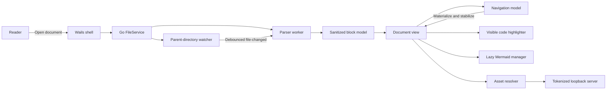
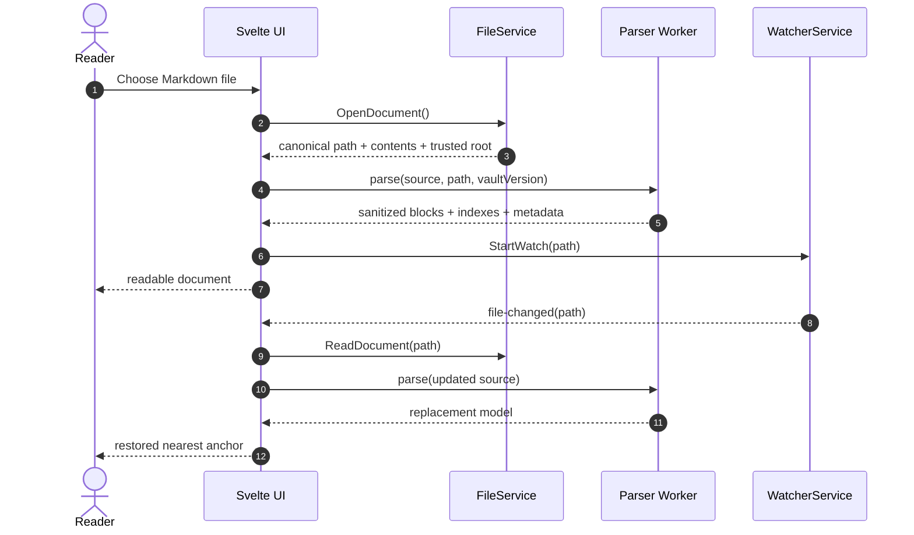
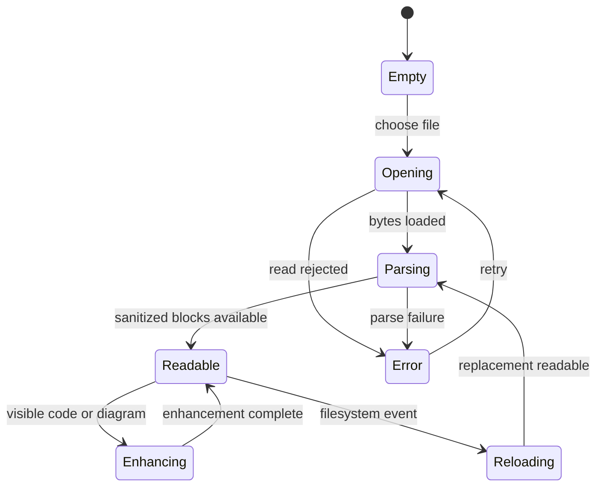
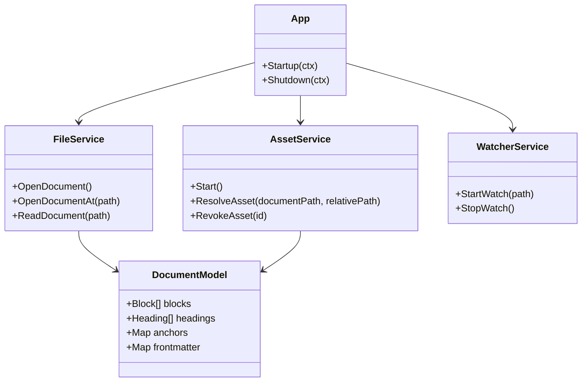
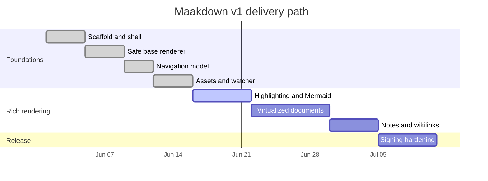
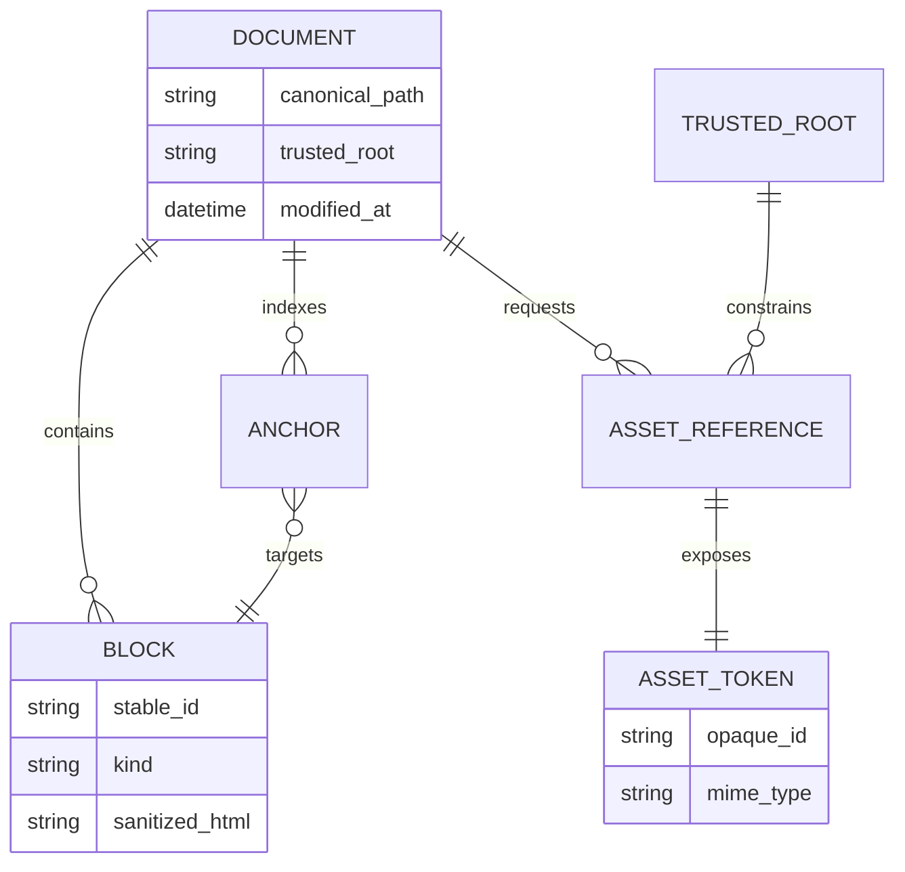

# Mermaid rendering cases

Minimal reproduction document: one of each Mermaid diagram type used in the
reader evaluation dossier. Use this to iterate on Windows/WebView2 rendering
(label clipping, diagram sizing, edge-label overflow) without scrolling through
the full document.

## 1. Flowchart (flowchart LR)

## 2. Sequence diagram (sequenceDiagram)

## 3. State diagram (stateDiagram-v2)

## 4. Class diagram (classDiagram)

## 5. Gantt chart (gantt)

## 6. Entity-relationship diagram (erDiagram)

