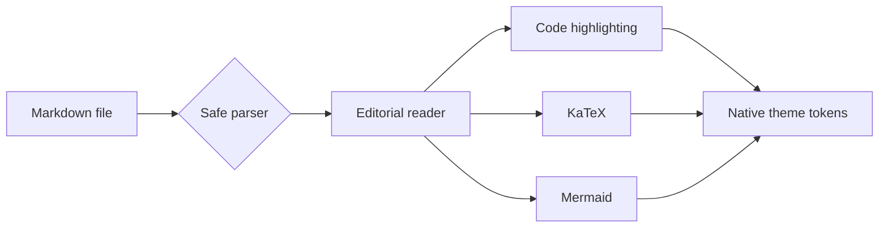

# Native Rendering Smoke

This compact document checks the rendering surfaces most likely to differ
between WKWebView, WebView2, and WebKitGTK. It is intentionally short enough to
keep every important element near the first viewport.

> [!NOTE]
> Confirm that this callout, the [project link](https://github.com/cybermaak/maakdown),
> and the surrounding page use the selected light or dark reader theme.

## Code and mathematics

```typescript
type DocumentState = {
  path: string;
  theme: "light" | "dark";
  ready: boolean;
};

export const isReady = (state: DocumentState): boolean =>
  state.ready && state.path.endsWith(".md");
```

The renderer should preserve the formula

$$
T_{\mathrm{frame}} = T_{\mathrm{layout}} + T_{\mathrm{enhance}} < 16.7\ \mathrm{ms}
$$

## Diagram



| Surface | Expected result |
| --- | --- |
| Code | Theme-matched background and visible syntax colors |
| Mermaid | Diagram colors match the reader palette |
| Text | Platform fonts remain legible with no clipping |

