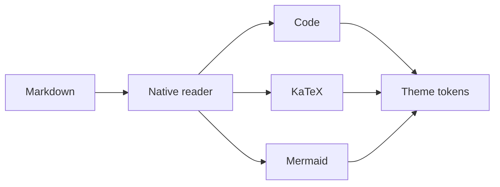

# Native Rendering Smoke

This compact document checks the rendering surfaces most likely to differ
between WKWebView, WebView2, and WebKitGTK.

> [!NOTE]
> Confirm that this callout, the [project link](https://github.com/cybermaak/maakdown),
> and the surrounding page use the selected light or dark reader theme.

## Code and mathematics

```typescript
const renderReady = (theme: "light" | "dark"): boolean =>
  document.documentElement.dataset.theme === theme;
```

The renderer should preserve $T_{\mathrm{frame}} < 16.7\ \mathrm{ms}$.

## Diagram


