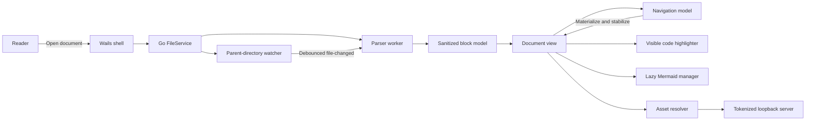
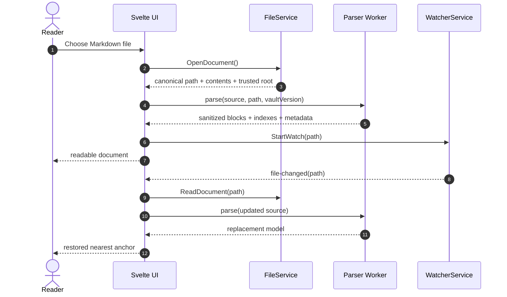
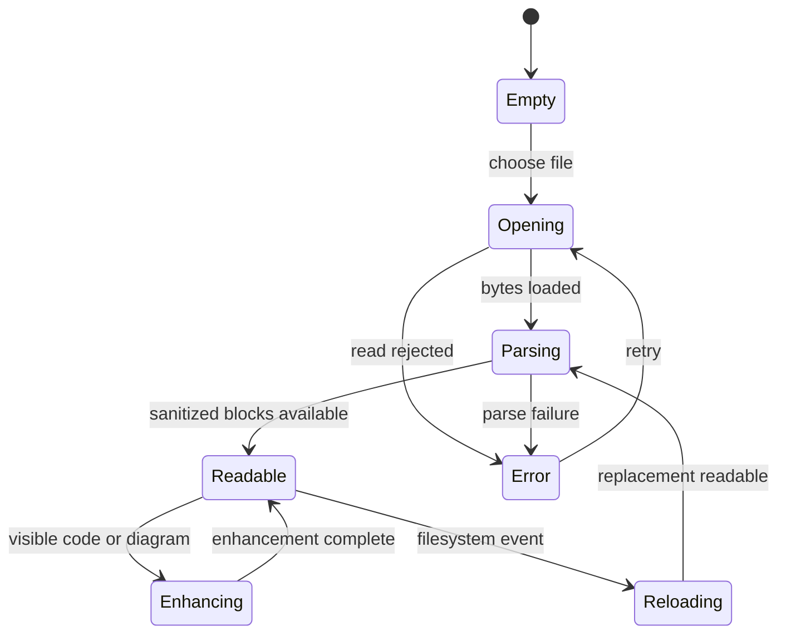

# Maakdown Reader Evaluation Dossier

This document is a combined product specification, implementation plan, security
review, and performance fixture for **Maakdown**, a cross-platform desktop
Markdown viewer. It is deliberately substantial: the content remains meaningful
when read end-to-end, while its size and feature density make it useful for
evaluating first paint, scrolling, navigation, local assets, and progressive
enhancement.

> [!IMPORTANT]
> This fixture is executable documentation. When a renderer feature changes, the
> same file should be reopened and compared across macOS WebKit, Windows WebView2,
> and Linux WebKitGTK.

## Executive summary

Maakdown opens local technical documents and personal notes without becoming an
editor or a general-purpose browser. Its design centers on four promises:

1. **Readable first:** sanitized base content appears before expensive work.
2. **Bounded later:** large documents eventually use block virtualization.
3. **Local by default:** files, assets, and credentials stay under explicit trust boundaries.
4. **Predictable everywhere:** one architecture targets all desktop platforms.

The v1 stack is Wails 2.12, Go, Svelte 5, Vite 8, unified/remark/rehype, KaTeX,
Shiki, Highlight.js, and Mermaid. External links are delegated to the system browser.
Relative images are served through an opaque, tokenized loopback URL.


## System architecture



### Open and reload sequence



### Document lifecycle



## Performance budgets

| Fixture | macOS target | Windows target | Linux target |
|---|---:|---:|---:|
| Small README first meaningful paint | 200 ms | 150 ms | 250 ms |
| Medium technical document | 350 ms | 250 ms | 450 ms |
| This evaluation dossier | responsive scroll | responsive scroll | responsive scroll |
| Anchor correction | <= 8 px | <= 8 px | <= 8 px |

The frame budget at 60 Hz is approximately:

$$
\Delta t = \frac{1000\text{ ms}}{60} \approx 16.67\text{ ms}
$$


## 1. Rendering Architecture: Evaluation Scenario 1

This scenario examines **Keeping parsing deterministic while expensive enhancements remain progressive**. The governing choice is:
Sanitize serialized block HTML in the parser worker, then enhance visible code and diagrams separately. The primary measurement is `open-to-readable-text`, owned by
Frontend platform. This section intentionally mixes prose, structured data, links,
code, mathematics, and navigation targets so that one scroll pass exercises the
reader as a coherent technical document rather than as synthetic filler.

### Context and intended behavior

Maakdown should make the base text readable before enhancement work begins. A
reader opening this section should be able to scan the decision, inspect the
acceptance criteria, follow [the implementation checkpoint](#checkpoint-1),
and return from footnote 1 without the interface stealing focus.[^scenario-1]

> [!NOTE]
> Scenario 1 belongs to **P1** and uses `open-to-readable-text` as its
> principal signal. A slow enhancement must never make the unenhanced source unreadable.

> [!WARNING]
> A successful happy-path render is not enough. The same workflow must remain safe
> when Markdown contains raw HTML, malformed links, oversized assets, duplicate
> headings, or a filesystem event burst.

### Acceptance matrix

| Dimension | Expected behavior | Evidence | Owner |
|---|---|---|---|
| Correctness | Stable block ordering and deterministic anchors | fixture snapshot | Frontend platform |
| Security | Sanitized HTML and constrained local resources | adversarial tests | Security |
| Performance | No sustained main-thread stall during scrolling | trace and timing sample | Performance |
| Accessibility | Keyboard-reachable links and meaningful document structure | semantic audit | Reader experience |
| Distribution | Same behavior in development and signed builds | release smoke test | Release engineering |

### Delivery checklist

- [x] Define the scenario and its observable outcome.
- [x] Identify the trusted boundary and failure behavior.
- [ ] Capture p50 and p95 values on macOS WebKit.
- [ ] Repeat the same fixture on Windows WebView2.
- [ ] Record Linux WebKitGTK as the likely performance floor.
- [ ] Link regressions to [[Maakdown Performance Notebook]].

### Quantitative model

For a document with (n) parsed blocks and a visible window containing (v)
blocks, the target steady-state cost is:

$$
T_{frame} = T_{layout}(v) + T_{enhance}(v) + \epsilon,
\qquad v \ll n
$$

The weighted readiness score for this scenario is:

$$
R = 0.35C + 0.25S + 0.20P + 0.10A + 0.10D
$$

where (C) is correctness, (S) security, (P) performance, (A)
accessibility, and (D) distribution confidence.

### typescript implementation sample

```typescript
export async function openAndParse(path: string): Promise<DocumentModel> {
  const document = await openDocumentAt(path);
  const model = await parser.parse({
    source: document.contents,
    path: document.path
  });
  return buildDocumentModel(model);
}
```

### Checkpoint 1

<a id="checkpoint-1"></a>

The checkpoint captures the operational contract:

1. Parse and sanitize before HTML reaches the document surface.
2. Preserve plain text and source code while enhancements are pending.
3. Resolve navigation through stable document-model identifiers.
4. Keep filesystem paths behind the backend trust boundary.
5. Verify the same behavior in a packaged build.

The expected result is measurable: **open-to-readable-text** should remain within its
budget while the reader scrolls continuously through adjacent sections.

[^scenario-1]: Scenario 1 is generated deterministically from the approved Maakdown design and implementation plan.

## Consolidated risk register

| Risk | Likelihood | Impact | Mitigation |
|---|---|---|---|
| Main-thread parsing delays first paint | Medium | High | worker parsing and serialized blocks |
| Mermaid blocks stall scrolling | Medium | High | viewport scheduling and lazy module load |
| Relative image escapes trusted root | Low | Critical | canonicalization and symlink-aware root checks |
| Atomic save drops file watch | Medium | Medium | parent-directory watch and event coalescing |
| Anchor target is unmounted | High after P5 | Medium | model-owned navigation and stabilization |
| Signing credential leaks into git | Low | Critical | external secret storage and ignore rules |

## Final release gate

- [ ] All required Markdown constructs render safely.
- [ ] Code highlighting is lazy and theme-aware.
- [ ] Mermaid diagrams render or fail with a safe visible error.
- [ ] The large-document DOM remains bounded.
- [ ] Internal anchors and footnote backlinks survive virtualization.
- [ ] Local images resolve only under the trusted root.
- [ ] Reload preserves reader position.
- [ ] macOS artifacts are signed and notarized.
- [ ] Windows artifacts are Authenticode-signed and timestamped.
- [ ] Checksums and release notes are published without secrets.

The dossier ends where the product begins: with a reader opening a difficult,
realistic document and finding that the software stays quiet, quick, and
trustworthy around it.
