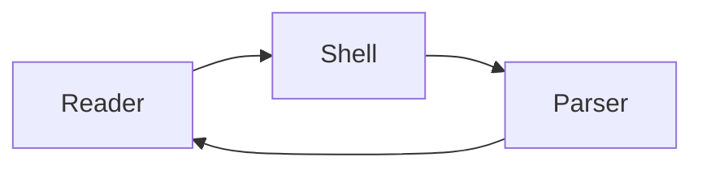

# UAT Technical Document

This document is a deterministic fixture for the UI-driven UAT suite. It mixes
prose with every reader feature so a single open exercises rendering,
enhancement, local assets, metadata, navigation, and security presentation.

## Overview

Maakdown renders sanitized Markdown for technical reading. See the
[architecture section](#architecture) for the rendered diagram, or visit the
[project homepage](https://example.com/maakdown) which opens externally.

## Capability matrix

| Capability | Status | Notes |
|---|---|---|
| Tables | Done | GFM pipe tables render |
| Math | Done | KaTeX block and inline |
| Diagrams | Done | Mermaid with reader colors |

### Release checklist

- [x] Base text renders before enhancement
- [x] Local images resolve under the trusted root
- [ ] Final cross-platform pass recorded

> [!NOTE]
> This callout verifies admonition presentation. It should render as a styled
> blockquote, not as raw text.

## Architecture




The frame budget at 60 Hz is $\Delta t = 16.67\,\text{ms}$ per frame, derived from:

$$
\Delta t = \frac{1000\ \text{ms}}{60}
$$

```typescript
export function openAndParse(path: string): Promise<DocumentModel> {
  const document = readDocument(path);
  return parse(document.contents);
}
```

## Notes and links

This paragraph links to a note that is not in the vault:
[[Nonexistent UAT Note]]. It should render as an unresolved wikilink rather
than a working link.

<div class="uat-unsafe">
  <script>window.__xssExecuted = true;</script>
  <a href="javascript:window.__xssExecuted = true">unsafe link</a>
</div>

The text after the unsafe block should still render normally.
